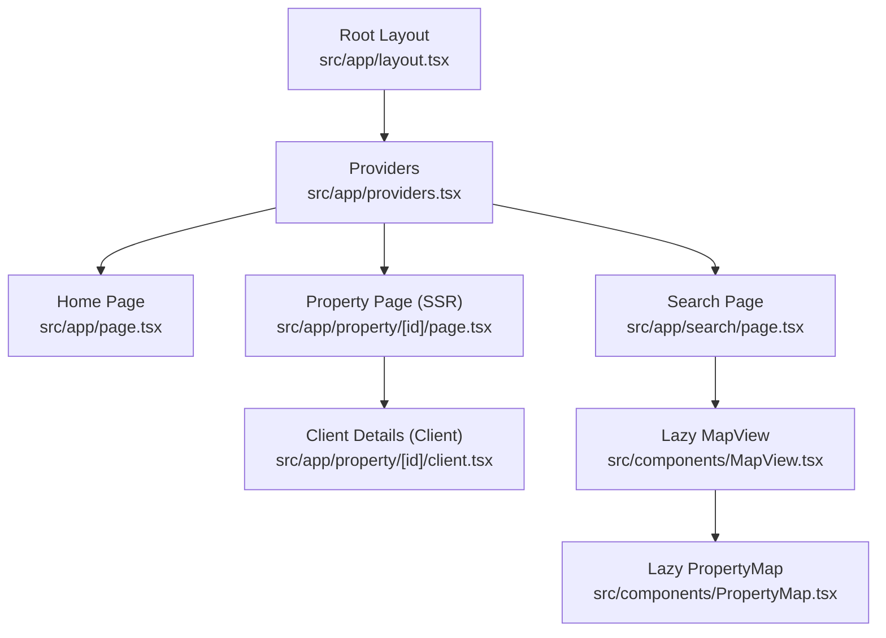
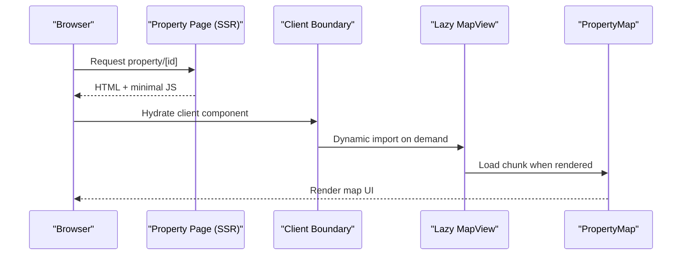
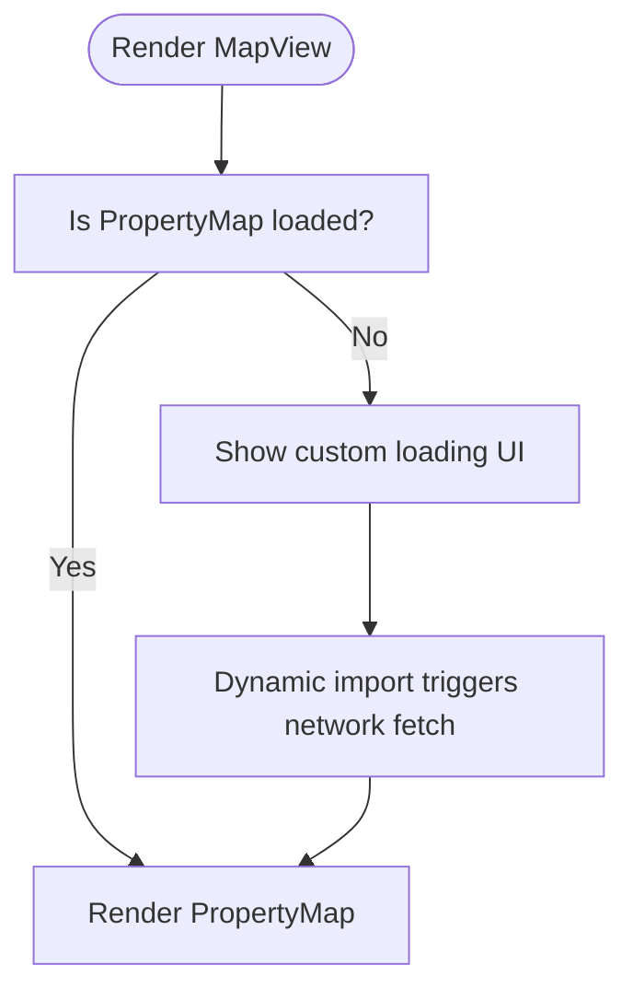
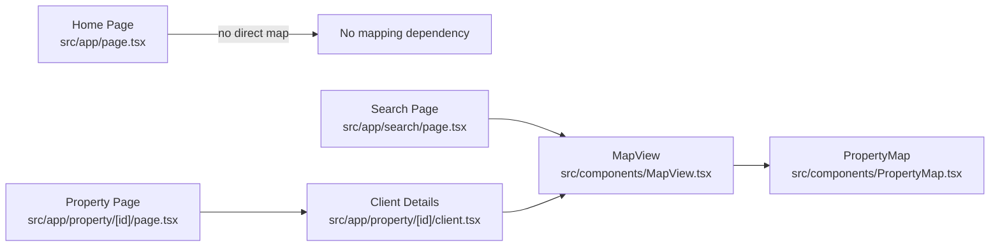

# Code Splitting and Lazy Loading

<cite>
**Referenced Files in This Document**
- [layout.tsx](file://src/app/layout.tsx)
- [providers.tsx](file://src/app/providers.tsx)
- [MapView.tsx](file://src/components/MapView.tsx)
- [PropertyMap.tsx](file://src/components/PropertyMap.tsx)
- [page.tsx (Home)](file://src/app/page.tsx)
- [page.tsx (Search)](file://src/app/search/page.tsx)
- [page.tsx (Property)](file://src/app/property/[id]/page.tsx)
- [client.tsx (Property Details)](file://src/app/property/[id]/client.tsx)
- [ProtectedRoute.tsx](file://src/components/ProtectedRoute.tsx)
- [AuthLoading.tsx](file://src/components/AuthLoading.tsx)
- [AuthContext.tsx](file://src/context/AuthContext.tsx)
</cite>

## Table of Contents
1. [Introduction](#introduction)
2. [Project Structure](#project-structure)
3. [Core Components](#core-components)
4. [Architecture Overview](#architecture-overview)
5. [Detailed Component Analysis](#detailed-component-analysis)
6. [Dependency Analysis](#dependency-analysis)
7. [Performance Considerations](#performance-considerations)
8. [Troubleshooting Guide](#troubleshooting-guide)
9. [Conclusion](#conclusion)

## Introduction
This document explains how Gamasa Properties leverages Next.js code splitting and lazy loading to optimize initial load performance. It focuses on:
- Route-based code splitting using Next.js App Router
- Component-level lazy loading with dynamic imports
- Suspense-like loading states and error handling patterns
- Strategies for reducing bundle sizes by deferring heavy components and third-party libraries
- Practical examples and measurement techniques for evaluating effectiveness

## Project Structure
The project follows Next.js App Router conventions with route segments and client/server boundaries clearly separated. Providers wrap the application to supply global contexts. Heavy UI components are isolated and lazily imported to minimize initial payload.

**Diagram sources**
- [layout.tsx](file://src/app/layout.tsx#L64-L89)
- [providers.tsx](file://src/app/providers.tsx#L7-L17)
- [page.tsx (Home)](file://src/app/page.tsx#L88-L194)
- [page.tsx (Search)](file://src/app/search/page.tsx#L12-L219)
- [page.tsx (Property)](file://src/app/property/[id]/page.tsx#L74-L87)
- [client.tsx (Property Details)](file://src/app/property/[id]/client.tsx#L17-L214)
- [MapView.tsx](file://src/components/MapView.tsx#L24-L39)
- [PropertyMap.tsx](file://src/components/PropertyMap.tsx#L35-L92)

**Section sources**
- [layout.tsx](file://src/app/layout.tsx#L64-L89)
- [providers.tsx](file://src/app/providers.tsx#L7-L17)
- [page.tsx (Home)](file://src/app/page.tsx#L88-L194)
- [page.tsx (Search)](file://src/app/search/page.tsx#L12-L219)
- [page.tsx (Property)](file://src/app/property/[id]/page.tsx#L74-L87)
- [client.tsx (Property Details)](file://src/app/property/[id]/client.tsx#L17-L214)
- [MapView.tsx](file://src/components/MapView.tsx#L24-L39)
- [PropertyMap.tsx](file://src/components/PropertyMap.tsx#L35-L92)

## Core Components
- Route-based code splitting:
  - Pages under src/app are automatically split into separate route chunks. For example, the property detail page uses a server-rendered shell with a client component boundary to defer heavy client logic.
- Component-level lazy loading:
  - The MapView component dynamically imports PropertyMap to avoid bundling the entire mapping library on pages that do not require it.
- Suspense-like loading states:
  - Dynamic imports define a custom loading UI while the chunk loads.
- Authentication gating:
  - ProtectedRoute ensures users are authenticated before accessing protected areas, with a dedicated loading state during auth resolution.

**Section sources**
- [page.tsx (Property)](file://src/app/property/[id]/page.tsx#L74-L87)
- [client.tsx (Property Details)](file://src/app/property/[id]/client.tsx#L17-L214)
- [MapView.tsx](file://src/components/MapView.tsx#L7-L17)
- [PropertyMap.tsx](file://src/components/PropertyMap.tsx#L35-L92)
- [ProtectedRoute.tsx](file://src/components/ProtectedRoute.tsx#L8-L30)
- [AuthLoading.tsx](file://src/components/AuthLoading.tsx#L3-L12)

## Architecture Overview
The application separates concerns across route boundaries and defers expensive UI to reduce initial JavaScript payload. The property detail page demonstrates a common pattern: SSR metadata and shell, then a client component boundary for interactive features.

**Diagram sources**
- [page.tsx (Property)](file://src/app/property/[id]/page.tsx#L74-L87)
- [client.tsx (Property Details)](file://src/app/property/[id]/client.tsx#L17-L214)
- [MapView.tsx](file://src/components/MapView.tsx#L24-L39)
- [PropertyMap.tsx](file://src/components/PropertyMap.tsx#L35-L92)

## Detailed Component Analysis

### Route-Based Code Splitting
- Home page and Search page are separate route chunks, enabling independent loading.
- The property detail page uses a server-rendered shell with a client boundary to defer heavy client logic until hydration.

Implementation highlights:
- Home page composition and navigation are fully client-side after hydration.
- Search page conditionally renders either a list view or a map view; the map view is lazy-loaded.

**Section sources**
- [page.tsx (Home)](file://src/app/page.tsx#L88-L194)
- [page.tsx (Search)](file://src/app/search/page.tsx#L12-L219)
- [page.tsx (Property)](file://src/app/property/[id]/page.tsx#L74-L87)

### Component-Level Lazy Loading with Dynamic Imports
- MapView dynamically imports PropertyMap to avoid shipping the mapping library to pages that do not need it.
- The dynamic import specifies a custom loading UI and disables SSR for the lazy component.

**Diagram sources**
- [MapView.tsx](file://src/components/MapView.tsx#L7-L17)
- [MapView.tsx](file://src/components/MapView.tsx#L24-L39)
- [PropertyMap.tsx](file://src/components/PropertyMap.tsx#L35-L92)

**Section sources**
- [MapView.tsx](file://src/components/MapView.tsx#L7-L17)
- [MapView.tsx](file://src/components/MapView.tsx#L24-L39)
- [PropertyMap.tsx](file://src/components/PropertyMap.tsx#L35-L92)

### Suspense Boundaries, Error Boundaries, and Loading States
- Suspense-like behavior:
  - Dynamic imports provide a loading fallback while the chunk downloads.
- Error handling:
  - There is no explicit error boundary around the dynamic import in this codebase; errors during chunk load would surface as unhandled rejections. Consider adding an error boundary around the dynamic component if robustness is required.
- Loading states:
  - AuthLoading provides a clear loading indicator during authentication checks.
  - PropertyMap includes a loading UI via the dynamic import’s loading prop.

Recommendations:
- Wrap dynamic components in an error boundary to gracefully handle chunk load failures.
- Use a centralized loading strategy (e.g., skeleton loaders) for consistent UX.

**Section sources**
- [MapView.tsx](file://src/components/MapView.tsx#L9-L16)
- [AuthLoading.tsx](file://src/components/AuthLoading.tsx#L3-L12)
- [AuthContext.tsx](file://src/context/AuthContext.tsx#L22-L78)

### Conditional Imports Based on User Roles
- The codebase does not currently implement role-based conditional imports. However, the structure supports this pattern:
  - Use dynamic imports guarded by role checks to load admin-only features only when needed.
  - Example pattern: import a module inside a conditional branch based on user role.

[No sources needed since this section proposes a general pattern not yet implemented]

### Optimizing Bundle Sizes Through Strategic Code Splitting
- Defer heavy libraries:
  - Keep mapping libraries out of the main bundle by importing them lazily.
- Route-level separation:
  - Separate pages into distinct route chunks to avoid cross-page code sharing.
- Client/server boundaries:
  - Use server components for metadata and static content; defer client-only logic to client components.

[No sources needed since this section provides general guidance]

### Lazy Loading Third-Party Libraries
- The mapping library is lazily imported through a dynamic import, preventing it from being included in non-map pages.
- Extend this pattern to other heavy third-party libraries used conditionally.

**Section sources**
- [MapView.tsx](file://src/components/MapView.tsx#L7-L17)
- [PropertyMap.tsx](file://src/components/PropertyMap.tsx#L3-L6)

### Performance Measurement Techniques
- Use Next.js build analyzer to inspect generated chunks and their sizes.
- Measure Core Web Vitals (LCP, FID, CLS) before and after changes.
- Monitor runtime metrics such as time-to-interactive and total JS downloaded per route.
- Track user behavior with analytics to confirm improved engagement on slower connections.

[No sources needed since this section provides general guidance]

## Dependency Analysis
The following diagram shows how route boundaries and lazy components influence the dependency graph.

**Diagram sources**
- [page.tsx (Home)](file://src/app/page.tsx#L88-L194)
- [page.tsx (Search)](file://src/app/search/page.tsx#L12-L219)
- [MapView.tsx](file://src/components/MapView.tsx#L24-L39)
- [PropertyMap.tsx](file://src/components/PropertyMap.tsx#L35-L92)
- [page.tsx (Property)](file://src/app/property/[id]/page.tsx#L74-L87)
- [client.tsx (Property Details)](file://src/app/property/[id]/client.tsx#L17-L214)

**Section sources**
- [page.tsx (Home)](file://src/app/page.tsx#L88-L194)
- [page.tsx (Search)](file://src/app/search/page.tsx#L12-L219)
- [MapView.tsx](file://src/components/MapView.tsx#L24-L39)
- [PropertyMap.tsx](file://src/components/PropertyMap.tsx#L35-L92)
- [page.tsx (Property)](file://src/app/property/[id]/page.tsx#L74-L87)
- [client.tsx (Property Details)](file://src/app/property/[id]/client.tsx#L17-L214)

## Performance Considerations
- Prefer route-based splitting for major sections to reduce initial payload.
- Use dynamic imports for heavy components and libraries.
- Provide meaningful loading states to maintain perceived performance.
- Avoid shipping unused third-party libraries to pages that do not need them.
- Continuously measure and iterate on bundle budgets and user-centric metrics.

[No sources needed since this section provides general guidance]

## Troubleshooting Guide
Common issues and remedies:
- Chunk fails to load:
  - Add an error boundary around the dynamic component to catch and recover from load failures.
- Slow initial load despite lazy loading:
  - Audit bundles to ensure the intended code is deferred; verify route boundaries and client/server splits.
- Authentication flicker:
  - Use a dedicated loading UI while auth resolves to prevent UI thrash.

**Section sources**
- [MapView.tsx](file://src/components/MapView.tsx#L9-L16)
- [AuthLoading.tsx](file://src/components/AuthLoading.tsx#L3-L12)
- [ProtectedRoute.tsx](file://src/components/ProtectedRoute.tsx#L13-L29)

## Conclusion
Gamasa Properties employs route-based code splitting and component-level lazy loading to keep initial payloads small and improve perceived performance. The property detail page demonstrates a strong pattern: SSR metadata and shell, followed by a client boundary for interactive features. Extending this approach—adding error boundaries, measuring performance, and strategically deferring third-party libraries—will further enhance load times and user experience.