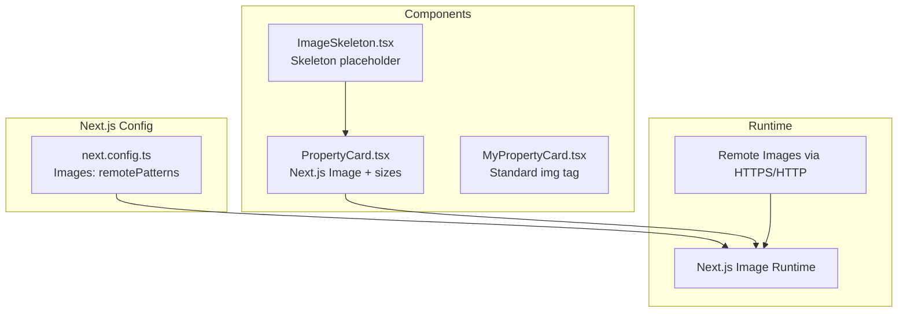
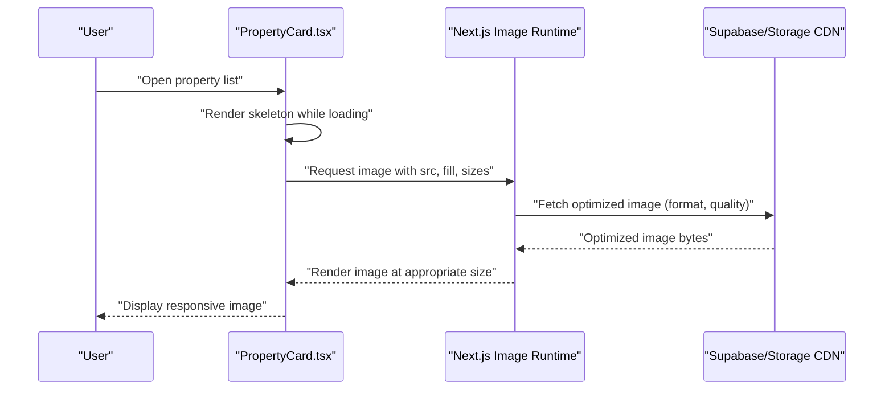
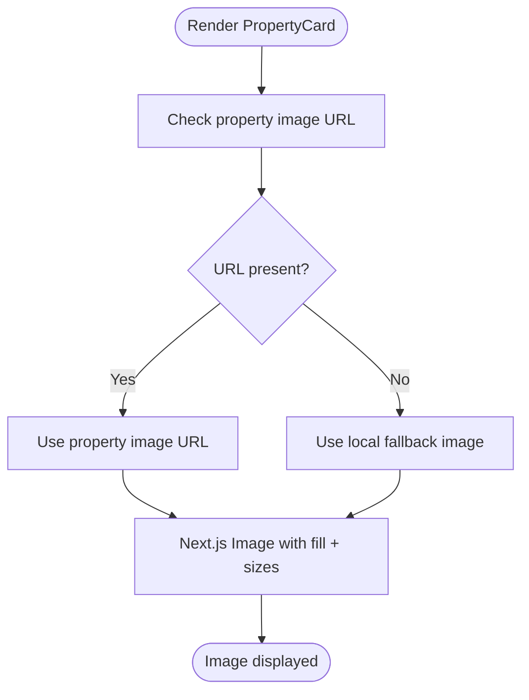
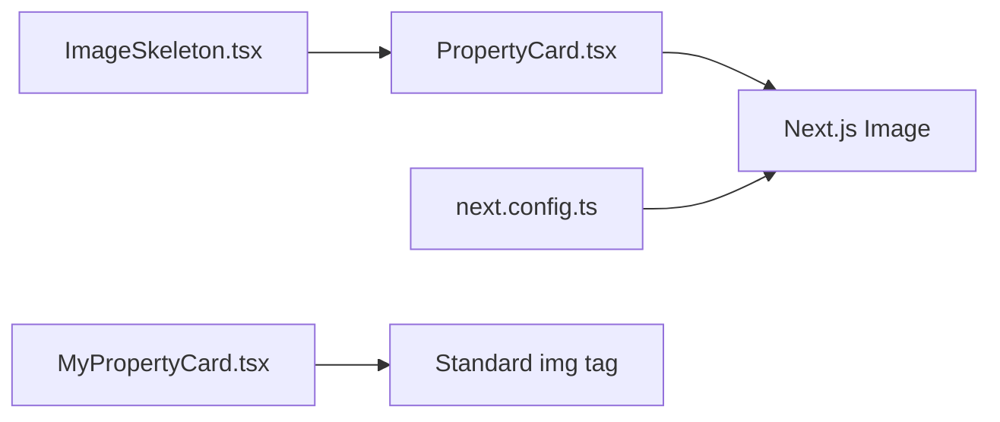

# Image Optimization

<cite>
**Referenced Files in This Document**
- [next.config.ts](file://next.config.ts)
- [ImageSkeleton.tsx](file://src/components/ImageSkeleton.tsx)
- [PropertyCard.tsx](file://src/components/PropertyCard.tsx)
- [MyPropertyCard.tsx](file://src/components/MyPropertyCard.tsx)
- [package.json](file://package.json)
</cite>

## Table of Contents
1. [Introduction](#introduction)
2. [Project Structure](#project-structure)
3. [Core Components](#core-components)
4. [Architecture Overview](#architecture-overview)
5. [Detailed Component Analysis](#detailed-component-analysis)
6. [Dependency Analysis](#dependency-analysis)
7. [Performance Considerations](#performance-considerations)
8. [Troubleshooting Guide](#troubleshooting-guide)
9. [Conclusion](#conclusion)

## Introduction
This document explains how Gamasa Properties optimizes images across the application, focusing on Next.js Image usage, responsive image serving, automatic format detection, skeleton placeholders for progressive loading, lazy loading strategies, and remote image optimization. It also covers compression techniques, CDN integration via Next.js configuration, and practical examples for property images to reduce bandwidth and improve Core Web Vitals.

## Project Structure
The image optimization features are primarily implemented in:
- Next.js configuration enabling remote image support and PWA integration
- Property card components using Next.js Image for responsive and optimized rendering
- A reusable skeleton component for progressive image loading

**Diagram sources**
- [next.config.ts](file://next.config.ts#L16-L27)
- [PropertyCard.tsx](file://src/components/PropertyCard.tsx#L87-L93)
- [ImageSkeleton.tsx](file://src/components/ImageSkeleton.tsx#L1-L6)

**Section sources**
- [next.config.ts](file://next.config.ts#L12-L28)
- [PropertyCard.tsx](file://src/components/PropertyCard.tsx#L83-L94)
- [ImageSkeleton.tsx](file://src/components/ImageSkeleton.tsx#L1-L6)

## Core Components
- Next.js Image configuration for remote images and PWA compatibility
- PropertyCard component leveraging Next.js Image with responsive sizing
- ImageSkeleton component for progressive image loading
- MyPropertyCard component using standard img for thumbnails

Key implementation highlights:
- Remote image support configured for secure and local development protocols
- Next.js Image used for property hero images with fill and sizes attributes
- Skeleton placeholder component for perceived performance during image load
- Standard img tag for small thumbnails in lists

**Section sources**
- [next.config.ts](file://next.config.ts#L16-L27)
- [PropertyCard.tsx](file://src/components/PropertyCard.tsx#L87-L93)
- [ImageSkeleton.tsx](file://src/components/ImageSkeleton.tsx#L1-L6)
- [MyPropertyCard.tsx](file://src/components/MyPropertyCard.tsx#L15-L21)

## Architecture Overview
The image optimization pipeline integrates Next.js Image runtime with remote image fetching and responsive serving. The configuration enables HTTPS and localhost HTTP for development, while the components specify aspect ratios and breakpoints for efficient delivery.

**Diagram sources**
- [PropertyCard.tsx](file://src/components/PropertyCard.tsx#L87-L93)
- [next.config.ts](file://next.config.ts#L16-L27)

## Detailed Component Analysis

### Next.js Image Configuration
- Enables remote image patterns for HTTPS and HTTP (localhost) to support development and production CDN origins
- Integrates PWA plugin for offline caching and faster asset delivery

Implementation details:
- Remote patterns allow Next.js Image to optimize external images transparently
- PWA configuration ensures service worker registration and caching strategies

**Section sources**
- [next.config.ts](file://next.config.ts#L16-L27)
- [package.json](file://package.json#L21)

### PropertyCard Component (Hero Image)
- Uses Next.js Image with fill and sizes to serve responsive images
- Applies object-cover and hover scaling for engaging UX
- Provides a fallback image when the property image URL is empty or invalid

**Diagram sources**
- [PropertyCard.tsx](file://src/components/PropertyCard.tsx#L81-L93)

**Section sources**
- [PropertyCard.tsx](file://src/components/PropertyCard.tsx#L81-L93)

### ImageSkeleton Component (Progressive Loading)
- Provides a lightweight skeleton placeholder using animated pulse effect
- Designed to match container aspect ratio and theme (light/dark)

Usage pattern:
- Render skeleton while the hero image is loading
- Replace with actual image after load completes

**Section sources**
- [ImageSkeleton.tsx](file://src/components/ImageSkeleton.tsx#L1-L6)

### MyPropertyCard Component (Thumbnail)
- Uses standard img tag for small thumbnails in lists
- Suitable for constrained layouts where Next.js Image overhead is unnecessary

Recommendation:
- Prefer Next.js Image for hero images requiring responsiveness and modern formats
- Keep standard img for compact thumbnails to minimize DOM overhead

**Section sources**
- [MyPropertyCard.tsx](file://src/components/MyPropertyCard.tsx#L15-L21)

## Dependency Analysis
- PropertyCard depends on Next.js Image for responsive optimization
- next.config.ts defines remote image policies consumed by Next.js Image
- ImageSkeleton is a standalone UI helper used by PropertyCard
- MyPropertyCard uses standard img for thumbnails

**Diagram sources**
- [PropertyCard.tsx](file://src/components/PropertyCard.tsx#L5-L8)
- [next.config.ts](file://next.config.ts#L16-L27)
- [ImageSkeleton.tsx](file://src/components/ImageSkeleton.tsx#L1-L6)
- [MyPropertyCard.tsx](file://src/components/MyPropertyCard.tsx#L16-L20)

**Section sources**
- [PropertyCard.tsx](file://src/components/PropertyCard.tsx#L5-L8)
- [next.config.ts](file://next.config.ts#L16-L27)
- [ImageSkeleton.tsx](file://src/components/ImageSkeleton.tsx#L1-L6)
- [MyPropertyCard.tsx](file://src/components/MyPropertyCard.tsx#L16-L20)

## Performance Considerations
- Use Next.js Image for hero images to leverage automatic format selection (AVIF/WebP when supported) and responsive breakpoints
- Specify sizes to help Next.js choose the optimal width per viewport breakpoint
- Employ skeleton placeholders to improve perceived performance and CLS stability
- Keep thumbnail images small and compressed; standard img is fine for compact thumbnails
- Enable PWA caching to reduce repeated fetches for frequently visited property pages

[No sources needed since this section provides general guidance]

## Troubleshooting Guide
Common issues and resolutions:
- Remote image blocked: Verify next.config.ts remotePatterns include the image host; ensure HTTPS URLs in production
- Hero image not appearing: Confirm the property image URL is valid; fallback to local placeholder is applied automatically
- CLS fluctuations: Use skeleton placeholders and fixed aspect containers around Next.js Image
- Large thumbnails: Replace standard img with Next.js Image for better compression and responsiveness

**Section sources**
- [next.config.ts](file://next.config.ts#L16-L27)
- [PropertyCard.tsx](file://src/components/PropertyCard.tsx#L81-L93)
- [ImageSkeleton.tsx](file://src/components/ImageSkeleton.tsx#L1-L6)

## Conclusion
Gamasa Properties leverages Next.js Image for responsive, format-aware image delivery, combined with skeleton placeholders for smooth progressive loading. The configuration supports remote images across secure and development origins, while component-level choices balance performance and maintainability. Adopting these patterns improves bandwidth efficiency and Core Web Vitals across property listings and detail pages.