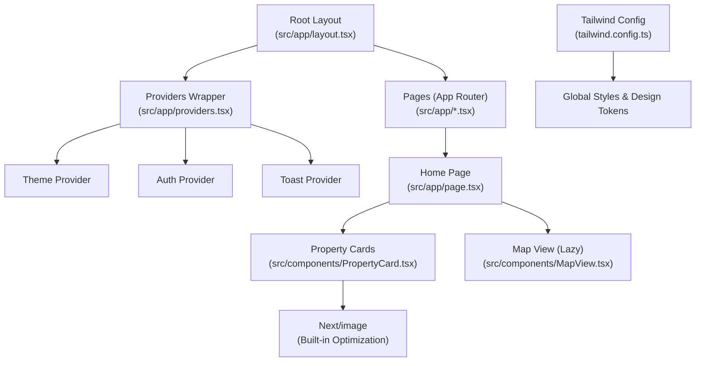
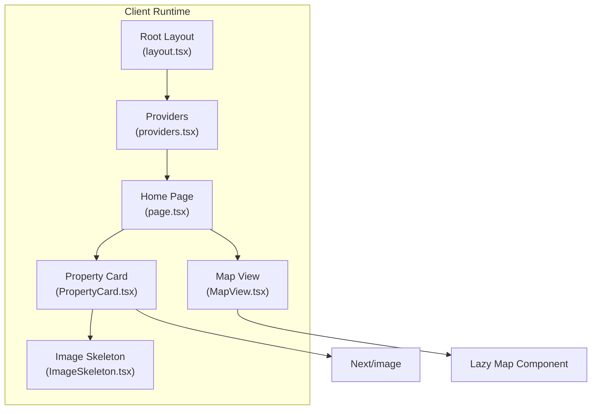
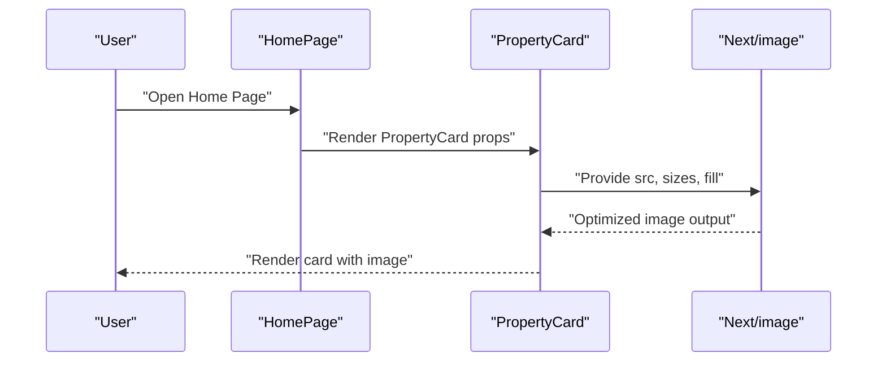
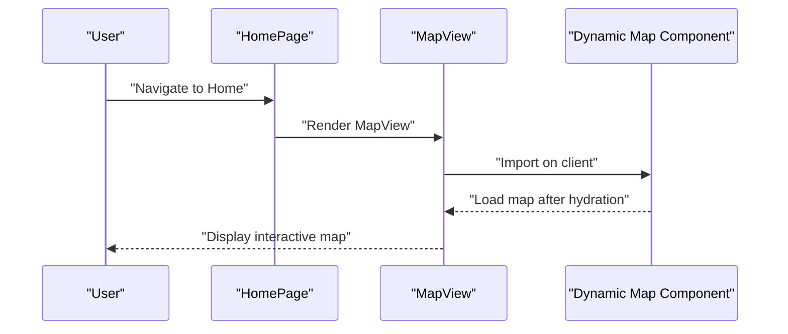
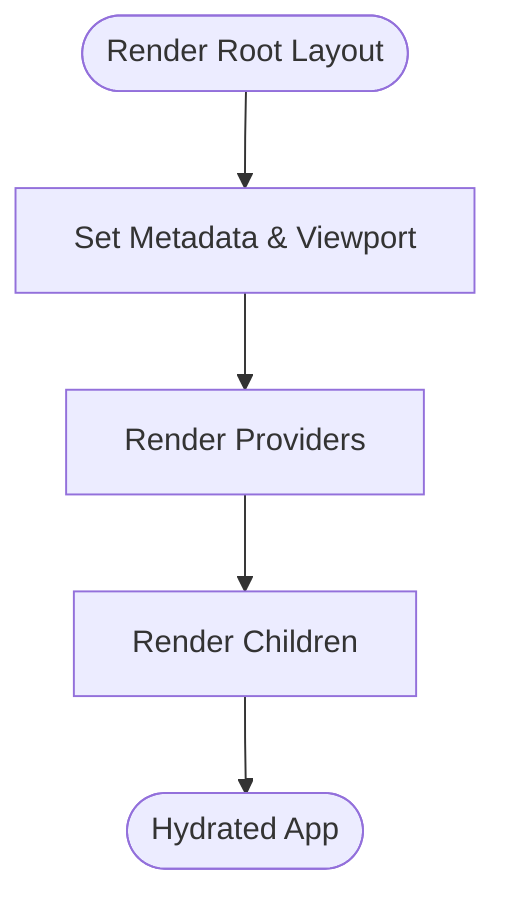
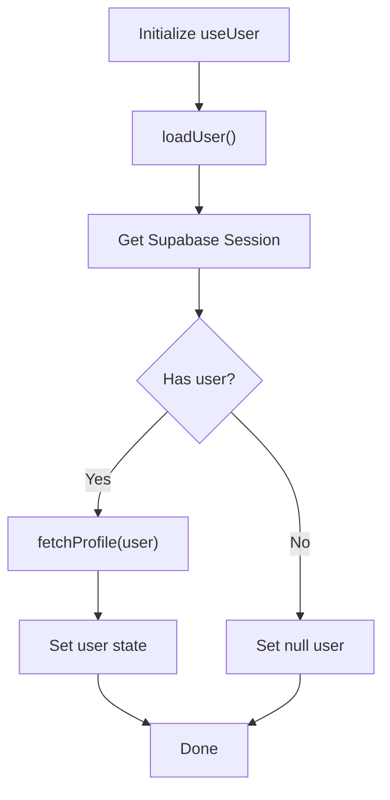
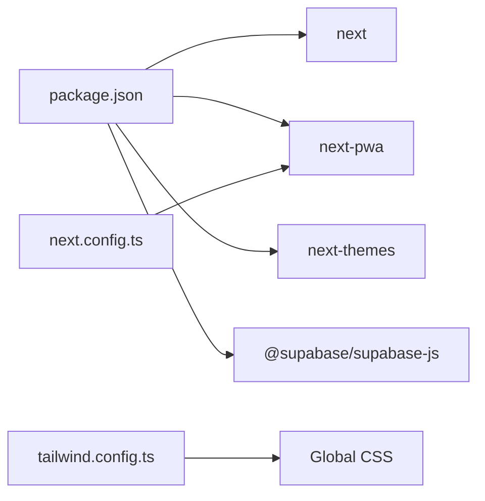

# Performance Optimization

<cite>
**Referenced Files in This Document**
- [next.config.ts](file://next.config.ts)
- [package.json](file://package.json)
- [src/app/layout.tsx](file://src/app/layout.tsx)
- [src/app/providers.tsx](file://src/app/providers.tsx)
- [src/components/ImageSkeleton.tsx](file://src/components/ImageSkeleton.tsx)
- [src/components/MapView.tsx](file://src/components/MapView.tsx)
- [src/components/PropertyCard.tsx](file://src/components/PropertyCard.tsx)
- [src/app/page.tsx](file://src/app/page.tsx)
- [src/hooks/useUser.ts](file://src/hooks/useUser.ts)
- [tailwind.config.ts](file://tailwind.config.ts)
</cite>

## Table of Contents
1. [Introduction](#introduction)
2. [Project Structure](#project-structure)
3. [Core Components](#core-components)
4. [Architecture Overview](#architecture-overview)
5. [Detailed Component Analysis](#detailed-component-analysis)
6. [Dependency Analysis](#dependency-analysis)
7. [Performance Considerations](#performance-considerations)
8. [Troubleshooting Guide](#troubleshooting-guide)
9. [Conclusion](#conclusion)
10. [Appendices](#appendices)

## Introduction
This document provides a comprehensive guide to performance optimization for Gamasa Properties, focusing on Next.js performance features, code splitting, lazy loading, image optimization, bundle analysis, static generation, server-side rendering, caching strategies, CDN integration, asset optimization, profiling tools, monitoring, and bottleneck identification. It synthesizes current implementation patterns in the repository and offers actionable recommendations to maintain optimal application performance.

## Project Structure
Gamasa Properties follows a modern Next.js App Router project layout with:
- Application shell and global providers in the root layout
- Feature-based pages under src/app
- Shared UI components under src/components
- Global providers and theme management
- Tailwind CSS configuration for styling and design tokens

**Diagram sources**
- [src/app/layout.tsx](file://src/app/layout.tsx#L64-L89)
- [src/app/providers.tsx](file://src/app/providers.tsx#L7-L17)
- [src/app/page.tsx](file://src/app/page.tsx#L88-L194)
- [src/components/PropertyCard.tsx](file://src/components/PropertyCard.tsx#L26-L198)
- [src/components/MapView.tsx](file://src/components/MapView.tsx#L24-L39)
- [tailwind.config.ts](file://tailwind.config.ts#L1-L36)

**Section sources**
- [src/app/layout.tsx](file://src/app/layout.tsx#L1-L90)
- [src/app/providers.tsx](file://src/app/providers.tsx#L1-L18)
- [src/app/page.tsx](file://src/app/page.tsx#L1-L195)
- [tailwind.config.ts](file://tailwind.config.ts#L1-L36)

## Core Components
- Root layout and providers: Establishes global metadata, viewport, fonts, PWA manifest, and provider stack for theme, auth, and toast contexts.
- Home page: Demonstrates client-side rendering, scroll-aware sticky header, category chips, and property listings with lazy-loaded map.
- Property card: Uses Next.js Image for responsive optimization and hover effects; integrates favorites toggle and link navigation.
- Map view: Dynamically imports the map component to avoid SSR overhead and provides skeleton/loading visuals.
- Image skeleton: Provides a lightweight skeleton for image placeholders.
- User hook: Manages user session hydration and profile fetching with lifecycle safeguards.

Key performance-relevant elements:
- Next.js Image optimization via built-in component
- Dynamic imports for non-critical UI (maps)
- Client directive usage for interactivity
- Tailwind-based design tokens for efficient styling

**Section sources**
- [src/app/layout.tsx](file://src/app/layout.tsx#L20-L62)
- [src/app/providers.tsx](file://src/app/providers.tsx#L7-L17)
- [src/app/page.tsx](file://src/app/page.tsx#L88-L194)
- [src/components/PropertyCard.tsx](file://src/components/PropertyCard.tsx#L26-L198)
- [src/components/MapView.tsx](file://src/components/MapView.tsx#L24-L39)
- [src/components/ImageSkeleton.tsx](file://src/components/ImageSkeleton.tsx#L1-L6)
- [src/hooks/useUser.ts](file://src/hooks/useUser.ts#L37-L176)

## Architecture Overview
The runtime architecture leverages Next.js App Router with client-side providers and selective SSR/SWR patterns. The home page composes property cards and a lazy map, while the root layout centralizes metadata and PWA assets.

**Diagram sources**
- [src/app/layout.tsx](file://src/app/layout.tsx#L64-L89)
- [src/app/providers.tsx](file://src/app/providers.tsx#L7-L17)
- [src/app/page.tsx](file://src/app/page.tsx#L88-L194)
- [src/components/PropertyCard.tsx](file://src/components/PropertyCard.tsx#L26-L198)
- [src/components/MapView.tsx](file://src/components/MapView.tsx#L24-L39)
- [src/components/ImageSkeleton.tsx](file://src/components/ImageSkeleton.tsx#L1-L6)

## Detailed Component Analysis

### Next.js Image Optimization in PropertyCard
- Uses Next.js Image with fill and sizes for responsive behavior.
- Applies hover scaling and transition for perceived performance.
- Falls back to local placeholder when image URL is missing.

**Diagram sources**
- [src/app/page.tsx](file://src/app/page.tsx#L160-L186)
- [src/components/PropertyCard.tsx](file://src/components/PropertyCard.tsx#L87-L94)

**Section sources**
- [src/components/PropertyCard.tsx](file://src/components/PropertyCard.tsx#L87-L94)

### Lazy Loading MapView with Dynamic Import
- Dynamically imports the map component to avoid SSR and reduce initial bundle size.
- Provides a skeleton loader during initialization.

**Diagram sources**
- [src/components/MapView.tsx](file://src/components/MapView.tsx#L7-L17)
- [src/components/MapView.tsx](file://src/components/MapView.tsx#L24-L39)

**Section sources**
- [src/components/MapView.tsx](file://src/components/MapView.tsx#L1-L40)

### Client Providers and Hydration
- Root layout sets up providers for theme, auth, and toast.
- Providers wrap children to ensure proper hydration order.

**Diagram sources**
- [src/app/layout.tsx](file://src/app/layout.tsx#L64-L89)
- [src/app/providers.tsx](file://src/app/providers.tsx#L7-L17)

**Section sources**
- [src/app/layout.tsx](file://src/app/layout.tsx#L64-L89)
- [src/app/providers.tsx](file://src/app/providers.tsx#L7-L17)

### User Session Management and Hydration Safety
- Uses a mounted ref to prevent state updates after unmount.
- Fetches profile and listens to auth state changes.

**Diagram sources**
- [src/hooks/useUser.ts](file://src/hooks/useUser.ts#L110-L136)
- [src/hooks/useUser.ts](file://src/hooks/useUser.ts#L145-L162)

**Section sources**
- [src/hooks/useUser.ts](file://src/hooks/useUser.ts#L37-L176)

## Dependency Analysis
- Next.js version and related packages are declared in dependencies.
- PWA plugin is configured via next.config.ts with service worker registration and destination folder.
- Tailwind CSS is configured with content globs covering app, components, and pages.

**Diagram sources**
- [package.json](file://package.json#L11-L27)
- [next.config.ts](file://next.config.ts#L1-L31)
- [tailwind.config.ts](file://tailwind.config.ts#L4-L8)

**Section sources**
- [package.json](file://package.json#L1-L42)
- [next.config.ts](file://next.config.ts#L1-L31)
- [tailwind.config.ts](file://tailwind.config.ts#L1-L36)

## Performance Considerations

### Code Splitting Strategies
- Dynamic imports for non-critical UI (e.g., map component) reduce initial bundle size and defer heavy modules until needed.
- Route-based code splitting is native in Next.js App Router; ensure route segments remain granular to keep chunks small.

Recommendations:
- Split large vendor bundles by grouping rarely-used features behind dynamic imports.
- Use React.lazy and Suspense boundaries around heavy third-party widgets.

**Section sources**
- [src/components/MapView.tsx](file://src/components/MapView.tsx#L7-L17)

### Lazy Loading Implementation
- Dynamic import with client-side-only rendering prevents SSR overhead for map rendering.
- Provide skeleton loaders to improve perceived performance during hydration.

Recommendations:
- Add error boundaries around dynamic imports.
- Use intersection observer to trigger lazy loads closer to viewport.

**Section sources**
- [src/components/MapView.tsx](file://src/components/MapView.tsx#L7-L17)
- [src/components/ImageSkeleton.tsx](file://src/components/ImageSkeleton.tsx#L1-L6)

### Image Optimization Techniques
- Next.js Image automatically applies responsive srcset, aspect ratio preservation, and quality transformations.
- Use appropriate sizes and fill for container-driven layouts.

Recommendations:
- Prefer next/image for all images; avoid vanilla img tags for optimized assets.
- Use modern formats (AVIF/WebP) when supported; rely on next.config.ts images configuration for remote patterns.

**Section sources**
- [src/components/PropertyCard.tsx](file://src/components/PropertyCard.tsx#L87-L94)
- [next.config.ts](file://next.config.ts#L16-L27)

### Bundle Analysis Approaches
- Use Next.js build analyzer or webpack-bundle-analyzer to inspect output bundles.
- Monitor chunk sizes per route and shared dependencies.

Recommendations:
- Track bundle growth across releases.
- Identify and split large dependencies (e.g., maps, analytics).

**Section sources**
- [package.json](file://package.json#L5-L10)

### Next.js Performance Features
- App Router with client directives enables fine-grained SSR/CSR control.
- Built-in image optimization reduces bandwidth and CPU usage.
- React Strict Mode helps surface effects and memory leaks.

Recommendations:
- Keep client directives scoped to interactive components.
- Leverage incremental static regeneration (ISR) for frequently changing content.

**Section sources**
- [src/app/layout.tsx](file://src/app/layout.tsx#L64-L89)
- [next.config.ts](file://next.config.ts#L12-L15)

### Static Generation Optimization
- Use static generation for content that does not change frequently.
- Combine ISR for dynamic content that needs periodic updates.

Recommendations:
- Pre-generate pages with stable content; use revalidation intervals.
- Cache expensive computations and memoize derived data.

**Section sources**
- [src/app/page.tsx](file://src/app/page.tsx#L88-L194)

### Server-Side Rendering Benefits
- SSR improves initial page load and SEO for content-heavy pages.
- Hydration must be fast; avoid heavy synchronous work on the server.

Recommendations:
- Keep server components lean; move heavy logic to client components.
- Use streaming SSR for large HTML payloads.

**Section sources**
- [src/app/layout.tsx](file://src/app/layout.tsx#L64-L89)

### Caching Strategies
- Client-side caching for user session and preferences.
- CDN caching for static assets; leverage long-lived cache headers.

Recommendations:
- Implement cache-first strategies for images and fonts.
- Use cache tags or invalidation strategies for dynamic content.

**Section sources**
- [src/hooks/useUser.ts](file://src/hooks/useUser.ts#L37-L176)
- [next.config.ts](file://next.config.ts#L16-L27)

### CDN Integration
- Serve static assets via CDN for reduced latency.
- Configure cache-control headers and origin pull-through.

Recommendations:
- Host images and PWA assets on CDN; ensure HTTPS and proper CORS.
- Use domain sharding cautiously; measure impact on connection limits.

**Section sources**
- [src/app/layout.tsx](file://src/app/layout.tsx#L20-L54)
- [next.config.ts](file://next.config.ts#L16-L27)

### Asset Optimization Techniques
- Minimize CSS and JS; purge unused styles with Tailwind.
- Compress images and serve vector graphics where applicable.

Recommendations:
- Enable compression (gzip/brotli) at the edge.
- Use WebP/AVIF for modern browsers; provide fallbacks.

**Section sources**
- [tailwind.config.ts](file://tailwind.config.ts#L4-L8)

### Profiling Tools, Monitoring, and Bottlenecks
- Use Next.js profiler and React DevTools Profiler to identify slow components.
- Monitor Core Web Vitals (LCP, FID, CLS) and server response times.
- Track bundle sizes and third-party script performance.

Recommendations:
- Integrate performance budgets; alert on regressions.
- Use RUM (Real User Monitoring) to capture real-world metrics.

**Section sources**
- [package.json](file://package.json#L5-L10)

## Troubleshooting Guide
- Hydration mismatches: Ensure client directives are applied only to interactive components; verify server/client markup parity.
- Slow initial load: Audit bundle composition; defer non-critical features; leverage dynamic imports.
- Large images: Replace vanilla img with next/image; configure remote patterns; compress assets.
- Auth hydration flicker: Use a minimal spinner or skeleton in providers; hydrate auth state early.

**Section sources**
- [src/app/providers.tsx](file://src/app/providers.tsx#L7-L17)
- [src/components/MapView.tsx](file://src/components/MapView.tsx#L7-L17)
- [src/components/PropertyCard.tsx](file://src/components/PropertyCard.tsx#L87-L94)
- [src/hooks/useUser.ts](file://src/hooks/useUser.ts#L138-L168)

## Conclusion
Gamasa Properties leverages Next.js’s built-in optimizations and App Router patterns effectively. By expanding on dynamic imports, image optimization, caching, and monitoring, the team can further reduce bundle sizes, improve Core Web Vitals, and deliver a smooth user experience. Adopting the recommendations in this document will help sustain performance as the application scales.

## Appendices

### Recommended Next.js Configuration Enhancements
- Enable experimental features selectively (e.g., appDir optimizations).
- Configure images with strict remote patterns and device sizes.
- Integrate PWA for offline support and faster reloads.

**Section sources**
- [next.config.ts](file://next.config.ts#L12-L31)

### Tailwind and CSS Optimization Checklist
- Purge unused CSS in production builds.
- Use design tokens consistently to minimize style churn.
- Avoid utility bloat by composing reusable components.

**Section sources**
- [tailwind.config.ts](file://tailwind.config.ts#L4-L8)