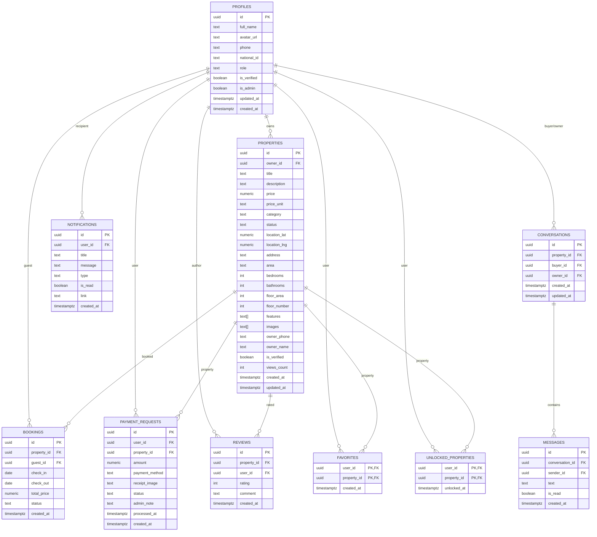
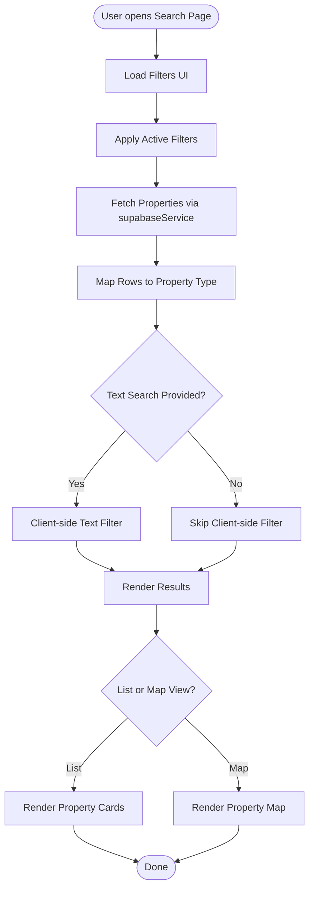

# Project Overview

<cite>
**Referenced Files in This Document**
- [README.md](file://README.md)
- [package.json](file://package.json)
- [product_specification.md](file://product_specification.md)
- [BOOKING_SYSTEM.md](file://BOOKING_SYSTEM.md)
- [schema.sql](file://supabase/schema.sql)
- [layout.tsx](file://src/app/layout.tsx)
- [providers.tsx](file://src/app/providers.tsx)
- [supabase.ts](file://src/lib/supabase.ts)
- [supabaseService.ts](file://src/services/supabaseService.ts)
- [database.types.ts](file://src/types/database.types.ts)
- [AuthContext.tsx](file://src/context/AuthContext.tsx)
- [page.tsx](file://src/app/page.tsx)
- [search/page.tsx](file://src/app/search/page.tsx)
- [SearchFilters.tsx](file://src/components/SearchFilters.tsx)
- [MapView.tsx](file://src/components/MapView.tsx)
</cite>

## Table of Contents
1. [Introduction](#introduction)
2. [Project Structure](#project-structure)
3. [Core Components](#core-components)
4. [Architecture Overview](#architecture-overview)
5. [Detailed Component Analysis](#detailed-component-analysis)
6. [Dependency Analysis](#dependency-analysis)
7. [Performance Considerations](#performance-considerations)
8. [Troubleshooting Guide](#troubleshooting-guide)
9. [Conclusion](#conclusion)

## Introduction
Gamasa Properties is a vacation rental marketplace tailored for Gamasa city, Egypt, connecting property owners with tenants seeking short-term stays. The platform offers a modern, mobile-first experience with integrated property search, interactive maps, messaging, favorites, and a comprehensive booking system supporting daily, monthly, and seasonal rentals. It leverages Supabase for authentication, real-time data, and storage, while the frontend is built with Next.js App Router, React 19, and Tailwind CSS.

Target audience:
- Tourists and visitors seeking vacation rentals in Gamasa
- Local property owners wanting to list and manage their properties
- Administrators who oversee listings, users, and payments

Core value proposition:
- Seamless discovery and booking of vacation properties
- Transparent pricing and flexible rental terms
- Secure communication and payment workflows
- Verified listings and trusted community features

Key differentiators:
- Integrated booking engine with multiple rental types and payment methods
- Real-time messaging and notifications
- Verified profiles and property unlocking mechanism
- Progressive Web App (PWA) support for native-like mobile experience

Business model and revenue streams:
- Commission-based revenue from booking service fees
- Optional premium features for property owners (e.g., featured listings)
- Payment processing fees for supported methods
- Administrative oversight and listing approval workflows

Market positioning:
- First-resort vacation rental platform in Gamasa
- Emphasis on verified properties, secure transactions, and responsive customer support
- Competitive pricing aligned with local tourism demand

Egyptian real estate rental context:
- Seasonal tourism drives demand for short-term rentals, especially during summer months
- Tourists prefer convenient, verified accommodations near popular beaches and attractions
- Digital-first platforms reduce friction for both owners and tenants
- Trust and transparency are critical factors influencing booking decisions

## Project Structure
The project follows a Next.js App Router-based architecture with a clear separation of concerns:
- Application shell and providers in the root layout
- Feature-focused pages under src/app (e.g., homepage, search, property details, auth)
- Shared UI components under src/components
- Services abstraction for Supabase operations under src/services
- Type-safe database contracts under src/types
- Authentication context and providers under src/context
- Supabase client initialization and storage utilities under src/lib

**Diagram sources**
- [layout.tsx](file://src/app/layout.tsx#L64-L89)
- [providers.tsx](file://src/app/providers.tsx#L7-L17)
- [page.tsx](file://src/app/page.tsx#L88-L194)
- [search/page.tsx](file://src/app/search/page.tsx#L12-L219)
- [SearchFilters.tsx](file://src/components/SearchFilters.tsx#L11-L162)
- [MapView.tsx](file://src/components/MapView.tsx#L24-L39)
- [supabaseService.ts](file://src/services/supabaseService.ts#L153-L800)
- [supabase.ts](file://src/lib/supabase.ts#L18-L68)
- [database.types.ts](file://src/types/database.types.ts#L12-L310)
- [AuthContext.tsx](file://src/context/AuthContext.tsx#L22-L185)

**Section sources**
- [layout.tsx](file://src/app/layout.tsx#L64-L89)
- [providers.tsx](file://src/app/providers.tsx#L7-L17)
- [page.tsx](file://src/app/page.tsx#L88-L194)
- [search/page.tsx](file://src/app/search/page.tsx#L12-L219)
- [SearchFilters.tsx](file://src/components/SearchFilters.tsx#L11-L162)
- [MapView.tsx](file://src/components/MapView.tsx#L24-L39)
- [supabaseService.ts](file://src/services/supabaseService.ts#L153-L800)
- [supabase.ts](file://src/lib/supabase.ts#L18-L68)
- [database.types.ts](file://src/types/database.types.ts#L12-L310)
- [AuthContext.tsx](file://src/context/AuthContext.tsx#L22-L185)

## Core Components
- Authentication and user management: Supabase Auth integrated with a custom AuthContext provider for session handling and user state
- Property catalog and search: Supabase-backed property listing with advanced filters, area selection, and feature-based queries
- Interactive maps: Leaflet-powered property map view with dynamic centering and property markers
- Messaging: Conversations and messages with real-time updates and RLS policies
- Favorites and unlocks: User-specific lists and property unlocking for enhanced engagement
- Booking system: Multi-type rental support (daily, monthly, seasonal), tenant forms, payment methods, and confirmation flows
- Notifications: Real-time alerts with read/unread states and policy-driven visibility
- Storage: Cloud storage for property images with upload and deletion utilities

Practical user workflows:
- Guest visitor: Browse homepage → search/filter properties → view details → unlock property → initiate booking → choose dates → fill tenant info → select payment method → confirm booking → receive confirmation
- Property owner: Log in → navigate to “My Properties” → add/edit property → submit for review → manage bookings and messages
- Renter/buyer: Log in → browse listings → add to favorites → send messages to owner → book property with chosen rental type

**Section sources**
- [product_specification.md](file://product_specification.md#L3-L44)
- [BOOKING_SYSTEM.md](file://BOOKING_SYSTEM.md#L62-L80)
- [supabaseService.ts](file://src/services/supabaseService.ts#L153-L800)
- [AuthContext.tsx](file://src/context/AuthContext.tsx#L22-L185)
- [page.tsx](file://src/app/page.tsx#L88-L194)
- [search/page.tsx](file://src/app/search/page.tsx#L12-L219)
- [SearchFilters.tsx](file://src/components/SearchFilters.tsx#L11-L162)
- [MapView.tsx](file://src/components/MapView.tsx#L24-L39)

## Architecture Overview
The platform adopts a client-centric architecture with Supabase as the backend foundation:
- Frontend: Next.js App Router with React 19, styled with Tailwind CSS, and enhanced with PWA capabilities
- Backend/Database: Supabase (PostgreSQL, Auth, Storage, Realtime) with Row Level Security (RLS) policies
- Services: Centralized service layer abstracting Supabase operations and providing mock mode for development
- Context: Global authentication and theme providers for consistent UX

**Diagram sources**
- [package.json](file://package.json#L11-L27)
- [supabase.ts](file://src/lib/supabase.ts#L18-L68)
- [supabaseService.ts](file://src/services/supabaseService.ts#L153-L800)
- [database.types.ts](file://src/types/database.types.ts#L12-L310)
- [schema.sql](file://supabase/schema.sql#L170-L251)

**Section sources**
- [package.json](file://package.json#L11-L27)
- [supabase.ts](file://src/lib/supabase.ts#L18-L68)
- [supabaseService.ts](file://src/services/supabaseService.ts#L153-L800)
- [database.types.ts](file://src/types/database.types.ts#L12-L310)
- [schema.sql](file://supabase/schema.sql#L170-L251)

## Detailed Component Analysis

### Booking System Workflow
The booking system supports three rental types with dedicated UI components and service functions. The flow integrates date selection, tenant information, payment method choice, and confirmation pages.

**Diagram sources**
- [BOOKING_SYSTEM.md](file://BOOKING_SYSTEM.md#L146-L205)
- [supabaseService.ts](file://src/services/supabaseService.ts#L153-L800)
- [page.tsx](file://src/app/property/[id]/page.tsx#L1-L200)
- [page.tsx](file://src/app/property/[id]/booking/page.tsx#L1-L200)
- [page.tsx](file://src/app/property/[id]/booking/confirmation/page.tsx#L1-L200)

**Section sources**
- [BOOKING_SYSTEM.md](file://BOOKING_SYSTEM.md#L62-L80)
- [BOOKING_SYSTEM.md](file://BOOKING_SYSTEM.md#L146-L205)
- [supabaseService.ts](file://src/services/supabaseService.ts#L153-L800)

### Data Model Overview
The Supabase schema defines core entities and relationships, enforcing RLS policies for secure access control.

**Diagram sources**
- [schema.sql](file://supabase/schema.sql#L7-L167)
- [schema.sql](file://supabase/schema.sql#L338-L360)
- [database.types.ts](file://src/types/database.types.ts#L12-L310)

**Section sources**
- [schema.sql](file://supabase/schema.sql#L7-L167)
- [schema.sql](file://supabase/schema.sql#L338-L360)
- [database.types.ts](file://src/types/database.types.ts#L12-L310)

### Authentication and Session Flow
The authentication layer combines Supabase Auth with a custom context provider to manage user sessions and state across the application.

**Diagram sources**
- [AuthContext.tsx](file://src/context/AuthContext.tsx#L80-L115)
- [supabase.ts](file://src/lib/supabase.ts#L18-L28)

**Section sources**
- [AuthContext.tsx](file://src/context/AuthContext.tsx#L22-L185)
- [supabase.ts](file://src/lib/supabase.ts#L18-L28)

### Property Search and Filtering
The search page aggregates filters and performs hybrid filtering (database and client-side) to present results in list or map view.

**Diagram sources**
- [search/page.tsx](file://src/app/search/page.tsx#L24-L82)
- [SearchFilters.tsx](file://src/components/SearchFilters.tsx#L11-L162)
- [MapView.tsx](file://src/components/MapView.tsx#L24-L39)
- [supabaseService.ts](file://src/services/supabaseService.ts#L313-L358)

**Section sources**
- [search/page.tsx](file://src/app/search/page.tsx#L12-L219)
- [SearchFilters.tsx](file://src/components/SearchFilters.tsx#L11-L162)
- [MapView.tsx](file://src/components/MapView.tsx#L24-L39)
- [supabaseService.ts](file://src/services/supabaseService.ts#L313-L358)

## Dependency Analysis
Technology stack overview:
- Frontend: Next.js 16+, React 19, Tailwind CSS, PWA support
- Backend/Database: Supabase (PostgreSQL, Auth, Storage, Realtime)
- Maps: Leaflet and React-Leaflet
- Utilities: date-fns, react-signature-canvas, next-themes

**Diagram sources**
- [package.json](file://package.json#L11-L27)
- [layout.tsx](file://src/app/layout.tsx#L20-L54)

**Section sources**
- [package.json](file://package.json#L11-L27)
- [layout.tsx](file://src/app/layout.tsx#L20-L54)

## Performance Considerations
- Client-side filtering: Hybrid approach balances simplicity with performance; consider moving text search to the database for large datasets
- Image optimization: Supabase storage with caching; ensure appropriate image sizes and formats
- Map rendering: Dynamic imports and lazy loading improve initial load times
- Mock mode: Enables rapid iteration without database overhead; toggle for production readiness
- Progressive Web App: Enhances offline capability and mobile performance

## Troubleshooting Guide
Common issues and resolutions:
- Missing environment variables: Ensure Supabase URL and anonymous key are configured; otherwise, the client falls back to placeholders
- Authentication failures: Verify Supabase Auth settings and network connectivity
- Property image uploads: Confirm bucket permissions and file types; handle errors gracefully
- Real-time updates: Ensure Realtime publication is enabled for messages and verify RLS policies
- Mock vs. live mode: Toggle mock flag to switch between mock data and Supabase operations

**Section sources**
- [supabase.ts](file://src/lib/supabase.ts#L7-L15)
- [schema.sql](file://supabase/schema.sql#L406-L416)
- [supabaseService.ts](file://src/services/supabaseService.ts#L6-L6)

## Conclusion
Gamasa Properties delivers a modern, scalable vacation rental platform tailored to Gamasa’s tourism market. Its architecture leverages Supabase for robust backend services while maintaining a responsive, user-friendly frontend. The integrated booking system, messaging, and verification mechanisms position the platform to become the preferred marketplace for vacation rentals in the region, with clear pathways for future enhancements such as advanced analytics, expanded payment methods, and enhanced owner dashboards.