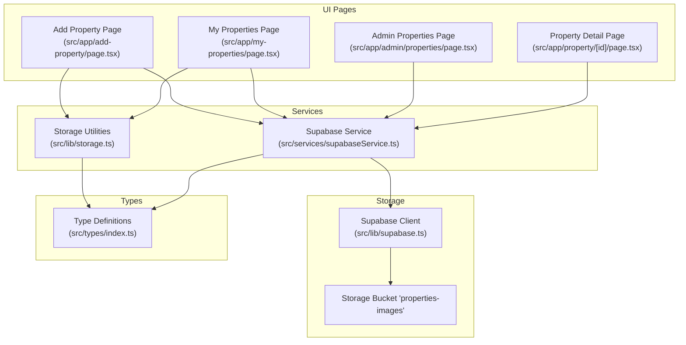
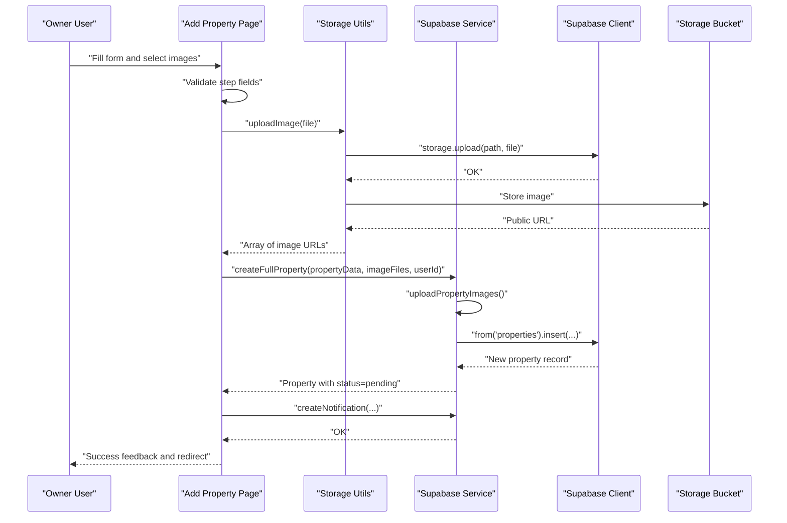
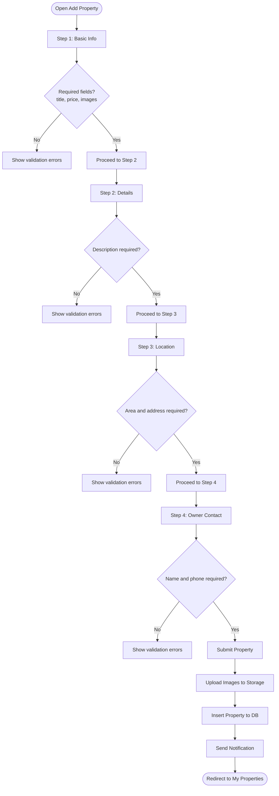
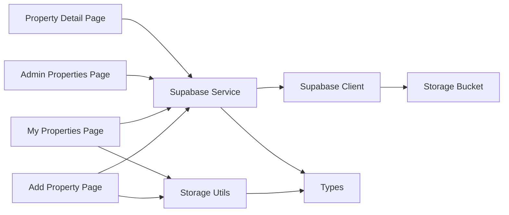

# Property CRUD Operations

<cite>
**Referenced Files in This Document**
- [src/app/add-property/page.tsx](file://src/app/add-property/page.tsx)
- [src/app/my-properties/page.tsx](file://src/app/my-properties/page.tsx)
- [src/app/admin/properties/page.tsx](file://src/app/admin/properties/page.tsx)
- [src/app/property/[id]/page.tsx](file://src/app/property/[id]/page.tsx)
- [src/lib/storage.ts](file://src/lib/storage.ts)
- [src/services/supabaseService.ts](file://src/services/supabaseService.ts)
- [src/lib/supabase.ts](file://src/lib/supabase.ts)
- [src/types/index.ts](file://src/types/index.ts)
- [src/components/MyPropertyCard.tsx](file://src/components/MyPropertyCard.tsx)
</cite>

## Table of Contents
1. [Introduction](#introduction)
2. [Project Structure](#project-structure)
3. [Core Components](#core-components)
4. [Architecture Overview](#architecture-overview)
5. [Detailed Component Analysis](#detailed-component-analysis)
6. [Dependency Analysis](#dependency-analysis)
7. [Performance Considerations](#performance-considerations)
8. [Troubleshooting Guide](#troubleshooting-guide)
9. [Conclusion](#conclusion)

## Introduction
This document explains the property CRUD (Create, Read, Update, Delete) operations implementation in the platform. It covers the property creation workflow, form validation, image upload processing, data persistence, update mechanisms, modification tracking, approval processes, deletion procedures, soft delete strategies, and administrative controls. It also documents the property owner dashboard and user feedback mechanisms.

## Project Structure
The property CRUD implementation spans UI pages, services, and storage utilities:
- UI pages orchestrate user interactions and form submission
- Services encapsulate Supabase operations and mock modes
- Storage utilities manage local mock data and Supabase image storage
- Types define data contracts and enums

**Diagram sources**
- [src/app/add-property/page.tsx](file://src/app/add-property/page.tsx#L1-L538)
- [src/app/my-properties/page.tsx](file://src/app/my-properties/page.tsx#L1-L211)
- [src/app/admin/properties/page.tsx](file://src/app/admin/properties/page.tsx#L1-L177)
- [src/app/property/[id]/page.tsx](file://src/app/property/[id]/page.tsx#L1-L88)
- [src/services/supabaseService.ts](file://src/services/supabaseService.ts#L1-L1384)
- [src/lib/storage.ts](file://src/lib/storage.ts#L1-L633)
- [src/lib/supabase.ts](file://src/lib/supabase.ts#L1-L68)
- [src/types/index.ts](file://src/types/index.ts#L1-L237)

**Section sources**
- [src/app/add-property/page.tsx](file://src/app/add-property/page.tsx#L1-L538)
- [src/app/my-properties/page.tsx](file://src/app/my-properties/page.tsx#L1-L211)
- [src/app/admin/properties/page.tsx](file://src/app/admin/properties/page.tsx#L1-L177)
- [src/app/property/[id]/page.tsx](file://src/app/property/[id]/page.tsx#L1-L88)
- [src/services/supabaseService.ts](file://src/services/supabaseService.ts#L1-L1384)
- [src/lib/storage.ts](file://src/lib/storage.ts#L1-L633)
- [src/lib/supabase.ts](file://src/lib/supabase.ts#L1-L68)
- [src/types/index.ts](file://src/types/index.ts#L1-L237)

## Core Components
- Property Creation Workflow: Multi-step form collects title, category, pricing, images, description, location, and owner contact; uploads images via Supabase storage; persists property with pending status; sends notifications.
- Form Validation: Step-based validation enforces required fields per step; displays inline errors; prevents navigation until valid.
- Image Upload Processing: Batch upload of multiple images; generates unique filenames; stores in Supabase storage bucket; returns public URLs; supports removal before submission.
- Data Persistence: Property insertion into Supabase properties table; mapping between DB and app types; fallback to mock mode when environment flag is enabled.
- Property Update Mechanisms: Admin approval toggles status; owner dashboard lists properties with edit/delete actions; update timestamps maintained in mock mode.
- Modification Tracking: Created/updated timestamps and view counters; property views incremented via RPC or fallback logic.
- Approval Processes: Admin filters by status; approves or rejects; sends notifications to owners; updates property status accordingly.
- Deletion Procedures: Owner deletes from dashboard; mock mode removes from localStorage; Supabase mode deletes records and associated images.
- Administrative Controls: Admin dashboard filters properties by status; bulk approval/rejection actions; preview links to property detail.

**Section sources**
- [src/app/add-property/page.tsx](file://src/app/add-property/page.tsx#L86-L156)
- [src/app/add-property/page.tsx](file://src/app/add-property/page.tsx#L158-L188)
- [src/lib/supabase.ts](file://src/lib/supabase.ts#L34-L54)
- [src/lib/storage.ts](file://src/lib/storage.ts#L190-L230)
- [src/services/supabaseService.ts](file://src/services/supabaseService.ts#L259-L311)
- [src/services/supabaseService.ts](file://src/services/supabaseService.ts#L393-L415)
- [src/services/supabaseService.ts](file://src/services/supabaseService.ts#L417-L440)
- [src/app/admin/properties/page.tsx](file://src/app/admin/properties/page.tsx#L31-L56)
- [src/app/my-properties/page.tsx](file://src/app/my-properties/page.tsx#L57-L67)
- [src/lib/storage.ts](file://src/lib/storage.ts#L232-L244)

## Architecture Overview
The property CRUD pipeline integrates UI forms, service abstractions, and Supabase storage:

**Diagram sources**
- [src/app/add-property/page.tsx](file://src/app/add-property/page.tsx#L51-L66)
- [src/app/add-property/page.tsx](file://src/app/add-property/page.tsx#L86-L156)
- [src/lib/supabase.ts](file://src/lib/supabase.ts#L34-L54)
- [src/services/supabaseService.ts](file://src/services/supabaseService.ts#L259-L311)
- [src/services/supabaseService.ts](file://src/services/supabaseService.ts#L618-L637)

## Detailed Component Analysis

### Property Creation Workflow
- Multi-step form captures:
  - Basic info: title, category, price, unit, images
  - Details: description
  - Location: area, address
  - Owner contact: name, phone
- Validation per step ensures required fields before advancing
- Image handling:
  - Multiple file selection
  - Parallel upload promises
  - Unique filename generation
  - Public URL collection
- Submission:
  - Builds property object with status pending
  - Calls service to create property
  - Sends notification to owner
  - Redirects to owner dashboard

**Diagram sources**
- [src/app/add-property/page.tsx](file://src/app/add-property/page.tsx#L158-L188)
- [src/app/add-property/page.tsx](file://src/app/add-property/page.tsx#L51-L66)
- [src/app/add-property/page.tsx](file://src/app/add-property/page.tsx#L86-L156)

**Section sources**
- [src/app/add-property/page.tsx](file://src/app/add-property/page.tsx#L10-L156)
- [src/lib/supabase.ts](file://src/lib/supabase.ts#L34-L54)
- [src/lib/storage.ts](file://src/lib/storage.ts#L190-L230)
- [src/services/supabaseService.ts](file://src/services/supabaseService.ts#L259-L311)

### Form Validation Patterns
- Inline error indicators for invalid fields
- Step-based validation preventing navigation
- Clear user feedback for missing required fields

**Section sources**
- [src/app/add-property/page.tsx](file://src/app/add-property/page.tsx#L158-L188)

### Image Upload Processing
- Generates unique filenames to avoid collisions
- Stores images in the configured bucket
- Returns public URLs for property images
- Supports removing images before submission

**Section sources**
- [src/lib/supabase.ts](file://src/lib/supabase.ts#L34-L54)
- [src/app/add-property/page.tsx](file://src/app/add-property/page.tsx#L51-L70)

### Data Persistence
- Mock mode: localStorage-backed CRUD with generated IDs and timestamps
- Supabase mode: inserts property rows with mapped fields
- Type conversion utilities ensure compatibility between DB and app models

**Section sources**
- [src/lib/storage.ts](file://src/lib/storage.ts#L181-L230)
- [src/lib/storage.ts](file://src/lib/storage.ts#L71-L124)
- [src/services/supabaseService.ts](file://src/services/supabaseService.ts#L259-L311)

### Property Update Mechanisms and Modification Tracking
- Admin approval toggles property status
- Owner dashboard lists properties with edit/delete actions
- Mock mode updates timestamps on change
- View counters incremented via RPC or fallback logic

**Section sources**
- [src/app/admin/properties/page.tsx](file://src/app/admin/properties/page.tsx#L31-L56)
- [src/app/my-properties/page.tsx](file://src/app/my-properties/page.tsx#L57-L67)
- [src/services/supabaseService.ts](file://src/services/supabaseService.ts#L378-L391)
- [src/lib/storage.ts](file://src/lib/storage.ts#L232-L253)

### Approval Processes
- Admin filters properties by status (pending, approved, rejected, all)
- Approve or reject actions update status and notify owners
- Preview links open property detail in a new tab

**Section sources**
- [src/app/admin/properties/page.tsx](file://src/app/admin/properties/page.tsx#L17-L56)

### Deletion Procedures and Soft Delete Strategies
- Owner dashboard supports deletion with confirmation
- Mock mode removes property from localStorage
- Supabase mode deletes property and associated images
- No explicit soft-delete implementation observed; deletion appears hard

**Section sources**
- [src/app/my-properties/page.tsx](file://src/app/my-properties/page.tsx#L57-L67)
- [src/services/supabaseService.ts](file://src/services/supabaseService.ts#L417-L440)

### Property Owner Dashboard
- Lists owned properties with summary and actions
- Provides quick access to add new properties
- Displays property status badges and view counts
- Edit/Delete actions per property card

**Section sources**
- [src/app/my-properties/page.tsx](file://src/app/my-properties/page.tsx#L13-L211)
- [src/components/MyPropertyCard.tsx](file://src/components/MyPropertyCard.tsx#L1-L83)

### Administrative Controls
- Filters properties by status
- Bulk approval/rejection actions
- Notification sending to property owners
- Property preview links

**Section sources**
- [src/app/admin/properties/page.tsx](file://src/app/admin/properties/page.tsx#L1-L177)

## Dependency Analysis
The following diagram maps key dependencies among components involved in property CRUD:

**Diagram sources**
- [src/app/add-property/page.tsx](file://src/app/add-property/page.tsx#L1-L538)
- [src/app/my-properties/page.tsx](file://src/app/my-properties/page.tsx#L1-L211)
- [src/app/admin/properties/page.tsx](file://src/app/admin/properties/page.tsx#L1-L177)
- [src/app/property/[id]/page.tsx](file://src/app/property/[id]/page.tsx#L1-L88)
- [src/services/supabaseService.ts](file://src/services/supabaseService.ts#L1-L1384)
- [src/lib/storage.ts](file://src/lib/storage.ts#L1-L633)
- [src/lib/supabase.ts](file://src/lib/supabase.ts#L1-L68)
- [src/types/index.ts](file://src/types/index.ts#L1-L237)

**Section sources**
- [src/app/add-property/page.tsx](file://src/app/add-property/page.tsx#L1-L538)
- [src/app/my-properties/page.tsx](file://src/app/my-properties/page.tsx#L1-L211)
- [src/app/admin/properties/page.tsx](file://src/app/admin/properties/page.tsx#L1-L177)
- [src/app/property/[id]/page.tsx](file://src/app/property/[id]/page.tsx#L1-L88)
- [src/services/supabaseService.ts](file://src/services/supabaseService.ts#L1-L1384)
- [src/lib/storage.ts](file://src/lib/storage.ts#L1-L633)
- [src/lib/supabase.ts](file://src/lib/supabase.ts#L1-L68)
- [src/types/index.ts](file://src/types/index.ts#L1-L237)

## Performance Considerations
- Image uploads use parallel promises to improve throughput; consider upload progress and cancellation for large batches.
- Property listing queries support filtering and ordering; ensure appropriate indexes on frequently filtered columns.
- View counting uses RPC when available; fallback to direct update maintains correctness but may increase write volume.
- Mock mode simplifies development but bypasses real storage; ensure production mode is enabled for performance testing.

## Troubleshooting Guide
Common issues and resolutions:
- Missing environment variables for Supabase client cause warnings; ensure NEXT_PUBLIC_SUPABASE_URL and NEXT_PUBLIC_SUPABASE_ANON_KEY are configured.
- Image upload failures: verify bucket permissions and file types; inspect returned error messages.
- Property creation errors: check Supabase insert response and rollback of uploaded images in error paths.
- Admin approval failures: verify status transitions and notification delivery.
- Local storage corruption: clear localStorage keys prefixed by the app to reset mock data.

**Section sources**
- [src/lib/supabase.ts](file://src/lib/supabase.ts#L7-L15)
- [src/lib/supabase.ts](file://src/lib/supabase.ts#L56-L67)
- [src/services/supabaseService.ts](file://src/services/supabaseService.ts#L299-L310)
- [src/lib/storage.ts](file://src/lib/storage.ts#L480-L482)

## Conclusion
The property CRUD implementation provides a robust, multi-step creation flow with image handling, validation, and persistence across mock and Supabase modes. Administrative controls enable approval workflows, while owner dashboards facilitate property management. The architecture cleanly separates UI concerns from service and storage layers, enabling maintainability and extensibility.