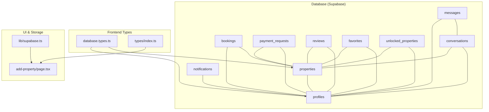
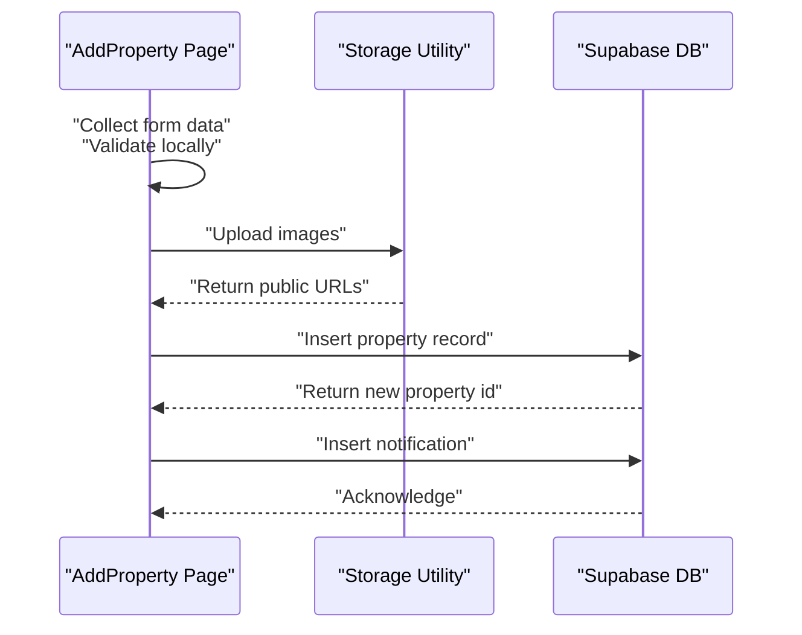
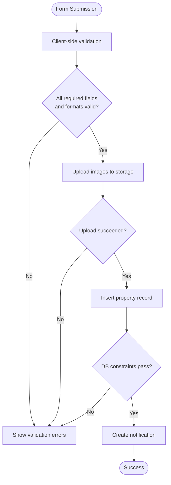
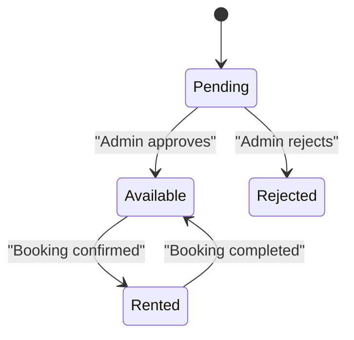
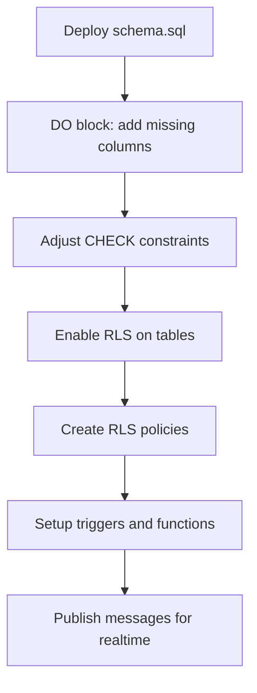
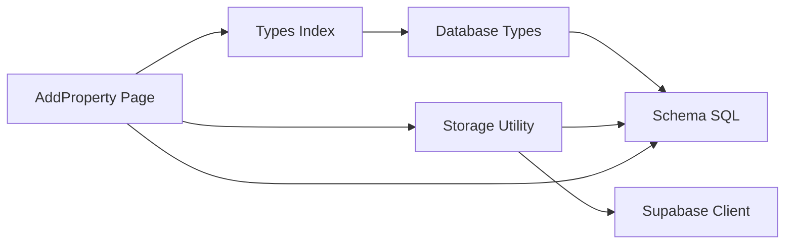

# Property Data Model and Types

<cite>
**Referenced Files in This Document**
- [schema.sql](file://supabase/schema.sql)
- [database.types.ts](file://src/types/database.types.ts)
- [index.ts](file://src/types/index.ts)
- [page.tsx](file://src/app/add-property/page.tsx)
- [supabase.ts](file://src/lib/supabase.ts)
- [functions.sql](file://supabase/functions.sql)
</cite>

## Table of Contents
1. [Introduction](#introduction)
2. [Project Structure](#project-structure)
3. [Core Components](#core-components)
4. [Architecture Overview](#architecture-overview)
5. [Detailed Component Analysis](#detailed-component-analysis)
6. [Dependency Analysis](#dependency-analysis)
7. [Performance Considerations](#performance-considerations)
8. [Troubleshooting Guide](#troubleshooting-guide)
9. [Conclusion](#conclusion)
10. [Appendices](#appendices)

## Introduction
This document provides comprehensive data model documentation for the property system. It covers the Property interface structure, database table schema, field definitions, validation rules, type safety, and relationships with users, bookings, and favorites. It also explains the property status system, verification process, approval workflows, and migration patterns.

## Project Structure
The property system spans database schema definitions, TypeScript type definitions, UI forms, and storage utilities:
- Database schema defines tables, constraints, policies, triggers, and helper functions
- TypeScript types define strongly-typed interfaces for frontend and backend integration
- UI pages collect property data with client-side validation
- Storage utilities handle image uploads and URL generation

**Diagram sources**
- [schema.sql](file://supabase/schema.sql#L8-L416)
- [database.types.ts](file://src/types/database.types.ts#L12-L310)
- [index.ts](file://src/types/index.ts#L25-L54)
- [page.tsx](file://src/app/add-property/page.tsx#L17-L129)
- [supabase.ts](file://src/lib/supabase.ts#L34-L54)

**Section sources**
- [schema.sql](file://supabase/schema.sql#L1-L416)
- [database.types.ts](file://src/types/database.types.ts#L1-L310)
- [index.ts](file://src/types/index.ts#L1-L237)
- [page.tsx](file://src/app/add-property/page.tsx#L1-L538)
- [supabase.ts](file://src/lib/supabase.ts#L1-L68)

## Core Components
This section documents the Property interface and related types, followed by the database schema for properties and supporting entities.

### Property Interface
The Property interface defines the runtime shape of property data used across the application.

- Identity and ownership
  - id: string (UUID)
  - ownerId: string (references profiles.id)
- Title and description
  - title: string
  - description: string
- Pricing and unit
  - price: number
  - priceUnit: 'يوم' | 'أسبوع' | 'شهر' | 'موسم'
- Category and status
  - category: PropertyCategory
  - status: PropertyStatus
- Location and geometry
  - images: string[]
  - location: Location { lat, lng, address, area }
- Owner contact
  - ownerPhone: string (hidden until payment)
  - ownerName: string
- Features and dimensions
  - features: string[]
  - bedrooms: number
  - bathrooms: number
  - area: number (square meters)
  - floor: number
- Verification and analytics
  - isVerified: boolean
  - viewsCount: number
- Timestamps
  - createdAt: string (ISO timestamp)
  - updatedAt: string (ISO timestamp)

Optional advanced rental configuration and availability dates are supported for backward compatibility.

**Section sources**
- [index.ts](file://src/types/index.ts#L25-L54)

### Supporting Types
- Location: coordinates, address, and area
- PropertyCategory: 'شقة' | 'غرفة' | 'استوديو' | 'فيلا' | 'شاليه'
- PropertyStatus: 'متاح' | 'محجوز' | 'مؤجر'
- User: profile with roles, verification, favorites, and unlocked properties
- PaymentRequest: payment workflow for property owners
- Review: user ratings and comments
- Notification: user-centric notifications
- SearchFilters: query parameters for property listings

**Section sources**
- [index.ts](file://src/types/index.ts#L18-L133)

### Database Schema: Properties
The properties table encapsulates property records with strong constraints and defaults.

- Primary key and foreign keys
  - id: UUID (default gen_random_uuid(), primary key)
  - owner_id: UUID (references profiles.id, cascade delete)
- Required fields
  - title: TEXT NOT NULL
  - price: DECIMAL NOT NULL
- Enumerations and defaults
  - price_unit: TEXT DEFAULT 'day' with CHECK (in 'day','week','month','season')
  - category: TEXT with CHECK (in 'apartment','room','studio','villa','chalet')
  - status: TEXT DEFAULT 'pending' with CHECK (in 'pending','available','rented','rejected')
- Geometry and address
  - location_lat, location_lng: DOUBLE PRECISION
  - address: TEXT
  - area: TEXT (e.g., "كرنك", "بحر", "مركز")
- Dimensions and rooms
  - bedrooms: INTEGER DEFAULT 1
  - bathrooms: INTEGER DEFAULT 1
  - floor_area: INTEGER (square meters)
  - floor_number: INTEGER DEFAULT 0
- Arrays
  - features: TEXT[] DEFAULT '{}'
  - images: TEXT[] DEFAULT '{}'
- Owner info
  - owner_phone: TEXT
  - owner_name: TEXT
- Verification and analytics
  - is_verified: BOOLEAN DEFAULT FALSE
  - views_count: INTEGER DEFAULT 0
- Timestamps
  - created_at, updated_at: TIMESTAMP WITH TIME ZONE DEFAULT NOW()

Constraints and defaults are enforced via CHECK constraints and DO blocks to maintain consistency across deployments.

**Section sources**
- [schema.sql](file://supabase/schema.sql#L42-L92)

### Related Entities and Relationships
- Profiles (users)
  - id: UUID (primary key, references auth.users)
  - role: TEXT DEFAULT 'tenant' with CHECK (in 'tenant','landlord','admin')
  - is_verified: BOOLEAN DEFAULT FALSE
  - is_admin: BOOLEAN DEFAULT FALSE
- Bookings
  - property_id → properties.id (cascade delete)
  - guest_id → profiles.id (cascade delete)
  - check_in/check_out: DATE NOT NULL
  - total_price: DECIMAL NOT NULL
  - status: TEXT DEFAULT 'pending' with CHECK (in 'pending','confirmed','cancelled','completed')
- Payment Requests
  - user_id → profiles.id (cascade delete)
  - property_id → properties.id (cascade delete)
  - payment_method: TEXT with CHECK (in 'vodafone_cash','instapay','fawry')
  - status: TEXT DEFAULT 'pending' with CHECK (in 'pending','approved','rejected')
- Reviews
  - property_id → properties.id (cascade delete)
  - user_id → profiles.id (cascade delete)
  - rating: INTEGER CHECK (1..5)
  - unique constraint (property_id,user_id)
- Notifications
  - user_id → profiles.id (cascade delete)
  - type: TEXT with CHECK (in 'success','info','warning','error')
- Favorites and Unlocked Properties
  - composite primary key (user_id,property_id)
  - foreign keys with cascade delete
- Conversations and Messages
  - property_id → properties.id (set null on delete)
  - buyer_id, owner_id → profiles.id (cascade delete)
  - messages reference conversations with cascade delete

**Section sources**
- [schema.sql](file://supabase/schema.sql#L8-L167)
- [schema.sql](file://supabase/schema.sql#L338-L403)

## Architecture Overview
The property system integrates frontend forms, typed interfaces, and backend database constraints. The following sequence illustrates property creation and verification flow.

**Diagram sources**
- [page.tsx](file://src/app/add-property/page.tsx#L51-L156)
- [supabase.ts](file://src/lib/supabase.ts#L34-L54)
- [schema.sql](file://supabase/schema.sql#L42-L67)

## Detailed Component Analysis

### Property Validation Rules and Type Safety
- Frontend validation (client-side)
  - Title and price required in initial steps
  - Description required in step 2
  - Area and address required in step 3
  - Owner name and phone required in step 4
  - Image upload limit: up to 6 images
  - Image constraints: file types JPEG/PNG/WEBP/JPG, max size 5MB
- Backend enforcement (database)
  - NOT NULL constraints on title, price, owner_id
  - CHECK constraints on enums (price_unit, category, status)
  - Arrays default to empty arrays
  - Numeric defaults for bedrooms/bathrooms/floor_number
- Type safety (TypeScript)
  - Strongly-typed Row/Insert/Update shapes in database.types.ts
  - Property interface aligns with database schema
  - Enums and literal unions enforce domain values

**Diagram sources**
- [page.tsx](file://src/app/add-property/page.tsx#L158-L178)
- [page.tsx](file://src/app/add-property/page.tsx#L51-L66)
- [supabase.ts](file://src/lib/supabase.ts#L34-L54)
- [schema.sql](file://supabase/schema.sql#L42-L67)

**Section sources**
- [page.tsx](file://src/app/add-property/page.tsx#L17-L156)
- [supabase.ts](file://src/lib/supabase.ts#L34-L54)
- [database.types.ts](file://src/types/database.types.ts#L53-L132)
- [index.ts](file://src/types/index.ts#L25-L54)

### Property Status System and Approval Workflows
- Status lifecycle
  - pending: newly submitted, awaiting review
  - available: approved and visible to tenants
  - rented: currently leased
  - rejected: declined by admin
- Visibility policy
  - Approved properties are selectable by tenants when status is available or rented
  - Owners can view their own properties regardless of status
- Admin privileges
  - Admins can manage all properties and payment requests
- Approval flow
  - On property submission, status defaults to pending
  - Admin updates status to available after verification
  - Upon approval, property becomes searchable and bookable

**Diagram sources**
- [schema.sql](file://supabase/schema.sql#L197-L209)
- [schema.sql](file://supabase/schema.sql#L307-L315)

**Section sources**
- [schema.sql](file://supabase/schema.sql#L48-L50)
- [schema.sql](file://supabase/schema.sql#L197-L209)
- [schema.sql](file://supabase/schema.sql#L307-L315)

### Verification Process and Data Types
- Verification flag
  - is_verified: BOOLEAN DEFAULT FALSE on properties
  - is_verified: BOOLEAN DEFAULT FALSE on profiles
- Verification triggers and policies
  - Admins can bypass visibility restrictions for properties
  - Profiles can be marked verified by admins
- Data types and precision
  - price: DECIMAL (monetary)
  - location_lat/location_lng: DOUBLE PRECISION (geographic)
  - floor_area: INTEGER (square meters)
  - views_count: INTEGER (analytics)

**Section sources**
- [schema.sql](file://supabase/schema.sql#L62-L63)
- [schema.sql](file://supabase/schema.sql#L15-L16)
- [schema.sql](file://supabase/schema.sql#L297-L304)

### Database Migration Patterns and Schema Evolution
- Idempotent schema updates
  - DO blocks add missing columns and adjust CHECK constraints
  - Constraints redefined to use English values for compatibility
- Column additions and defaults
  - Added price_unit, category, floor_area, floor_number, features, views_count
- Row Level Security (RLS)
  - Enabled on all tables
  - Fine-grained policies per entity (select/update/insert/delete)
- Helper functions and triggers
  - Automatic profile creation on user signup
  - Atomic increment for views_count via stored procedure
  - Realtime publication for messages

**Diagram sources**
- [schema.sql](file://supabase/schema.sql#L21-L92)
- [schema.sql](file://supabase/schema.sql#L170-L180)
- [schema.sql](file://supabase/schema.sql#L185-L250)
- [schema.sql](file://supabase/schema.sql#L254-L294)
- [functions.sql](file://supabase/functions.sql#L5-L39)
- [schema.sql](file://supabase/schema.sql#L408-L416)

**Section sources**
- [schema.sql](file://supabase/schema.sql#L21-L92)
- [schema.sql](file://supabase/schema.sql#L170-L250)
- [functions.sql](file://supabase/functions.sql#L5-L39)

## Dependency Analysis
The property system exhibits clear separation of concerns:
- UI depends on types and storage utilities
- Storage utilities depend on Supabase client configuration
- Database enforces referential integrity and business rules
- Type definitions mirror database schema for compile-time safety

**Diagram sources**
- [page.tsx](file://src/app/add-property/page.tsx#L1-L10)
- [index.ts](file://src/types/index.ts#L1-L20)
- [supabase.ts](file://src/lib/supabase.ts#L1-L31)
- [database.types.ts](file://src/types/database.types.ts#L1-L12)
- [schema.sql](file://supabase/schema.sql#L1-L10)

**Section sources**
- [page.tsx](file://src/app/add-property/page.tsx#L1-L10)
- [index.ts](file://src/types/index.ts#L1-L20)
- [supabase.ts](file://src/lib/supabase.ts#L1-L31)
- [database.types.ts](file://src/types/database.types.ts#L1-L12)
- [schema.sql](file://supabase/schema.sql#L1-L10)

## Performance Considerations
- Use arrays for features and images to avoid normalization overhead
- Keep CHECK constraints minimal to reduce write-time validation cost
- Leverage atomic increments for counters (views_count) via stored procedures
- Apply RLS judiciously; ensure appropriate indexes on frequently filtered columns (e.g., status, owner_id)
- Store only public URLs in images/features arrays to minimize payload sizes

## Troubleshooting Guide
- Missing environment variables for Supabase client
  - Symptom: warnings during initialization
  - Resolution: configure NEXT_PUBLIC_SUPABASE_URL and NEXT_PUBLIC_SUPABASE_ANON_KEY
- Image upload failures
  - Symptom: upload errors or empty URLs
  - Resolution: verify file types and sizes; confirm bucket permissions
- Property insertion fails
  - Symptom: constraint violations on enums or NOT NULL fields
  - Resolution: ensure price_unit, category, status match allowed values; fill required fields
- Visibility issues
  - Symptom: properties not appearing to tenants
  - Resolution: verify status is available or owner_id matches authenticated user

**Section sources**
- [supabase.ts](file://src/lib/supabase.ts#L7-L15)
- [supabase.ts](file://src/lib/supabase.ts#L45-L47)
- [schema.sql](file://supabase/schema.sql#L80-L89)
- [schema.sql](file://supabase/schema.sql#L197-L209)

## Conclusion
The property system combines robust database constraints, strongly-typed frontend interfaces, and practical UI validation to ensure data integrity and a smooth user experience. The schema supports flexible property configurations, clear approval workflows, and scalable storage for media assets. Migration patterns and RLS policies provide a secure foundation for future enhancements.

## Appendices

### Property Data Structure Examples
- Minimal property object
  - title, price, priceUnit, category, images[], ownerId, location{lat,lng,address,area}, bedrooms, bathrooms, area, floor
- With optional fields
  - description, features[], ownerPhone, ownerName, isVerified, viewsCount, status, createdAt, updatedAt

**Section sources**
- [index.ts](file://src/types/index.ts#L25-L54)
- [page.tsx](file://src/app/add-property/page.tsx#L106-L129)

### Validation Patterns
- Client-side
  - Required fields per step
  - File type and size checks for images
- Server-side
  - NOT NULL and CHECK constraints
  - Unique constraints for reviews

**Section sources**
- [page.tsx](file://src/app/add-property/page.tsx#L158-L178)
- [supabase.ts](file://src/lib/supabase.ts#L7-L27)
- [schema.sql](file://supabase/schema.sql#L130-L139)

### Type Safety Implementations
- database.types.ts exports Row/Insert/Update types aligned with schema
- index.ts defines enums and interfaces for frontend consumption
- Strict enum literals ensure domain correctness

**Section sources**
- [database.types.ts](file://src/types/database.types.ts#L53-L132)
- [index.ts](file://src/types/index.ts#L3-L6)