# Property Image Management

<cite>
**Referenced Files in This Document**
- [supabase.ts](file://src/lib/supabase.ts)
- [validation.ts](file://src/utils/validation.ts)
- [add-property/page.tsx](file://src/app/add-property/page.tsx)
- [property/[id]/page.tsx](file://src/app/property/[id]/page.tsx)
- [property/[id]/client.tsx](file://src/app/property/[id]/client.tsx)
- [PropertyCard.tsx](file://src/components/PropertyCard.tsx)
- [ImageSkeleton.tsx](file://src/components/ImageSkeleton.tsx)
- [storage.ts](file://src/lib/storage.ts)
- [supabaseService.ts](file://src/services/supabaseService.ts)
- [database.types.ts](file://src/types/database.types.ts)
- [package.json](file://package.json)
- [package-lock.json](file://package-lock.json)
</cite>

## Table of Contents
1. [Introduction](#introduction)
2. [Project Structure](#project-structure)
3. [Core Components](#core-components)
4. [Architecture Overview](#architecture-overview)
5. [Detailed Component Analysis](#detailed-component-analysis)
6. [Dependency Analysis](#dependency-analysis)
7. [Performance Considerations](#performance-considerations)
8. [Troubleshooting Guide](#troubleshooting-guide)
9. [Conclusion](#conclusion)

## Introduction
This document provides comprehensive documentation for the property image management system. It covers image upload workflows, file validation, storage optimization, image resizing and format conversion, CDN integration, image gallery implementation with lazy loading and responsive images, storage service integration, image URL generation, fallback mechanisms, metadata management, thumbnail generation, and performance optimization techniques.

## Project Structure
The image management system spans several key areas:
- Frontend pages for property creation and display
- Utility functions for file validation
- Supabase integration for storage and retrieval
- Component libraries for image galleries and skeletons
- Service layer for business logic and image operations

**Diagram sources**
- [add-property/page.tsx](file://src/app/add-property/page.tsx#L1-L538)
- [property/[id]/page.tsx](file://src/app/property/[id]/page.tsx#L1-L88)
- [PropertyCard.tsx](file://src/components/PropertyCard.tsx#L1-L199)
- [validation.ts](file://src/utils/validation.ts#L1-L33)
- [ImageSkeleton.tsx](file://src/components/ImageSkeleton.tsx#L1-L6)
- [storage.ts](file://src/lib/storage.ts#L1-L633)
- [supabaseService.ts](file://src/services/supabaseService.ts#L1-L800)
- [supabase.ts](file://src/lib/supabase.ts#L1-L68)
- [database.types.ts](file://src/types/database.types.ts#L1-L310)

**Section sources**
- [supabase.ts](file://src/lib/supabase.ts#L1-L68)
- [validation.ts](file://src/utils/validation.ts#L1-L33)
- [add-property/page.tsx](file://src/app/add-property/page.tsx#L1-L538)
- [property/[id]/page.tsx](file://src/app/property/[id]/page.tsx#L1-L88)
- [PropertyCard.tsx](file://src/components/PropertyCard.tsx#L1-L199)
- [ImageSkeleton.tsx](file://src/components/ImageSkeleton.tsx#L1-L6)
- [storage.ts](file://src/lib/storage.ts#L1-L633)
- [supabaseService.ts](file://src/services/supabaseService.ts#L1-L800)
- [database.types.ts](file://src/types/database.types.ts#L1-L310)

## Core Components
The system consists of several core components working together:

### Supabase Storage Integration
The central storage mechanism uses Supabase Storage with a dedicated bucket for property images. The system supports both direct Supabase integration and mock mode for development.

### Image Upload Pipeline
The upload pipeline handles file validation, secure naming, and URL generation with automatic cache control configuration.

### Validation Layer
Comprehensive file validation ensures only supported image formats and sizes are accepted, preventing invalid uploads.

### Gallery Components
Responsive image galleries with skeleton loading, lazy loading, and fallback mechanisms provide optimal user experience across devices.

**Section sources**
- [supabase.ts](file://src/lib/supabase.ts#L30-L67)
- [validation.ts](file://src/utils/validation.ts#L7-L27)
- [add-property/page.tsx](file://src/app/add-property/page.tsx#L51-L66)
- [PropertyCard.tsx](file://src/components/PropertyCard.tsx#L81-L94)

## Architecture Overview
The image management system follows a layered architecture with clear separation of concerns:

**Diagram sources**
- [validation.ts](file://src/utils/validation.ts#L7-L27)
- [supabase.ts](file://src/lib/supabase.ts#L34-L54)
- [supabaseService.ts](file://src/services/supabaseService.ts#L231-L248)
- [storage.ts](file://src/lib/storage.ts#L44-L67)

The architecture supports:
- **Scalable Storage**: Supabase Storage with CDN-backed URLs
- **Validation Pipeline**: Client-side and server-side validation
- **Flexible Upload**: Support for multiple image formats and sizes
- **Robust Error Handling**: Comprehensive error management and fallbacks

## Detailed Component Analysis

### Image Upload Workflow
The upload workflow implements a complete pipeline from file selection to storage and URL generation:

**Diagram sources**
- [add-property/page.tsx](file://src/app/add-property/page.tsx#L51-L66)
- [validation.ts](file://src/utils/validation.ts#L7-L27)
- [supabase.ts](file://src/lib/supabase.ts#L34-L54)

Key features:
- **Batch Upload**: Multiple images can be uploaded simultaneously
- **Progress Tracking**: Visual feedback during upload process
- **Error Recovery**: Graceful handling of upload failures
- **Security**: Unique filenames prevent conflicts and ensure privacy

**Section sources**
- [add-property/page.tsx](file://src/app/add-property/page.tsx#L51-L66)
- [supabase.ts](file://src/lib/supabase.ts#L34-L54)

### File Validation System
The validation system ensures image quality and compatibility:

```mermaid
flowchart TD
FileSelect["File Selection"] --> CheckType{"Image type<br/>supported?"}
CheckType --> |No| RejectType["Reject: Unsupported type"]
CheckType --> |Yes| CheckSize{"Size ≤ 5MB?"}
CheckSize --> |No| RejectSize["Reject: File too large"]
CheckSize --> |Yes| Accept["Accept file"]
RejectType --> End([End])
RejectSize --> End
Accept --> End
```

**Diagram sources**
- [validation.ts](file://src/utils/validation.ts#L7-L27)

Supported formats and limits:
- **Formats**: JPG, PNG, WEBP, JPEG
- **Size Limit**: 5MB per image
- **Multiple Files**: Up to 6 images per property submission

**Section sources**
- [validation.ts](file://src/utils/validation.ts#L7-L27)

### Storage Service Integration
The storage service provides a unified interface for image operations:

**Diagram sources**
- [supabase.ts](file://src/lib/supabase.ts#L30-L67)
- [storage.ts](file://src/lib/storage.ts#L44-L67)
- [supabaseService.ts](file://src/services/supabaseService.ts#L231-L248)

**Section sources**
- [supabase.ts](file://src/lib/supabase.ts#L30-L67)
- [storage.ts](file://src/lib/storage.ts#L44-L67)
- [supabaseService.ts](file://src/services/supabaseService.ts#L231-L248)

### Image Gallery Implementation
The gallery components provide responsive, optimized image display:

**Diagram sources**
- [PropertyCard.tsx](file://src/components/PropertyCard.tsx#L26-L40)
- [ImageSkeleton.tsx](file://src/components/ImageSkeleton.tsx#L1-L6)
- [property/[id]/client.tsx](file://src/app/property/[id]/client.tsx#L67-L84)

Gallery features:
- **Responsive Design**: Adaptive sizing for different screen sizes
- **Lazy Loading**: Images load as they come into viewport
- **Skeleton Loading**: Placeholder while images load
- **Fallback Handling**: Graceful degradation for missing images

**Section sources**
- [PropertyCard.tsx](file://src/components/PropertyCard.tsx#L81-L94)
- [ImageSkeleton.tsx](file://src/components/ImageSkeleton.tsx#L1-L6)
- [property/[id]/client.tsx](file://src/app/property/[id]/client.tsx#L67-L84)

### CDN Integration and URL Generation
The system leverages Supabase Storage's built-in CDN capabilities:

**Diagram sources**
- [supabase.ts](file://src/lib/supabase.ts#L38-L51)

CDN benefits:
- **Global Delivery**: Fast content delivery worldwide
- **Automatic Caching**: Configurable cache control headers
- **Scalability**: Handles traffic spikes automatically
- **Compression**: Transparent image optimization

**Section sources**
- [supabase.ts](file://src/lib/supabase.ts#L38-L51)

### Metadata Management
The system manages image metadata through database integration:

**Diagram sources**
- [database.types.ts](file://src/types/database.types.ts#L53-L132)

Metadata stored:
- **Image URLs**: Direct links to CDN-hosted images
- **File Information**: Names, sizes, and MIME types
- **Processing Status**: Upload completion and validation results

**Section sources**
- [database.types.ts](file://src/types/database.types.ts#L53-L132)

## Dependency Analysis
The image management system has well-defined dependencies:

**Diagram sources**
- [package.json](file://package.json)
- [package-lock.json](file://package-lock.json#L9207-L9251)
- [validation.ts](file://src/utils/validation.ts#L1-L33)
- [supabase.ts](file://src/lib/supabase.ts#L1-L28)
- [supabaseService.ts](file://src/services/supabaseService.ts#L1-L8)
- [storage.ts](file://src/lib/storage.ts#L1-L6)
- [PropertyCard.tsx](file://src/components/PropertyCard.tsx#L1-L9)

Key dependencies:
- **Supabase**: Core storage and authentication
- **Sharp**: Optional image processing and optimization
- **Next.js Image**: Built-in responsive image optimization

**Section sources**
- [package.json](file://package.json)
- [package-lock.json](file://package-lock.json#L9207-L9251)

## Performance Considerations
The system implements several performance optimization strategies:

### Image Optimization Strategies
- **Modern Formats**: Support for WebP and AVIF where available
- **Responsive Images**: Dynamic sizing based on viewport
- **Lazy Loading**: Non-critical images defer loading
- **CDN Distribution**: Global content delivery network

### Memory Management
- **Batch Operations**: Concurrent uploads with controlled concurrency
- **Cleanup**: Proper error handling and resource cleanup
- **Caching**: Strategic caching of frequently accessed images

### Network Optimization
- **Connection Pooling**: Efficient database connections
- **Compression**: Automatic compression for images
- **Cache Headers**: Proper cache control configuration

## Troubleshooting Guide

### Common Upload Issues
**Problem**: Images fail to upload
**Solutions**:
- Verify file format and size limits
- Check network connectivity
- Ensure proper authentication
- Validate bucket permissions

**Problem**: Images appear corrupted
**Solutions**:
- Verify file integrity during upload
- Check MIME type detection
- Validate file extensions
- Test with different browsers

**Problem**: Slow upload speeds
**Solutions**:
- Implement chunked uploads for large files
- Use compression before upload
- Monitor network conditions
- Consider CDN optimization

### Display Issues
**Problem**: Images not showing in galleries
**Solutions**:
- Check image URLs and CDN accessibility
- Verify responsive image implementation
- Test fallback mechanisms
- Inspect browser console for errors

**Problem**: Poor image quality
**Solutions**:
- Verify compression settings
- Check resolution requirements
- Test different formats (WebP, AVIF)
- Validate display dimensions

**Section sources**
- [validation.ts](file://src/utils/validation.ts#L7-L27)
- [supabase.ts](file://src/lib/supabase.ts#L45-L47)
- [PropertyCard.tsx](file://src/components/PropertyCard.tsx#L81-L94)

## Conclusion
The property image management system provides a robust, scalable solution for handling property images with comprehensive validation, efficient storage, and optimized delivery. The system's modular architecture supports easy maintenance and future enhancements while providing excellent user experience through responsive design and performance optimization.

Key strengths include:
- **Comprehensive Validation**: Multi-layered file validation prevents invalid uploads
- **Scalable Storage**: Supabase integration with CDN ensures global availability
- **Performance Optimization**: Responsive images, lazy loading, and modern formats
- **Developer Experience**: Clear APIs and comprehensive error handling
- **Future Extensibility**: Modular design supports additional features like AI-powered optimization

The system successfully balances functionality, performance, and maintainability, providing a solid foundation for property image management needs.