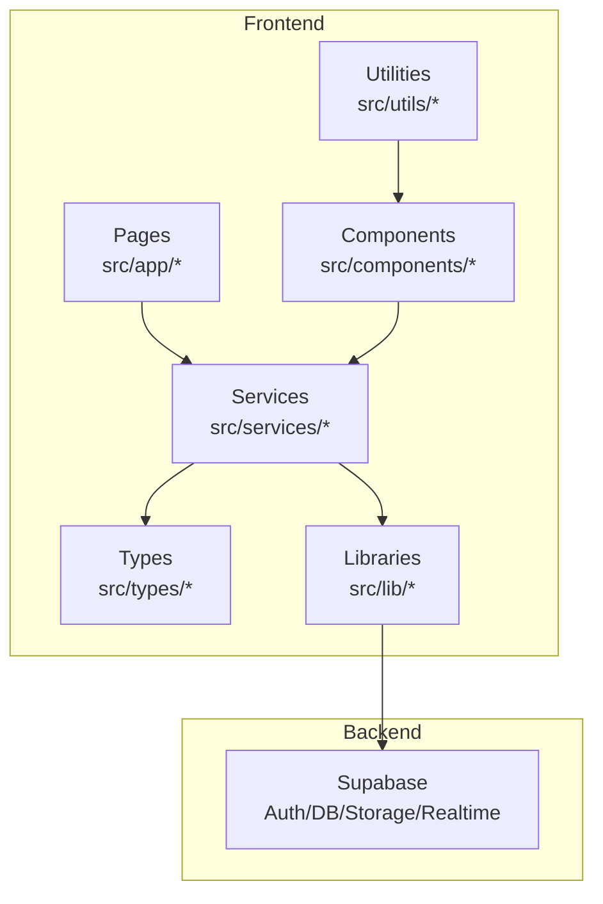
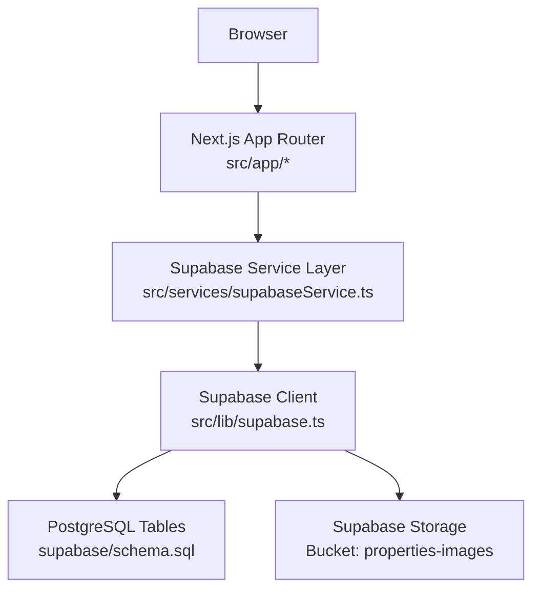
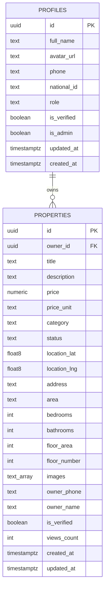
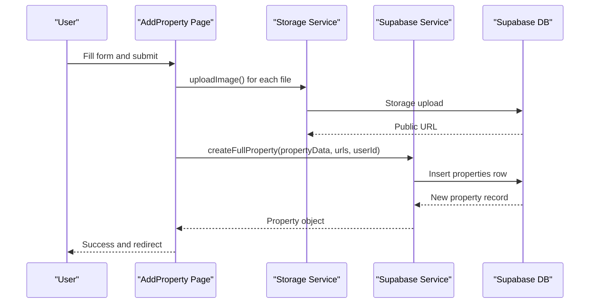
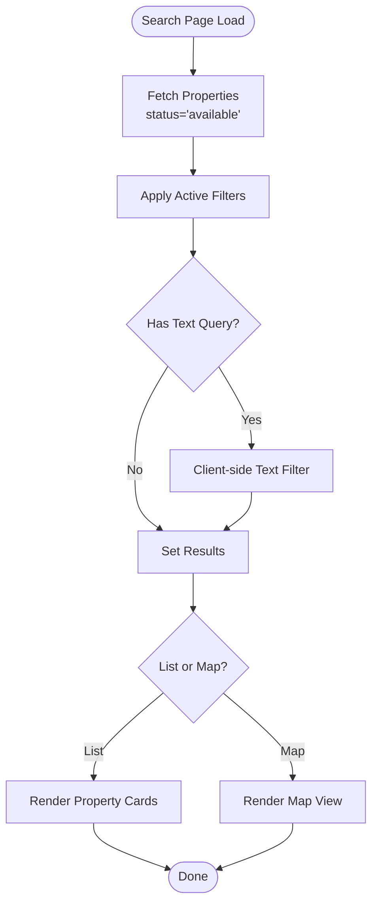
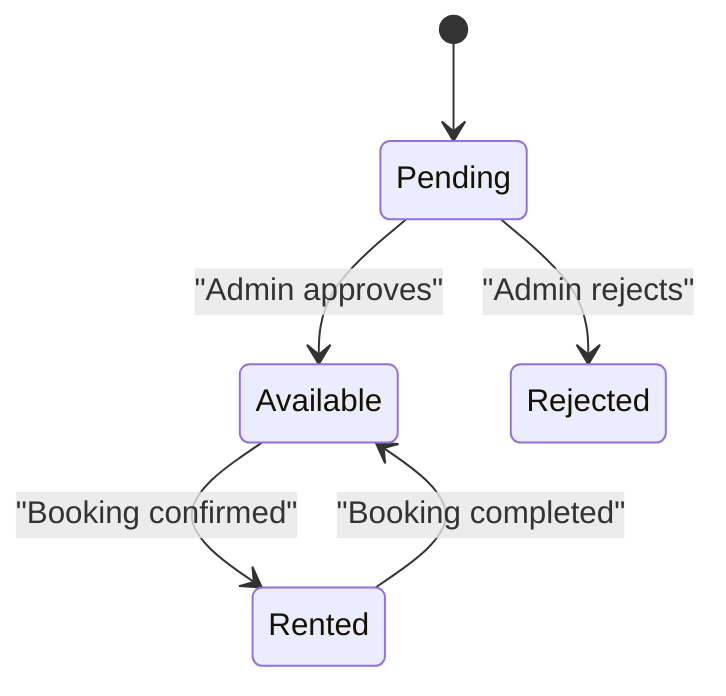
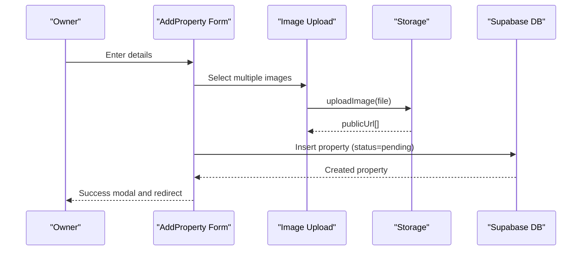
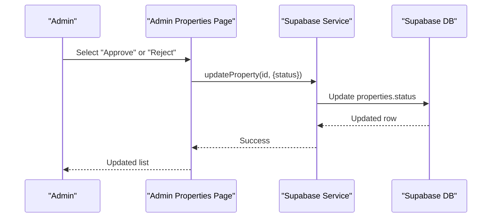
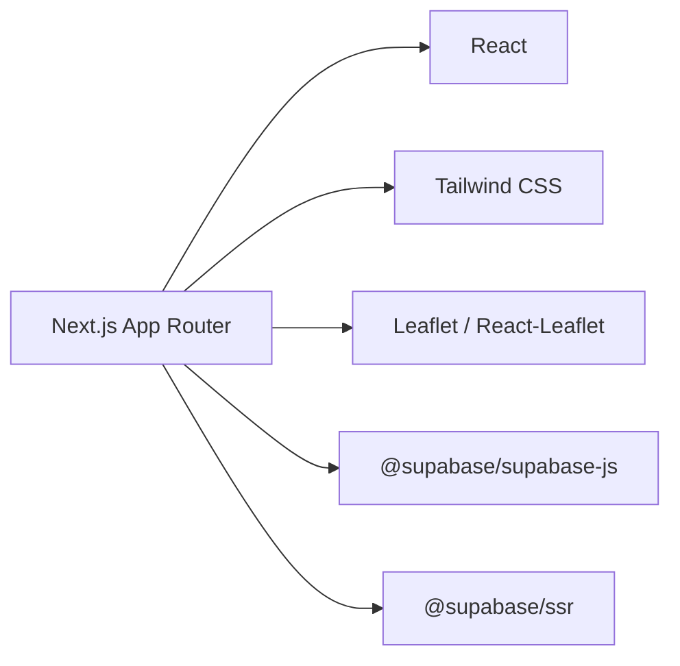

# Property Management System

<cite>
**Referenced Files in This Document**
- [package.json](file://package.json)
- [README.md](file://README.md)
- [product_specification.md](file://product_specification.md)
- [schema.sql](file://supabase/schema.sql)
- [database.types.ts](file://src/types/database.types.ts)
- [index.ts](file://src/types/index.ts)
- [supabase.ts](file://src/lib/supabase.ts)
- [storage.ts](file://src/lib/storage.ts)
- [supabaseService.ts](file://src/services/supabaseService.ts)
- [validation.ts](file://src/utils/validation.ts)
- [page.tsx](file://src/app/add-property/page.tsx)
- [page.tsx](file://src/app/my-properties/page.tsx)
- [page.tsx](file://src/app/search/page.tsx)
- [page.tsx](file://src/app/admin/properties/page.tsx)
- [PropertyCard.tsx](file://src/components/PropertyCard.tsx)
</cite>

## Table of Contents
1. [Introduction](#introduction)
2. [Project Structure](#project-structure)
3. [Core Components](#core-components)
4. [Architecture Overview](#architecture-overview)
5. [Detailed Component Analysis](#detailed-component-analysis)
6. [Dependency Analysis](#dependency-analysis)
7. [Performance Considerations](#performance-considerations)
8. [Troubleshooting Guide](#troubleshooting-guide)
9. [Conclusion](#conclusion)
10. [Appendices](#appendices)

## Introduction
This document describes the Property Management System for Gamasa Properties, a real estate platform built with Next.js and Supabase. It covers the property data model, CRUD operations, listing and search functionality, categorization, creation workflow, image management, validation rules, approval processes, filtering/sorting, geolocation integration, availability management, owner dashboard, modification workflows, and deletion procedures. Examples of data structures, API interactions, and UI components are included to guide developers and stakeholders.

## Project Structure
The system follows a modern Next.js 16 App Router architecture with TypeScript, Supabase for backend/database/auth/storage, and Tailwind CSS for styling. Key areas:
- Frontend pages under src/app for public, authenticated, and admin experiences
- Services under src/services for Supabase interactions
- Utilities under src/utils for validation
- Types under src/types for database and domain models
- Libraries under src/lib for Supabase client and storage helpers
- Components under src/components for reusable UI elements

**Diagram sources**
- [package.json](file://package.json#L11-L27)
- [supabase.ts](file://src/lib/supabase.ts#L1-L68)
- [supabaseService.ts](file://src/services/supabaseService.ts#L1-L800)

**Section sources**
- [README.md](file://README.md#L1-L37)
- [package.json](file://package.json#L1-L42)

## Core Components
- Property data model: Strongly typed in src/types with database mapping in src/types/database.types.ts
- Supabase integration: Client initialization, storage bucket management, and helper functions
- Property CRUD: Implemented via src/lib/storage.ts (localStorage fallback) and src/services/supabaseService.ts (Supabase)
- UI components: PropertyCard, SearchFilters, and admin property management
- Validation: Utility functions for messages, files, and basic sanitization

**Section sources**
- [database.types.ts](file://src/types/database.types.ts#L12-L310)
- [index.ts](file://src/types/index.ts#L25-L54)
- [supabase.ts](file://src/lib/supabase.ts#L1-L68)
- [storage.ts](file://src/lib/storage.ts#L1-L633)
- [supabaseService.ts](file://src/services/supabaseService.ts#L153-L440)
- [validation.ts](file://src/utils/validation.ts#L1-L33)

## Architecture Overview
The system uses Supabase as the backend foundation:
- Authentication via Supabase Auth
- Relational data stored in PostgreSQL tables with Row Level Security (RLS)
- Storage for property images in Supabase Storage
- Realtime capabilities for chat and notifications
- App Router pages coordinate with service layer for data operations

**Diagram sources**
- [supabase.ts](file://src/lib/supabase.ts#L1-L68)
- [supabaseService.ts](file://src/services/supabaseService.ts#L1-L800)
- [schema.sql](file://supabase/schema.sql#L1-L416)

## Detailed Component Analysis

### Property Data Model
The property entity is defined with TypeScript interfaces and mapped to Supabase tables. It includes:
- Identity: id, owner_id
- Description: title, description, category, status
- Pricing: price, price_unit
- Location: coordinates, address, area
- Dimensions: bedrooms, bathrooms, floor_area, floor_number
- Media: images array
- Contact: owner_name, owner_phone
- Metadata: is_verified, views_count, timestamps

**Diagram sources**
- [schema.sql](file://supabase/schema.sql#L42-L67)
- [database.types.ts](file://src/types/database.types.ts#L53-L132)

**Section sources**
- [index.ts](file://src/types/index.ts#L25-L54)
- [database.types.ts](file://src/types/database.types.ts#L53-L132)
- [schema.sql](file://supabase/schema.sql#L42-L67)

### Property CRUD Operations Implementation
- Creation: Add property via src/app/add-property/page.tsx → src/lib/storage.ts → Supabase insert
- Retrieval: List properties in search and owner dashboards via src/services/supabaseService.ts
- Update: Admin approval and owner modifications handled in service layer
- Deletion: Property deletion implemented in service layer with image cleanup

**Diagram sources**
- [page.tsx](file://src/app/add-property/page.tsx#L51-L156)
- [storage.ts](file://src/lib/storage.ts#L44-L67)
- [supabaseService.ts](file://src/services/supabaseService.ts#L259-L311)

**Section sources**
- [page.tsx](file://src/app/add-property/page.tsx#L10-L156)
- [storage.ts](file://src/lib/storage.ts#L190-L230)
- [supabaseService.ts](file://src/services/supabaseService.ts#L259-L440)

### Property Listing and Search Functionality
- Search page aggregates filters and queries, retrieves approved properties, and supports list/map views
- Filtering includes category, price range, area, bedrooms/bathrooms, and features
- Text search is applied client-side on title/address

**Diagram sources**
- [page.tsx](file://src/app/search/page.tsx#L28-L82)
- [PropertyCard.tsx](file://src/components/PropertyCard.tsx#L26-L199)

**Section sources**
- [page.tsx](file://src/app/search/page.tsx#L12-L82)
- [PropertyCard.tsx](file://src/components/PropertyCard.tsx#L26-L199)

### Property Categorization System
- Categories supported: apartment, room, studio, villa, chalet
- Status lifecycle: pending → available/rented/rejected
- Admin approval controls publication status

**Diagram sources**
- [schema.sql](file://supabase/schema.sql#L49-L50)
- [schema.sql](file://supabase/schema.sql#L307-L315)

**Section sources**
- [schema.sql](file://supabase/schema.sql#L49-L50)
- [schema.sql](file://supabase/schema.sql#L307-L315)

### Property Creation Workflow
- Multi-step form collects title, category, pricing, images, description, location, and owner contact
- Image upload uses Supabase Storage with unique filenames and public URL retrieval
- Submission triggers property insertion with pending status and admin notification

**Diagram sources**
- [page.tsx](file://src/app/add-property/page.tsx#L51-L156)
- [supabase.ts](file://src/lib/supabase.ts#L34-L54)

**Section sources**
- [page.tsx](file://src/app/add-property/page.tsx#L10-L156)
- [supabase.ts](file://src/lib/supabase.ts#L34-L54)

### Image Upload and Management
- Storage bucket: properties-images
- Unique filename generation prevents conflicts
- Public URL retrieval enables direct image display
- Cleanup on property deletion removes associated images

**Section sources**
- [supabase.ts](file://src/lib/supabase.ts#L31-L68)
- [supabaseService.ts](file://src/services/supabaseService.ts#L231-L254)
- [supabaseService.ts](file://src/services/supabaseService.ts#L417-L440)

### Property Validation Rules
- Message validation: length limits and emptiness checks
- File validation: MIME type and size constraints for images and voice
- Basic text sanitization to mitigate XSS risks

**Section sources**
- [validation.ts](file://src/utils/validation.ts#L1-L33)

### Approval Processes
- Admin dashboard lists pending properties with action buttons to approve or reject
- On approval, owner receives a notification and property becomes available
- On rejection, owner receives a notification with reason context

**Diagram sources**
- [page.tsx](file://src/app/admin/properties/page.tsx#L31-L56)
- [supabaseService.ts](file://src/services/supabaseService.ts#L393-L415)

**Section sources**
- [page.tsx](file://src/app/admin/properties/page.tsx#L7-L56)
- [supabaseService.ts](file://src/services/supabaseService.ts#L393-L415)

### Property Filtering and Sorting Mechanisms
- Filters: category, area, price range, bedrooms, bathrooms, features
- Sorting: default by created_at descending
- Hybrid search: DB-side filtering plus client-side text matching

**Section sources**
- [supabaseService.ts](file://src/services/supabaseService.ts#L313-L358)
- [page.tsx](file://src/app/search/page.tsx#L28-L82)

### Geolocation Integration
- Property records include latitude/longitude and address fields
- Map view component renders property markers
- Center/bounds constants define Gamasa city coverage

**Section sources**
- [index.ts](file://src/types/index.ts#L18-L23)
- [index.ts](file://src/types/index.ts#L166-L177)
- [page.tsx](file://src/app/search/page.tsx#L158-L160)

### Property Availability Management
- Status lifecycle managed via RLS policies and service updates
- Admin can toggle availability after approval
- Owner dashboard displays owned properties with status indicators

**Section sources**
- [schema.sql](file://supabase/schema.sql#L197-L209)
- [page.tsx](file://src/app/my-properties/page.tsx#L13-L55)
- [page.tsx](file://src/app/admin/properties/page.tsx#L58-L71)

### Property Owner Dashboard Features
- Lists owned properties with counts and actions
- Supports mock mode for development and fallback behavior
- Provides quick links to add new properties

**Section sources**
- [page.tsx](file://src/app/my-properties/page.tsx#L13-L211)

### Property Modification Workflows
- Service layer supports partial updates to property attributes
- Ownership checks enforced via RLS policies
- UI components coordinate with service layer for optimistic updates

**Section sources**
- [supabaseService.ts](file://src/services/supabaseService.ts#L393-L415)
- [schema.sql](file://supabase/schema.sql#L205-L209)

### Property Deletion Procedures
- Service deletes property and associated images
- Ownership verification ensures only owner can delete
- Error handling reverts state if image deletion fails

**Section sources**
- [supabaseService.ts](file://src/services/supabaseService.ts#L417-L440)

### Examples of Property Data Structures
- Property interface: [index.ts](file://src/types/index.ts#L25-L54)
- Database row mapping: [database.types.ts](file://src/types/database.types.ts#L53-L132)
- Mock properties: [supabaseService.ts](file://src/services/supabaseService.ts#L50-L147)

### API Interactions
- Supabase client initialization: [supabase.ts](file://src/lib/supabase.ts#L18-L28)
- Property CRUD endpoints: [supabaseService.ts](file://src/services/supabaseService.ts#L259-L440)
- Image upload/delete helpers: [supabase.ts](file://src/lib/supabase.ts#L34-L68)

### UI Component Implementations
- Property card with favorites toggle and verified badges: [PropertyCard.tsx](file://src/components/PropertyCard.tsx#L26-L199)
- Search page with filters and view modes: [page.tsx](file://src/app/search/page.tsx#L12-L220)
- Admin property management: [page.tsx](file://src/app/admin/properties/page.tsx#L7-L177)

## Dependency Analysis
External dependencies include Supabase client libraries, React, Next.js, Tailwind CSS, and Leaflet for maps. The service layer abstracts Supabase operations and provides a clean interface for pages.

**Diagram sources**
- [package.json](file://package.json#L11-L27)

**Section sources**
- [package.json](file://package.json#L11-L27)

## Performance Considerations
- Client-side filtering should be minimized; push filters to DB where possible
- Use pagination for large property lists
- Optimize image uploads with appropriate compression and caching
- Leverage Supabase RLS to avoid unnecessary data transfer
- Consider indexing on frequently queried columns (area, category, price)

## Troubleshooting Guide
Common issues and resolutions:
- Missing environment variables: Verify NEXT_PUBLIC_SUPABASE_URL and NEXT_PUBLIC_SUPABASE_ANON_KEY
- Image upload failures: Check bucket permissions and file size/type constraints
- Property not appearing: Confirm status is available and RLS policies allow selection
- Admin actions failing: Ensure user has admin role and proper RLS policy coverage

**Section sources**
- [supabase.ts](file://src/lib/supabase.ts#L7-L15)
- [schema.sql](file://supabase/schema.sql#L197-L209)

## Conclusion
The Property Management System integrates Supabase for authentication, relational data, storage, and realtime features with a modern Next.js frontend. The system supports robust property lifecycle management, from creation and approval to listing and availability, with strong typing, validation, and admin oversight.

## Appendices
- Product specification overview: [product_specification.md](file://product_specification.md#L1-L44)
- Supabase schema reference: [schema.sql](file://supabase/schema.sql#L1-L416)