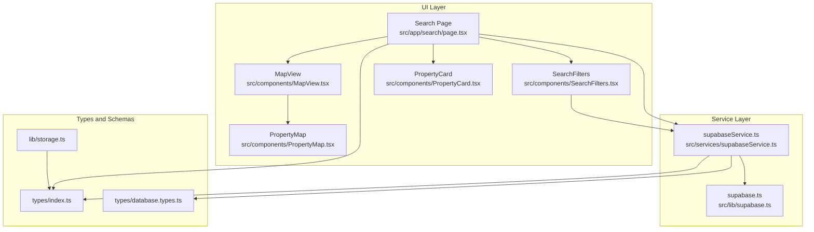
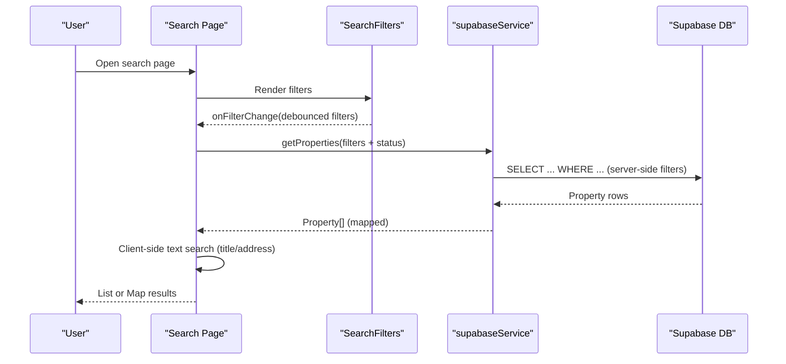
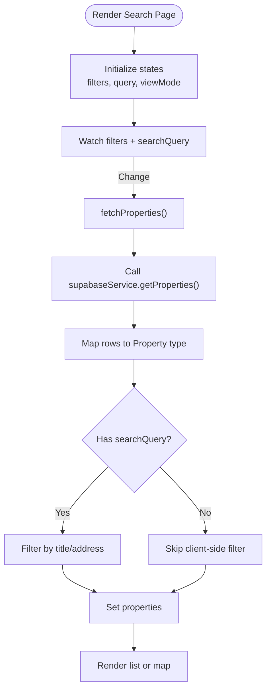
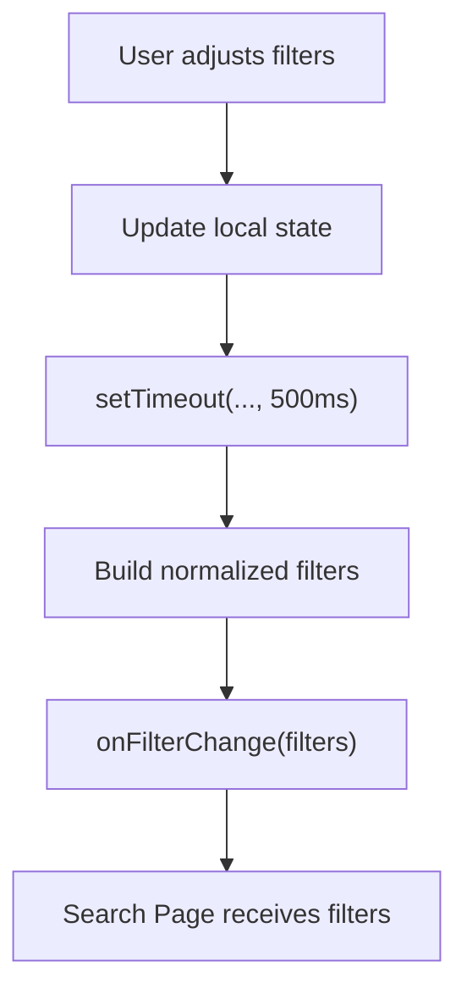
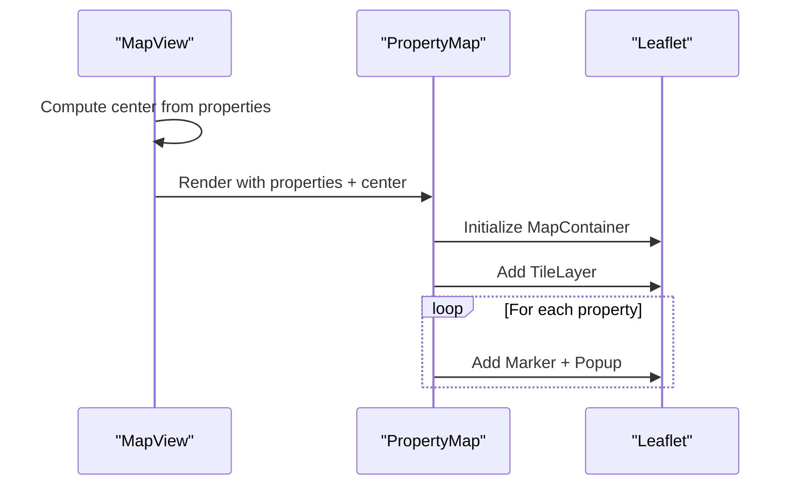
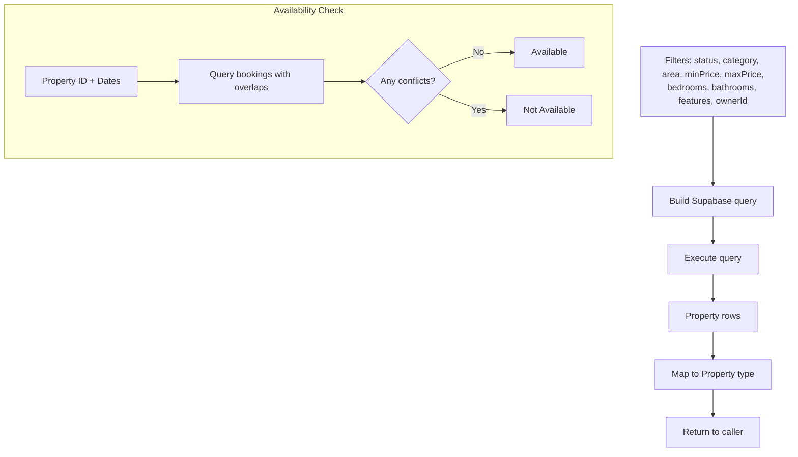
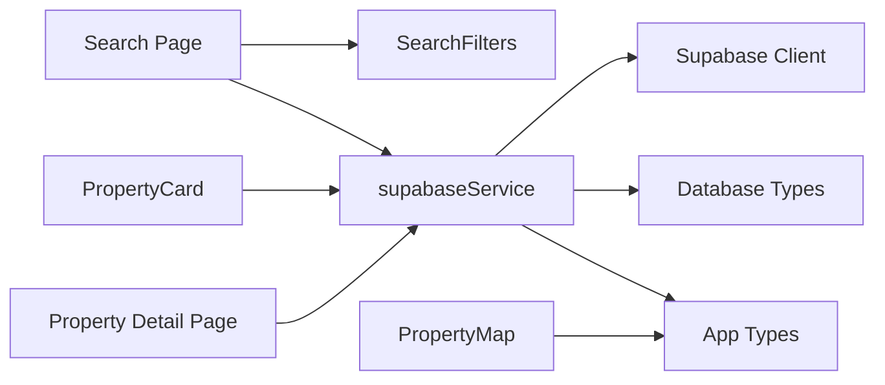

# Property Search and Filtering System

<cite>
**Referenced Files in This Document**
- [page.tsx](file://src/app/search/page.tsx)
- [SearchFilters.tsx](file://src/components/SearchFilters.tsx)
- [MapView.tsx](file://src/components/MapView.tsx)
- [PropertyMap.tsx](file://src/components/PropertyMap.tsx)
- [PropertyCard.tsx](file://src/components/PropertyCard.tsx)
- [supabase.ts](file://src/lib/supabase.ts)
- [supabaseService.ts](file://src/services/supabaseService.ts)
- [index.ts](file://src/types/index.ts)
- [database.types.ts](file://src/types/database.types.ts)
- [storage.ts](file://src/lib/storage.ts)
- [page.tsx](file://src/app/property/[id]/page.tsx)
- [supabaseService.ts](file://src/services/supabaseService.ts)
</cite>

## Table of Contents
1. [Introduction](#introduction)
2. [Project Structure](#project-structure)
3. [Core Components](#core-components)
4. [Architecture Overview](#architecture-overview)
5. [Detailed Component Analysis](#detailed-component-analysis)
6. [Dependency Analysis](#dependency-analysis)
7. [Performance Considerations](#performance-considerations)
8. [Troubleshooting Guide](#troubleshooting-guide)
9. [Conclusion](#conclusion)
10. [Appendices](#appendices)

## Introduction
This document explains the property search and filtering system, covering search algorithms, filter criteria, result ranking, geographic search, price range filtering, property type categorization, availability checking, UI components, filter state management, real-time updates, query construction, performance optimization, and map-based search integration. It synthesizes the client-side search page, filter controls, map rendering, and backend service layer to provide a complete understanding of how users discover and interact with properties.

## Project Structure
The search experience spans three primary areas:
- UI and orchestration: search page, filter sidebar, map view, and property cards
- Data and service layer: Supabase client, service methods, and types
- Types and constants: property model, areas, features, and availability configuration

**Diagram sources**
- [page.tsx](file://src/app/search/page.tsx#L1-L220)
- [SearchFilters.tsx](file://src/components/SearchFilters.tsx#L1-L163)
- [MapView.tsx](file://src/components/MapView.tsx#L1-L40)
- [PropertyMap.tsx](file://src/components/PropertyMap.tsx#L1-L93)
- [PropertyCard.tsx](file://src/components/PropertyCard.tsx#L1-L199)
- [supabaseService.ts](file://src/services/supabaseService.ts#L1-L800)
- [supabase.ts](file://src/lib/supabase.ts#L1-L68)
- [index.ts](file://src/types/index.ts#L1-L237)
- [database.types.ts](file://src/types/database.types.ts#L1-L310)
- [storage.ts](file://src/lib/storage.ts#L1-L633)

**Section sources**
- [page.tsx](file://src/app/search/page.tsx#L1-L220)
- [index.ts](file://src/types/index.ts#L1-L237)

## Core Components
- Search Page orchestrates state, fetches properties via the service, applies client-side text search, and renders either a list or map view.
- SearchFilters manages filter state with debounced updates and exposes normalized filters to the parent.
- MapView and PropertyMap integrate with react-leaflet to render property markers and popups.
- PropertyCard displays property details and supports favorites.
- supabaseService provides property retrieval with server-side filtering and availability checks.
- Types define property model, areas, features, bounds, and availability configuration.

**Section sources**
- [page.tsx](file://src/app/search/page.tsx#L12-L82)
- [SearchFilters.tsx](file://src/components/SearchFilters.tsx#L11-L33)
- [PropertyMap.tsx](file://src/components/PropertyMap.tsx#L26-L54)
- [supabaseService.ts](file://src/services/supabaseService.ts#L313-L358)
- [index.ts](file://src/types/index.ts#L18-L54)

## Architecture Overview
The search pipeline combines server-side filtering with client-side text matching and map rendering.

**Diagram sources**
- [page.tsx](file://src/app/search/page.tsx#L24-L82)
- [SearchFilters.tsx](file://src/components/SearchFilters.tsx#L19-L33)
- [supabaseService.ts](file://src/services/supabaseService.ts#L313-L358)

## Detailed Component Analysis

### Search Page (Orchestration and Real-Time Updates)
- State management: properties, loading, searchQuery, mobile filters, viewMode.
- Fetch lifecycle: useEffect triggers fetchProperties when filters or searchQuery change.
- Server-side filtering: status = available and optional filters passed to service.
- Client-side text search: filters by title and address for quick keyword matching.
- View modes: list or map; map view computes center from current properties.

**Diagram sources**
- [page.tsx](file://src/app/search/page.tsx#L14-L82)

**Section sources**
- [page.tsx](file://src/app/search/page.tsx#L12-L82)

### SearchFilters (Debounced Filter Controls)
- Manages price range, bedrooms/bathrooms thresholds, area selection, category, and features.
- Debounces onFilterChange to avoid excessive queries; clears invalid keys (e.g., undefined) for clean payloads.
- Provides reset button to restore defaults.

**Diagram sources**
- [SearchFilters.tsx](file://src/components/SearchFilters.tsx#L19-L33)

**Section sources**
- [SearchFilters.tsx](file://src/components/SearchFilters.tsx#L11-L33)

### MapView and PropertyMap (Geographic Rendering)
- MapView calculates a dynamic center from current properties; falls back to a default center if none.
- PropertyMap integrates react-leaflet, sets tile layer, and renders markers with popups linking to property pages.
- Uses dynamic import to defer leaflet loading and improve client performance.

**Diagram sources**
- [MapView.tsx](file://src/components/MapView.tsx#L25-L37)
- [PropertyMap.tsx](file://src/components/PropertyMap.tsx#L35-L91)

**Section sources**
- [MapView.tsx](file://src/components/MapView.tsx#L24-L39)
- [PropertyMap.tsx](file://src/components/PropertyMap.tsx#L26-L54)

### PropertyCard (Result Presentation)
- Displays property image, title, location, pricing, and features.
- Supports favorites with optimistic UI and service integration.
- Links to property detail page.

**Section sources**
- [PropertyCard.tsx](file://src/components/PropertyCard.tsx#L26-L199)

### Supabase Service (Query Construction and Availability)
- getProperties builds a server-side query with optional filters: status, category, area, min/max price, bedrooms/bathrooms, features, ownerId.
- Uses contains for array overlap on features.
- checkAvailability verifies booking conflicts for a given date range.
- createBooking persists booking records and computes derived amounts.

**Diagram sources**
- [supabaseService.ts](file://src/services/supabaseService.ts#L313-L358)
- [supabaseService.ts](file://src/services/supabaseService.ts#L1116-L1137)

**Section sources**
- [supabaseService.ts](file://src/services/supabaseService.ts#L313-L358)
- [supabaseService.ts](file://src/services/supabaseService.ts#L1116-L1137)

### Types and Constants (Modeling and Geography)
- Property model includes location coordinates, address, area, features, bedrooms/bathrooms, pricing unit, and availability configuration.
- AREAS and FEATURES define selectable filter options.
- Bounds and center constants support map defaults and region awareness.

**Section sources**
- [index.ts](file://src/types/index.ts#L18-L54)
- [index.ts](file://src/types/index.ts#L135-L176)
- [index.ts](file://src/types/index.ts#L146-L159)

## Dependency Analysis
- Search Page depends on SearchFilters for state and on supabaseService for data.
- Map components depend on Property model and types for rendering.
- supabaseService depends on Supabase client and database types.
- Property detail page increments views and maps DB rows to app types.

**Diagram sources**
- [page.tsx](file://src/app/search/page.tsx#L1-L220)
- [SearchFilters.tsx](file://src/components/SearchFilters.tsx#L1-L163)
- [PropertyMap.tsx](file://src/components/PropertyMap.tsx#L1-L93)
- [PropertyCard.tsx](file://src/components/PropertyCard.tsx#L1-L199)
- [supabaseService.ts](file://src/services/supabaseService.ts#L1-L800)
- [supabase.ts](file://src/lib/supabase.ts#L1-L68)
- [database.types.ts](file://src/types/database.types.ts#L1-L310)
- [index.ts](file://src/types/index.ts#L1-L237)
- [page.tsx](file://src/app/property/[id]/page.tsx#L1-L88)

**Section sources**
- [page.tsx](file://src/app/search/page.tsx#L1-L220)
- [supabaseService.ts](file://src/services/supabaseService.ts#L1-L800)

## Performance Considerations
- Debounced filters: SearchFilters delays emitting changes to reduce network requests.
- Client-side text search: Applied after server-side filtering to refine results quickly.
- Dynamic imports: Map components are loaded lazily to minimize initial bundle size.
- Map center calculation: Averages coordinates to center the map efficiently.
- Supabase query building: Uses equality and range filters plus array containment for features.

Recommendations:
- Add composite indexes on frequently filtered columns (e.g., status, area, price).
- Consider full-text search on title and address for richer text matching.
- Paginate results on the server to limit payload sizes.
- Cache recent queries and results for repeat visits.

[No sources needed since this section provides general guidance]

## Troubleshooting Guide
Common issues and resolutions:
- Missing environment variables for Supabase: The client warns and falls back to placeholders. Ensure NEXT_PUBLIC_SUPABASE_URL and NEXT_PUBLIC_SUPABASE_ANON_KEY are configured.
- No results returned: Verify filters (area, category, price range) are not overly restrictive; confirm status filter aligns with property statuses.
- Map markers not visible: Confirm coordinates are present; otherwise, default coordinates are used.
- Favorites toggle fails: Check authentication state and network errors during optimistic update.

**Section sources**
- [supabase.ts](file://src/lib/supabase.ts#L7-L15)
- [page.tsx](file://src/app/search/page.tsx#L77-L81)
- [PropertyMap.tsx](file://src/components/PropertyMap.tsx#L36-L45)

## Conclusion
The property search system blends efficient server-side filtering with responsive client-side refinement and map-based discovery. Filters are debounced, results are presented in list or map views, and availability checks guard against double bookings. Extending the system with database indexes, full-text search, and pagination will further improve performance and user experience.

[No sources needed since this section summarizes without analyzing specific files]

## Appendices

### Filter Criteria and Query Construction
- Server-side filters supported by the service:
  - status: property availability
  - category: property type
  - area: predefined regions
  - minPrice/maxPrice: numeric range
  - bedrooms/bathrooms: minimum thresholds
  - features: array overlap
  - ownerId: owner-specific view

- Client-side text search:
  - Filters by title and address for quick keyword matches.

- Map-based search:
  - Center computed from current results; default center used when empty.
  - Markers rendered with popups linking to property pages.

**Section sources**
- [supabaseService.ts](file://src/services/supabaseService.ts#L313-L358)
- [page.tsx](file://src/app/search/page.tsx#L68-L74)
- [MapView.tsx](file://src/components/MapView.tsx#L25-L32)
- [PropertyMap.tsx](file://src/components/PropertyMap.tsx#L32-L54)

### Availability Checking Workflow
- Confirms availability by checking overlapping pending/confirmed bookings for the requested dates.
- Returns availability status and error for downstream handling.

**Section sources**
- [supabaseService.ts](file://src/services/supabaseService.ts#L1116-L1137)