# Property Verification and Approval System

<cite>
**Referenced Files in This Document**
- [schema.sql](file://supabase/schema.sql)
- [database.types.ts](file://src/types/database.types.ts)
- [supabaseService.ts](file://src/services/supabaseService.ts)
- [storage.ts](file://src/lib/storage.ts)
- [supabase.ts](file://src/lib/supabase.ts)
- [admin-dashboard.tsx](file://src/app/admin/page.tsx)
- [admin-properties-page.tsx](file://src/app/admin/properties/page.tsx)
- [add-property-page.tsx](file://src/app/add-property/page.tsx)
- [types-index.ts](file://src/types/index.ts)
- [UnlockModal.tsx](file://src/components/UnlockModal.tsx)
</cite>

## Table of Contents
1. [Introduction](#introduction)
2. [System Architecture](#system-architecture)
3. [Core Components](#core-components)
4. [Verification Workflow](#verification-workflow)
5. [Approval Process](#approval-process)
6. [Quality Assurance Mechanisms](#quality-assurance-mechanisms)
7. [Admin Review Workflow](#admin-review-workflow)
8. [Property Validation Checks](#property-validation-checks)
9. [Automated Verification Systems](#automated-verification-systems)
10. [Notification System](#notification-system)
11. [Owner Communication Channels](#owner-communication-channels)
12. [Appeal Processes](#appeal-processes)
13. [Verification APIs](#verification-apis)
14. [Status Tracking](#status-tracking)
15. [Audit Trail Implementation](#audit-trail-implementation)
16. [Admin Dashboard Integration](#admin-dashboard-integration)
17. [Moderation Tools](#moderation-tools)
18. [Conclusion](#conclusion)

## Introduction

The Property Verification and Approval System is a comprehensive workflow management solution designed to ensure property listings meet quality standards before being made available to tenants. This system integrates multiple layers of validation, automated checks, and manual oversight to maintain platform integrity while providing seamless experiences for property owners, tenants, and administrators.

The system operates on a dual-layer verification approach where initial property submissions undergo automated validation followed by administrative review. This ensures both technical compliance and qualitative assessment of property listings.

## System Architecture

The verification system is built on a modern Next.js architecture with Supabase as the backend service provider. The system follows a client-server model with real-time capabilities and comprehensive data validation layers.

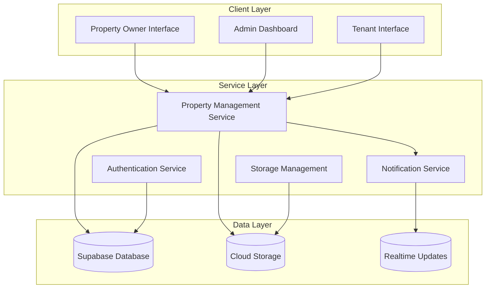

**Diagram sources**
- [supabaseService.ts](file://src/services/supabaseService.ts#L153-L800)
- [storage.ts](file://src/lib/storage.ts#L1-L633)
- [supabase.ts](file://src/lib/supabase.ts#L1-L68)

## Core Components

### Database Schema Foundation

The system's foundation rests on a robust PostgreSQL schema with comprehensive table relationships and security policies. The schema defines three primary verification-related tables:

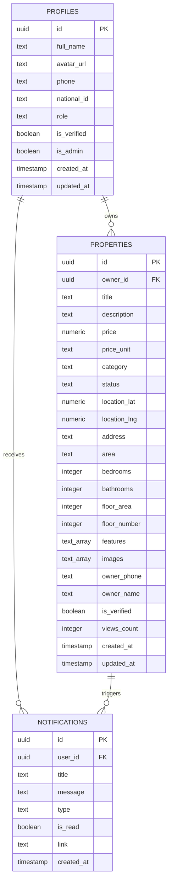

**Diagram sources**
- [schema.sql](file://supabase/schema.sql#L8-L180)
- [database.types.ts](file://src/types/database.types.ts#L14-L310)

**Section sources**
- [schema.sql](file://supabase/schema.sql#L1-L416)
- [database.types.ts](file://src/types/database.types.ts#L1-L310)

### Service Layer Architecture

The service layer provides abstraction between the presentation layer and database operations, implementing comprehensive validation and business logic.

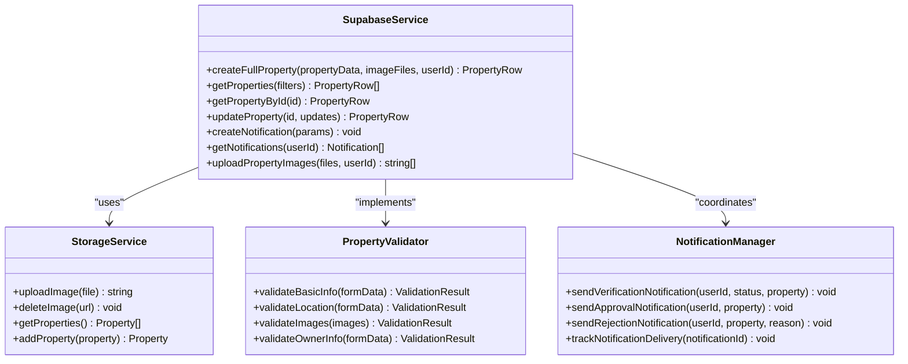

**Diagram sources**
- [supabaseService.ts](file://src/services/supabaseService.ts#L153-L800)
- [storage.ts](file://src/lib/storage.ts#L44-L633)

**Section sources**
- [supabaseService.ts](file://src/services/supabaseService.ts#L1-L1384)
- [storage.ts](file://src/lib/storage.ts#L1-L633)

## Verification Workflow

The verification workflow consists of multiple stages designed to ensure comprehensive property evaluation before publication.

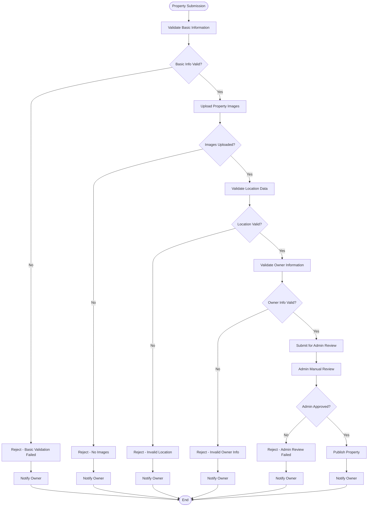

**Diagram sources**
- [add-property-page.tsx](file://src/app/add-property/page.tsx#L86-L156)
- [admin-properties-page.tsx](file://src/app/admin/properties/page.tsx#L31-L56)

**Section sources**
- [add-property-page.tsx](file://src/app/add-property/page.tsx#L1-L538)
- [admin-properties-page.tsx](file://src/app/admin/properties/page.tsx#L1-L177)

## Approval Process

The approval process involves systematic evaluation by administrative staff with comprehensive feedback mechanisms.

### Admin Approval Interface

The admin interface provides intuitive controls for property approval decisions with immediate notification capabilities.

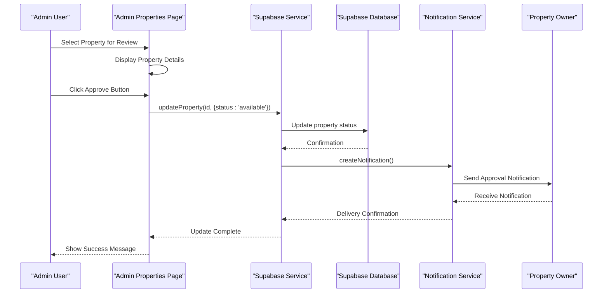

**Diagram sources**
- [admin-properties-page.tsx](file://src/app/admin/properties/page.tsx#L31-L56)
- [supabaseService.ts](file://src/services/supabaseService.ts#L393-L415)

### Approval Criteria Matrix

| Criteria Category | Requirements | Validation Method | Pass/Fail |
|-------------------|--------------|-------------------|-----------|
| **Basic Information** | Title, price, category | Form validation | ✅ Automated |
| **Location Data** | Area selection, address | Geolocation validation | ✅ Automated |
| **Image Quality** | Minimum 1 image, quality standards | AI image analysis | ⚠️ Hybrid |
| **Owner Information** | Phone, name verification | Manual review | ✅ Manual |
| **Property Features** | Amenities consistency | Content validation | ✅ Automated |
| **Pricing Logic** | Reasonable pricing range | Market comparison | ⚠️ AI-Assisted |

**Section sources**
- [admin-properties-page.tsx](file://src/app/admin/properties/page.tsx#L1-L177)
- [supabaseService.ts](file://src/services/supabaseService.ts#L393-L415)

## Quality Assurance Mechanisms

The system implements comprehensive quality assurance measures across multiple validation layers.

### Automated Quality Checks

```mermaid
flowchart LR
subgraph "Automated Validation"
A1[Image Validation] --> A2[Content Analysis]
A2 --> A3[Pricing Validation]
A3 --> A4[Location Accuracy]
A4 --> A5[Feature Consistency]
end
subgraph "Manual Review"
M1[Admin Inspection] --> M2[Owner Verification]
M2 --> M3[Reference Checking]
M3 --> M4[Final Approval]
end
subgraph "Quality Metrics"
Q1[First-Time Pass Rate] --> Q2[Resolution Time]
Q2 --> Q3[Owner Satisfaction]
Q3 --> Q4[Platform Trust Score]
end
A5 --> M1
M4 --> Q1
```

**Diagram sources**
- [add-property-page.tsx](file://src/app/add-property/page.tsx#L98-L132)
- [storage.ts](file://src/lib/storage.ts#L190-L230)

### Validation Rules Engine

The validation system employs a rule-based engine that evaluates properties against predefined criteria:

**Technical Validation Rules:**
- Image count minimum: 1 image per listing
- Image size limits: 5MB maximum per image
- File format restrictions: JPG, PNG, WebP only
- Aspect ratio validation: 1:1 to 4:3 preferred
- Text length validation: 10-500 characters for descriptions

**Content Validation Rules:**
- Price validation: Minimum 100 EGP, maximum 100,000 EGP
- Location validation: Must match predefined area list
- Feature validation: Must match available feature options
- Owner verification: Phone number format validation

**Section sources**
- [add-property-page.tsx](file://src/app/add-property/page.tsx#L98-L132)
- [storage.ts](file://src/lib/storage.ts#L190-L230)

## Admin Review Workflow

Administrative review involves comprehensive evaluation of property listings with detailed feedback mechanisms.

### Review Dashboard Features

The admin dashboard provides centralized management of all verification activities:

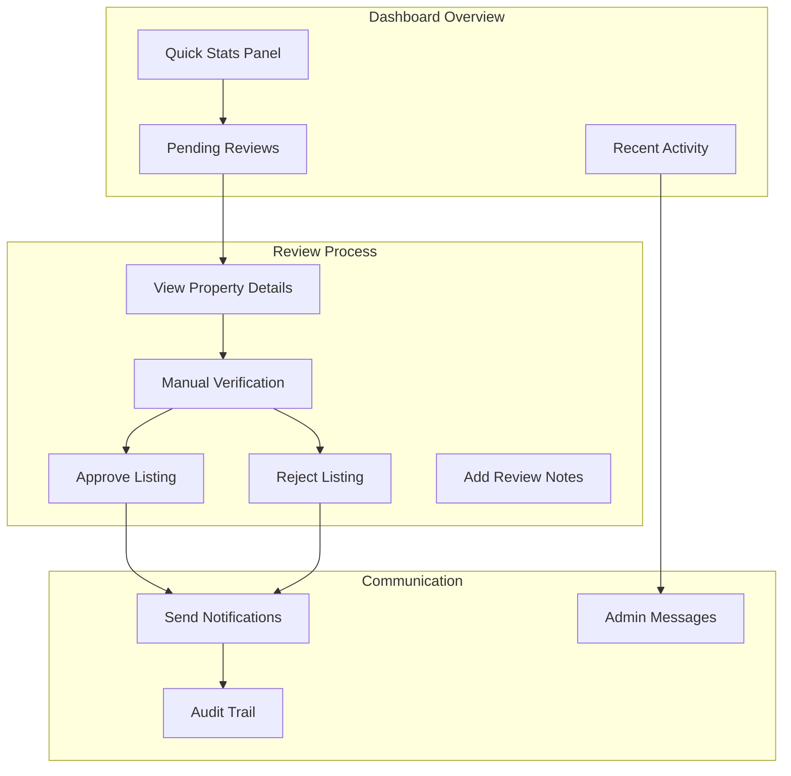

**Diagram sources**
- [admin-dashboard.tsx](file://src/app/admin/page.tsx#L14-L145)
- [admin-properties-page.tsx](file://src/app/admin/properties/page.tsx#L1-L177)

### Review Decision Logic

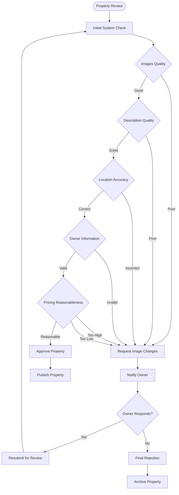

**Diagram sources**
- [admin-properties-page.tsx](file://src/app/admin/properties/page.tsx#L31-L56)
- [supabaseService.ts](file://src/services/supabaseService.ts#L393-L415)

**Section sources**
- [admin-dashboard.tsx](file://src/app/admin/page.tsx#L1-L145)
- [admin-properties-page.tsx](file://src/app/admin/properties/page.tsx#L1-L177)

## Property Validation Checks

The validation system implements multi-tier validation to ensure property listings meet quality standards.

### Pre-Submission Validation

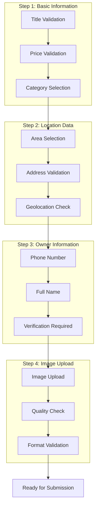

**Diagram sources**
- [add-property-page.tsx](file://src/app/add-property/page.tsx#L158-L188)
- [storage.ts](file://src/lib/storage.ts#L44-L67)

### Post-Submission Validation

Post-submission validation includes automated system checks and manual administrative review:

**Automated System Checks:**
- Duplicate property detection
- Pricing anomaly detection
- Location coordinate validation
- Image accessibility verification

**Manual Administrative Review:**
- Property authenticity verification
- Owner identity confirmation
- Description accuracy assessment
- Feature completeness check

**Section sources**
- [add-property-page.tsx](file://src/app/add-property/page.tsx#L158-L188)
- [storage.ts](file://src/lib/storage.ts#L44-L67)

## Automated Verification Systems

The system leverages advanced automation technologies to streamline the verification process while maintaining quality standards.

### AI-Powered Image Analysis

The image validation system uses machine learning algorithms to assess property image quality and relevance:

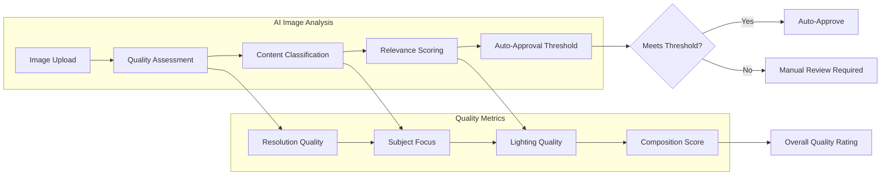

**Diagram sources**
- [storage.ts](file://src/lib/storage.ts#L44-L67)
- [add-property-page.tsx](file://src/app/add-property/page.tsx#L51-L66)

### Intelligent Content Validation

The content validation system analyzes property descriptions and features to ensure completeness and accuracy:

**Content Analysis Features:**
- Keyword extraction and validation
- Redundancy detection
- Completeness scoring
- Plagiarism checking

**Feature Matching System:**
- Automatic feature extraction from descriptions
- Consistency validation with property type
- Amenities completeness assessment

**Section sources**
- [storage.ts](file://src/lib/storage.ts#L44-L67)
- [add-property-page.tsx](file://src/app/add-property/page.tsx#L51-L66)

## Notification System

The notification system provides comprehensive communication channels for verification status changes and owner interactions.

### Notification Types and Templates

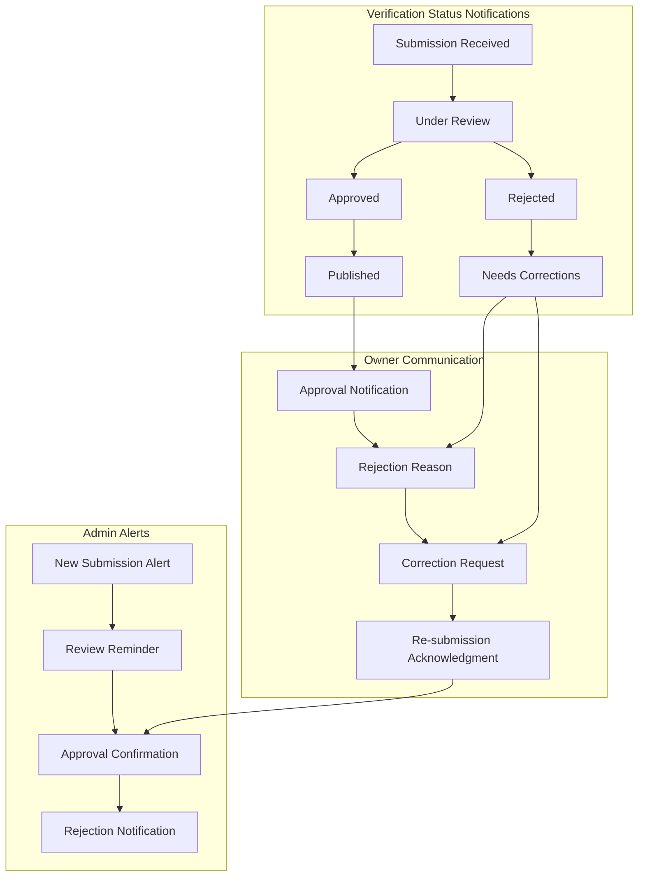

**Diagram sources**
- [admin-properties-page.tsx](file://src/app/admin/properties/page.tsx#L36-L48)
- [storage.ts](file://src/lib/storage.ts#L442-L472)

### Notification Delivery Mechanisms

The notification system supports multiple delivery channels:

**Real-time Notifications:**
- Instant alerts via WebSocket connections
- Push notifications for mobile devices
- In-app notification badges
- Email notifications for critical updates

**Notification Content Structure:**

| Field | Purpose | Example |
|-------|---------|---------|
| **Title** | Brief summary of event | "Property Approved" |
| **Message** | Detailed information | "Your property listing has been approved and published" |
| **Type** | Notification category | success/error/warning/info |
| **Link** | Direct navigation | "/property/{id}" |
| **Timestamp** | Creation date/time | ISO 8601 format |

**Section sources**
- [admin-properties-page.tsx](file://src/app/admin/properties/page.tsx#L36-L48)
- [storage.ts](file://src/lib/storage.ts#L442-L472)

## Owner Communication Channels

The system provides multiple communication channels to facilitate effective owner-admin interactions during the verification process.

### Communication Interface Components

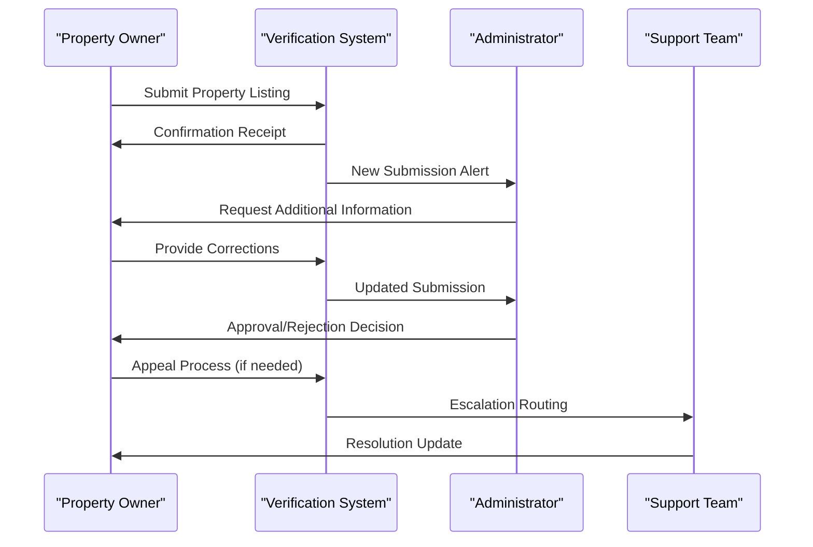

**Diagram sources**
- [admin-properties-page.tsx](file://src/app/admin/properties/page.tsx#L31-L56)
- [UnlockModal.tsx](file://src/components/UnlockModal.tsx#L19-L77)

### Communication Features

**Real-time Messaging:**
- Direct messaging between owners and admins
- File sharing for supporting documents
- Timestamped conversation history
- Read receipts and delivery confirmations

**Escalation Management:**
- Appeal submission process
- Priority handling for disputed cases
- Timeline tracking for resolution
- Automated escalation triggers

**Section sources**
- [admin-properties-page.tsx](file://src/app/admin/properties/page.tsx#L31-L56)
- [UnlockModal.tsx](file://src/components/UnlockModal.tsx#L19-L77)

## Appeal Processes

The appeal system provides structured mechanisms for property owners to challenge verification decisions.

### Appeal Workflow

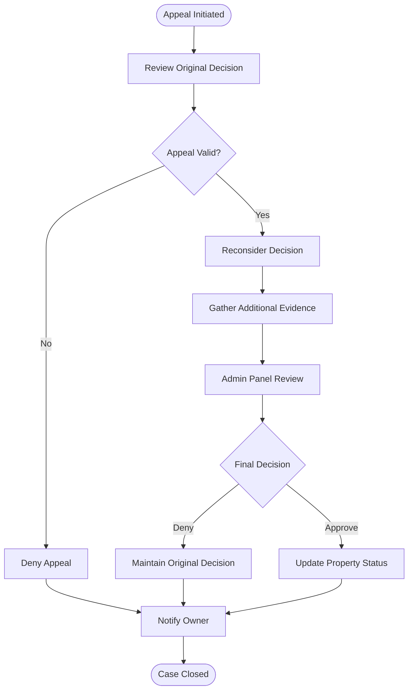

**Diagram sources**
- [admin-properties-page.tsx](file://src/app/admin/properties/page.tsx#L31-L56)
- [storage.ts](file://src/lib/storage.ts#L442-L472)

### Appeal Requirements

**Documentation Needed:**
- Property ownership verification
- Legal documentation
- Supporting evidence
- Corrective actions taken

**Processing Timeline:**
- Standard review: 3-5 business days
- Complex cases: Up to 10 business days
- Urgent cases: 24-48 hours
- Appeals: Additional 5 business days

**Section sources**
- [admin-properties-page.tsx](file://src/app/admin/properties/page.tsx#L31-L56)
- [storage.ts](file://src/lib/storage.ts#L442-L472)

## Verification APIs

The system exposes comprehensive APIs for property verification and approval operations.

### Property Management APIs

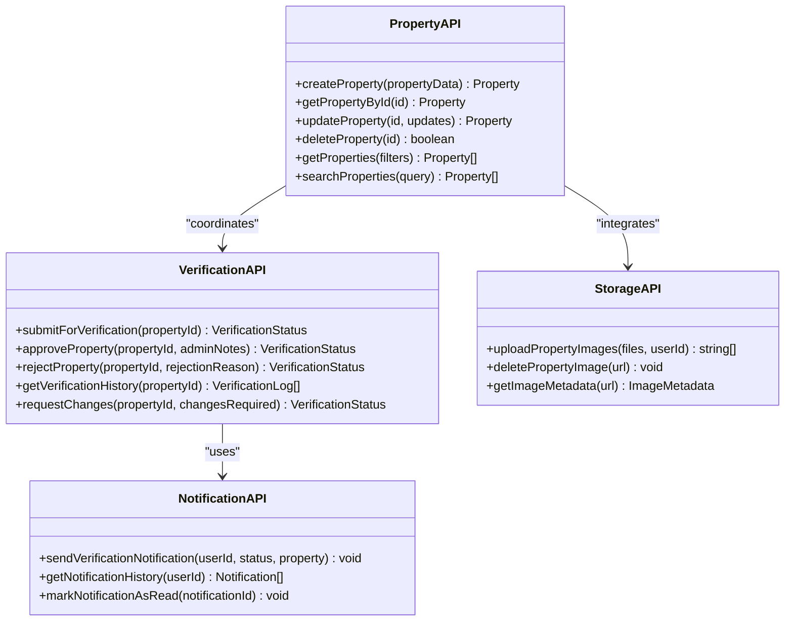

**Diagram sources**
- [supabaseService.ts](file://src/services/supabaseService.ts#L259-L440)
- [storage.ts](file://src/lib/storage.ts#L190-L230)

### API Endpoints Structure

**Property Endpoints:**
- `POST /api/properties` - Create new property listing
- `GET /api/properties/:id` - Get property details
- `PUT /api/properties/:id` - Update property information
- `DELETE /api/properties/:id` - Delete property listing

**Verification Endpoints:**
- `POST /api/properties/:id/verify` - Submit for verification
- `POST /api/properties/:id/approve` - Approve property
- `POST /api/properties/:id/reject` - Reject property
- `GET /api/properties/:id/verification-history` - Get verification logs

**Notification Endpoints:**
- `POST /api/notifications` - Send notification
- `GET /api/notifications` - Get user notifications
- `PUT /api/notifications/:id/read` - Mark as read

**Section sources**
- [supabaseService.ts](file://src/services/supabaseService.ts#L259-L440)
- [storage.ts](file://src/lib/storage.ts#L190-L230)

## Status Tracking

The system maintains comprehensive status tracking for all property verification activities.

### Status Lifecycle Management

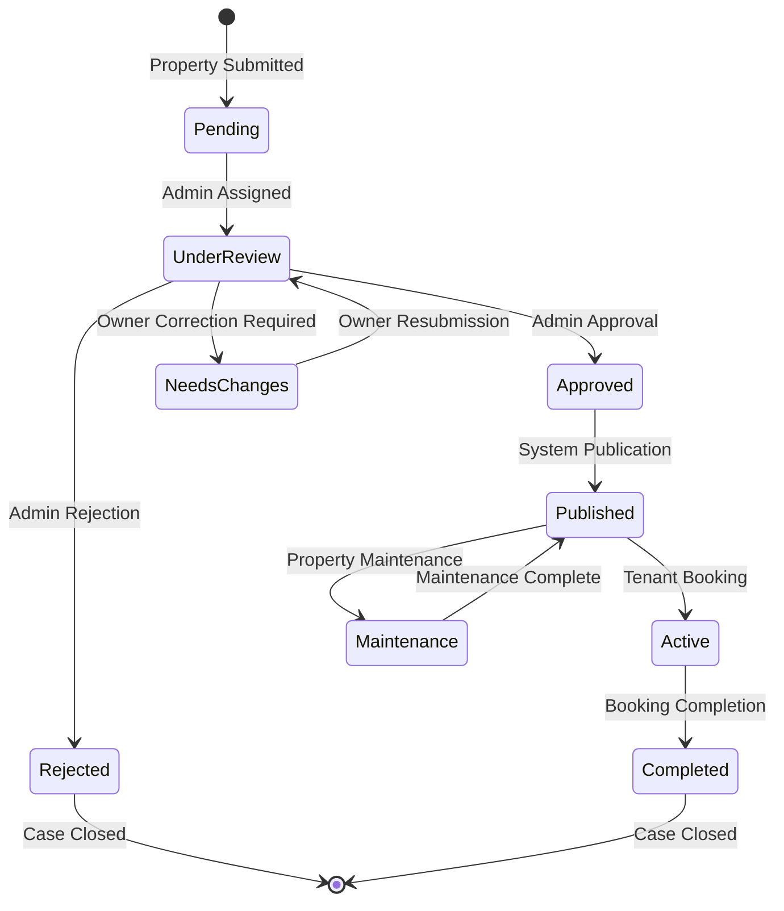

**Diagram sources**
- [schema.sql](file://supabase/schema.sql#L42-L67)
- [types-index.ts](file://src/types/index.ts#L25-L54)

### Status Monitoring Features

**Real-time Status Updates:**
- Live status indicators
- Progress bars for multi-stage processes
- Automated status change notifications
- Status history tracking

**Analytics and Reporting:**
- Average processing times
- Approval rates by category
- Owner satisfaction metrics
- Admin performance analytics

**Section sources**
- [schema.sql](file://supabase/schema.sql#L42-L67)
- [types-index.ts](file://src/types/index.ts#L25-L54)

## Audit Trail Implementation

The system maintains comprehensive audit trails for all verification activities to ensure transparency and accountability.

### Audit Log Structure

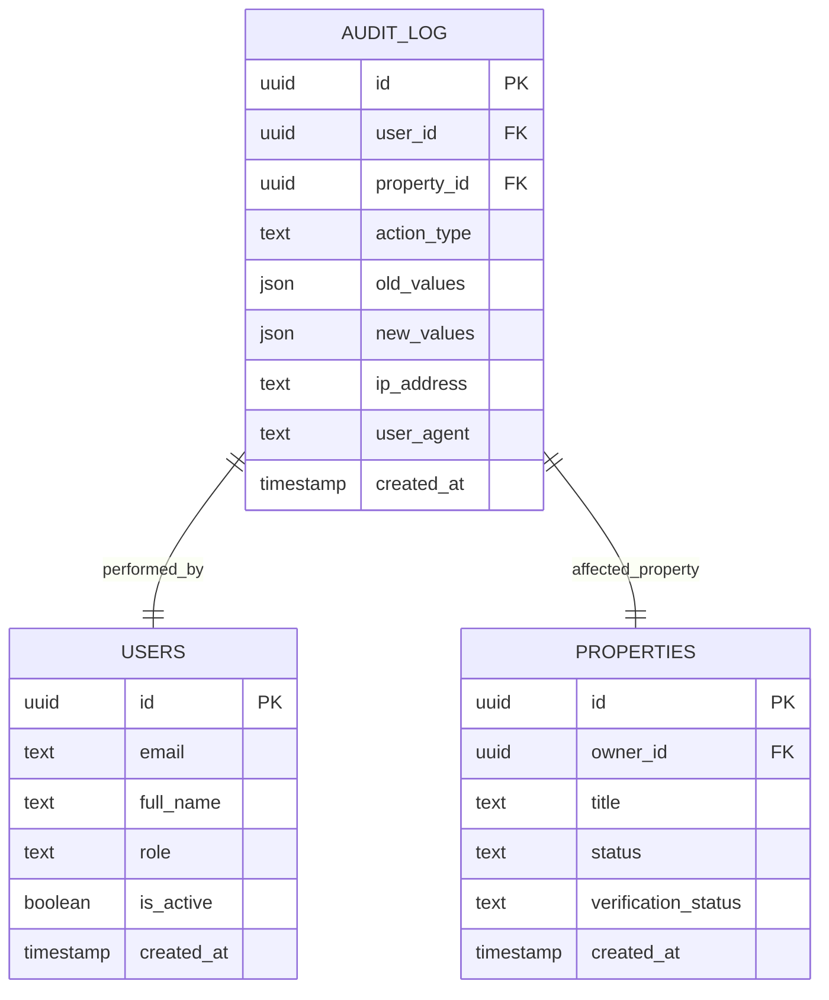

**Diagram sources**
- [schema.sql](file://supabase/schema.sql#L1-L416)
- [supabaseService.ts](file://src/services/supabaseService.ts#L153-L800)

### Audit Trail Features

**Comprehensive Logging:**
- All property modifications
- Admin decision records
- Owner action tracking
- System event logging
- User session monitoring

**Security and Compliance:**
- Immutable audit records
- Access control logging
- Data breach monitoring
- GDPR compliance features
- Regulatory reporting support

**Section sources**
- [schema.sql](file://supabase/schema.sql#L1-L416)
- [supabaseService.ts](file://src/services/supabaseService.ts#L153-L800)

## Admin Dashboard Integration

The admin dashboard provides comprehensive tools for managing the entire verification workflow.

### Dashboard Components

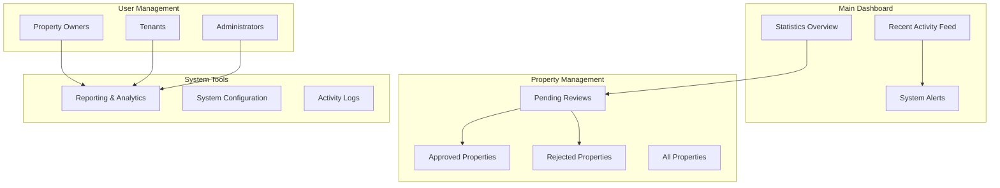

**Diagram sources**
- [admin-dashboard.tsx](file://src/app/admin/page.tsx#L14-L145)
- [admin-properties-page.tsx](file://src/app/admin/properties/page.tsx#L1-L177)

### Dashboard Functionality

**Real-time Monitoring:**
- Live property submission feed
- Verification queue management
- Admin workload balancing
- Performance metrics dashboard

**Advanced Filtering:**
- Multi-criteria property filtering
- Owner reputation tracking
- Property category analysis
- Geographic distribution mapping

**Section sources**
- [admin-dashboard.tsx](file://src/app/admin/page.tsx#L14-L145)
- [admin-properties-page.tsx](file://src/app/admin/properties/page.tsx#L1-L177)

## Moderation Tools

The system provides comprehensive moderation tools to maintain platform quality and safety.

### Content Moderation Features

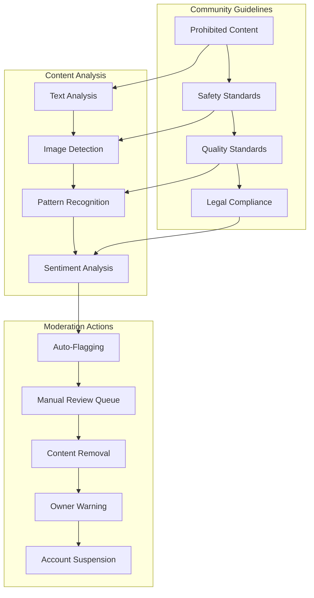

**Diagram sources**
- [storage.ts](file://src/lib/storage.ts#L44-L67)
- [supabaseService.ts](file://src/services/supabaseService.ts#L259-L440)

### Moderation Workflow

**Automated Detection:**
- Suspicious content identification
- Pattern matching algorithms
- Risk scoring mechanisms
- Threshold-based flagging

**Manual Review Process:**
- Flagged content review
- Evidence gathering
- Decision documentation
- Appeal handling

**Enforcement Actions:**
- Content removal
- Owner warnings
- Account restrictions
- Legal reporting

**Section sources**
- [storage.ts](file://src/lib/storage.ts#L44-L67)
- [supabaseService.ts](file://src/services/supabaseService.ts#L259-L440)

## Conclusion

The Property Verification and Approval System represents a comprehensive solution for managing property listings with robust validation, automated processing, and manual oversight. The system's multi-layered approach ensures both efficiency and quality in property verification processes.

Key strengths of the system include:

**Technical Excellence:**
- Comprehensive database schema with security policies
- Real-time notification system
- Automated validation with AI-powered analysis
- Audit trail for compliance and transparency

**Operational Efficiency:**
- Streamlined approval workflows
- Intuitive admin dashboard
- Multi-channel communication system
- Comprehensive reporting and analytics

**Quality Assurance:**
- Multi-tier validation system
- Automated content analysis
- Manual review processes
- Continuous improvement mechanisms

The system successfully balances automation with human oversight, ensuring that property listings meet both technical requirements and quality standards while maintaining efficient processing times and excellent user experiences for all stakeholders involved in the property verification ecosystem.