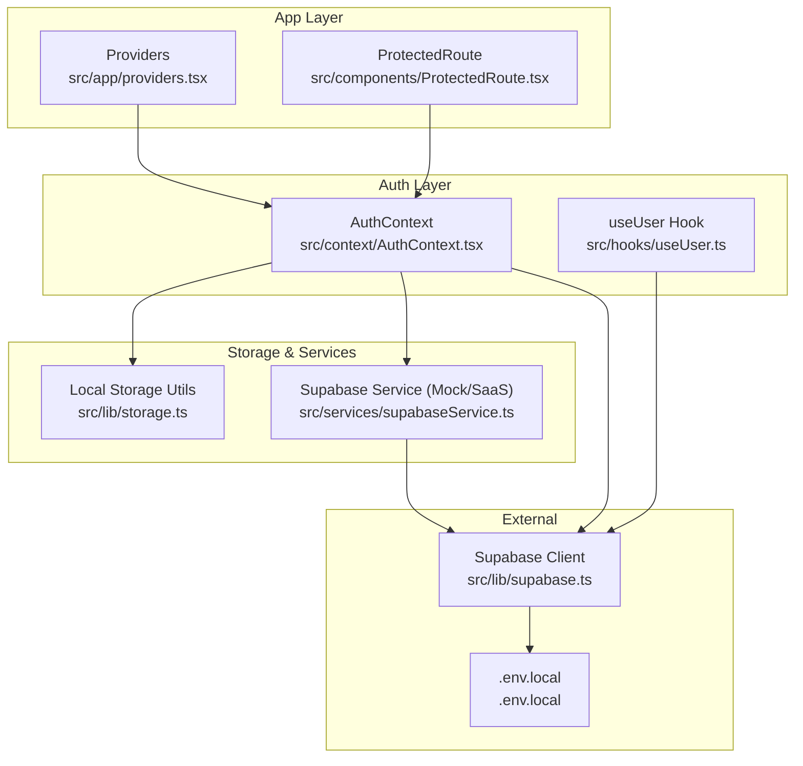
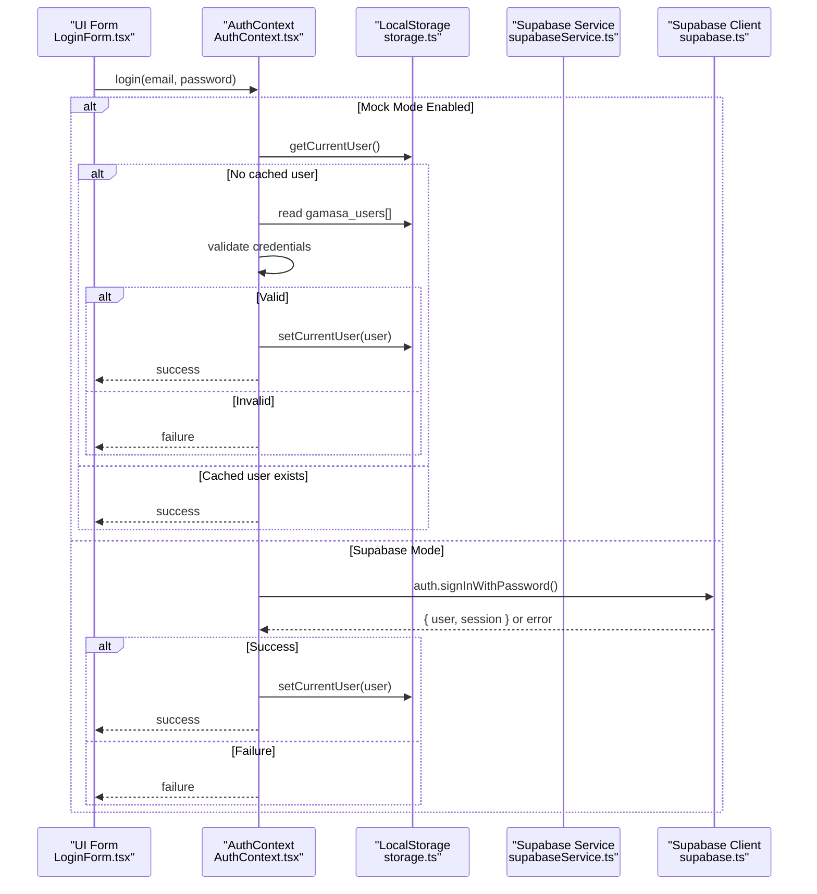
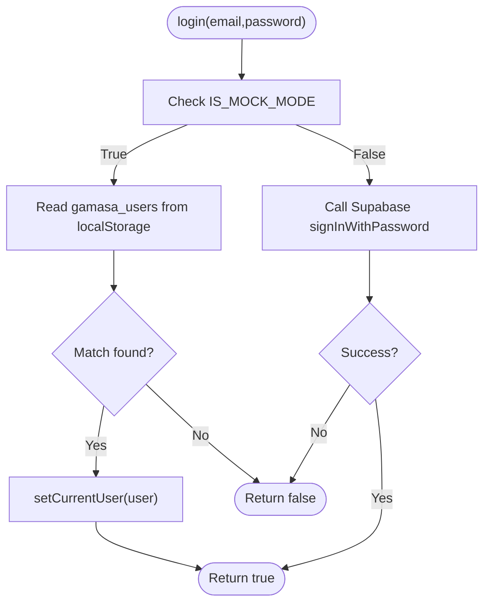
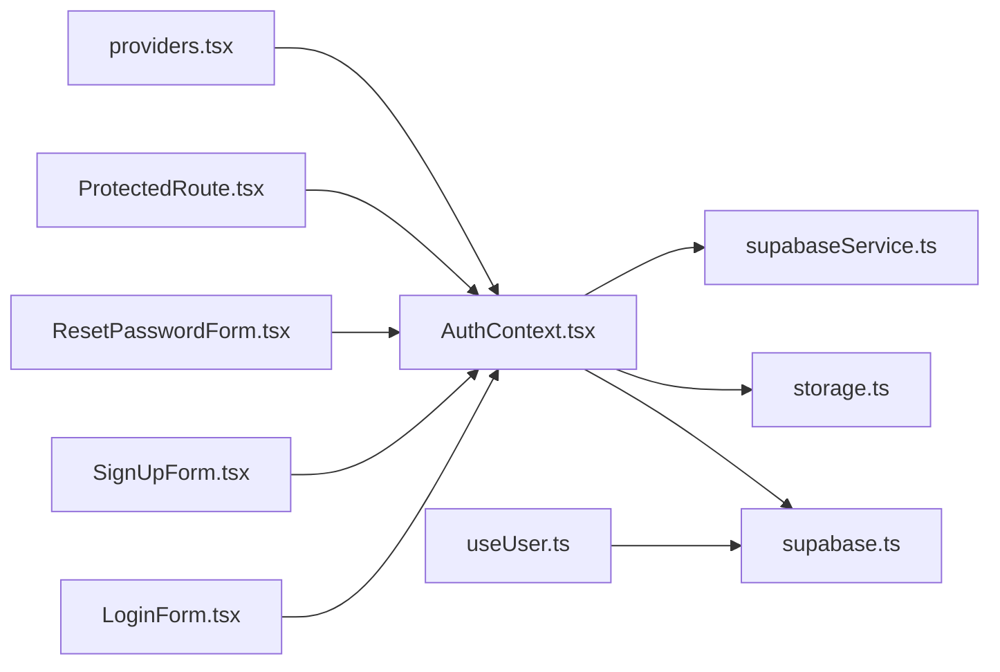

# Authentication Security

<cite>
**Referenced Files in This Document**
- [AuthContext.tsx](file://src/context/AuthContext.tsx)
- [supabase.ts](file://src/lib/supabase.ts)
- [storage.ts](file://src/lib/storage.ts)
- [supabaseService.ts](file://src/services/supabaseService.ts)
- [useUser.ts](file://src/hooks/useUser.ts)
- [LoginForm.tsx](file://src/components/auth/LoginForm.tsx)
- [SignUpForm.tsx](file://src/components/auth/SignUpForm.tsx)
- [ResetPasswordForm.tsx](file://src/components/auth/ResetPasswordForm.tsx)
- [ProtectedRoute.tsx](file://src/components/ProtectedRoute.tsx)
- [providers.tsx](file://src/app/providers.tsx)
- [.env.local](file://.env.local)
- [validation.ts](file://src/utils/validation.ts)
- [index.ts](file://src/types/index.ts)
</cite>

## Table of Contents
1. [Introduction](#introduction)
2. [Project Structure](#project-structure)
3. [Core Components](#core-components)
4. [Architecture Overview](#architecture-overview)
5. [Detailed Component Analysis](#detailed-component-analysis)
6. [Dependency Analysis](#dependency-analysis)
7. [Performance Considerations](#performance-considerations)
8. [Troubleshooting Guide](#troubleshooting-guide)
9. [Conclusion](#conclusion)

## Introduction
This document provides comprehensive authentication security documentation for Gamasa Properties. It explains the dual authentication system that supports Supabase authentication and a local mock mode fallback. It covers credential protection, session management, token handling, authentication flows, password validation, secure storage mechanisms, mock mode security considerations, local storage encryption, and cross-tab synchronization security. It also includes secure authentication patterns, error handling for authentication failures, and best practices for user session management.

## Project Structure
The authentication system spans several layers:
- Provider setup wraps the app with authentication and theme providers.
- A central AuthContext manages authentication state and exposes login/register/logout.
- Supabase client configuration enables secure session persistence and token refresh.
- Local storage utilities provide mock-mode fallback and cross-tab synchronization.
- UI components implement login, registration, and password reset flows.
- Hooks integrate Supabase’s auth state change events for real-time updates.
- Validation utilities enforce input constraints.

**Diagram sources**
- [providers.tsx](file://src/app/providers.tsx#L7-L16)
- [ProtectedRoute.tsx](file://src/components/ProtectedRoute.tsx#L8-L29)
- [AuthContext.tsx](file://src/context/AuthContext.tsx#L22-L186)
- [useUser.ts](file://src/hooks/useUser.ts#L37-L176)
- [storage.ts](file://src/lib/storage.ts#L1-L633)
- [supabaseService.ts](file://src/services/supabaseService.ts#L1-L1384)
- [supabase.ts](file://src/lib/supabase.ts#L1-L68)
- [.env.local](file://.env.local#L1-L4)

**Section sources**
- [providers.tsx](file://src/app/providers.tsx#L7-L16)
- [ProtectedRoute.tsx](file://src/components/ProtectedRoute.tsx#L8-L29)
- [AuthContext.tsx](file://src/context/AuthContext.tsx#L22-L186)
- [useUser.ts](file://src/hooks/useUser.ts#L37-L176)
- [storage.ts](file://src/lib/storage.ts#L1-L633)
- [supabaseService.ts](file://src/services/supabaseService.ts#L1-L1384)
- [supabase.ts](file://src/lib/supabase.ts#L1-L68)
- [.env.local](file://.env.local#L1-L4)

## Core Components
- AuthContext: Centralizes authentication state, login/register/logout, and cross-tab synchronization. Supports mock mode via environment flag and local storage fallback.
- Supabase Client: Configured with automatic token refresh, persistent sessions, and URL session detection.
- Local Storage Utilities: Provide secure keys, serialization, and cross-tab event propagation for user state.
- Supabase Service: Offers a unified facade for Supabase operations, with a mock mode toggle and consistent return shapes.
- useUser Hook: Integrates Supabase auth state changes and loads profile data.
- UI Forms: Implement login, registration, and password reset with validation and error handling.
- ProtectedRoute: Guards protected pages and redirects unauthenticated users to login with a return URL.

Security highlights:
- Environment-controlled mock mode flag ensures deterministic behavior during development and testing.
- Cross-tab synchronization uses storage events and a dedicated userUpdated event to keep tabs in sync.
- Supabase session persistence and auto-refresh reduce manual token management overhead.
- UI forms validate inputs and display localized error messages without exposing sensitive details.

**Section sources**
- [AuthContext.tsx](file://src/context/AuthContext.tsx#L8-L186)
- [supabase.ts](file://src/lib/supabase.ts#L18-L28)
- [storage.ts](file://src/lib/storage.ts#L4-L40)
- [supabaseService.ts](file://src/services/supabaseService.ts#L5-L202)
- [useUser.ts](file://src/hooks/useUser.ts#L37-L176)
- [LoginForm.tsx](file://src/components/auth/LoginForm.tsx#L20-L46)
- [SignUpForm.tsx](file://src/components/auth/SignUpForm.tsx#L16-L49)
- [ProtectedRoute.tsx](file://src/components/ProtectedRoute.tsx#L8-L29)

## Architecture Overview
The authentication architecture combines Supabase SaaS with a local mock mode. AuthContext orchestrates the dual-mode behavior, while Supabase client manages sessions and tokens. Local storage utilities provide fallback and synchronization. The UI components delegate authentication actions to AuthContext, which coordinates with either Supabase or mock storage.

**Diagram sources**
- [LoginForm.tsx](file://src/components/auth/LoginForm.tsx#L20-L46)
- [AuthContext.tsx](file://src/context/AuthContext.tsx#L80-L115)
- [storage.ts](file://src/lib/storage.ts#L294-L300)
- [supabaseService.ts](file://src/services/supabaseService.ts#L155-L172)
- [supabase.ts](file://src/lib/supabase.ts#L98-L107)

**Section sources**
- [AuthContext.tsx](file://src/context/AuthContext.tsx#L80-L115)
- [storage.ts](file://src/lib/storage.ts#L294-L300)
- [supabaseService.ts](file://src/services/supabaseService.ts#L155-L172)
- [supabase.ts](file://src/lib/supabase.ts#L98-L107)

## Detailed Component Analysis

### AuthContext: Dual Authentication Orchestrator
AuthContext manages:
- Authentication state and loading flags
- Login flow with mock mode fallback
- Registration flow with mock mode fallback
- Logout with Supabase sign out when applicable
- Cross-tab synchronization via storage events and a userUpdated event
- Error handling and cleanup of corrupted data

Security considerations:
- Uses environment flag to switch between mock and Supabase modes.
- Clears corrupted local user data by removing the current user key on errors.
- Emits userUpdated and storage events to synchronize state across tabs.

**Diagram sources**
- [AuthContext.tsx](file://src/context/AuthContext.tsx#L80-L115)
- [storage.ts](file://src/lib/storage.ts#L294-L300)

**Section sources**
- [AuthContext.tsx](file://src/context/AuthContext.tsx#L80-L115)
- [storage.ts](file://src/lib/storage.ts#L294-L300)

### Supabase Client: Session Management and Token Handling
The Supabase client is configured with:
- Auto-refresh of tokens
- Persistent sessions
- Detection of sessions in URL fragments

Security implications:
- Reduces risk of expired tokens causing silent failures.
- Persists sessions across browser restarts, improving UX while maintaining security boundaries.
- Detecting sessions in URL prevents accidental token leakage via referrers.

**Section sources**
- [supabase.ts](file://src/lib/supabase.ts#L18-L28)

### Local Storage Utilities: Secure Keys and Cross-Tab Sync
Key responsibilities:
- Centralized storage keys for properties, users, current user, payments, reviews, and notifications
- Serialization/deserialization with error handling
- Cross-tab synchronization via storage events and a dedicated userUpdated event
- Mock data initialization for properties

Security considerations:
- Uses a single source of truth for user state via gamasa_current_user.
- Dispatches userUpdated to notify the same tab and storage events for other tabs.
- Initializes mock properties on first load to avoid empty datasets in mock mode.

**Section sources**
- [storage.ts](file://src/lib/storage.ts#L4-L40)
- [storage.ts](file://src/lib/storage.ts#L294-L300)
- [storage.ts](file://src/lib/storage.ts#L629-L633)

### Supabase Service: Unified Facade with Mock Mode
The service provides:
- Consistent signatures for sign-in/sign-up/sign-out regardless of mode
- Mock mode that returns deterministic tokens and user objects
- Supabase mode that delegates to Supabase client
- Image upload/delete helpers
- Property CRUD operations
- Favorites and unlocked properties management
- Notifications and reviews APIs

Security considerations:
- Mock mode returns mock tokens; production mode uses real Supabase tokens.
- Mock mode does not persist across page reloads; in-memory sets reset on refresh.
- Image operations are handled securely via Supabase storage when enabled.

**Section sources**
- [supabaseService.ts](file://src/services/supabaseService.ts#L5-L202)
- [supabaseService.ts](file://src/services/supabaseService.ts#L231-L254)

### useUser Hook: Real-Time Auth State Integration
The hook:
- Loads the current user session from Supabase
- Subscribes to auth state changes (SIGNED_IN, SIGNED_OUT)
- Fetches profile data and maps it to the app’s user model
- Handles errors gracefully and sets loading states

Security considerations:
- Reactivity to auth state changes keeps UI synchronized with backend state.
- Graceful fallback when profile retrieval fails.

**Section sources**
- [useUser.ts](file://src/hooks/useUser.ts#L37-L176)

### UI Forms: Validation and Error Handling
- LoginForm: Validates form inputs, displays localized error messages, and triggers login.
- SignUpForm: Enforces terms agreement, collects user data, and triggers sign-up.
- ResetPasswordForm: Requests password reset with feedback.

Validation utilities:
- validateMessage: Enforces length limits and emptiness checks.
- validateFile: Enforces supported media types and size limits.
- sanitizeText: Basic HTML escaping to mitigate XSS risks.

Security considerations:
- Prevents oversized uploads and unsupported formats.
- Sanitizes text inputs to reduce XSS exposure.

**Section sources**
- [LoginForm.tsx](file://src/components/auth/LoginForm.tsx#L20-L46)
- [SignUpForm.tsx](file://src/components/auth/SignUpForm.tsx#L16-L49)
- [ResetPasswordForm.tsx](file://src/components/auth/ResetPasswordForm.tsx#L14-L38)
- [validation.ts](file://src/utils/validation.ts#L1-L33)

### ProtectedRoute: Access Control
ProtectedRoute:
- Redirects unauthenticated users to login with a return URL
- Renders a loading state while checking authentication status

Security considerations:
- Ensures users cannot access protected pages without authentication.
- Preserves intended destination after login.

**Section sources**
- [ProtectedRoute.tsx](file://src/components/ProtectedRoute.tsx#L8-L29)

### Environment Configuration
Environment variables:
- NEXT_PUBLIC_SUPABASE_URL and NEXT_PUBLIC_SUPABASE_ANON_KEY configure the Supabase client.
- NEXT_PUBLIC_IS_MOCK_MODE toggles mock mode behavior.

Security considerations:
- Environment variables are client-side; do not expose secrets.
- Ensure proper CSP and secure cookie policies in production.

**Section sources**
- [.env.local](file://.env.local#L1-L4)

## Dependency Analysis
The authentication stack exhibits low coupling and clear separation of concerns:
- AuthContext depends on Supabase client and local storage utilities.
- UI components depend on AuthContext for authentication actions.
- useUser integrates with Supabase auth state changes.
- Supabase Service abstracts Supabase client usage and mock mode.

**Diagram sources**
- [LoginForm.tsx](file://src/components/auth/LoginForm.tsx#L17-L30)
- [SignUpForm.tsx](file://src/components/auth/SignUpForm.tsx#L13-L34)
- [ResetPasswordForm.tsx](file://src/components/auth/ResetPasswordForm.tsx#L12-L24)
- [ProtectedRoute.tsx](file://src/components/ProtectedRoute.tsx#L9-L19)
- [AuthContext.tsx](file://src/context/AuthContext.tsx#L22-L186)
- [supabase.ts](file://src/lib/supabase.ts#L1-L68)
- [storage.ts](file://src/lib/storage.ts#L1-L633)
- [supabaseService.ts](file://src/services/supabaseService.ts#L1-L1384)
- [useUser.ts](file://src/hooks/useUser.ts#L37-L176)
- [providers.tsx](file://src/app/providers.tsx#L7-L16)

**Section sources**
- [AuthContext.tsx](file://src/context/AuthContext.tsx#L22-L186)
- [supabase.ts](file://src/lib/supabase.ts#L1-L68)
- [storage.ts](file://src/lib/storage.ts#L1-L633)
- [supabaseService.ts](file://src/services/supabaseService.ts#L1-L1384)
- [useUser.ts](file://src/hooks/useUser.ts#L37-L176)
- [providers.tsx](file://src/app/providers.tsx#L7-L16)

## Performance Considerations
- Supabase auto-refresh reduces token refresh overhead and minimizes re-authentication churn.
- Local storage operations are synchronous; batch updates and minimize frequent writes.
- Cross-tab synchronization uses lightweight events; avoid excessive dispatches.
- UI forms disable submit buttons during async operations to prevent duplicate submissions.

## Troubleshooting Guide
Common issues and resolutions:
- Missing Supabase environment variables: The client logs warnings and falls back to placeholder values. Ensure NEXT_PUBLIC_SUPABASE_URL and NEXT_PUBLIC_SUPABASE_ANON_KEY are set in .env.local.
- Authentication failures: UI components display localized error messages. Inspect console logs for underlying errors.
- Corrupted local user data: AuthContext clears gamasa_current_user on load errors to prevent stale state.
- Cross-tab desynchronization: Ensure storage and userUpdated events are dispatched and listeners are attached.
- Mock mode behavior: Verify NEXT_PUBLIC_IS_MOCK_MODE is set appropriately. In mock mode, tokens are mock and data is in-memory/localStorage.

**Section sources**
- [supabase.ts](file://src/lib/supabase.ts#L7-L15)
- [AuthContext.tsx](file://src/context/AuthContext.tsx#L44-L51)
- [storage.ts](file://src/lib/storage.ts#L32-L36)
- [.env.local](file://.env.local#L3-L4)

## Conclusion
Gamasa Properties implements a robust dual authentication system that seamlessly switches between Supabase and a local mock mode. Security is addressed through environment-controlled mode selection, Supabase session persistence and auto-refresh, cross-tab synchronization, and careful input validation. The architecture balances developer productivity with strong security foundations, enabling secure user session management and reliable authentication flows across environments.