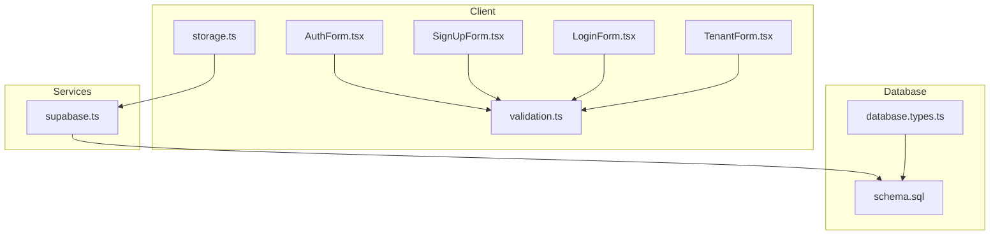
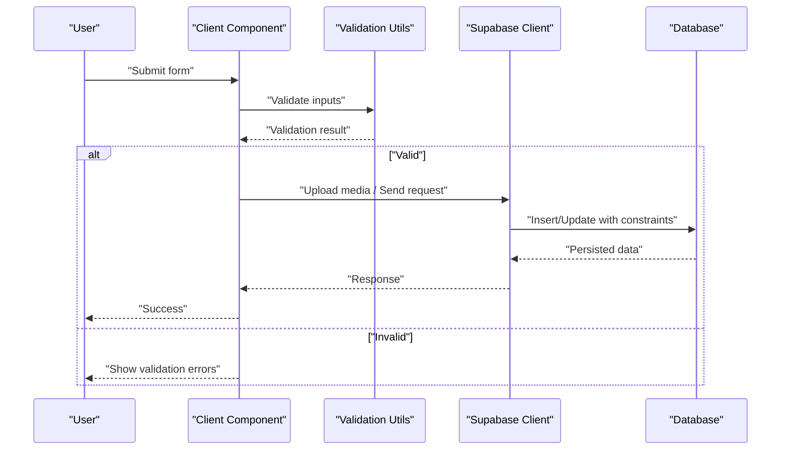
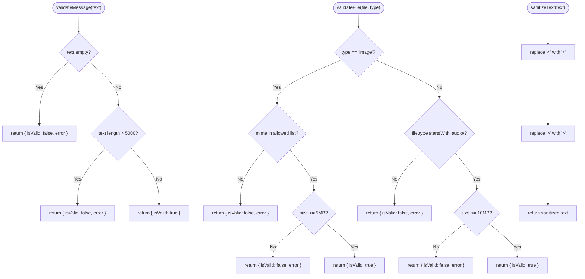
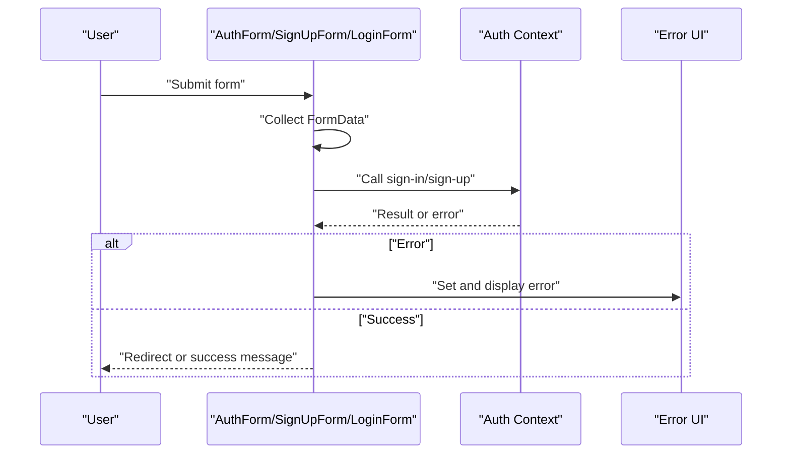
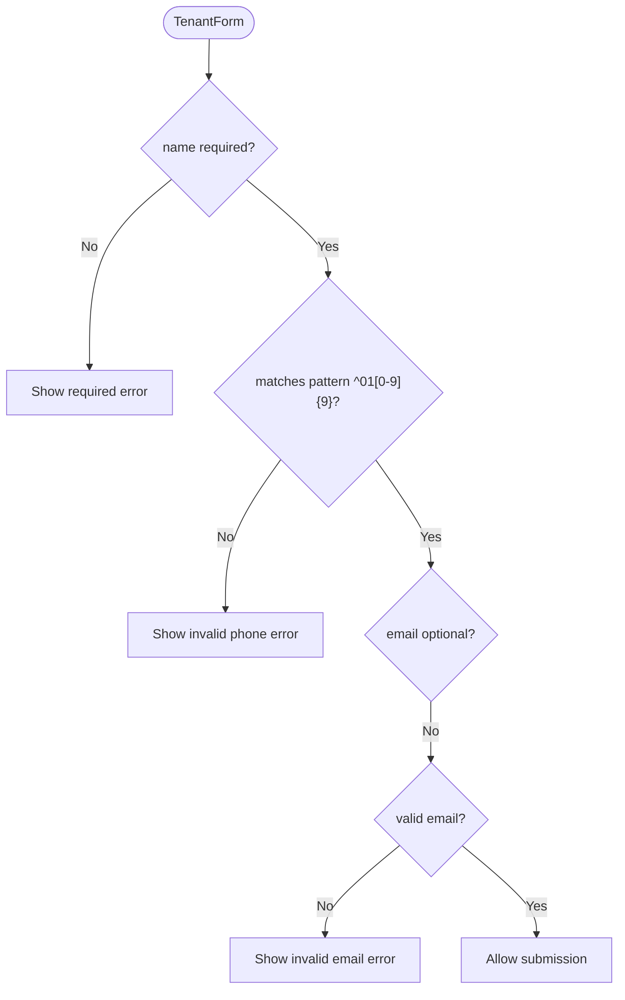
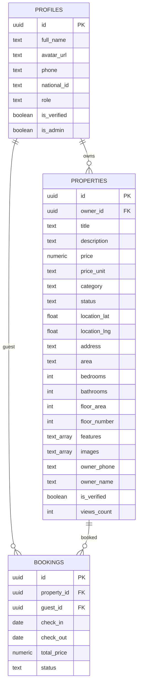
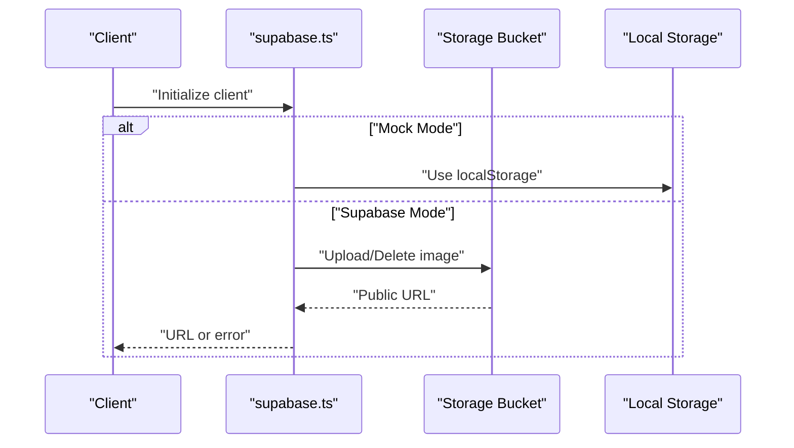
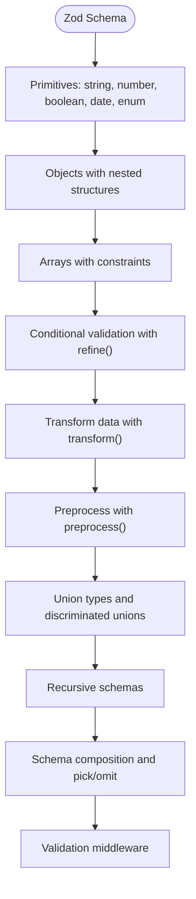
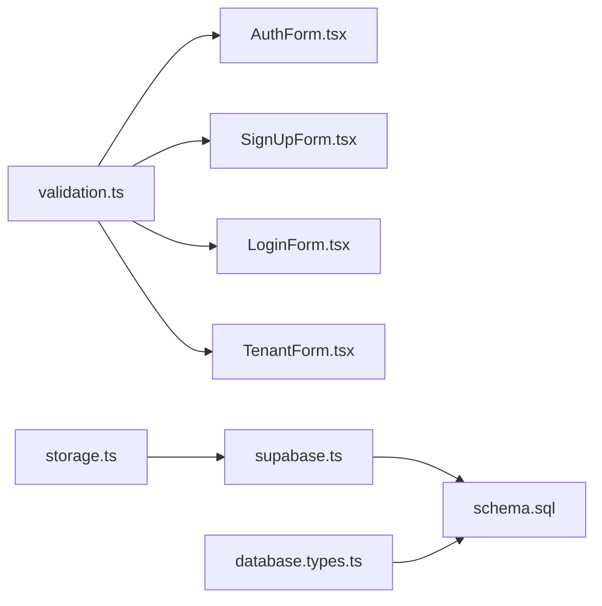

# Data Validation and Sanitization

<cite>
**Referenced Files in This Document**
- [validation.ts](file://src/utils/validation.ts)
- [AuthForm.tsx](file://src/components/auth/AuthForm.tsx)
- [SignUpForm.tsx](file://src/components/auth/SignUpForm.tsx)
- [LoginForm.tsx](file://src/components/auth/LoginForm.tsx)
- [TenantForm.tsx](file://src/components/booking/TenantForm.tsx)
- [validation-patterns.md](file://.agent/skills/backend-dev-guidelines/resources/validation-patterns.md)
- [schema.sql](file://supabase/schema.sql)
- [supabase.ts](file://src/lib/supabase.ts)
- [storage.ts](file://src/lib/storage.ts)
- [database.types.ts](file://src/types/database.types.ts)
- [BOOKING_SYSTEM.md](file://BOOKING_SYSTEM.md)
</cite>

## Table of Contents
1. [Introduction](#introduction)
2. [Project Structure](#project-structure)
3. [Core Components](#core-components)
4. [Architecture Overview](#architecture-overview)
5. [Detailed Component Analysis](#detailed-component-analysis)
6. [Dependency Analysis](#dependency-analysis)
7. [Performance Considerations](#performance-considerations)
8. [Troubleshooting Guide](#troubleshooting-guide)
9. [Conclusion](#conclusion)

## Introduction
This document provides comprehensive guidance on data validation and sanitization for Gamasa Properties. It explains input validation patterns, data sanitization techniques, and security measures against injection attacks. It documents form validation implementation, data type checking, and constraint validation. It also includes examples of validation rules for user inputs, property data, and booking information, along with XSS prevention, SQL injection protection, and secure data processing patterns. Finally, it outlines guidelines for implementing custom validation rules, error handling for validation failures, and maintaining data integrity across the application.

## Project Structure
Gamasa Properties follows a modern Next.js architecture with client-side React components, TypeScript types, Supabase integration, and local storage for mock mode. Validation is implemented at the client level via dedicated utilities and React components, while database constraints and Row Level Security policies enforce integrity and access control.

**Diagram sources**
- [AuthForm.tsx](file://src/components/auth/AuthForm.tsx#L16-L53)
- [SignUpForm.tsx](file://src/components/auth/SignUpForm.tsx#L16-L49)
- [LoginForm.tsx](file://src/components/auth/LoginForm.tsx#L20-L46)
- [TenantForm.tsx](file://src/components/booking/TenantForm.tsx#L27-L61)
- [validation.ts](file://src/utils/validation.ts#L1-L33)
- [storage.ts](file://src/lib/storage.ts#L18-L40)
- [supabase.ts](file://src/lib/supabase.ts#L18-L28)
- [schema.sql](file://supabase/schema.sql#L1-L416)
- [database.types.ts](file://src/types/database.types.ts#L1-L310)

**Section sources**
- [validation.ts](file://src/utils/validation.ts#L1-L33)
- [AuthForm.tsx](file://src/components/auth/AuthForm.tsx#L16-L53)
- [SignUpForm.tsx](file://src/components/auth/SignUpForm.tsx#L16-L49)
- [LoginForm.tsx](file://src/components/auth/LoginForm.tsx#L20-L46)
- [TenantForm.tsx](file://src/components/booking/TenantForm.tsx#L27-L61)
- [supabase.ts](file://src/lib/supabase.ts#L18-L28)
- [schema.sql](file://supabase/schema.sql#L1-L416)
- [database.types.ts](file://src/types/database.types.ts#L1-L310)

## Core Components
This section summarizes the current validation and sanitization mechanisms present in the codebase.

- Client-side validation utilities:
  - Message length and content checks
  - File type and size validation for images and voice recordings
  - Basic text sanitization to prevent XSS
- React form components:
  - Required fields and HTML5 patterns for phone numbers
  - Controlled inputs and basic client-side checks
- Supabase integration:
  - Environment variable checks for client initialization
  - Storage bucket operations for media uploads
- Database schema and RLS:
  - Strong constraints on enums and booleans
  - Row Level Security policies for data isolation
  - Typed database interfaces for compile-time safety

**Section sources**
- [validation.ts](file://src/utils/validation.ts#L1-L33)
- [AuthForm.tsx](file://src/components/auth/AuthForm.tsx#L71-L125)
- [SignUpForm.tsx](file://src/components/auth/SignUpForm.tsx#L107-L231)
- [LoginForm.tsx](file://src/components/auth/LoginForm.tsx#L76-L151)
- [TenantForm.tsx](file://src/components/booking/TenantForm.tsx#L27-L76)
- [supabase.ts](file://src/lib/supabase.ts#L18-L28)
- [schema.sql](file://supabase/schema.sql#L8-L180)
- [database.types.ts](file://src/types/database.types.ts#L14-L300)

## Architecture Overview
The validation and sanitization pipeline spans client-side checks, Supabase storage, and database constraints. Client components collect and validate user inputs, utilities sanitize and validate content, and Supabase enforces backend constraints and access policies.

**Diagram sources**
- [validation.ts](file://src/utils/validation.ts#L1-L33)
- [supabase.ts](file://src/lib/supabase.ts#L34-L67)
- [schema.sql](file://supabase/schema.sql#L42-L180)

## Detailed Component Analysis

### Client-Side Validation Utilities
The validation module centralizes common checks for messages, files, and text sanitization.

**Diagram sources**
- [validation.ts](file://src/utils/validation.ts#L1-L33)

**Section sources**
- [validation.ts](file://src/utils/validation.ts#L1-L33)

### Authentication Forms Validation
Authentication forms rely on HTML5 attributes and controlled state updates. They collect email, password, and optional full name, and display localized error messages.

**Diagram sources**
- [AuthForm.tsx](file://src/components/auth/AuthForm.tsx#L16-L53)
- [SignUpForm.tsx](file://src/components/auth/SignUpForm.tsx#L16-L49)
- [LoginForm.tsx](file://src/components/auth/LoginForm.tsx#L20-L46)

**Section sources**
- [AuthForm.tsx](file://src/components/auth/AuthForm.tsx#L16-L53)
- [SignUpForm.tsx](file://src/components/auth/SignUpForm.tsx#L16-L49)
- [LoginForm.tsx](file://src/components/auth/LoginForm.tsx#L20-L46)

### Booking Tenant Information Validation
The tenant form enforces required fields and a phone number pattern. It uses controlled inputs to update state and passes callbacks to parent components.

**Diagram sources**
- [TenantForm.tsx](file://src/components/booking/TenantForm.tsx#L27-L76)

**Section sources**
- [TenantForm.tsx](file://src/components/booking/TenantForm.tsx#L27-L76)

### Database Constraints and RLS
The Supabase schema defines strong constraints on enums and booleans, ensuring data integrity. Row Level Security policies isolate data per user and role.

**Diagram sources**
- [schema.sql](file://supabase/schema.sql#L8-L180)
- [database.types.ts](file://src/types/database.types.ts#L14-L300)

**Section sources**
- [schema.sql](file://supabase/schema.sql#L8-L180)
- [database.types.ts](file://src/types/database.types.ts#L14-L300)

### Supabase Client Initialization and Storage
The Supabase client initializes with environment variables and provides helper functions for image upload and deletion. Local storage is used for mock mode, while Supabase handles real data.

**Diagram sources**
- [supabase.ts](file://src/lib/supabase.ts#L18-L67)
- [storage.ts](file://src/lib/storage.ts#L18-L40)

**Section sources**
- [supabase.ts](file://src/lib/supabase.ts#L18-L67)
- [storage.ts](file://src/lib/storage.ts#L18-L40)

### Recommended Validation Patterns (Zod)
The backend guidelines resource demonstrates robust validation patterns using Zod, including primitive types, objects, arrays, conditional validation, transforms, preprocessing, union types, recursive schemas, and composition. These patterns should be adopted for server-side validation and DTOs.

**Diagram sources**
- [validation-patterns.md](file://.agent/skills/backend-dev-guidelines/resources/validation-patterns.md#L57-L746)

**Section sources**
- [validation-patterns.md](file://.agent/skills/backend-dev-guidelines/resources/validation-patterns.md#L57-L746)

## Dependency Analysis
The following diagram highlights key dependencies among validation utilities, components, and database constraints.

**Diagram sources**
- [validation.ts](file://src/utils/validation.ts#L1-L33)
- [AuthForm.tsx](file://src/components/auth/AuthForm.tsx#L16-L53)
- [SignUpForm.tsx](file://src/components/auth/SignUpForm.tsx#L16-L49)
- [LoginForm.tsx](file://src/components/auth/LoginForm.tsx#L20-L46)
- [TenantForm.tsx](file://src/components/booking/TenantForm.tsx#L27-L76)
- [storage.ts](file://src/lib/storage.ts#L18-L40)
- [supabase.ts](file://src/lib/supabase.ts#L18-L28)
- [schema.sql](file://supabase/schema.sql#L1-L416)
- [database.types.ts](file://src/types/database.types.ts#L1-L310)

**Section sources**
- [validation.ts](file://src/utils/validation.ts#L1-L33)
- [storage.ts](file://src/lib/storage.ts#L18-L40)
- [supabase.ts](file://src/lib/supabase.ts#L18-L28)
- [schema.sql](file://supabase/schema.sql#L1-L416)
- [database.types.ts](file://src/types/database.types.ts#L1-L310)

## Performance Considerations
- Client-side validation reduces unnecessary network requests and improves user experience.
- Zod-based server-side validation ensures type safety and efficient error reporting.
- Database constraints minimize redundant application-level checks and maintain integrity.
- RLS policies reduce application complexity by enforcing access controls at the database level.

## Troubleshooting Guide
Common validation and sanitization issues and resolutions:

- Validation errors on forms:
  - Ensure required fields are filled and formatted correctly (e.g., phone number pattern).
  - Verify that file uploads meet type and size constraints.
- XSS prevention:
  - Use the provided sanitization utility for raw text inputs.
  - Rely on framework rendering defaults; avoid innerHTML where possible.
- SQL injection protection:
  - Use Supabase client methods and database constraints; avoid dynamic SQL.
  - Enforce RLS policies to restrict unauthorized access.
- Error handling:
  - Display localized error messages for user feedback.
  - Log errors for debugging while avoiding sensitive data exposure.

**Section sources**
- [validation.ts](file://src/utils/validation.ts#L1-L33)
- [AuthForm.tsx](file://src/components/auth/AuthForm.tsx#L103-L113)
- [SignUpForm.tsx](file://src/components/auth/SignUpForm.tsx#L215-L220)
- [LoginForm.tsx](file://src/components/auth/LoginForm.tsx#L133-L138)
- [schema.sql](file://supabase/schema.sql#L170-L180)

## Conclusion
Gamasa Properties implements practical client-side validation and sanitization alongside robust database constraints and RLS policies. To strengthen the system, adopt Zod-based server-side validation and DTOs, enhance error handling, and expand validation coverage to all user inputs and booking data. These steps will improve security, maintainability, and user trust.