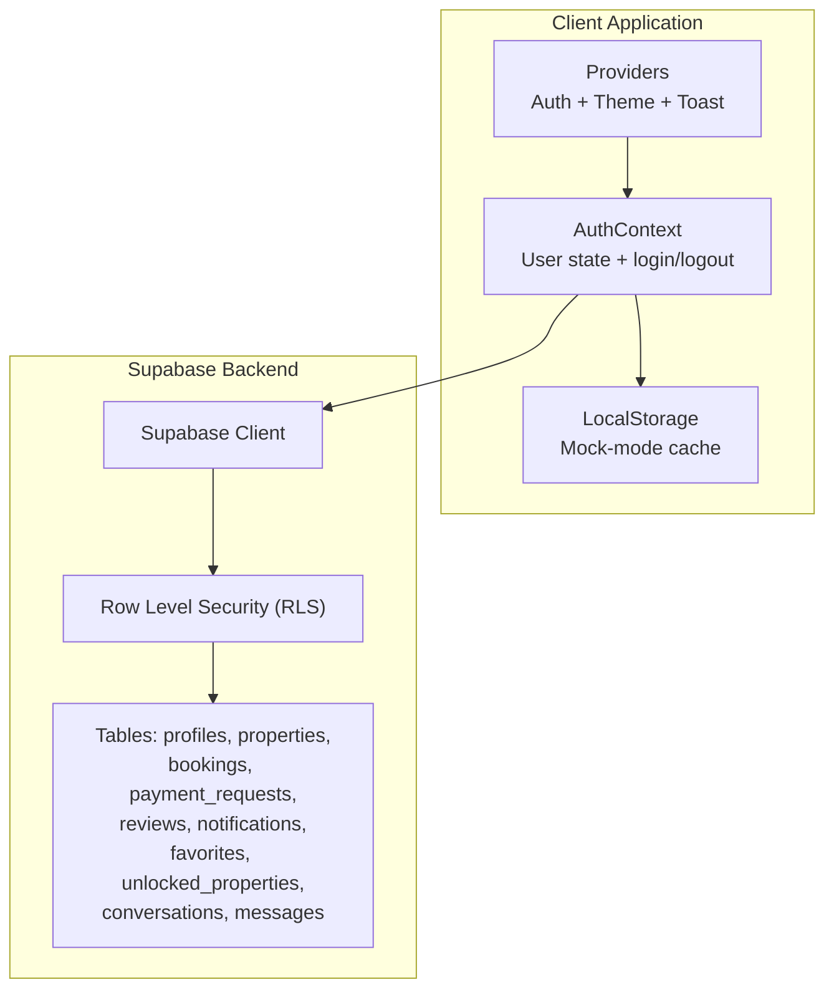
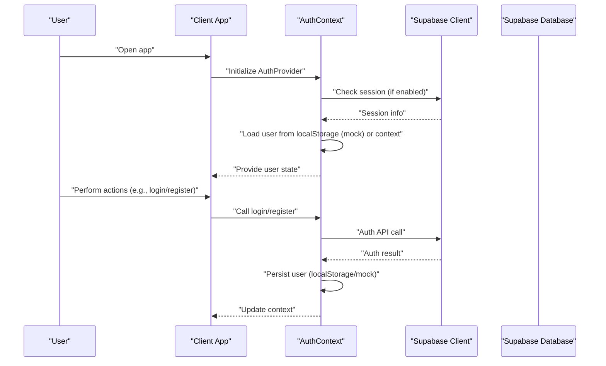
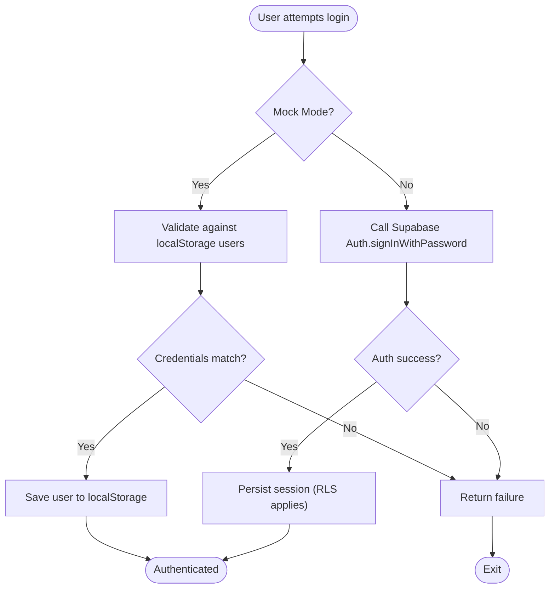
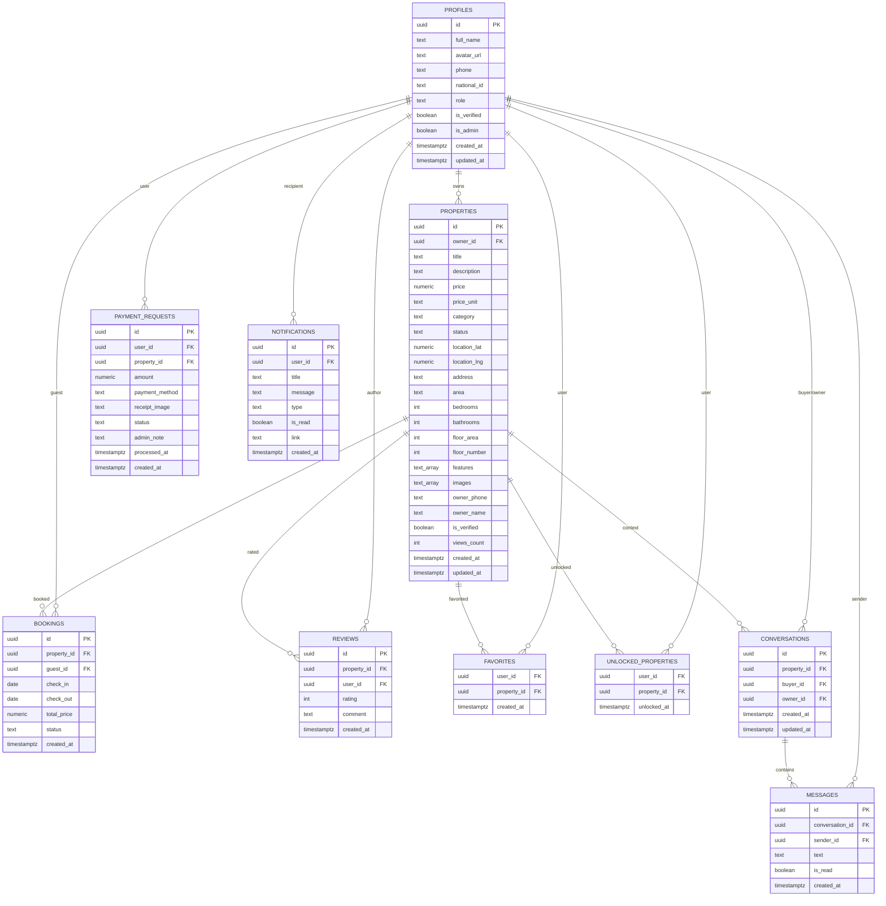
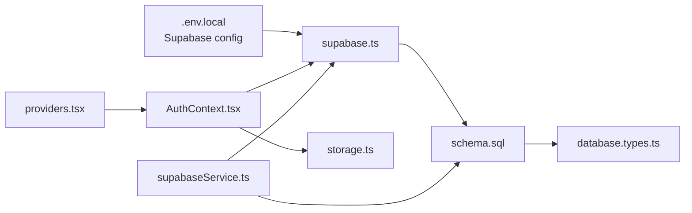

# Privacy and Compliance

<cite>
**Referenced Files in This Document**
- [supabase.ts](file://src/lib/supabase.ts)
- [storage.ts](file://src/lib/storage.ts)
- [AuthContext.tsx](file://src/context/AuthContext.tsx)
- [providers.tsx](file://src/app/providers.tsx)
- [supabaseService.ts](file://src/services/supabaseService.ts)
- [schema.sql](file://supabase/schema.sql)
- [database.types.ts](file://src/types/database.types.ts)
- [.env.local](file://.env.local)
- [BOOKING_SYSTEM.md](file://BOOKING_SYSTEM.md)
- [AdminGuard.tsx](file://src/components/auth/AdminGuard.tsx)
- [AuthForm.tsx](file://src/components/auth/AuthForm.tsx)
</cite>

## Table of Contents
1. [Introduction](#introduction)
2. [Project Structure](#project-structure)
3. [Core Components](#core-components)
4. [Architecture Overview](#architecture-overview)
5. [Detailed Component Analysis](#detailed-component-analysis)
6. [Dependency Analysis](#dependency-analysis)
7. [Performance Considerations](#performance-considerations)
8. [Troubleshooting Guide](#troubleshooting-guide)
9. [Conclusion](#conclusion)
10. [Appendices](#appendices)

## Introduction
This document provides comprehensive privacy and compliance guidance for Gamasa Properties, focusing on data protection measures, GDPR alignment, user consent management, and secure handling of personal data. It explains current data collection and processing flows, outlines privacy controls, secure storage practices, retention and deletion mechanisms, and provides practical examples for privacy-friendly configurations. It also includes guidelines for handling sensitive information, implementing data subject rights, and maintaining audit trails aligned with Egyptian data protection regulations.

## Project Structure
Gamasa Properties is a Next.js application with a Supabase backend. Authentication and session persistence are handled via Supabase Auth, while application-level user data and local caches are stored in localStorage during mock mode. Supabase RLS policies govern row-level access control for all data tables. Environment variables configure Supabase client settings and feature flags.

**Diagram sources**
- [providers.tsx](file://src/app/providers.tsx#L7-L16)
- [AuthContext.tsx](file://src/context/AuthContext.tsx#L22-L185)
- [supabase.ts](file://src/lib/supabase.ts#L18-L28)
- [schema.sql](file://supabase/schema.sql#L170-L250)

**Section sources**
- [providers.tsx](file://src/app/providers.tsx#L1-L18)
- [supabase.ts](file://src/lib/supabase.ts#L1-L68)
- [schema.sql](file://supabase/schema.sql#L1-L416)

## Core Components
- Supabase client initialization and storage utilities
- Local storage-based mock-mode persistence
- Authentication provider with login/logout flows
- Supabase service layer orchestrating CRUD operations
- Supabase schema with RLS policies and triggers
- TypeScript database types for strong typing

Key privacy-relevant aspects:
- Supabase Auth manages sessions and tokens with auto-refresh and persistence.
- Mock mode stores user data and preferences in localStorage.
- Supabase RLS restricts access to user-specific records.
- Images are stored in Supabase Storage with public URL generation.

**Section sources**
- [supabase.ts](file://src/lib/supabase.ts#L1-L68)
- [storage.ts](file://src/lib/storage.ts#L1-L633)
- [AuthContext.tsx](file://src/context/AuthContext.tsx#L1-L195)
- [supabaseService.ts](file://src/services/supabaseService.ts#L1-L1384)
- [schema.sql](file://supabase/schema.sql#L1-L416)
- [database.types.ts](file://src/types/database.types.ts#L1-L310)

## Architecture Overview
The system separates authentication and session management from data access. During mock mode, localStorage acts as the primary data store. In production mode, Supabase Auth and Supabase Database handle authentication and data persistence respectively. RLS ensures per-user access control.

**Diagram sources**
- [providers.tsx](file://src/app/providers.tsx#L7-L16)
- [AuthContext.tsx](file://src/context/AuthContext.tsx#L22-L185)
- [supabase.ts](file://src/lib/supabase.ts#L18-L28)

## Detailed Component Analysis

### Authentication and Consent Management
- Login/logout flows are centralized in the Auth Provider. In mock mode, user credentials are validated against localStorage entries; in production mode, Supabase Auth is used.
- Terms acceptance is represented in the registration form, indicating a consent mechanism for terms and privacy policy.
- Session persistence and auto-refresh are configured in the Supabase client.

Recommended privacy-aligned enhancements:
- Implement explicit consent checkboxes for marketing and analytics.
- Add granular consent toggles for data processing purposes.
- Provide a dedicated consent management screen with timestamps and revocation options.

**Diagram sources**
- [AuthContext.tsx](file://src/context/AuthContext.tsx#L80-L115)
- [AuthContext.tsx](file://src/context/AuthContext.tsx#L117-L161)
- [supabase.ts](file://src/lib/supabase.ts#L22-L27)

**Section sources**
- [AuthContext.tsx](file://src/context/AuthContext.tsx#L1-L195)
- [AuthForm.tsx](file://src/components/auth/AuthForm.tsx#L196-L211)
- [supabase.ts](file://src/lib/supabase.ts#L1-L68)

### Data Collection and Handling Procedures
- User profiles include identifiers such as full name, phone, and national ID. These fields are present in the schema and mapped in TypeScript types.
- Property data includes owner contact details and images, stored in Supabase Storage.
- Booking and payment request data are captured in dedicated tables with status tracking.

Privacy controls:
- RLS policies restrict access to user-specific records (e.g., bookings, payment requests, notifications).
- Admin policies grant expanded access for administrative tasks.

**Diagram sources**
- [schema.sql](file://supabase/schema.sql#L7-L167)
- [database.types.ts](file://src/types/database.types.ts#L12-L310)

**Section sources**
- [schema.sql](file://supabase/schema.sql#L1-L416)
- [database.types.ts](file://src/types/database.types.ts#L1-L310)

### Secure Data Storage Practices
- Supabase Storage bucket is used for images with public URL generation.
- In mock mode, localStorage serves as the primary store for users, properties, and notifications.
- Environment variables configure Supabase client and feature flags.

Recommendations:
- Enforce HTTPS and secure cookies for production environments.
- Use signed, time-limited URLs for storage downloads.
- Apply CSP headers and sanitize user-generated content.
- Encrypt sensitive fields at rest where applicable.

**Section sources**
- [supabase.ts](file://src/lib/supabase.ts#L30-L67)
- [storage.ts](file://src/lib/storage.ts#L42-L67)
- [.env.local](file://.env.local#L1-L4)

### Data Retention and Deletion Mechanisms
- Current implementation does not define explicit data retention or automated deletion policies.
- AdminGuard demonstrates administrative access control for protected routes.

Recommendations:
- Define retention periods for logs, analytics, and user data.
- Implement data subject requests (access, rectification, erasure, portability).
- Add automated cleanup jobs for expired sessions and unused assets.
- Provide user-controlled data deletion with confirmation.

**Section sources**
- [AdminGuard.tsx](file://src/components/auth/AdminGuard.tsx#L1-L44)

### Privacy Controls Implementation
- RLS policies restrict data visibility to authenticated users and owners.
- Admin policies allow authorized administrators to manage data.
- Realtime publication for messages enables live updates with controlled access.

Recommendations:
- Add opt-in/opt-out toggles for non-essential data processing.
- Implement data minimization by limiting collected fields to business necessity.
- Provide granular consent for profiling and marketing communications.

**Section sources**
- [schema.sql](file://supabase/schema.sql#L182-L250)
- [schema.sql](file://supabase/schema.sql#L362-L416)

### Examples of Privacy-Friendly Configurations
- Environment variables for Supabase client and mock mode flag:
  - NEXT_PUBLIC_SUPABASE_URL
  - NEXT_PUBLIC_SUPABASE_ANON_KEY
  - NEXT_PUBLIC_IS_MOCK_MODE

- Recommendations:
  - Disable mock mode in production and rely on Supabase Auth and RLS.
  - Use separate Supabase projects for development and production.
  - Restrict Supabase anon key usage to frontend only and avoid exposing service keys.

**Section sources**
- [.env.local](file://.env.local#L1-L4)
- [supabase.ts](file://src/lib/supabase.ts#L4-L28)

### Data Anonymization Techniques
- Remove or mask personally identifiable information (PII) in reports and logs.
- Aggregate analytics to prevent individual identification.
- Apply pseudonymization for research datasets.

[No sources needed since this section provides general guidance]

### Compliance with Egyptian Data Protection Regulations
- Align with data minimization, transparency, and user consent requirements.
- Implement data breach notification procedures and security measures.
- Establish legal basis for processing and provide withdrawal of consent.

[No sources needed since this section provides general guidance]

### Guidelines for Handling Sensitive User Information
- Treat national ID and financial data as special categories requiring explicit consent and additional safeguards.
- Limit access to sensitive data via least-privileged roles and RLS.
- Log access to sensitive data for auditability.

**Section sources**
- [schema.sql](file://supabase/schema.sql#L13-L16)
- [schema.sql](file://supabase/schema.sql#L182-L250)

### Implementing Data Subject Rights
- Right of access: Provide user dashboards to view stored data.
- Right to rectification: Allow users to update profile information.
- Right to erasure: Offer account deletion with data scrubbing.
- Right to data portability: Export user data in standardized formats.

**Section sources**
- [AuthContext.tsx](file://src/context/AuthContext.tsx#L163-L170)
- [schema.sql](file://supabase/schema.sql#L182-L250)

### Maintaining Audit Trails
- Track authentication events, profile updates, and administrative actions.
- Store logs with timestamps, user IDs, and action details.
- Ensure log integrity and retention policies.

**Section sources**
- [schema.sql](file://supabase/schema.sql#L254-L294)

## Dependency Analysis
The application’s privacy posture depends on the interplay between client-side mock/local storage and Supabase backend services. Authentication and authorization are handled centrally, while data access is governed by RLS policies.

**Diagram sources**
- [.env.local](file://.env.local#L1-L4)
- [supabase.ts](file://src/lib/supabase.ts#L1-L68)
- [providers.tsx](file://src/app/providers.tsx#L1-L18)
- [AuthContext.tsx](file://src/context/AuthContext.tsx#L1-L195)
- [storage.ts](file://src/lib/storage.ts#L1-L633)
- [schema.sql](file://supabase/schema.sql#L1-L416)
- [database.types.ts](file://src/types/database.types.ts#L1-L310)
- [supabaseService.ts](file://src/services/supabaseService.ts#L1-L1384)

**Section sources**
- [supabase.ts](file://src/lib/supabase.ts#L1-L68)
- [storage.ts](file://src/lib/storage.ts#L1-L633)
- [AuthContext.tsx](file://src/context/AuthContext.tsx#L1-L195)
- [supabaseService.ts](file://src/services/supabaseService.ts#L1-L1384)
- [schema.sql](file://supabase/schema.sql#L1-L416)
- [database.types.ts](file://src/types/database.types.ts#L1-L310)
- [.env.local](file://.env.local#L1-L4)

## Performance Considerations
- Minimize localStorage usage in production; prefer Supabase for scalability.
- Use Supabase Storage CDN for efficient image delivery.
- Implement pagination and filtering to reduce payload sizes.

[No sources needed since this section provides general guidance]

## Troubleshooting Guide
Common privacy-related issues and resolutions:
- Missing environment variables cause warnings and fallback behavior. Ensure NEXT_PUBLIC_SUPABASE_URL and NEXT_PUBLIC_SUPABASE_ANON_KEY are set.
- Mock mode stores user data locally; disable mock mode for production to enforce RLS and centralized auth.
- If users cannot access their data, verify RLS policies and user roles.

**Section sources**
- [supabase.ts](file://src/lib/supabase.ts#L7-L15)
- [AuthContext.tsx](file://src/context/AuthContext.tsx#L8-L10)
- [schema.sql](file://supabase/schema.sql#L182-L250)

## Conclusion
Gamasa Properties currently relies on Supabase for authentication and data persistence, with RLS policies providing per-user access control. To strengthen privacy and compliance, adopt explicit consent mechanisms, implement data retention and deletion policies, enhance audit logging, and align with Egyptian data protection regulations. Transition from mock mode to production-grade Supabase configuration and apply the recommended privacy controls.

[No sources needed since this section summarizes without analyzing specific files]

## Appendices

### Appendix A: Booking and Payment Data Privacy Notes
- Booking and payment request data capture sensitive information (names, phones, amounts).
- Ensure receipts are stored securely and retained only as long as necessary.
- Implement user access controls and encryption for sensitive documents.

**Section sources**
- [BOOKING_SYSTEM.md](file://BOOKING_SYSTEM.md#L299-L341)
- [schema.sql](file://supabase/schema.sql#L94-L128)