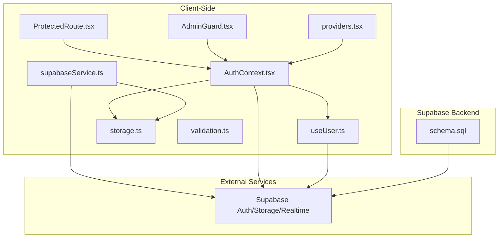
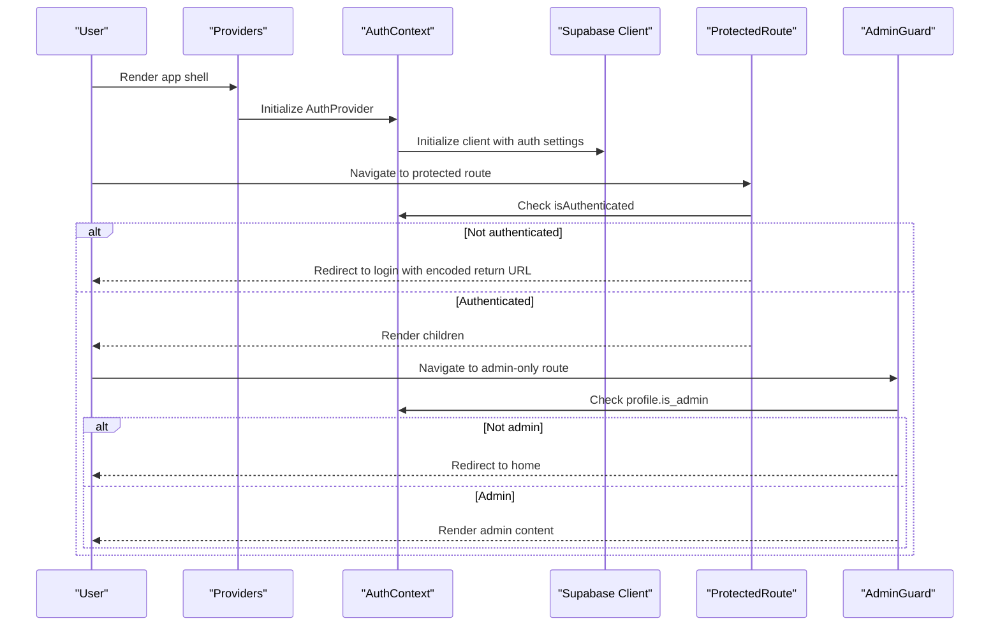
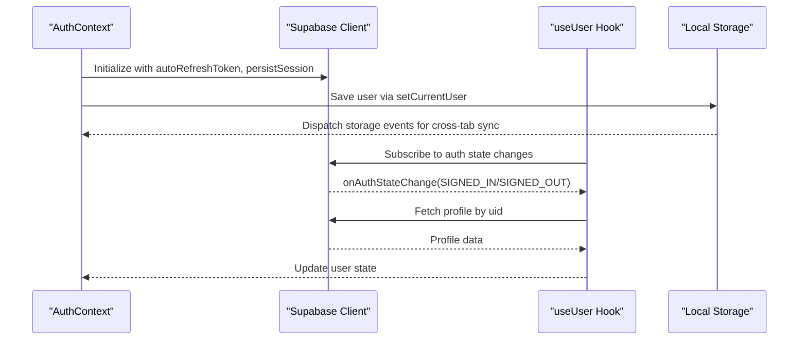
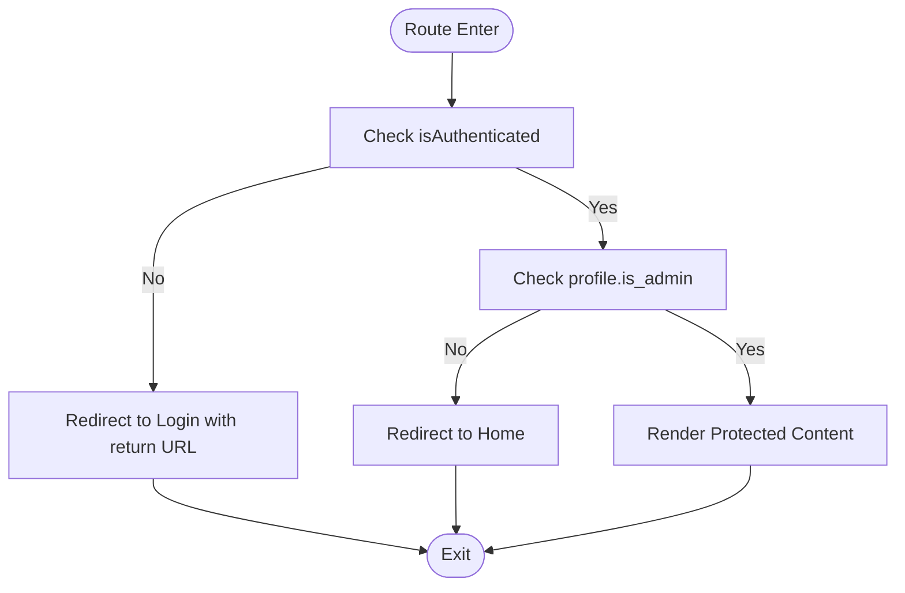
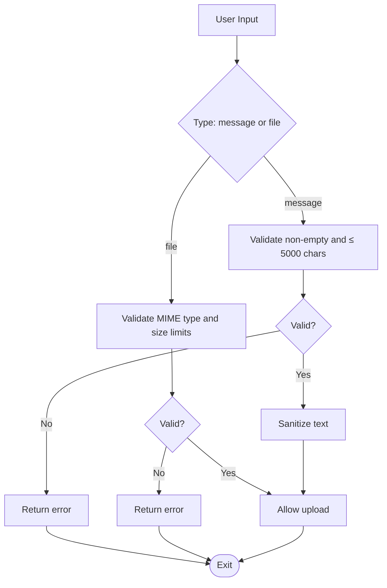
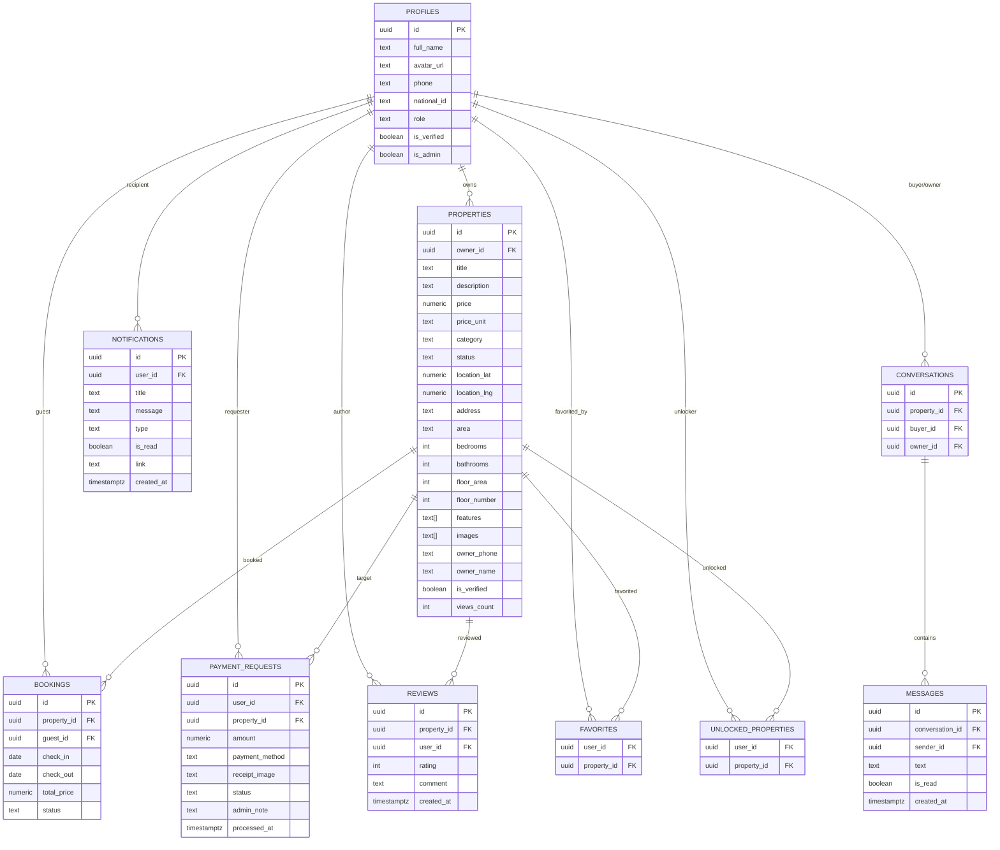
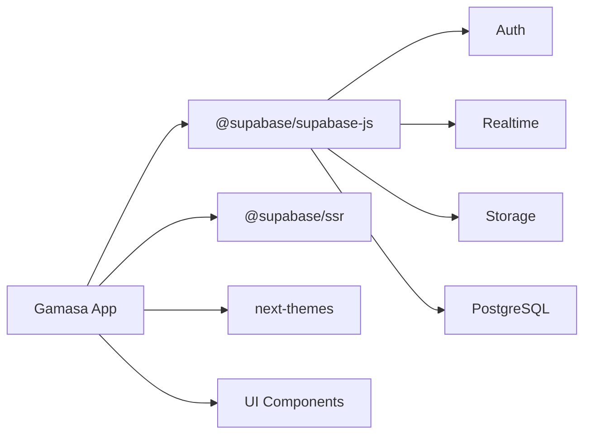

# Security Considerations

<cite>
**Referenced Files in This Document**
- [supabase.ts](file://src/lib/supabase.ts)
- [AuthContext.tsx](file://src/context/AuthContext.tsx)
- [ProtectedRoute.tsx](file://src/components/ProtectedRoute.tsx)
- [AdminGuard.tsx](file://src/components/auth/AdminGuard.tsx)
- [storage.ts](file://src/lib/storage.ts)
- [validation.ts](file://src/utils/validation.ts)
- [supabaseService.ts](file://src/services/supabaseService.ts)
- [useUser.ts](file://src/hooks/useUser.ts)
- [providers.tsx](file://src/app/providers.tsx)
- [schema.sql](file://supabase/schema.sql)
- [.env.local](file://.env.local)
- [package.json](file://package.json)
</cite>

## Table of Contents
1. [Introduction](#introduction)
2. [Project Structure](#project-structure)
3. [Core Components](#core-components)
4. [Architecture Overview](#architecture-overview)
5. [Detailed Component Analysis](#detailed-component-analysis)
6. [Dependency Analysis](#dependency-analysis)
7. [Performance Considerations](#performance-considerations)
8. [Troubleshooting Guide](#troubleshooting-guide)
9. [Conclusion](#conclusion)
10. [Appendices](#appendices)

## Introduction
This document consolidates the security posture of Gamasa Properties with a focus on authentication, session management, authorization, data validation, input controls, privacy compliance, Supabase Row Level Security (RLS), encryption strategies, secure communications, vulnerability assessment, monitoring, and incident response. It synthesizes the current implementation details present in the repository and provides actionable guidance grounded in the codebase.

## Project Structure
Security-relevant modules are distributed across client-side contexts, services, utilities, and Supabase schema definitions:
- Authentication and session management: Supabase client initialization, AuthContext provider, and user hook
- Authorization and access control: AdminGuard and ProtectedRoute guards
- Data validation and sanitization: validation utilities
- Local storage and hybrid modes: storage utilities and mock mode flags
- Supabase schema and policies: RLS policies and triggers
- Environment configuration: Supabase credentials and feature flags

**Diagram sources**
- [ProtectedRoute.tsx](file://src/components/ProtectedRoute.tsx#L1-L31)
- [AdminGuard.tsx](file://src/components/auth/AdminGuard.tsx#L1-L44)
- [AuthContext.tsx](file://src/context/AuthContext.tsx#L1-L195)
- [useUser.ts](file://src/hooks/useUser.ts#L1-L178)
- [storage.ts](file://src/lib/storage.ts#L1-L633)
- [validation.ts](file://src/utils/validation.ts#L1-L33)
- [supabaseService.ts](file://src/services/supabaseService.ts#L1-L800)
- [providers.tsx](file://src/app/providers.tsx#L1-L18)
- [schema.sql](file://supabase/schema.sql#L1-L416)

**Section sources**
- [supabase.ts](file://src/lib/supabase.ts#L1-L68)
- [AuthContext.tsx](file://src/context/AuthContext.tsx#L1-L195)
- [ProtectedRoute.tsx](file://src/components/ProtectedRoute.tsx#L1-L31)
- [AdminGuard.tsx](file://src/components/auth/AdminGuard.tsx#L1-L44)
- [storage.ts](file://src/lib/storage.ts#L1-L633)
- [validation.ts](file://src/utils/validation.ts#L1-L33)
- [supabaseService.ts](file://src/services/supabaseService.ts#L1-L800)
- [useUser.ts](file://src/hooks/useUser.ts#L1-L178)
- [providers.tsx](file://src/app/providers.tsx#L1-L18)
- [schema.sql](file://supabase/schema.sql#L1-L416)
- [.env.local](file://.env.local#L1-L4)
- [package.json](file://package.json#L1-L42)

## Core Components
- Supabase client initialization and session persistence
- Authentication context with mock mode support and local storage integration
- Route guards for protected and admin-only areas
- Validation and sanitization utilities for messages and media uploads
- Hybrid storage service bridging mock and Supabase modes
- Supabase RLS policies enforcing tenant isolation and admin privileges
- Environment variables controlling Supabase endpoints and feature flags

**Section sources**
- [supabase.ts](file://src/lib/supabase.ts#L1-L68)
- [AuthContext.tsx](file://src/context/AuthContext.tsx#L1-L195)
- [ProtectedRoute.tsx](file://src/components/ProtectedRoute.tsx#L1-L31)
- [AdminGuard.tsx](file://src/components/auth/AdminGuard.tsx#L1-L44)
- [validation.ts](file://src/utils/validation.ts#L1-L33)
- [supabaseService.ts](file://src/services/supabaseService.ts#L1-L800)
- [schema.sql](file://supabase/schema.sql#L170-L336)
- [.env.local](file://.env.local#L1-L4)

## Architecture Overview
The application integrates Supabase for authentication, real-time messaging, storage, and database operations. Client-side guards enforce access control, while Supabase enforces RLS policies at the database level. Local storage supports a hybrid mock mode for development and testing.

**Diagram sources**
- [providers.tsx](file://src/app/providers.tsx#L1-L18)
- [AuthContext.tsx](file://src/context/AuthContext.tsx#L1-L195)
- [ProtectedRoute.tsx](file://src/components/ProtectedRoute.tsx#L1-L31)
- [AdminGuard.tsx](file://src/components/auth/AdminGuard.tsx#L1-L44)
- [supabase.ts](file://src/lib/supabase.ts#L18-L28)

## Detailed Component Analysis

### Authentication Security Measures
- Supabase client initialization enables automatic token refresh, persistent sessions, and URL-based session detection. These settings help maintain secure, resilient authentication flows.
- The AuthContext supports a mock mode flag and local storage integration for user state synchronization across tabs. While convenient for development, production deployments should rely on Supabase Auth exclusively.
- The useUser hook listens to Supabase auth state changes and loads profile data upon sign-in, ensuring the UI reflects current authentication state.

**Diagram sources**
- [supabase.ts](file://src/lib/supabase.ts#L18-L28)
- [AuthContext.tsx](file://src/context/AuthContext.tsx#L22-L78)
- [useUser.ts](file://src/hooks/useUser.ts#L138-L168)
- [storage.ts](file://src/lib/storage.ts#L28-L40)

**Section sources**
- [supabase.ts](file://src/lib/supabase.ts#L18-L28)
- [AuthContext.tsx](file://src/context/AuthContext.tsx#L1-L195)
- [useUser.ts](file://src/hooks/useUser.ts#L1-L178)
- [storage.ts](file://src/lib/storage.ts#L1-L633)

### Session Management Security
- Session persistence is enabled in the Supabase client, reducing friction for users while maintaining security defaults.
- Cross-tab synchronization is handled via storage events and a dedicated userUpdated event, minimizing stale state risks.
- Logout clears local user state and invokes Supabase sign-out, ensuring the session is terminated server-side.

**Section sources**
- [supabase.ts](file://src/lib/supabase.ts#L22-L27)
- [AuthContext.tsx](file://src/context/AuthContext.tsx#L163-L170)
- [storage.ts](file://src/lib/storage.ts#L28-L40)

### Authorization Controls
- ProtectedRoute redirects unauthenticated users to the login page with a return URL encoded in the query string.
- AdminGuard checks authentication and admin status, rendering a loader while resolving state and redirecting otherwise.
- Supabase RLS policies restrict access to data based on ownership, roles, and explicit admin permissions.

**Diagram sources**
- [ProtectedRoute.tsx](file://src/components/ProtectedRoute.tsx#L8-L29)
- [AdminGuard.tsx](file://src/components/auth/AdminGuard.tsx#L11-L43)

**Section sources**
- [ProtectedRoute.tsx](file://src/components/ProtectedRoute.tsx#L1-L31)
- [AdminGuard.tsx](file://src/components/auth/AdminGuard.tsx#L1-L44)
- [schema.sql](file://supabase/schema.sql#L197-L244)

### Data Validation and Sanitization
- Message validation enforces non-empty content and length limits.
- File validation restricts media types and sizes for images and voice recordings.
- Text sanitization replaces angle brackets to mitigate basic XSS risks in raw text contexts.

**Diagram sources**
- [validation.ts](file://src/utils/validation.ts#L1-L33)

**Section sources**
- [validation.ts](file://src/utils/validation.ts#L1-L33)

### Input Security Controls
- Supabase RLS policies enforce ownership and role-based access for properties, bookings, payment requests, reviews, notifications, favorites, and unlocked properties.
- Admin policies grant broad permissions for administrative tasks.
- Conversations and messages are restricted to participants, preventing unauthorized access.

**Section sources**
- [schema.sql](file://supabase/schema.sql#L197-L336)

### Privacy Compliance Requirements
- Data minimization: Only necessary fields are stored and exposed via RLS.
- Consent and transparency: Profiles include verification flags; consider adding explicit consent mechanisms for data processing.
- Right to erasure: Supabase cascading deletes and manual cleanup routines should be reviewed for GDPR alignment.
- Data localization: Ensure Supabase regions align with applicable regulations.

**Section sources**
- [schema.sql](file://supabase/schema.sql#L8-L19)
- [schema.sql](file://supabase/schema.sql#L42-L67)
- [schema.sql](file://supabase/schema.sql#L339-L360)

### Supabase Row Level Security Implementation
- RLS is enabled on all relevant tables.
- Policies:
  - Profiles: select allowed; update/insert restricted to self
  - Properties: select visible to owners or approved statuses; insert/update/delete restricted to owners; admin can do all
  - Bookings: select restricted to guests
  - Payment Requests: select restricted to requester; admin can manage
  - Reviews: select allowed; insert restricted to self
  - Notifications: select/update restricted to owner
  - Favorites: select/manage restricted to self
  - Unlocked Properties: select restricted to self
  - Messages/Conversations: select/send restricted to participants

**Diagram sources**
- [schema.sql](file://supabase/schema.sql#L8-L19)
- [schema.sql](file://supabase/schema.sql#L42-L67)
- [schema.sql](file://supabase/schema.sql#L95-L104)
- [schema.sql](file://supabase/schema.sql#L117-L128)
- [schema.sql](file://supabase/schema.sql#L131-L139)
- [schema.sql](file://supabase/schema.sql#L142-L151)
- [schema.sql](file://supabase/schema.sql#L154-L167)
- [schema.sql](file://supabase/schema.sql#L339-L360)

**Section sources**
- [schema.sql](file://supabase/schema.sql#L170-L336)

### Data Encryption Strategies
- Transport encryption: Supabase connections use HTTPS; ensure clients enforce TLS and avoid mixed content.
- At-rest encryption: Supabase manages encryption at rest; review regional settings and compliance requirements.
- Client-side hashing: Passwords are handled server-side by Supabase; avoid storing sensitive data client-side unless encrypted.

**Section sources**
- [supabase.ts](file://src/lib/supabase.ts#L18-L21)
- [schema.sql](file://supabase/schema.sql#L8-L19)

### Secure Communication Protocols
- Supabase client connects to Supabase-hosted endpoints; verify endpoint URLs and consider certificate pinning for hardened environments.
- Environment variables define Supabase URL and anon key; ensure secrets are managed securely and not committed to version control.

**Section sources**
- [.env.local](file://.env.local#L1-L3)
- [supabase.ts](file://src/lib/supabase.ts#L4-L5)

### Hybrid Mode and Mock Data
- Mock mode flag and in-memory collections simplify development but bypass Supabase enforcement. Ensure strict separation between development and production configurations.
- Local storage is used for user state in mock mode; avoid persisting sensitive data.

**Section sources**
- [supabaseService.ts](file://src/services/supabaseService.ts#L6-L6)
- [storage.ts](file://src/lib/storage.ts#L1-L12)
- [AuthContext.tsx](file://src/context/AuthContext.tsx#L8-L9)

### Vulnerability Assessment
- Input validation and sanitization reduce XSS and content-type risks.
- RLS prevents unauthorized data access; verify policy coverage and test edge cases.
- Session management relies on Supabase defaults; monitor token lifecycle and refresh behavior.
- Storage bucket access is controlled; ensure upload/remove operations handle errors gracefully.

**Section sources**
- [validation.ts](file://src/utils/validation.ts#L1-L33)
- [schema.sql](file://supabase/schema.sql#L197-L336)
- [supabase.ts](file://src/lib/supabase.ts#L34-L67)

### Security Monitoring and Incident Response
- Auth state change subscriptions enable reactive UI updates; consider augmenting with analytics or logging for suspicious activity.
- RLS violations surface as permission errors; centralize error handling and alerting.
- Incident response should include:
  - Immediate revocation of compromised sessions
  - Audit logs review
  - Policy and schema updates as needed
  - User notifications and remediation steps

**Section sources**
- [useUser.ts](file://src/hooks/useUser.ts#L145-L162)
- [schema.sql](file://supabase/schema.sql#L197-L336)

## Dependency Analysis
The client depends on Supabase SDKs and Tailwind for UI theming. Supabase provides authentication, storage, database, and real-time capabilities.

**Diagram sources**
- [package.json](file://package.json#L11-L27)

**Section sources**
- [package.json](file://package.json#L11-L27)

## Performance Considerations
- RLS adds minimal overhead; ensure indexes on frequently filtered columns (e.g., owner_id, user_id).
- Batch operations for notifications and reviews can improve throughput.
- Client-side caching and optimistic updates should be coordinated with RLS to avoid stale reads.

[No sources needed since this section provides general guidance]

## Troubleshooting Guide
Common issues and resolutions:
- Missing environment variables: The Supabase client warns when URL or anon key are missing; configure .env.local accordingly.
- Authentication loops: Verify autoRefreshToken and persistSession settings; ensure auth state listeners are attached.
- Access denied errors: Confirm RLS policies match intended access patterns; check user roles and ownership.
- Upload failures: Validate file types and sizes; inspect storage bucket permissions and error responses.

**Section sources**
- [supabase.ts](file://src/lib/supabase.ts#L7-L15)
- [supabase.ts](file://src/lib/supabase.ts#L34-L67)
- [schema.sql](file://supabase/schema.sql#L197-L336)

## Conclusion
Gamasa Properties leverages Supabase for robust authentication, storage, and database services, complemented by client-side guards and validation utilities. Supabase RLS provides strong tenant isolation and admin controls. To strengthen security posture, enforce strict production-only Supabase usage, harden environment management, expand monitoring and alerting, and continuously validate policy coverage and input controls.

[No sources needed since this section summarizes without analyzing specific files]

## Appendices
- Best practices:
  - Never commit secrets; rotate keys regularly.
  - Enforce HTTPS everywhere; disable insecure content.
  - Use least privilege for service accounts and database roles.
  - Conduct periodic penetration testing and policy audits.
  - Educate users on safe browsing and reporting suspicious activity.

[No sources needed since this section provides general guidance]