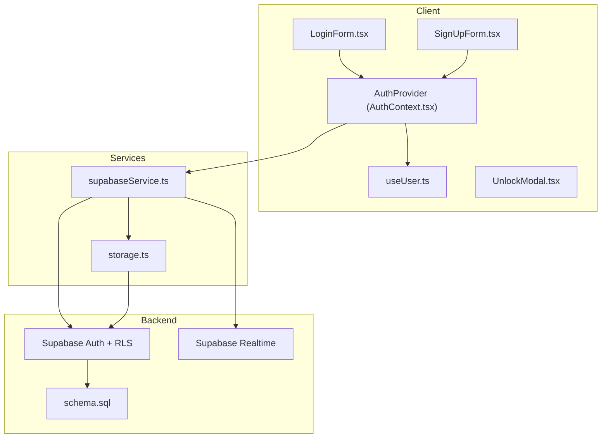
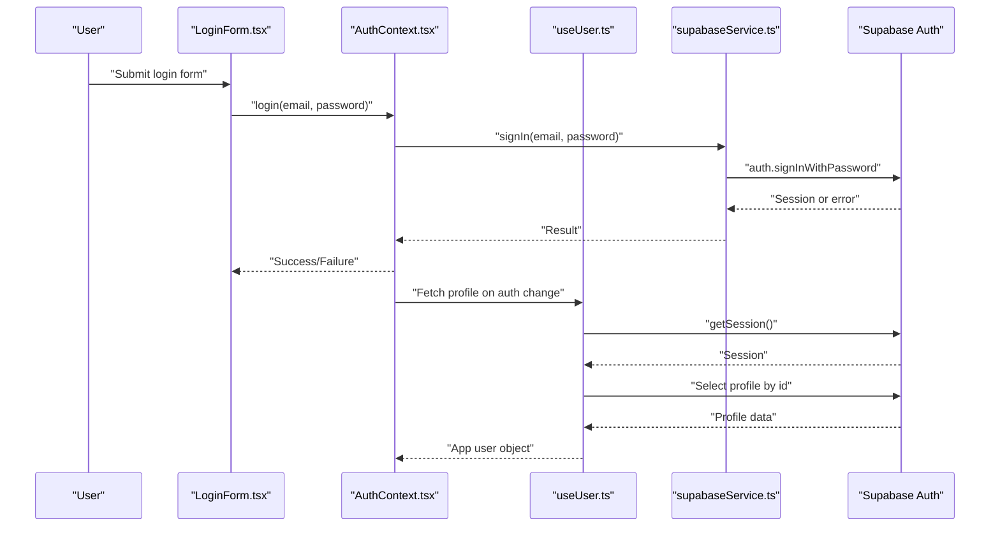
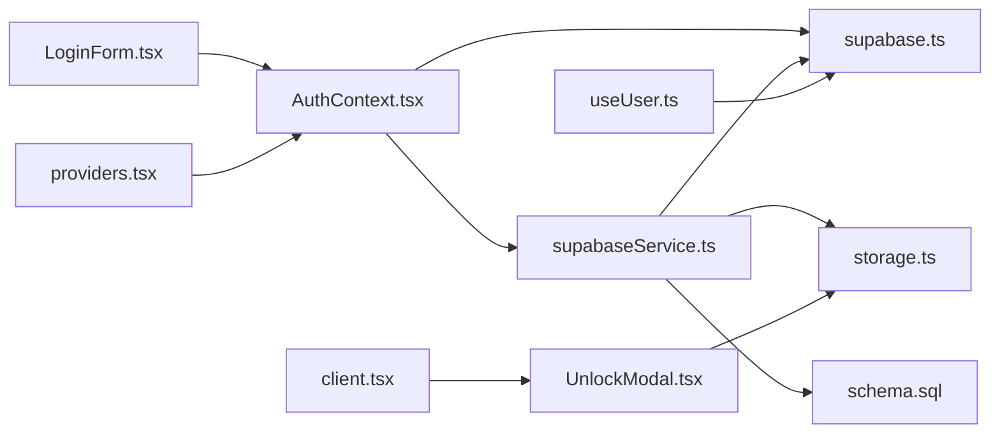

# Threat Mitigation and Monitoring

<cite>
**Referenced Files in This Document**
- [supabase.ts](file://src/lib/supabase.ts)
- [AuthContext.tsx](file://src/context/AuthContext.tsx)
- [LoginForm.tsx](file://src/components/auth/LoginForm.tsx)
- [SignUpForm.tsx](file://src/components/auth/SignUpForm.tsx)
- [storage.ts](file://src/lib/storage.ts)
- [supabaseService.ts](file://src/services/supabaseService.ts)
- [schema.sql](file://supabase/schema.sql)
- [SecurityAlert.tsx](file://src/components/chat/SecurityAlert.tsx)
- [UnlockModal.tsx](file://src/components/UnlockModal.tsx)
- [client.tsx](file://src/app/property/[id]/client.tsx)
- [useUser.ts](file://src/hooks/useUser.ts)
- [providers.tsx](file://src/app/providers.tsx)
- [index.ts](file://src/types/index.ts)
- [package.json](file://package.json)
</cite>

## Table of Contents
1. [Introduction](#introduction)
2. [Project Structure](#project-structure)
3. [Core Components](#core-components)
4. [Architecture Overview](#architecture-overview)
5. [Detailed Component Analysis](#detailed-component-analysis)
6. [Dependency Analysis](#dependency-analysis)
7. [Performance Considerations](#performance-considerations)
8. [Troubleshooting Guide](#troubleshooting-guide)
9. [Conclusion](#conclusion)
10. [Appendices](#appendices)

## Introduction
This document provides a comprehensive guide to threat mitigation and monitoring for Gamasa Properties. It focuses on security monitoring implementation, threat detection mechanisms, and incident response procedures tailored to the current codebase. It also explains rate limiting strategies, brute force attack prevention, suspicious activity detection, security logging practices, anomaly detection, and automated security alerts. Practical examples are included for implementing CAPTCHA systems, IP blocking mechanisms, and account lockout policies. Finally, it outlines guidelines for security event logging, monitoring dashboard implementation, and establishing security incident response workflows.

## Project Structure
Gamasa Properties is a Next.js application with a Supabase backend. Authentication is handled via Supabase Auth, while Supabase Realtime and Row Level Security (RLS) policies govern data access and real-time messaging. Local storage is used for mock mode and client-side caching. The authentication flow integrates with Supabase Auth and exposes a simplified provider for UI components.

**Diagram sources**
- [LoginForm.tsx](file://src/components/auth/LoginForm.tsx#L1-L220)
- [SignUpForm.tsx](file://src/components/auth/SignUpForm.tsx#L1-L274)
- [AuthContext.tsx](file://src/context/AuthContext.tsx#L1-L195)
- [useUser.ts](file://src/hooks/useUser.ts#L1-L178)
- [supabaseService.ts](file://src/services/supabaseService.ts#L1-L800)
- [storage.ts](file://src/lib/storage.ts#L1-L633)
- [supabase.ts](file://src/lib/supabase.ts#L1-L68)
- [schema.sql](file://supabase/schema.sql#L1-L416)

**Section sources**
- [supabase.ts](file://src/lib/supabase.ts#L1-L68)
- [AuthContext.tsx](file://src/context/AuthContext.tsx#L1-L195)
- [LoginForm.tsx](file://src/components/auth/LoginForm.tsx#L1-L220)
- [SignUpForm.tsx](file://src/components/auth/SignUpForm.tsx#L1-L274)
- [storage.ts](file://src/lib/storage.ts#L1-L633)
- [supabaseService.ts](file://src/services/supabaseService.ts#L1-L800)
- [schema.sql](file://supabase/schema.sql#L1-L416)

## Core Components
- Supabase client initialization and environment checks
- Authentication provider with mock mode support
- Login and registration forms
- Messaging and security awareness UI
- Property unlocking flow with receipts
- Types and constants for roles, notifications, and contracts
- Supabase schema with RLS policies and triggers

Security-relevant highlights:
- Supabase Auth integration for login/register
- Supabase RLS policies for data isolation
- Supabase Realtime publication for messages
- Local storage usage for mock mode and client-side state
- Property unlocking requiring payment verification

**Section sources**
- [supabase.ts](file://src/lib/supabase.ts#L1-L68)
- [AuthContext.tsx](file://src/context/AuthContext.tsx#L1-L195)
- [LoginForm.tsx](file://src/components/auth/LoginForm.tsx#L1-L220)
- [SignUpForm.tsx](file://src/components/auth/SignUpForm.tsx#L1-L274)
- [SecurityAlert.tsx](file://src/components/chat/SecurityAlert.tsx#L1-L13)
- [UnlockModal.tsx](file://src/components/UnlockModal.tsx#L1-L32)
- [client.tsx](file://src/app/property/[id]/client.tsx#L195-L214)
- [index.ts](file://src/types/index.ts#L1-L237)
- [schema.sql](file://supabase/schema.sql#L1-L416)

## Architecture Overview
The system leverages Supabase for authentication, authorization, and data persistence. RLS policies restrict data access per user, and triggers automatically manage related records. Realtime subscriptions enable live messaging. Client-side components integrate with Supabase Auth and services for secure operations.

**Diagram sources**
- [LoginForm.tsx](file://src/components/auth/LoginForm.tsx#L1-L220)
- [AuthContext.tsx](file://src/context/AuthContext.tsx#L1-L195)
- [useUser.ts](file://src/hooks/useUser.ts#L1-L178)
- [supabaseService.ts](file://src/services/supabaseService.ts#L153-L202)
- [supabase.ts](file://src/lib/supabase.ts#L1-L68)

## Detailed Component Analysis

### Authentication and Session Management
- Supabase client initialization enforces environment variable presence and enables auto-refresh and session persistence.
- Auth provider supports mock mode and integrates with Supabase Auth for login/register.
- useUser hook listens to Supabase auth state changes and loads user profile data.

Security implications:
- Auto-refresh and persisted sessions improve UX but require robust token validation and short-lived sessions.
- Auth state listeners ensure UI reflects current session state.

Recommendations:
- Enforce strong password policies and two-factor authentication at the Supabase level.
- Monitor failed login attempts and implement adaptive rate limiting.

**Section sources**
- [supabase.ts](file://src/lib/supabase.ts#L1-L68)
- [AuthContext.tsx](file://src/context/AuthContext.tsx#L1-L195)
- [useUser.ts](file://src/hooks/useUser.ts#L1-L178)

### Login and Registration Forms
- LoginForm captures credentials and delegates to AuthContext for sign-in.
- SignUpForm validates terms and delegates to AuthContext for registration.

Security implications:
- Client-side validation is present; server-side validation and rate limiting are essential.
- Terms acceptance is enforced before submission.

Recommendations:
- Implement CAPTCHA for both login and registration.
- Apply IP-based rate limits and account lockout after repeated failures.
- Log all authentication attempts with risk scoring.

**Section sources**
- [LoginForm.tsx](file://src/components/auth/LoginForm.tsx#L1-L220)
- [SignUpForm.tsx](file://src/components/auth/SignUpForm.tsx#L1-L274)
- [AuthContext.tsx](file://src/context/AuthContext.tsx#L1-L195)

### Messaging and Security Awareness
- SecurityAlert component displays platform security guidance to users.
- PropertyContextHeader includes a user block action for administrators.

Security implications:
- Educating users reduces social engineering risks.
- Administrative controls enable user management actions.

Recommendations:
- Integrate CAPTCHA for sensitive actions (reporting, blocking).
- Add behavioral analytics to flag suspicious activities.

**Section sources**
- [SecurityAlert.tsx](file://src/components/chat/SecurityAlert.tsx#L1-L13)
- [client.tsx](file://src/app/property/[id]/client.tsx#L225-L238)

### Property Unlocking and Receipt Handling
- UnlockModal handles receipt uploads and property unlocking.
- The flow requires payment verification before unlocking.

Security implications:
- Receipt verification is crucial to prevent fraud.
- Storage bucket access should be restricted and monitored.

Recommendations:
- Implement CAPTCHA for unlock requests.
- Add IP and rate limits per property and user.
- Store receipts securely and scan for malicious content.

**Section sources**
- [UnlockModal.tsx](file://src/components/UnlockModal.tsx#L1-L32)
- [client.tsx](file://src/app/property/[id]/client.tsx#L195-L214)
- [storage.ts](file://src/lib/storage.ts#L44-L67)

### Supabase Schema, RLS, and Realtime
- RLS policies enforce data isolation for profiles, properties, bookings, payment requests, reviews, notifications, favorites, and unlocked properties.
- Triggers manage profile creation and updated timestamps.
- Realtime publication is enabled for messages.

Security implications:
- RLS prevents unauthorized data access.
- Triggers ensure audit trails and data integrity.
- Realtime requires careful policy management to avoid leaks.

Recommendations:
- Regularly review and test RLS policies.
- Monitor Realtime subscriptions for anomalies.
- Enable Supabase Auditing and Logging.

**Section sources**
- [schema.sql](file://supabase/schema.sql#L170-L416)

### Client-Side Storage and Mock Mode
- storage.ts manages local storage keys and mock mode fallbacks.
- AuthContext supports mock mode for development.

Security implications:
- Local storage is client-side and not suitable for secrets.
- Mock mode simplifies development but must not be used in production.

Recommendations:
- Avoid storing sensitive data in local storage.
- Disable mock mode in production builds.

**Section sources**
- [storage.ts](file://src/lib/storage.ts#L1-L633)
- [AuthContext.tsx](file://src/context/AuthContext.tsx#L1-L195)

### Types and Contracts
- index.ts defines roles, notifications, contracts, and constants.
- Roles include landlord, tenant, and admin.

Security implications:
- Role-based access controls should align with RLS policies.
- Contract definitions support legal and financial compliance.

Recommendations:
- Enforce role checks on all privileged operations.
- Log role changes and administrative actions.

**Section sources**
- [index.ts](file://src/types/index.ts#L1-L237)

## Dependency Analysis
The application depends on Supabase for authentication, authorization, and data services. Client-side components depend on the Supabase client and services.

**Diagram sources**
- [LoginForm.tsx](file://src/components/auth/LoginForm.tsx#L1-L220)
- [AuthContext.tsx](file://src/context/AuthContext.tsx#L1-L195)
- [supabase.ts](file://src/lib/supabase.ts#L1-L68)
- [supabaseService.ts](file://src/services/supabaseService.ts#L1-L800)
- [storage.ts](file://src/lib/storage.ts#L1-L633)
- [schema.sql](file://supabase/schema.sql#L1-L416)
- [UnlockModal.tsx](file://src/components/UnlockModal.tsx#L1-L32)
- [client.tsx](file://src/app/property/[id]/client.tsx#L195-L214)
- [providers.tsx](file://src/app/providers.tsx#L1-L18)
- [useUser.ts](file://src/hooks/useUser.ts#L1-L178)

**Section sources**
- [package.json](file://package.json#L1-L42)
- [supabase.ts](file://src/lib/supabase.ts#L1-L68)
- [supabaseService.ts](file://src/services/supabaseService.ts#L1-L800)
- [storage.ts](file://src/lib/storage.ts#L1-L633)
- [schema.sql](file://supabase/schema.sql#L1-L416)

## Performance Considerations
- Supabase RLS adds minimal overhead; ensure indexes on frequently queried columns.
- Realtime subscriptions should be scoped to reduce bandwidth.
- Client-side caching via local storage improves responsiveness but must not compromise security.

[No sources needed since this section provides general guidance]

## Troubleshooting Guide
Common issues and resolutions:
- Missing Supabase environment variables cause warnings during initialization. Ensure NEXT_PUBLIC_SUPABASE_URL and NEXT_PUBLIC_SUPABASE_ANON_KEY are configured.
- Authentication failures should be logged with user agent, IP, and timestamp for forensic analysis.
- Realtime subscription errors indicate policy misconfiguration or network issues.

Recommendations:
- Implement structured logging for authentication events.
- Use Supabase Analytics and Logs to monitor anomalies.
- Set up automated alerts for unusual spikes in failed logins.

**Section sources**
- [supabase.ts](file://src/lib/supabase.ts#L1-L68)

## Conclusion
Gamasa Properties leverages Supabase for authentication, authorization, and data management. The current implementation includes RLS policies, triggers, and Realtime subscriptions that form a solid foundation for security. To strengthen threat mitigation and monitoring, integrate rate limiting, CAPTCHA, IP blocking, and account lockout mechanisms. Establish comprehensive logging, anomaly detection, and automated alerts. Implement robust incident response workflows and continuously review policies and configurations.

[No sources needed since this section summarizes without analyzing specific files]

## Appendices

### Rate Limiting Strategies
- Login attempts: Limit per IP and per user; apply exponential backoff.
- Registration attempts: Apply CAPTCHA and IP throttling.
- Property unlocking: Per-user and per-property limits with CAPTCHA.
- Messaging: Rate limits per conversation and user.

[No sources needed since this section provides general guidance]

### Brute Force Attack Prevention
- Enforce minimum password length and complexity.
- Implement temporary account lockout after N failed attempts.
- Use adaptive rate limiting based on risk scoring.
- Monitor and alert on geographic anomalies.

[No sources needed since this section provides general guidance]

### Suspicious Activity Detection
- Monitor login locations and devices.
- Detect rapid successive failed attempts.
- Flag bulk property queries or downloads.
- Track receipt uploads and unlock patterns.

[No sources needed since this section provides general guidance]

### Security Logging Practices
- Log all authentication events (success/failure, IP, user agent, timestamp).
- Record administrative actions and role changes.
- Capture property unlocking and payment verification events.
- Retain logs for compliance and forensics.

[No sources needed since this section provides general guidance]

### Anomaly Detection and Automated Alerts
- Use Supabase Analytics to track unusual patterns.
- Configure alerts for spikes in failed logins or unlock attempts.
- Integrate with external SIEM for centralized monitoring.

[No sources needed since this section provides general guidance]

### Implementing CAPTCHA Systems
- Use a managed CAPTCHA service for login and registration forms.
- Apply CAPTCHA for property unlocking and sensitive actions.
- Enforce CAPTCHA challenges after threshold breaches.

[No sources needed since this section provides general guidance]

### IP Blocking Mechanisms
- Block IPs with excessive failed attempts.
- Maintain allow/deny lists for known threats.
- Rotate blocks periodically and review appeals.

[No sources needed since this section provides general guidance]

### Account Lockout Policies
- Automatic lockout after N failed attempts.
- Temporary lockout duration with reset mechanism.
- Notify users and provide recovery options.

[No sources needed since this section provides general guidance]

### Security Event Logging Guidelines
- Define standardized event schemas for authentication, access, and administrative actions.
- Include contextual data (IP, user agent, device fingerprint).
- Ensure logs are tamper-evident and retained per policy.

[No sources needed since this section provides general guidance]

### Monitoring Dashboard Implementation
- Dashboard widgets for login trends, unlock volumes, and anomaly counts.
- Realtime alerts and drill-down capabilities.
- Integration with internal communication channels.

[No sources needed since this section provides general guidance]

### Security Incident Response Workflows
- Define escalation paths and roles.
- Automate initial containment (IP blocks, rate limits).
- Coordinate with legal and compliance teams.
- Conduct post-incident reviews and remediation.

[No sources needed since this section provides general guidance]