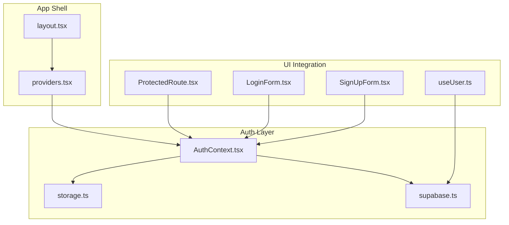
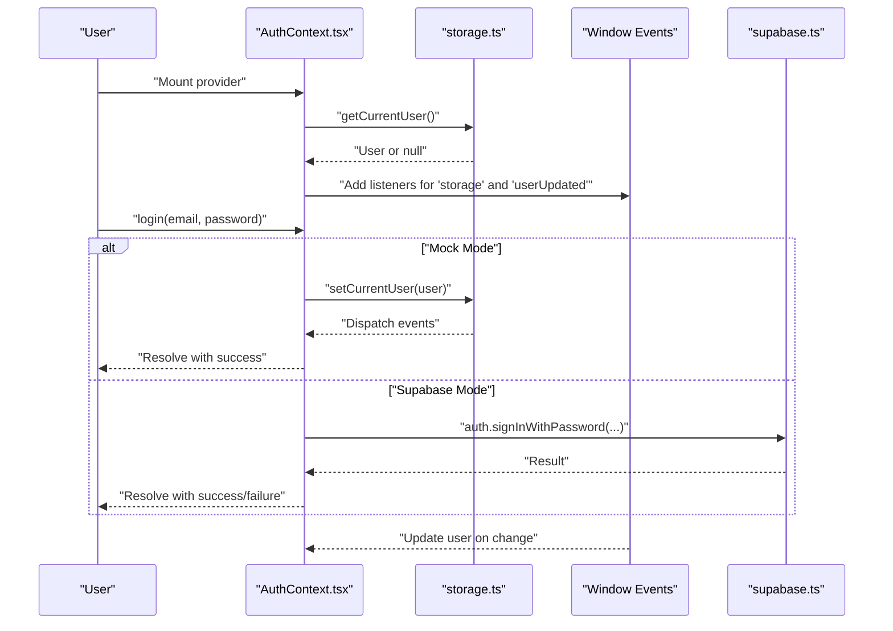
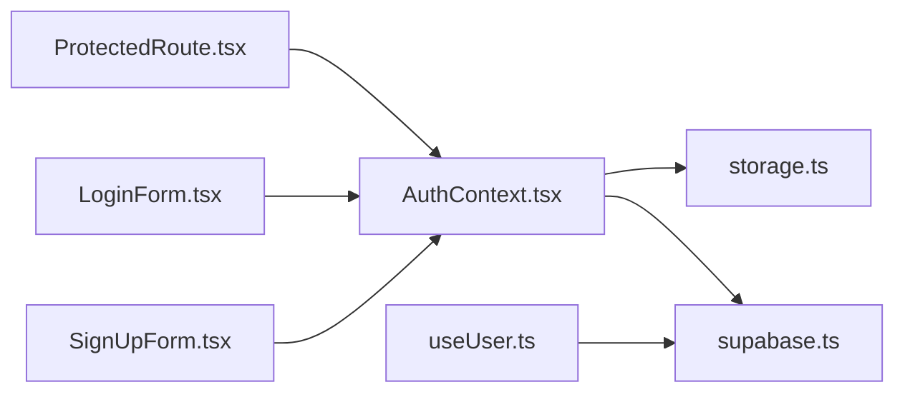

# Auth Context Provider

<cite>
**Referenced Files in This Document**
- [AuthContext.tsx](file://src/context/AuthContext.tsx)
- [providers.tsx](file://src/app/providers.tsx)
- [supabase.ts](file://src/lib/supabase.ts)
- [storage.ts](file://src/lib/storage.ts)
- [useUser.ts](file://src/hooks/useUser.ts)
- [index.ts](file://src/types/index.ts)
- [LoginForm.tsx](file://src/components/auth/LoginForm.tsx)
- [SignUpForm.tsx](file://src/components/auth/SignUpForm.tsx)
- [ProtectedRoute.tsx](file://src/components/ProtectedRoute.tsx)
- [AuthLoading.tsx](file://src/components/AuthLoading.tsx)
- [layout.tsx](file://src/app/layout.tsx)
- [supabaseService.ts](file://src/services/supabaseService.ts)
- [package.json](file://package.json)
</cite>

## Table of Contents
1. [Introduction](#introduction)
2. [Project Structure](#project-structure)
3. [Core Components](#core-components)
4. [Architecture Overview](#architecture-overview)
5. [Detailed Component Analysis](#detailed-component-analysis)
6. [Dependency Analysis](#dependency-analysis)
7. [Performance Considerations](#performance-considerations)
8. [Troubleshooting Guide](#troubleshooting-guide)
9. [Conclusion](#conclusion)
10. [Appendices](#appendices)

## Introduction
This document explains the Auth Context Provider implementation used by Gamasa Properties. It covers the React Context pattern, dual-mode authentication (mock and Supabase), user state management, initialization and hydration from storage, cross-tab synchronization, and error handling. It also provides practical usage patterns for wrapping applications, integrating with protected routes, and working with authentication-aware components.

## Project Structure
The authentication system spans several layers:
- Application shell wraps the entire app with providers.
- AuthProvider exposes authentication state and methods via React Context.
- Local storage utilities manage user hydration and cross-tab sync.
- Supabase client provides backend authentication when enabled.
- Additional hooks and services support Supabase-based user profiles and flows.

**Diagram sources**
- [layout.tsx](file://src/app/layout.tsx#L64-L89)
- [providers.tsx](file://src/app/providers.tsx#L7-L17)
- [AuthContext.tsx](file://src/context/AuthContext.tsx#L22-L186)
- [storage.ts](file://src/lib/storage.ts#L1-L633)
- [supabase.ts](file://src/lib/supabase.ts#L1-L68)
- [ProtectedRoute.tsx](file://src/components/ProtectedRoute.tsx#L8-L30)
- [LoginForm.tsx](file://src/components/auth/LoginForm.tsx#L7-L46)
- [SignUpForm.tsx](file://src/components/auth/SignUpForm.tsx#L7-L49)
- [useUser.ts](file://src/hooks/useUser.ts#L37-L176)

**Section sources**
- [layout.tsx](file://src/app/layout.tsx#L64-L89)
- [providers.tsx](file://src/app/providers.tsx#L7-L17)

## Core Components
- AuthProvider: Creates and manages the authentication context, initializes user state from storage, listens for cross-tab changes, and exposes login/register/logout methods.
- useAuth: Hook to consume the AuthContext safely.
- storage utilities: Provide getItem/setItem wrappers, dispatch events for cross-tab sync, and manage the current user record.
- supabase client: Provides authentication APIs and session management when not in mock mode.
- useUser hook: Manages Supabase-based user profiles and auth state changes.

Key responsibilities:
- Dual-mode support: Mock mode reads/writes users in localStorage; Supabase mode integrates with Supabase auth.
- Cross-tab synchronization: Listens to storage and userUpdated events to keep tabs in sync.
- Hydration: Loads user from localStorage on startup; falls back to Supabase when configured.
- Error handling: Clears corrupted data, logs errors, and returns safe defaults.

**Section sources**
- [AuthContext.tsx](file://src/context/AuthContext.tsx#L11-L195)
- [storage.ts](file://src/lib/storage.ts#L18-L40)
- [supabase.ts](file://src/lib/supabase.ts#L1-L68)
- [useUser.ts](file://src/hooks/useUser.ts#L37-L176)

## Architecture Overview
The AuthProvider orchestrates authentication state and integrates with local storage and Supabase. Components use the useAuth hook to access user state and authentication actions. ProtectedRoute enforces authentication for sensitive pages.

**Diagram sources**
- [AuthContext.tsx](file://src/context/AuthContext.tsx#L22-L186)
- [storage.ts](file://src/lib/storage.ts#L18-L40)
- [supabase.ts](file://src/lib/supabase.ts#L1-L68)

## Detailed Component Analysis

### AuthProvider and Context Value
AuthContext defines the context shape and exposes:
- user: Current user object or null
- loading: Initialization/loading state
- login: Authenticates with either mock or Supabase
- register: Registers a new user in mock mode; returns false in Supabase mode
- logout: Clears current user and signs out from Supabase if enabled
- isAuthenticated: Boolean derived from presence of user

Initialization and hydration:
- On mount, attempts to hydrate from localStorage; if none, sets loading to false and user to null
- Adds event listeners for storage and userUpdated to synchronize state across tabs
- Cleans up listeners on unmount

Mock vs Supabase login:
- Mock mode: Validates credentials against stored users and saves the hydrated user
- Supabase mode: Calls Supabase auth; returns a boolean indicating completion

Mock vs Supabase registration:
- Mock mode: Validates uniqueness, constructs a new user, persists to localStorage, and hydrates
- Supabase mode: Returns false (registration handled elsewhere)

Logout:
- Clears current user from storage and triggers Supabase sign-out if enabled, then redirects to home

**Section sources**
- [AuthContext.tsx](file://src/context/AuthContext.tsx#L11-L195)
- [storage.ts](file://src/lib/storage.ts#L294-L300)
- [supabase.ts](file://src/lib/supabase.ts#L1-L68)

### Cross-tab Synchronization
The provider listens to:
- storage: Fired when another tab modifies localStorage keys (e.g., gamasa_current_user)
- userUpdated: Fired locally when setCurrentUser is called

These listeners ensure that when a user logs in/out or changes their profile in one tab, other tabs reflect the change immediately.

**Section sources**
- [AuthContext.tsx](file://src/context/AuthContext.tsx#L58-L78)
- [storage.ts](file://src/lib/storage.ts#L32-L39)

### Protected Routes Integration
ProtectedRoute checks authentication state and redirects unauthenticated users to the login page with a redirect parameter. While loading, it renders a loading component.

Usage pattern:
- Wrap route segments that require authentication with ProtectedRoute
- Access isAuthenticated and loading from useAuth inside ProtectedRoute to decide behavior

**Section sources**
- [ProtectedRoute.tsx](file://src/components/ProtectedRoute.tsx#L8-L30)
- [AuthLoading.tsx](file://src/components/AuthLoading.tsx#L3-L12)

### Authentication Forms Integration
LoginForm and SignUpForm consume useAuth to trigger authentication actions. They handle form submission, loading states, and error messages.

Notes:
- LoginForm expects signIn and social methods from useAuth
- SignUpForm expects signUp and social methods from useAuth

Ensure your AuthProvider exposes these methods consistently.

**Section sources**
- [LoginForm.tsx](file://src/components/auth/LoginForm.tsx#L17-L46)
- [SignUpForm.tsx](file://src/components/auth/SignUpForm.tsx#L13-L49)

### Supabase Integration (Alternative Hook)
While the AuthProvider supports dual modes, the project also includes a dedicated useUser hook that integrates with Supabase for profile management and auth state changes. This hook:
- Subscribes to Supabase auth state changes
- Fetches user profile data from the profiles table
- Provides refreshUser to reload profile data

This is useful for components that need Supabase-backed user data rather than the simplified mock user model.

**Section sources**
- [useUser.ts](file://src/hooks/useUser.ts#L37-L176)
- [supabase.ts](file://src/lib/supabase.ts#L1-L68)

### Types and Models
The User type used by the AuthProvider aligns with the application’s internal user model. It includes identifiers, roles, preferences, and timestamps.

**Section sources**
- [index.ts](file://src/types/index.ts#L56-L70)

## Dependency Analysis
The AuthProvider depends on:
- storage.ts for hydration and persistence
- supabase.ts for Supabase authentication when enabled
- React Context for state distribution

ProtectedRoute and forms depend on useAuth to enforce authentication and trigger actions.

**Diagram sources**
- [AuthContext.tsx](file://src/context/AuthContext.tsx#L3-L6)
- [storage.ts](file://src/lib/storage.ts#L1-L6)
- [supabase.ts](file://src/lib/supabase.ts#L1-L6)
- [ProtectedRoute.tsx](file://src/components/ProtectedRoute.tsx#L3)
- [LoginForm.tsx](file://src/components/auth/LoginForm.tsx#L4)
- [SignUpForm.tsx](file://src/components/auth/SignUpForm.tsx#L4)
- [useUser.ts](file://src/hooks/useUser.ts#L4-L5)

**Section sources**
- [AuthContext.tsx](file://src/context/AuthContext.tsx#L3-L6)
- [storage.ts](file://src/lib/storage.ts#L1-L6)
- [supabase.ts](file://src/lib/supabase.ts#L1-L6)
- [ProtectedRoute.tsx](file://src/components/ProtectedRoute.tsx#L3)
- [LoginForm.tsx](file://src/components/auth/LoginForm.tsx#L4)
- [SignUpForm.tsx](file://src/components/auth/SignUpForm.tsx#L4)
- [useUser.ts](file://src/hooks/useUser.ts#L4-L5)

## Performance Considerations
- Minimize re-renders by keeping the AuthProvider near the root and consuming useAuth selectively.
- Avoid heavy computations in the hydration path; rely on localStorage reads/writes.
- Debounce or batch UI updates when reacting to storage events if needed.
- Prefer lazy initialization of Supabase-dependent features to reduce initial overhead.

## Troubleshooting Guide
Common issues and resolutions:
- Missing environment variables for Supabase:
  - Symptom: Warning about missing Supabase environment variables during runtime.
  - Resolution: Add NEXT_PUBLIC_SUPABASE_URL and NEXT_PUBLIC_SUPABASE_ANON_KEY to your environment configuration.
  - Reference: [supabase.ts](file://src/lib/supabase.ts#L7-L15)

- Corrupted user data in localStorage:
  - Symptom: AuthProvider fails to hydrate user or throws errors.
  - Resolution: The provider clears corrupted gamasa_current_user entries and resets state to null.
  - Reference: [AuthContext.tsx](file://src/context/AuthContext.tsx#L44-L51)

- Cross-tab desync:
  - Symptom: Tabs show inconsistent user state after login/logout.
  - Resolution: Ensure storage and userUpdated listeners are active; verify localStorage availability.
  - Reference: [AuthContext.tsx](file://src/context/AuthContext.tsx#L58-L78), [storage.ts](file://src/lib/storage.ts#L32-L39)

- Supabase integration not working:
  - Symptom: Supabase login/register appears disabled or returns false.
  - Resolution: Verify environment variables and that the provider is not forced into mock mode.
  - Reference: [AuthContext.tsx](file://src/context/AuthContext.tsx#L96-L114), [supabase.ts](file://src/lib/supabase.ts#L1-L68)

**Section sources**
- [supabase.ts](file://src/lib/supabase.ts#L7-L15)
- [AuthContext.tsx](file://src/context/AuthContext.tsx#L44-L51)
- [AuthContext.tsx](file://src/context/AuthContext.tsx#L58-L78)
- [storage.ts](file://src/lib/storage.ts#L32-L39)
- [AuthContext.tsx](file://src/context/AuthContext.tsx#L96-L114)

## Conclusion
The Auth Context Provider delivers a robust, dual-mode authentication solution tailored for Gamasa Properties. It seamlessly switches between mock and Supabase modes, maintains consistent user state across tabs, and integrates cleanly with protected routes and authentication forms. By following the recommended usage patterns and troubleshooting steps, teams can reliably implement secure, scalable authentication flows.

## Appendices

### Practical Usage Examples

- Wrapping the application with providers:
  - Ensure Providers wraps your root layout and includes AuthProvider.
  - Reference: [layout.tsx](file://src/app/layout.tsx#L82-L85), [providers.tsx](file://src/app/providers.tsx#L7-L17)

- Consuming authentication state in components:
  - Use useAuth to access user, loading, login, register, logout, and isAuthenticated.
  - Reference: [AuthContext.tsx](file://src/context/AuthContext.tsx#L188-L194)

- Protecting routes:
  - Wrap route segments with ProtectedRoute to enforce authentication.
  - Reference: [ProtectedRoute.tsx](file://src/components/ProtectedRoute.tsx#L8-L30)

- Using Supabase-backed user data:
  - Use useUser for Supabase session and profile management.
  - Reference: [useUser.ts](file://src/hooks/useUser.ts#L37-L176)

- Environment configuration:
  - Configure Supabase environment variables for production.
  - Reference: [supabase.ts](file://src/lib/supabase.ts#L4-L15)