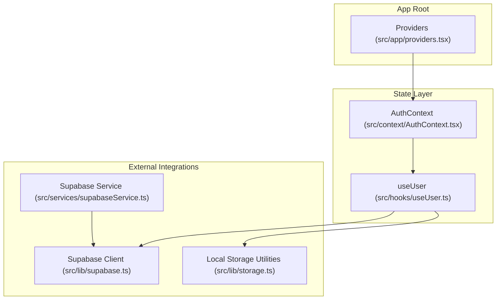
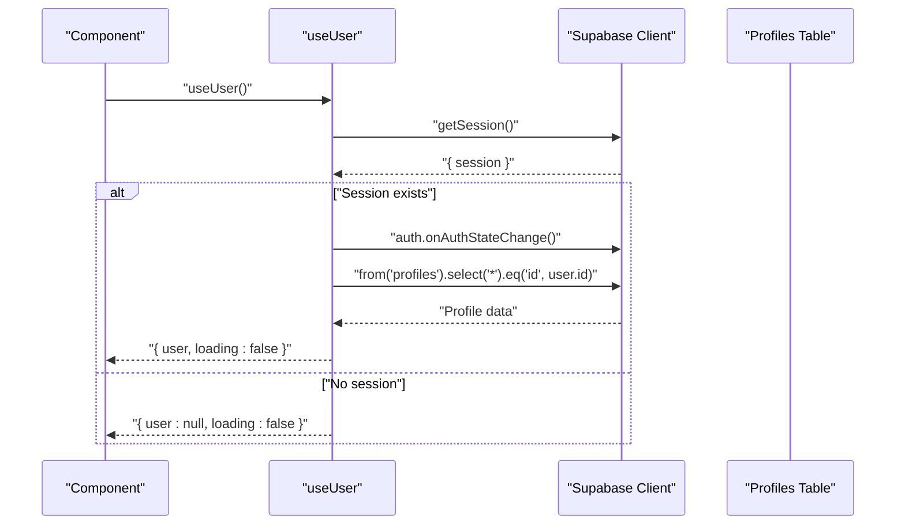
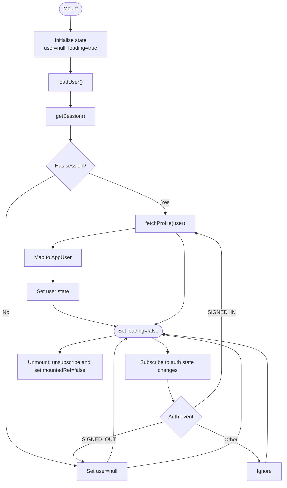
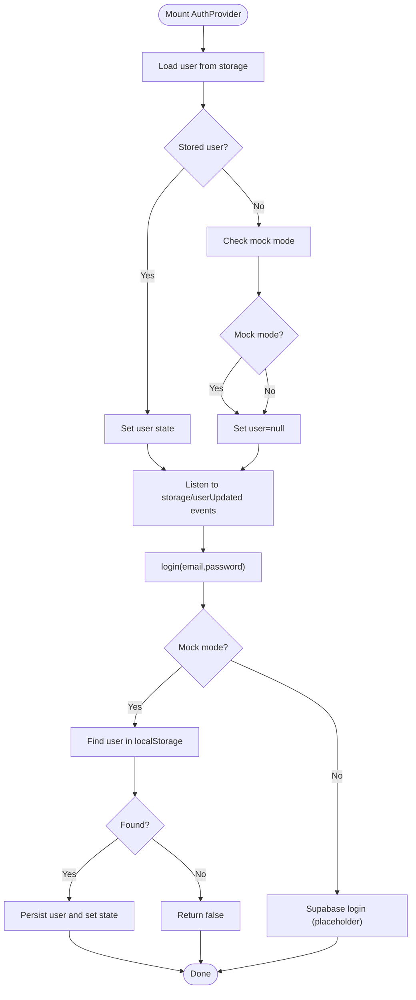
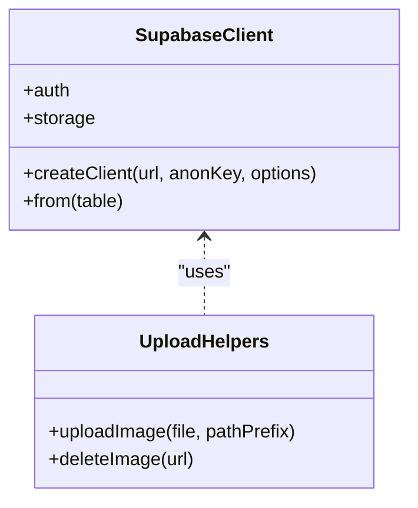
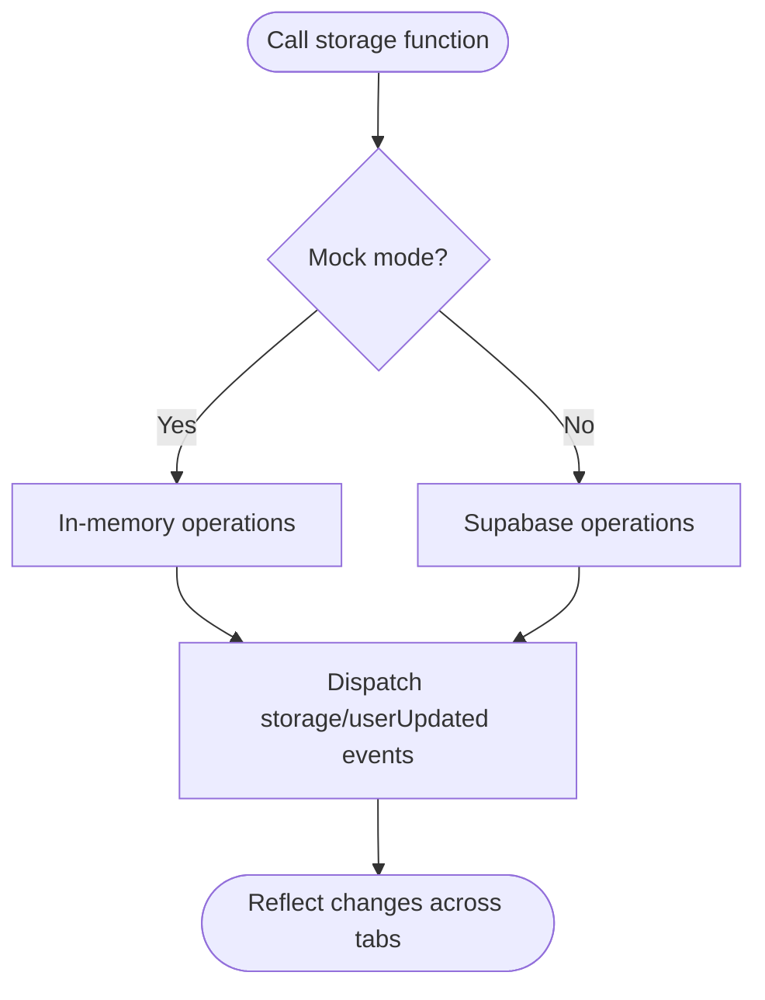
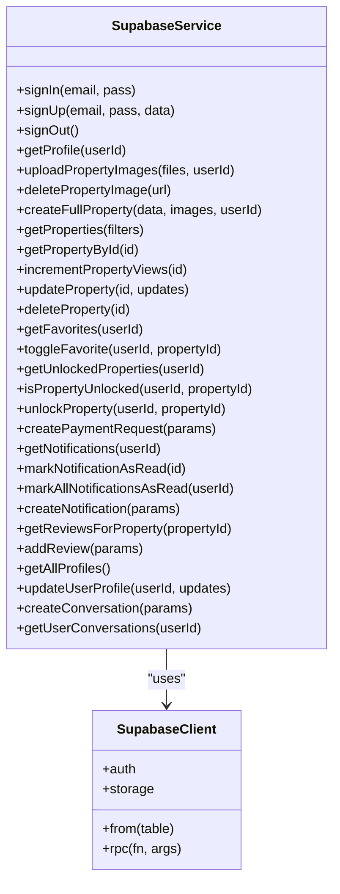
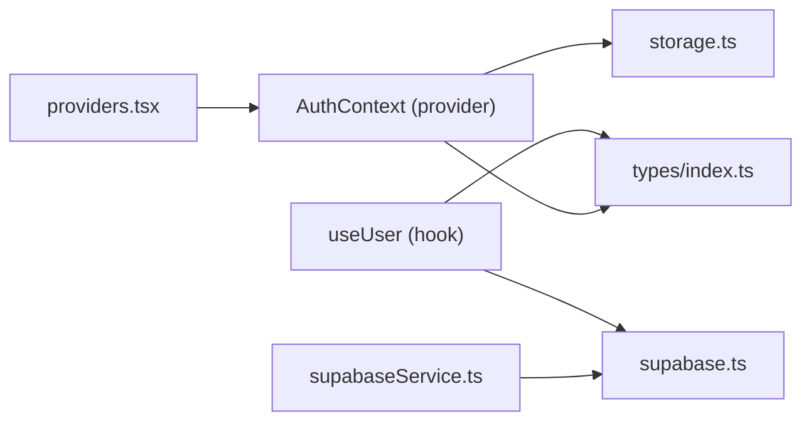

# Custom Hooks Patterns

<cite>
**Referenced Files in This Document**
- [useUser.ts](file://src/hooks/useUser.ts)
- [AuthContext.tsx](file://src/context/AuthContext.tsx)
- [supabase.ts](file://src/lib/supabase.ts)
- [storage.ts](file://src/lib/storage.ts)
- [supabaseService.ts](file://src/services/supabaseService.ts)
- [providers.tsx](file://src/app/providers.tsx)
- [index.ts](file://src/types/index.ts)
- [common-patterns.md](file://.agent/skills/frontend-dev-guidelines/resources/common-patterns.md)
- [react-patterns.md](file://.agent/skills/react-patterns/SKILL.md)
- [rerender-functional-setstate.md](file://.agent/skills/react-best-practices/rules/rerender-functional-setstate.md)
- [rerender-lazy-state-init.md](file://.agent/skills/react-best-practices/rules/rerender-lazy-state-init.md)
- [js-cache-function-results.md](file://.agent/skills/react-best-practices/rules/js-cache-function-results.md)
- [package.json](file://package.json)
</cite>

## Table of Contents
1. [Introduction](#introduction)
2. [Project Structure](#project-structure)
3. [Core Components](#core-components)
4. [Architecture Overview](#architecture-overview)
5. [Detailed Component Analysis](#detailed-component-analysis)
6. [Dependency Analysis](#dependency-analysis)
7. [Performance Considerations](#performance-considerations)
8. [Troubleshooting Guide](#troubleshooting-guide)
9. [Conclusion](#conclusion)
10. [Appendices](#appendices)

## Introduction
This document explains the custom hook patterns used for state management in Gamasa Properties, focusing on the useUser hook, hook composition, and state extraction strategies. It also covers naming conventions, dependency management, return value structures, reusability, performance optimization via memoization, lifecycle management, debugging techniques, and integration with external state sources such as Supabase. Practical examples demonstrate how to create custom hooks for different state domains and outlines testing strategies and best practices.

## Project Structure
Gamasa Properties organizes state-related code primarily under src/hooks, src/context, src/lib, and src/services. The Next.js app provider composes AuthProvider and theme providers at the root level to make authentication state globally available.

**Diagram sources**
- [providers.tsx](file://src/app/providers.tsx#L7-L17)
- [AuthContext.tsx](file://src/context/AuthContext.tsx#L22-L186)
- [useUser.ts](file://src/hooks/useUser.ts#L37-L176)
- [supabase.ts](file://src/lib/supabase.ts#L18-L28)
- [storage.ts](file://src/lib/storage.ts#L1-L633)
- [supabaseService.ts](file://src/services/supabaseService.ts#L1-L800)

**Section sources**
- [providers.tsx](file://src/app/providers.tsx#L1-L18)
- [AuthContext.tsx](file://src/context/AuthContext.tsx#L1-L195)
- [useUser.ts](file://src/hooks/useUser.ts#L1-L178)
- [supabase.ts](file://src/lib/supabase.ts#L1-L68)
- [storage.ts](file://src/lib/storage.ts#L1-L633)
- [supabaseService.ts](file://src/services/supabaseService.ts#L1-L800)

## Core Components
- useUser: A custom hook that loads and tracks the current authenticated user, synchronizes with Supabase auth state changes, and exposes loading and refresh capabilities.
- AuthContext: An alternative context-based authentication provider that manages user state locally and listens to storage events for cross-tab synchronization.
- Supabase integration: Centralized client creation and helper functions for image uploads and storage operations.
- Local storage utilities: A comprehensive library for mocking and persisting domain data (properties, users, notifications, etc.) with event-driven updates.

Key characteristics:
- Hook naming convention: Custom hooks start with "use".
- Return value structure: Objects with typed fields (e.g., user, loading, refreshUser).
- Dependency management: useCallback and useEffect with explicit dependency arrays; mountedRef to prevent state updates after unmount.
- Composition: useUser composes Supabase auth and profile retrieval; AuthContext composes local storage and mock mode logic.

**Section sources**
- [useUser.ts](file://src/hooks/useUser.ts#L37-L176)
- [AuthContext.tsx](file://src/context/AuthContext.tsx#L22-L194)
- [supabase.ts](file://src/lib/supabase.ts#L18-L28)
- [storage.ts](file://src/lib/storage.ts#L1-L633)

## Architecture Overview
The state architecture blends Supabase-backed server state with local client state. Authentication state is handled either by Supabase (via useUser) or by a hybrid/local context (AuthContext). Domain data (properties, users, notifications) is managed through local storage utilities with optional mock mode and Supabase fallbacks.

**Diagram sources**
- [useUser.ts](file://src/hooks/useUser.ts#L110-L168)
- [supabase.ts](file://src/lib/supabase.ts#L18-L28)

**Section sources**
- [useUser.ts](file://src/hooks/useUser.ts#L37-L176)
- [supabase.ts](file://src/lib/supabase.ts#L1-L68)

## Detailed Component Analysis

### useUser Hook Analysis
The useUser hook encapsulates:
- State: user (AppUser or null), loading flag.
- Effects: initializes on mount, subscribes to Supabase auth state changes, and unsubscribes on cleanup.
- Helpers: fetchProfile (maps Supabase profile to AppUser), loadUser (retrieves session and profile), refreshUser (reloads user).
- Safety: mountedRef prevents state updates after unmount; error logging ensures graceful fallbacks.

**Diagram sources**
- [useUser.ts](file://src/hooks/useUser.ts#L138-L168)

**Section sources**
- [useUser.ts](file://src/hooks/useUser.ts#L37-L176)

### AuthContext Provider Analysis
AuthContext provides:
- State: user, loading.
- Lifecycle: loads persisted user on mount, listens to storage events for cross-tab updates.
- Authentication: supports mock mode (localStorage) and Supabase mode (placeholder).
- Methods: login, register, logout, isAuthenticated computed flag.

**Diagram sources**
- [AuthContext.tsx](file://src/context/AuthContext.tsx#L26-L115)

**Section sources**
- [AuthContext.tsx](file://src/context/AuthContext.tsx#L22-L194)

### Supabase Integration
Supabase client is created with environment variables and configured for automatic token refresh and session persistence. Additional helpers support image uploads and deletions via Supabase Storage.

**Diagram sources**
- [supabase.ts](file://src/lib/supabase.ts#L18-L67)

**Section sources**
- [supabase.ts](file://src/lib/supabase.ts#L1-L68)

### Local Storage Utilities
The storage library centralizes CRUD operations for domain entities (properties, users, notifications) with:
- Mock mode: in-memory fallbacks and mock data.
- Cross-tab synchronization: dispatches custom events to reflect changes across tabs.
- Mapping: converts between DB and app formats for properties.

**Diagram sources**
- [storage.ts](file://src/lib/storage.ts#L18-L40)

**Section sources**
- [storage.ts](file://src/lib/storage.ts#L1-L633)

### Supabase Service Layer
The service layer abstracts Supabase operations for properties, users, favorites, unlocked properties, payments, notifications, reviews, and messaging. It supports mock mode and integrates with the Supabase client.

**Diagram sources**
- [supabaseService.ts](file://src/services/supabaseService.ts#L153-L800)
- [supabase.ts](file://src/lib/supabase.ts#L18-L28)

**Section sources**
- [supabaseService.ts](file://src/services/supabaseService.ts#L1-L800)
- [supabase.ts](file://src/lib/supabase.ts#L1-L68)

## Dependency Analysis
- useUser depends on Supabase client and types; it returns a normalized AppUser shape compatible with the rest of the app.
- AuthContext depends on local storage utilities and types; it provides a simpler, context-based authentication surface.
- Supabase service depends on the Supabase client and exposes higher-level domain operations.
- The app root composes Providers to inject authentication and theming contexts.

**Diagram sources**
- [useUser.ts](file://src/hooks/useUser.ts#L3-L5)
- [AuthContext.tsx](file://src/context/AuthContext.tsx#L3-L6)
- [supabase.ts](file://src/lib/supabase.ts#L1-L68)
- [storage.ts](file://src/lib/storage.ts#L1-L3)
- [supabaseService.ts](file://src/services/supabaseService.ts#L1-L8)
- [providers.tsx](file://src/app/providers.tsx#L3-L5)
- [index.ts](file://src/types/index.ts#L1-L237)

**Section sources**
- [useUser.ts](file://src/hooks/useUser.ts#L1-L178)
- [AuthContext.tsx](file://src/context/AuthContext.tsx#L1-L195)
- [supabase.ts](file://src/lib/supabase.ts#L1-L68)
- [storage.ts](file://src/lib/storage.ts#L1-L633)
- [supabaseService.ts](file://src/services/supabaseService.ts#L1-L800)
- [providers.tsx](file://src/app/providers.tsx#L1-L18)
- [index.ts](file://src/types/index.ts#L1-L237)

## Performance Considerations
- Memoization and stable callbacks:
  - Use useCallback for derived computations and event handlers to avoid unnecessary re-renders.
  - Use functional setState updates to prevent stale closures and reduce dependency churn.
- Lazy initialization:
  - Pass a function to useState for expensive initializers to compute once.
- Caching repeated computations:
  - Cache function results in module-level maps for repeated calls during render.
- Hook composition:
  - Keep hooks focused and reusable; extract shared logic into smaller hooks to minimize recomputation.

Practical references:
- Functional setState updates and stable callbacks
- Lazy state initialization
- Caching repeated function calls

**Section sources**
- [rerender-functional-setstate.md](file://.agent/skills/react-best-practices/rules/rerender-functional-setstate.md#L1-L75)
- [rerender-lazy-state-init.md](file://.agent/skills/react-best-practices/rules/rerender-lazy-state-init.md#L1-L56)
- [js-cache-function-results.md](file://.agent/skills/react-best-practices/rules/js-cache-function-results.md#L1-L81)

## Troubleshooting Guide
Common issues and resolutions:
- Hook lifecycle and memory leaks:
  - Ensure effects unsubscribe and use mounted references to prevent state updates after unmount.
- Auth state drift:
  - Verify Supabase auth listeners are properly cleaned up and that session changes trigger profile reloads.
- Mock vs. real mode:
  - Confirm environment flags and mock mode toggles to ensure consistent behavior across development and production.
- Storage synchronization:
  - Confirm custom events are dispatched and listened to for cross-tab updates.
- Debugging techniques:
  - Log errors from Supabase operations and fallback gracefully to null user state.
  - Add console logs around auth state changes and profile fetches to trace execution flow.

**Section sources**
- [useUser.ts](file://src/hooks/useUser.ts#L138-L168)
- [AuthContext.tsx](file://src/context/AuthContext.tsx#L58-L77)
- [storage.ts](file://src/lib/storage.ts#L32-L39)

## Conclusion
Gamasa Properties demonstrates robust custom hook patterns centered on useUser for Supabase-backed authentication and profile management, complemented by a flexible AuthContext for local storage-based authentication and cross-tab synchronization. The architecture leverages clear separation of concerns, memoization, and lifecycle-safe patterns to ensure reliability and performance. By following the outlined conventions and best practices, developers can extend the system with additional domain-specific hooks and maintain consistent state management across the application.

## Appendices

### Best Practices Checklist
- Naming: Prefix custom hooks with "use".
- Composition: Keep hooks small and focused; compose them to build complex state logic.
- Dependencies: Always specify dependency arrays for effects and callbacks; use refs for stable subscriptions.
- Memoization: Use useCallback, useMemo, and functional setState updates.
- Lifecycle: Clean up subscriptions and cancel side effects on unmount.
- Testing: Mock Supabase and storage utilities; test both success and error paths.

### Example Hook Creation Patterns
- Domain-specific hooks:
  - useProperties: encapsulate property fetching and caching.
  - useNotifications: manage notification lists and read/unread state.
  - useFavorites: handle favorite toggling and persistence.
- Integration patterns:
  - Combine Supabase service functions with local storage utilities for hybrid behavior.
  - Use providers to expose shared state across component subtrees.

**Section sources**
- [common-patterns.md](file://.agent/skills/frontend-dev-guidelines/resources/common-patterns.md#L219-L331)
- [react-patterns.md](file://.agent/skills/react-patterns/SKILL.md#L33-L50)
- [supabaseService.ts](file://src/services/supabaseService.ts#L153-L800)
- [storage.ts](file://src/lib/storage.ts#L1-L633)