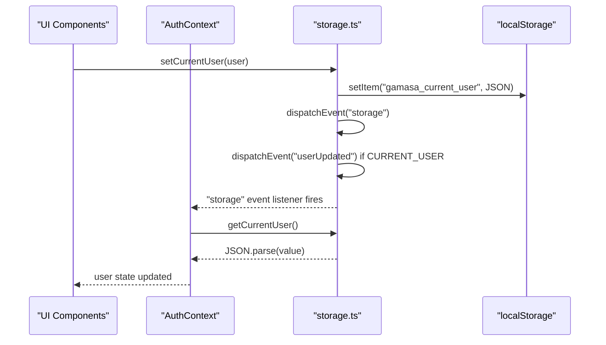
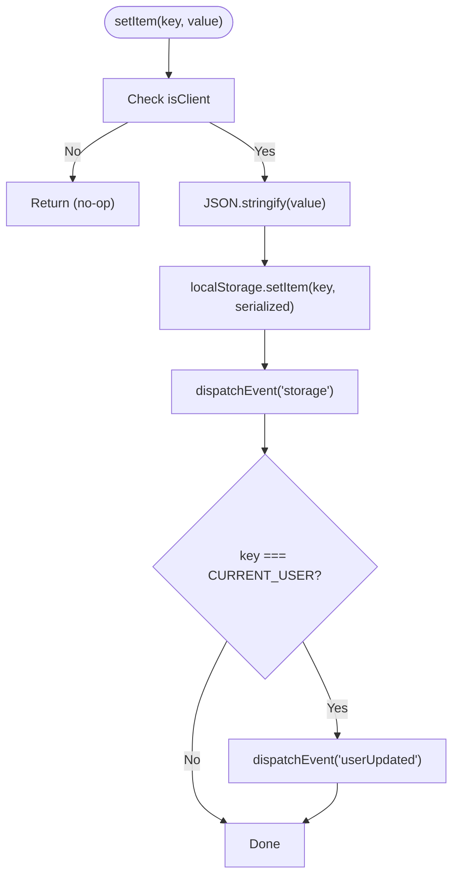
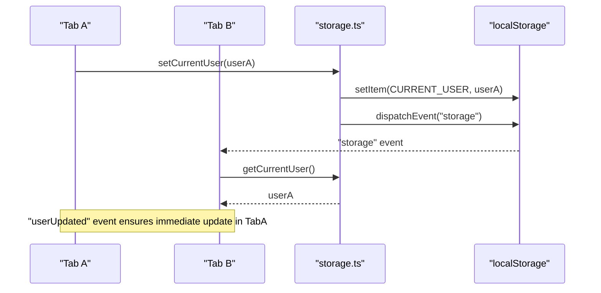
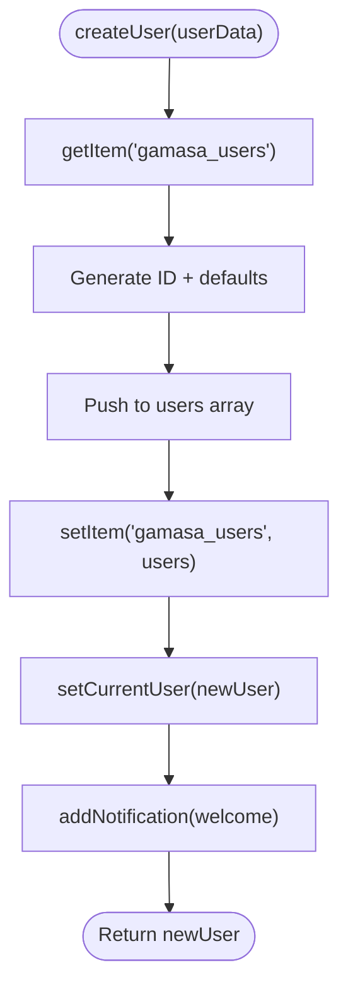
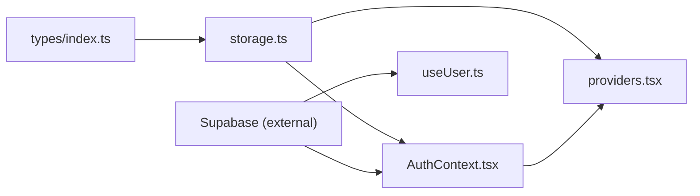

# Local Storage Integration

<cite>
**Referenced Files in This Document**
- [storage.ts](file://src/lib/storage.ts)
- [AuthContext.tsx](file://src/context/AuthContext.tsx)
- [useUser.ts](file://src/hooks/useUser.ts)
- [index.ts](file://src/types/index.ts)
- [providers.tsx](file://src/app/providers.tsx)
</cite>

## Table of Contents
1. [Introduction](#introduction)
2. [Project Structure](#project-structure)
3. [Core Components](#core-components)
4. [Architecture Overview](#architecture-overview)
5. [Detailed Component Analysis](#detailed-component-analysis)
6. [Dependency Analysis](#dependency-analysis)
7. [Performance Considerations](#performance-considerations)
8. [Troubleshooting Guide](#troubleshooting-guide)
9. [Conclusion](#conclusion)
10. [Appendices](#appendices)

## Introduction
This document explains the local storage integration patterns used in Gamasa Properties. It focuses on the storage abstraction layer, user data persistence strategies, state synchronization across browser tabs, and the mock user management system. It also documents the STORAGE_KEYS constants, the getCurrentUser and setCurrentUser functions, localStorage event handling for cross-tab communication, data serialization/deserialization patterns, and storage cleanup procedures. Practical guidance is included for secure data storage, offline state handling, storage migration strategies, performance considerations, storage limits, and fallback mechanisms for browsers with restricted storage access.

## Project Structure
The local storage integration is centered around a dedicated library module that encapsulates all client-side persistence concerns. Authentication state is managed via a React context provider that listens for storage events to keep the UI synchronized across tabs. Supporting types define the shape of persisted data.

```mermaid
graph TB
subgraph "App Layer"
Providers["Providers (Auth + Theme + Toast)"]
AuthCtx["AuthContext"]
Hooks["useUser Hook"]
end
subgraph "Storage Abstraction"
StorageLib["storage.ts<br/>STORAGE_KEYS, getItem/setItem,<br/>getCurrentUser/setCurrentUser,<br/>mock data, helpers"]
end
subgraph "Types"
Types["types/index.ts<br/>User, Property, PaymentRequest,<br/>Review, Notification"]
end
Providers --> AuthCtx
AuthCtx --> StorageLib
Hooks --> StorageLib
StorageLib --> Types
```

**Diagram sources**
- [providers.tsx](file://src/app/providers.tsx#L7-L16)
- [AuthContext.tsx](file://src/context/AuthContext.tsx#L22-L78)
- [useUser.ts](file://src/hooks/useUser.ts#L37-L168)
- [storage.ts](file://src/lib/storage.ts#L4-L12)
- [index.ts](file://src/types/index.ts#L25-L122)

**Section sources**
- [providers.tsx](file://src/app/providers.tsx#L1-L18)
- [AuthContext.tsx](file://src/context/AuthContext.tsx#L1-L195)
- [storage.ts](file://src/lib/storage.ts#L1-L633)
- [index.ts](file://src/types/index.ts#L1-L237)

## Core Components
- Storage abstraction layer with typed helpers for safe getItem and setItem operations.
- STORAGE_KEYS constants for consistent keys across modules.
- getCurrentUser and setCurrentUser for user state persistence and cross-tab synchronization.
- Mock user management system for development and demo environments.
- Cross-tab event handling using storage and userUpdated events.
- Serialization/deserialization using JSON for all stored values.
- Initialization of mock data on first visit.

**Section sources**
- [storage.ts](file://src/lib/storage.ts#L4-L12)
- [storage.ts](file://src/lib/storage.ts#L18-L40)
- [storage.ts](file://src/lib/storage.ts#L294-L300)
- [AuthContext.tsx](file://src/context/AuthContext.tsx#L58-L77)
- [storage.ts](file://src/lib/storage.ts#L629-L633)

## Architecture Overview
The system uses localStorage as the primary persistence mechanism in mock mode. The storage abstraction layer centralizes all reads/writes and emits events to synchronize state across tabs. The AuthContext listens for these events and updates the React context accordingly. The useUser hook integrates with Supabase for authenticated sessions when not in mock mode.



**Diagram sources**
- [storage.ts](file://src/lib/storage.ts#L28-L40)
- [storage.ts](file://src/lib/storage.ts#L294-L300)
- [AuthContext.tsx](file://src/context/AuthContext.tsx#L58-L77)

## Detailed Component Analysis

### Storage Abstraction Layer
The abstraction layer defines typed helpers for safe access to localStorage and centralizes event emission for synchronization.

- getItem<T>(key, defaultValue): Reads and parses a value from localStorage with robust error handling and SSR guard.
- setItem<T>(key, value): Serializes and writes a value to localStorage, then emits:
  - A generic "storage" event to notify other tabs.
  - A "userUpdated" event when the current user key changes.
- isClient guard ensures operations are only performed in the browser.



**Diagram sources**
- [storage.ts](file://src/lib/storage.ts#L18-L40)

**Section sources**
- [storage.ts](file://src/lib/storage.ts#L14-L40)

### STORAGE_KEYS Constants
The constants define the canonical keys used for persistence across modules.

- PROPERTIES: stores property listings.
- USERS: stores user accounts in mock mode.
- CURRENT_USER: stores the active user session.
- PAYMENTS: stores payment requests.
- REVIEWS: stores property reviews.
- NOTIFICATIONS: stores user notifications.

These keys are used by all persistence functions to ensure consistency and simplify refactoring.

**Section sources**
- [storage.ts](file://src/lib/storage.ts#L4-L12)

### User Data Persistence and Synchronization
- getCurrentUser: Retrieves the current user from localStorage using the typed getItem helper.
- setCurrentUser: Persists the current user and triggers cross-tab synchronization events.
- Cross-tab synchronization:
  - Other tabs listen for the "storage" event and reload the current user when the key changes.
  - A dedicated "userUpdated" event is dispatched locally to immediately reflect changes in the same tab.



**Diagram sources**
- [storage.ts](file://src/lib/storage.ts#L294-L300)
- [storage.ts](file://src/lib/storage.ts#L32-L37)
- [AuthContext.tsx](file://src/context/AuthContext.tsx#L58-L77)

**Section sources**
- [storage.ts](file://src/lib/storage.ts#L294-L300)
- [AuthContext.tsx](file://src/context/AuthContext.tsx#L58-L77)

### Mock User Management System
The mock system enables local development and demos without external authentication.

- createUser: Generates a new user with deterministic ID, sets defaults, persists to USERS, and sets as CURRENT_USER. Emits a welcome notification.
- getUserById: Retrieves a user from USERS by ID.
- toggleFavorite: Toggles a property in the current user's favorites and persists the change.
- unlockProperty: Adds a property to the current user's unlocked list and emits a success notification.
- updateUserLastLogin: Updates the last login timestamp for the current user.
- Login/Register in mock mode:
  - Login checks gamasa_users against email/password and sets CURRENT_USER upon success.
  - Register validates uniqueness and creates a new user record, then sets CURRENT_USER.



**Diagram sources**
- [storage.ts](file://src/lib/storage.ts#L302-L328)
- [storage.ts](file://src/lib/storage.ts#L303-L317)

**Section sources**
- [storage.ts](file://src/lib/storage.ts#L292-L381)
- [AuthContext.tsx](file://src/context/AuthContext.tsx#L80-L161)

### Data Serialization and Deserialization Patterns
- All values are serialized using JSON before storage and parsed on retrieval.
- getItem uses a default fallback to prevent runtime errors from malformed data.
- The abstraction layer centralizes these patterns to avoid duplication and reduce risk.

**Section sources**
- [storage.ts](file://src/lib/storage.ts#L18-L26)

### Storage Initialization and Cleanup
- First-visit initialization: On the client, if PROPERTIES is empty, mock properties are written to localStorage.
- Cleanup: On AuthContext initialization failure, the CURRENT_USER key is removed to prevent corrupted state.

**Section sources**
- [storage.ts](file://src/lib/storage.ts#L629-L633)
- [AuthContext.tsx](file://src/context/AuthContext.tsx#L44-L51)

### Offline State Handling
- Mock mode allows full offline operation by persisting all domain data (properties, users, payments, reviews, notifications) in localStorage.
- The abstraction layer ensures consistent behavior regardless of whether the app is online or offline.

**Section sources**
- [storage.ts](file://src/lib/storage.ts#L181-L290)
- [storage.ts](file://src/lib/storage.ts#L385-L477)

### Storage Migration Strategies
- Versioned keys: Introduce new keys for migrated data while keeping old keys readable during transition.
- Schema conversion: Add conversion helpers to transform legacy structures to new ones on first read.
- Fallbacks: Use getItem defaults to safely handle missing or incompatible fields.
- Validation: Parse and validate data before use; clear invalid entries if necessary.

[No sources needed since this section provides general guidance]

### Secure Data Storage Practices
- Avoid storing sensitive credentials in localStorage. Prefer server-side sessions or encrypted storage with a key derivation strategy.
- Mask or obfuscate identifiers when possible to reduce fingerprinting risks.
- Sanitize and validate all persisted data before use.
- Consider encrypting sensitive fields and decrypting only in memory.

[No sources needed since this section provides general guidance]

## Dependency Analysis
The storage module depends on shared types for strong typing. The AuthContext depends on the storage module for user persistence and on Supabase for authentication when not in mock mode. The useUser hook integrates with Supabase for authenticated sessions.



**Diagram sources**
- [index.ts](file://src/types/index.ts#L25-L122)
- [storage.ts](file://src/lib/storage.ts#L1-L6)
- [AuthContext.tsx](file://src/context/AuthContext.tsx#L4-L6)
- [providers.tsx](file://src/app/providers.tsx#L4-L5)
- [useUser.ts](file://src/hooks/useUser.ts#L4-L6)

**Section sources**
- [index.ts](file://src/types/index.ts#L1-L237)
- [storage.ts](file://src/lib/storage.ts#L1-L6)
- [AuthContext.tsx](file://src/context/AuthContext.tsx#L1-L195)
- [providers.tsx](file://src/app/providers.tsx#L1-L18)
- [useUser.ts](file://src/hooks/useUser.ts#L1-L178)

## Performance Considerations
- Minimize write frequency: Batch updates to localStorage to reduce disk I/O and event storms.
- Keep payloads small: Avoid storing large binary data in localStorage; prefer URLs or external storage.
- Debounce listeners: Coalesce frequent updates to avoid excessive re-renders.
- IndexedDB for large datasets: Consider IndexedDB for larger or more complex data needs.
- Avoid synchronous heavy parsing: Keep serialization/deserialization lightweight.

[No sources needed since this section provides general guidance]

## Troubleshooting Guide
- Corrupted data: If getCurrentUser throws or returns unexpected data, clear the CURRENT_USER key to reset state.
- Cross-tab desync: Ensure "storage" and "userUpdated" listeners are registered and that setItem emits events.
- SSR warnings: The isClient guard prevents localStorage usage on the server; verify hydration expectations.
- Mock vs Supabase: Confirm NEXT_PUBLIC_IS_MOCK_MODE to ensure the intended authentication flow is active.

**Section sources**
- [AuthContext.tsx](file://src/context/AuthContext.tsx#L44-L51)
- [AuthContext.tsx](file://src/context/AuthContext.tsx#L58-L77)
- [storage.ts](file://src/lib/storage.ts#L14-L16)

## Conclusion
Gamasa Properties employs a clean, typed storage abstraction layer to manage local persistence in mock mode, with robust cross-tab synchronization and a mock user management system. The design balances simplicity for development with a clear path to integrate with Supabase for production authentication. Following the recommended practices ensures secure, reliable, and performant local storage usage.

## Appendices

### STORAGE_KEYS Reference
- PROPERTIES: gamasa_properties
- USERS: gamasa_users
- CURRENT_USER: gamasa_current_user
- PAYMENTS: gamasa_payments
- REVIEWS: gamasa_reviews
- NOTIFICATIONS: gamasa_notifications

**Section sources**
- [storage.ts](file://src/lib/storage.ts#L4-L12)

### getCurrentUser and setCurrentUser Usage
- getCurrentUser: Retrieve the active user from localStorage.
- setCurrentUser: Persist the active user and emit events for synchronization.

**Section sources**
- [storage.ts](file://src/lib/storage.ts#L294-L300)

### Cross-Tab Communication Events
- "storage": Fired when any key changes; handlers can reload state.
- "userUpdated": Fired locally when CURRENT_USER changes; ensures immediate updates in the same tab.

**Section sources**
- [storage.ts](file://src/lib/storage.ts#L32-L37)
- [AuthContext.tsx](file://src/context/AuthContext.tsx#L58-L77)