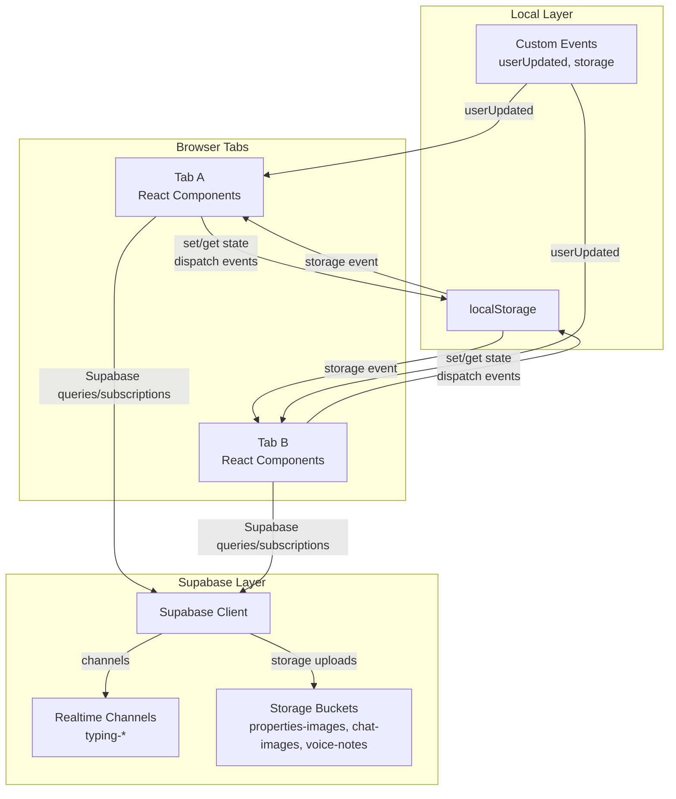
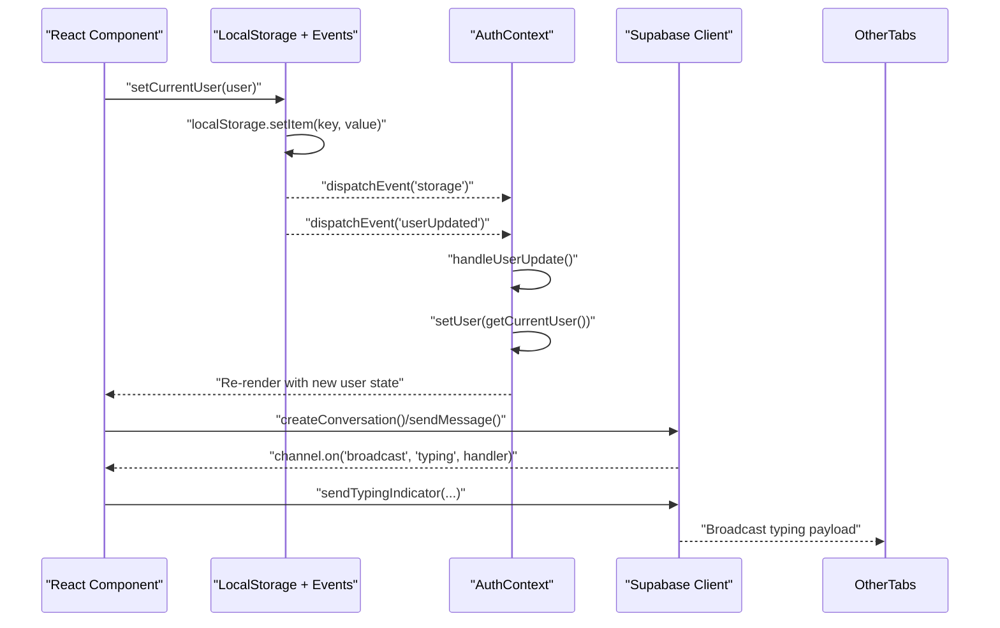
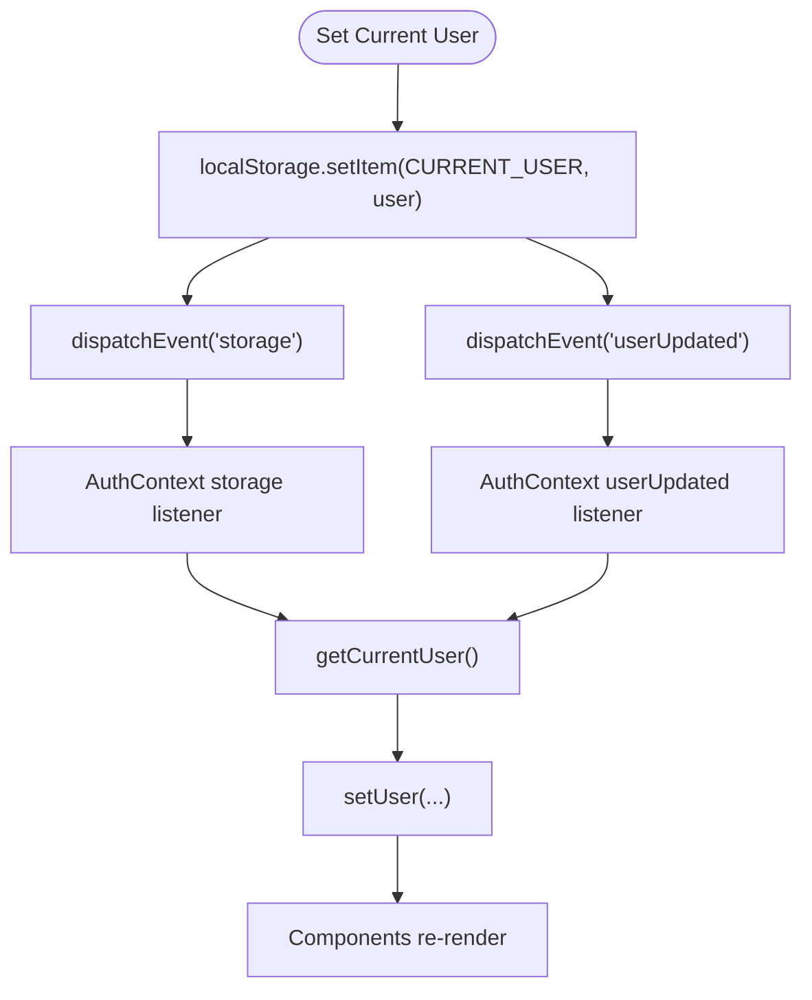
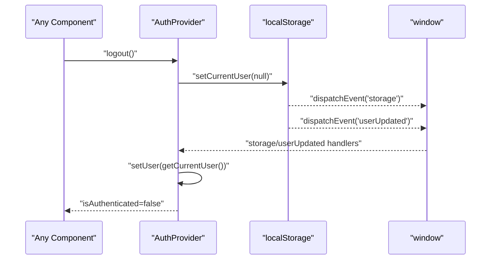
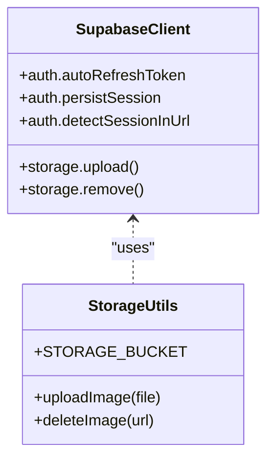
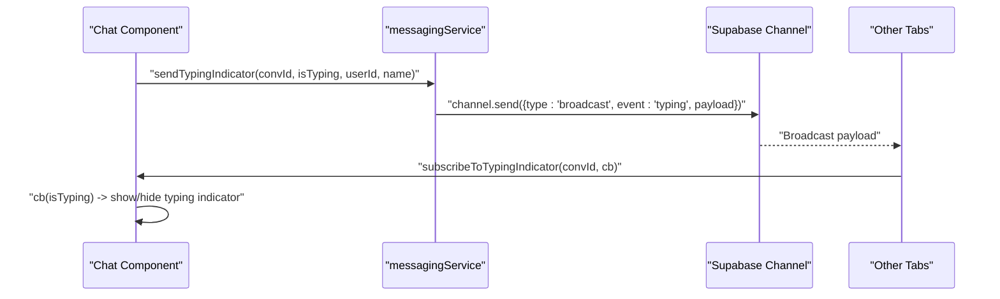
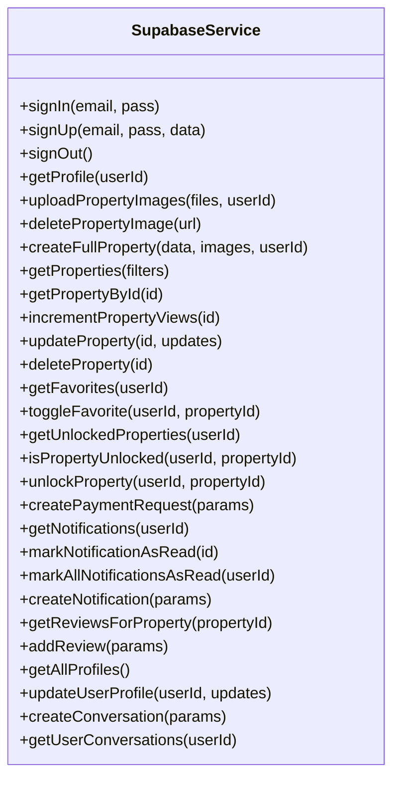
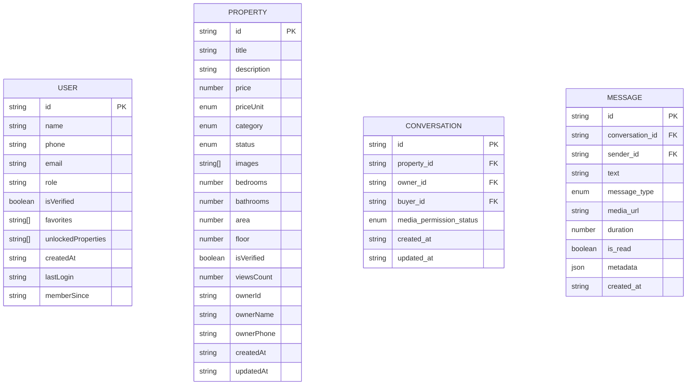
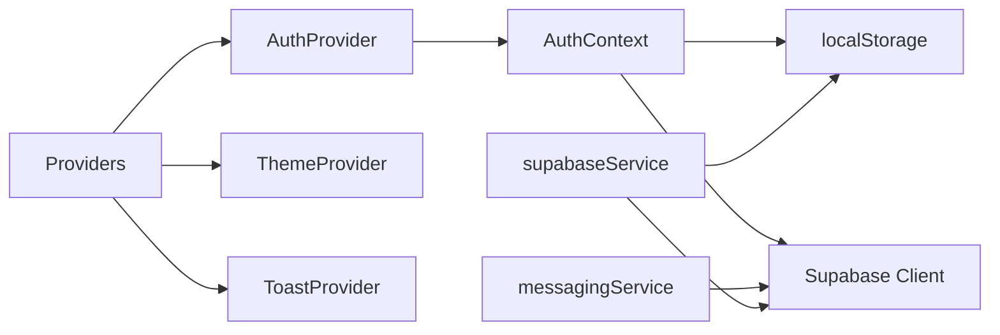

# Real-time State Synchronization

<cite>
**Referenced Files in This Document**
- [supabase.ts](file://src/lib/supabase.ts)
- [storage.ts](file://src/lib/storage.ts)
- [AuthContext.tsx](file://src/context/AuthContext.tsx)
- [supabaseService.ts](file://src/services/supabaseService.ts)
- [messagingService.ts](file://src/services/messagingService.ts)
- [providers.tsx](file://src/app/providers.tsx)
- [index.ts](file://src/types/index.ts)
- [messaging.ts](file://src/types/messaging.ts)
</cite>

## Table of Contents
1. [Introduction](#introduction)
2. [Project Structure](#project-structure)
3. [Core Components](#core-components)
4. [Architecture Overview](#architecture-overview)
5. [Detailed Component Analysis](#detailed-component-analysis)
6. [Dependency Analysis](#dependency-analysis)
7. [Performance Considerations](#performance-considerations)
8. [Troubleshooting Guide](#troubleshooting-guide)
9. [Conclusion](#conclusion)

## Introduction
This document explains the real-time state synchronization mechanisms in Gamasa Properties. It focuses on the event-driven architecture for state updates, cross-tab communication via browser storage events, and real-time data consistency. It documents the userUpdated custom event system, storage event listeners, and state propagation across browser tabs. It also covers integration with Supabase real-time channels and WebSocket connections, automatic state updates, reactive state patterns, concurrent user sessions, conflict resolution, performance optimization for frequent updates, and debugging techniques.

## Project Structure
Gamasa Properties organizes real-time state around three pillars:
- Local-first storage with localStorage and custom events for immediate cross-tab propagation
- Supabase client initialization and storage utilities for remote persistence
- Supabase real-time channels for live messaging and typing indicators

**Diagram sources**
- [storage.ts](file://src/lib/storage.ts#L28-L40)
- [AuthContext.tsx](file://src/context/AuthContext.tsx#L58-L77)
- [supabase.ts](file://src/lib/supabase.ts#L18-L28)
- [messagingService.ts](file://src/services/messagingService.ts#L89-L121)

**Section sources**
- [providers.tsx](file://src/app/providers.tsx#L7-L16)
- [supabase.ts](file://src/lib/supabase.ts#L1-L68)
- [storage.ts](file://src/lib/storage.ts#L1-L633)

## Core Components
- Supabase client initialization and storage helpers
- Local storage abstraction with custom events and cross-tab propagation
- Authentication context with event-driven user state updates
- Messaging service leveraging Supabase real-time channels for typing indicators
- Types for properties, users, and messaging

Key responsibilities:
- Ensure immediate UI updates across tabs via localStorage and custom events
- Provide a unified Supabase client for queries, storage, and real-time channels
- Manage user session state and propagate changes across tabs
- Enable real-time collaboration features (typing indicators) via Supabase channels

**Section sources**
- [supabase.ts](file://src/lib/supabase.ts#L1-L68)
- [storage.ts](file://src/lib/storage.ts#L1-L633)
- [AuthContext.tsx](file://src/context/AuthContext.tsx#L1-L195)
- [messagingService.ts](file://src/services/messagingService.ts#L1-L123)
- [index.ts](file://src/types/index.ts#L1-L237)
- [messaging.ts](file://src/types/messaging.ts#L1-L37)

## Architecture Overview
The system blends local-first state with Supabase for remote synchronization and real-time collaboration.

**Diagram sources**
- [storage.ts](file://src/lib/storage.ts#L28-L40)
- [AuthContext.tsx](file://src/context/AuthContext.tsx#L58-L77)
- [messagingService.ts](file://src/services/messagingService.ts#L89-L121)

## Detailed Component Analysis

### Local Storage and Cross-tab Propagation
- Custom events: Setting current user triggers a custom "userUpdated" event and a generic "storage" event to notify other tabs.
- Event listeners: The authentication context listens for "storage" and "userUpdated" to reload user state from localStorage.
- Consistency: Other components can listen to "storage" for keys like gamasa_current_user to keep UI in sync across tabs.

**Diagram sources**
- [storage.ts](file://src/lib/storage.ts#L28-L40)
- [AuthContext.tsx](file://src/context/AuthContext.tsx#L58-L77)

**Section sources**
- [storage.ts](file://src/lib/storage.ts#L28-L40)
- [AuthContext.tsx](file://src/context/AuthContext.tsx#L58-L77)

### Authentication Context and Reactive User State
- Initializes user state from localStorage and optionally from Supabase depending on mock mode.
- Subscribes to storage and custom events to keep the user state synchronized across tabs.
- Provides login/register/logout flows; logout persists null user and signs out via Supabase when not in mock mode.

**Diagram sources**
- [AuthContext.tsx](file://src/context/AuthContext.tsx#L163-L170)
- [storage.ts](file://src/lib/storage.ts#L298-L300)

**Section sources**
- [AuthContext.tsx](file://src/context/AuthContext.tsx#L22-L78)
- [AuthContext.tsx](file://src/context/AuthContext.tsx#L163-L170)

### Supabase Client Initialization and Storage Utilities
- Creates a Supabase client with auto-refresh and persisted sessions.
- Exposes constants and helpers for image upload/delete to Supabase storage buckets.
- Ensures environment variables are present with warnings if missing.

**Diagram sources**
- [supabase.ts](file://src/lib/supabase.ts#L18-L28)
- [supabase.ts](file://src/lib/supabase.ts#L34-L67)

**Section sources**
- [supabase.ts](file://src/lib/supabase.ts#L1-L68)

### Messaging Service and Real-time Channels
- Uses Supabase channels to broadcast typing indicators per conversation.
- Subscribes to typing broadcasts and exposes a cleanup function to remove channels.
- Integrates with Supabase storage for chat media uploads.

**Diagram sources**
- [messagingService.ts](file://src/services/messagingService.ts#L89-L121)

**Section sources**
- [messagingService.ts](file://src/services/messagingService.ts#L1-L123)

### Supabase Service Abstraction
- Provides a centralized service wrapper around Supabase for properties, profiles, conversations, notifications, and reviews.
- Supports mock mode for development and a hybrid approach to switch between mock and Supabase-backed logic.
- Includes helpers for image upload/delete and RPC calls for property views.

**Diagram sources**
- [supabaseService.ts](file://src/services/supabaseService.ts#L153-L800)

**Section sources**
- [supabaseService.ts](file://src/services/supabaseService.ts#L1-L800)

### Types and Contracts
- Defines core domain types for properties, users, notifications, reviews, and messaging.
- Supports role-based access and structured search/filters.

**Diagram sources**
- [index.ts](file://src/types/index.ts#L25-L122)
- [messaging.ts](file://src/types/messaging.ts#L1-L37)

**Section sources**
- [index.ts](file://src/types/index.ts#L1-L237)
- [messaging.ts](file://src/types/messaging.ts#L1-L37)

## Dependency Analysis
- Providers wrap the app with AuthProvider, ThemeProvider, and ToastProvider to ensure global state and theme availability.
- AuthContext depends on localStorage and custom events for cross-tab synchronization.
- Supabase client is shared across services and components for remote data and real-time features.
- Messaging service depends on Supabase channels and storage for media and typing indicators.

**Diagram sources**
- [providers.tsx](file://src/app/providers.tsx#L7-L16)
- [AuthContext.tsx](file://src/context/AuthContext.tsx#L1-L195)
- [supabase.ts](file://src/lib/supabase.ts#L18-L28)
- [messagingService.ts](file://src/services/messagingService.ts#L1-L123)
- [supabaseService.ts](file://src/services/supabaseService.ts#L1-L800)

**Section sources**
- [providers.tsx](file://src/app/providers.tsx#L1-L18)
- [AuthContext.tsx](file://src/context/AuthContext.tsx#L1-L195)
- [supabase.ts](file://src/lib/supabase.ts#L1-L68)
- [messagingService.ts](file://src/services/messagingService.ts#L1-L123)
- [supabaseService.ts](file://src/services/supabaseService.ts#L1-L800)

## Performance Considerations
- Debounce or throttle frequent updates: For high-frequency property view increments or search filters, batch updates to reduce DOM re-renders and localStorage churn.
- Minimize localStorage writes: Coalesce multiple small updates into fewer writes and avoid serializing large objects unnecessarily.
- Use selective reactivity: Components should subscribe only to the parts of state they need to render.
- Real-time channels: Keep channel subscriptions minimal and unsubscribe when components unmount to prevent memory leaks.
- Image uploads: Compress images before upload and use appropriate bucket policies to avoid repeated failed attempts.
- Mock vs. real mode: Disable mock mode in production to leverage Supabase caching and offline capabilities.

[No sources needed since this section provides general guidance]

## Troubleshooting Guide
Common issues and resolutions:
- Missing environment variables for Supabase: The client logs warnings if URL or anonymous key are missing. Ensure .env.local is configured.
- Cross-tab not updating: Verify that "storage" and "userUpdated" events are dispatched after localStorage writes and that listeners are attached on mount.
- Typing indicators not appearing: Confirm that the channel is subscribed before sending and that the event name matches ("typing").
- Logout not reflected across tabs: Ensure setCurrentUser(null) is called and that the storage listener reloads the user state.
- Conflicts across tabs: Since localStorage is synchronous per tab, conflicts are rare. If two tabs write concurrently, the last write wins; consider optimistic updates with reconciliation on reload.

**Section sources**
- [supabase.ts](file://src/lib/supabase.ts#L7-L15)
- [storage.ts](file://src/lib/storage.ts#L28-L40)
- [AuthContext.tsx](file://src/context/AuthContext.tsx#L58-L77)
- [messagingService.ts](file://src/services/messagingService.ts#L89-L121)

## Conclusion
Gamasa Properties achieves real-time state synchronization by combining local-first updates with cross-tab event propagation and Supabase-powered remote synchronization and real-time channels. The userUpdated custom event and storage event listeners ensure immediate UI updates across browser tabs. Supabase channels enable collaborative features like typing indicators. By following the reactive patterns, performance tips, and troubleshooting steps outlined above, teams can maintain consistent, responsive, and scalable real-time behavior.