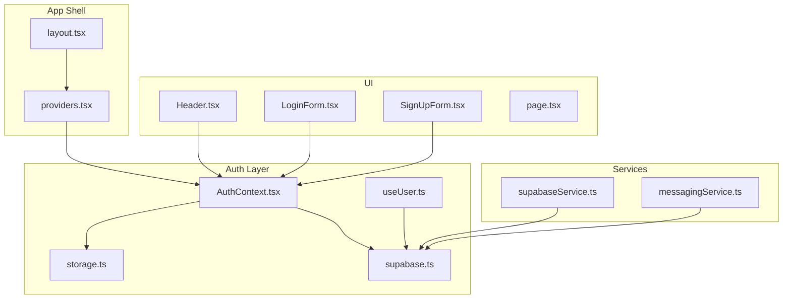
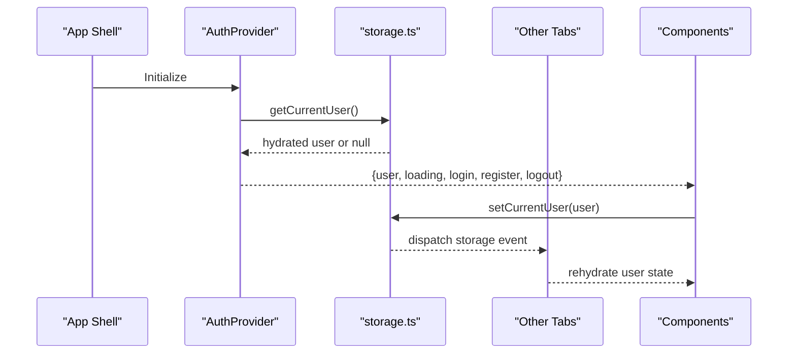
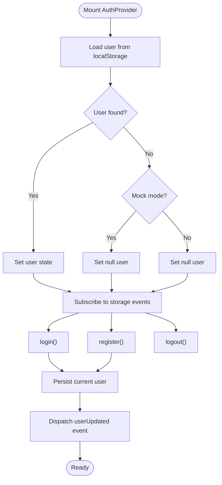
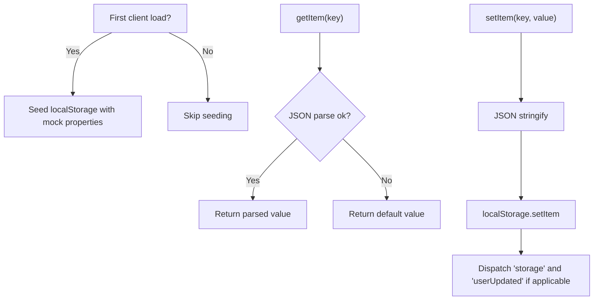
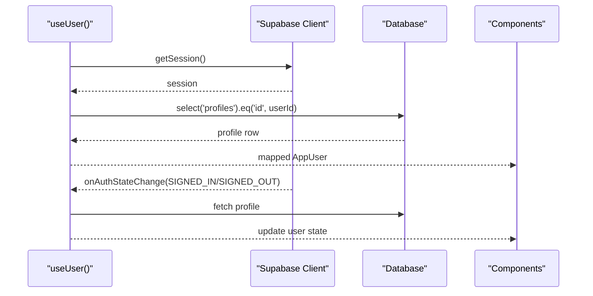
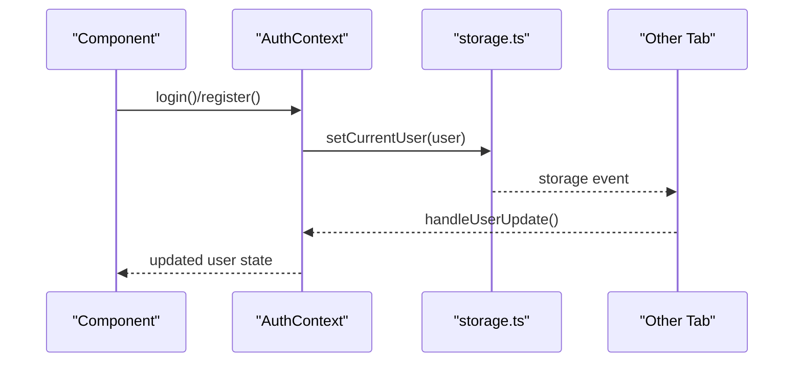
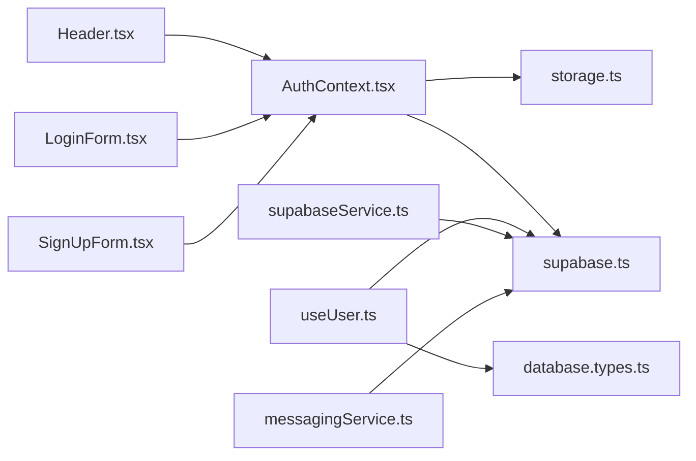

# State Management

<cite>
**Referenced Files in This Document**
- [AuthContext.tsx](file://src/context/AuthContext.tsx)
- [providers.tsx](file://src/app/providers.tsx)
- [storage.ts](file://src/lib/storage.ts)
- [supabase.ts](file://src/lib/supabase.ts)
- [useUser.ts](file://src/hooks/useUser.ts)
- [supabaseService.ts](file://src/services/supabaseService.ts)
- [messagingService.ts](file://src/services/messagingService.ts)
- [index.ts](file://src/types/index.ts)
- [database.types.ts](file://src/types/database.types.ts)
- [layout.tsx](file://src/app/layout.tsx)
- [Header.tsx](file://src/components/Header.tsx)
- [LoginForm.tsx](file://src/components/auth/LoginForm.tsx)
- [SignUpForm.tsx](file://src/components/auth/SignUpForm.tsx)
- [page.tsx](file://src/app/page.tsx)
</cite>

## Table of Contents
1. [Introduction](#introduction)
2. [Project Structure](#project-structure)
3. [Core Components](#core-components)
4. [Architecture Overview](#architecture-overview)
5. [Detailed Component Analysis](#detailed-component-analysis)
6. [Dependency Analysis](#dependency-analysis)
7. [Performance Considerations](#performance-considerations)
8. [Troubleshooting Guide](#troubleshooting-guide)
9. [Conclusion](#conclusion)

## Introduction
This document explains the state management architecture for Gamasa Properties, focusing on React Context, global state patterns, local storage integration, and mock data management. It covers the AuthContext provider architecture, user state management, session persistence, state update mechanisms, subscriptions, and synchronization across components. It also documents local storage strategies, state hydration, offline handling, and integration with Supabase real-time updates. Practical usage patterns and performance optimization techniques are included.

## Project Structure
Gamasa Properties organizes state management around:
- A React Context provider that wraps the entire app
- Local storage utilities for persistence and cross-tab synchronization
- Supabase integration for authentication and real-time features
- Hook-based user state management
- Mock services for development and offline scenarios

**Diagram sources**
- [layout.tsx](file://src/app/layout.tsx#L64-L89)
- [providers.tsx](file://src/app/providers.tsx#L7-L17)
- [AuthContext.tsx](file://src/context/AuthContext.tsx#L22-L186)
- [useUser.ts](file://src/hooks/useUser.ts#L37-L176)
- [storage.ts](file://src/lib/storage.ts#L1-L633)
- [supabase.ts](file://src/lib/supabase.ts#L1-L68)
- [Header.tsx](file://src/components/Header.tsx#L9-L222)
- [LoginForm.tsx](file://src/components/auth/LoginForm.tsx#L7-L220)
- [SignUpForm.tsx](file://src/components/auth/SignUpForm.tsx#L7-L274)
- [page.tsx](file://src/app/page.tsx#L88-L195)
- [supabaseService.ts](file://src/services/supabaseService.ts#L1-L1384)
- [messagingService.ts](file://src/services/messagingService.ts#L1-L123)

**Section sources**
- [layout.tsx](file://src/app/layout.tsx#L64-L89)
- [providers.tsx](file://src/app/providers.tsx#L7-L17)

## Core Components
- AuthContext: Provides authentication state, login/register/logout, and user hydration from local storage. It listens to localStorage changes across tabs and maintains a loading flag.
- storage.ts: Centralized local storage utilities with typed keys, hydration helpers, and mock data initialization. Emits events to synchronize state across tabs.
- useUser.ts: Hook that manages Supabase-based user state, profile mapping, and auth state change subscriptions.
- supabase.ts: Supabase client creation and image upload utilities with environment checks.
- supabaseService.ts: Mock service layer for properties, favorites, notifications, messaging, and bookings; includes real-time typing indicators and presence.
- messagingService.ts: Real-time broadcast channels for typing indicators and media permission requests.
- Types: Strongly typed domain models for properties, users, notifications, and database rows.

**Section sources**
- [AuthContext.tsx](file://src/context/AuthContext.tsx#L11-L195)
- [storage.ts](file://src/lib/storage.ts#L4-L40)
- [useUser.ts](file://src/hooks/useUser.ts#L37-L176)
- [supabase.ts](file://src/lib/supabase.ts#L1-L68)
- [supabaseService.ts](file://src/services/supabaseService.ts#L1-L1384)
- [messagingService.ts](file://src/services/messagingService.ts#L1-L123)
- [index.ts](file://src/types/index.ts#L25-L122)
- [database.types.ts](file://src/types/database.types.ts#L12-L310)

## Architecture Overview
The app uses a layered state strategy:
- Global Auth state via React Context with localStorage hydration and cross-tab sync
- Supabase-backed user profile state via a dedicated hook with auth state subscriptions
- Local storage for user preferences, notifications, favorites, and unlock history
- Mock service layer for properties and related features during development
- Supabase real-time channels for notifications, typing indicators, and presence

**Diagram sources**
- [AuthContext.tsx](file://src/context/AuthContext.tsx#L22-L78)
- [storage.ts](file://src/lib/storage.ts#L294-L300)

**Section sources**
- [AuthContext.tsx](file://src/context/AuthContext.tsx#L22-L78)
- [storage.ts](file://src/lib/storage.ts#L294-L300)

## Detailed Component Analysis

### AuthContext Provider
AuthContext orchestrates authentication state and persistence:
- Hydration: Loads current user from localStorage on mount; clears corrupted entries
- Cross-tab sync: Subscribes to 'storage' and 'userUpdated' events to keep state consistent
- Authentication modes:
  - Mock mode: Validates credentials against localStorage users and persists current user
  - Supabase mode: Delegates to Supabase client (login/register/logout paths present)
- Loading state: Ensures UI renders appropriately while hydrating

**Diagram sources**
- [AuthContext.tsx](file://src/context/AuthContext.tsx#L22-L186)
- [storage.ts](file://src/lib/storage.ts#L294-L300)

**Section sources**
- [AuthContext.tsx](file://src/context/AuthContext.tsx#L22-L186)
- [storage.ts](file://src/lib/storage.ts#L294-L300)

### Local Storage Integration and Hydration
- Keys: Centralized under STORAGE_KEYS for properties, users, current user, payments, reviews, notifications
- Helpers: getItem/setItem wrap localStorage with try/catch and emit 'storage' and 'userUpdated' events
- Hydration: AuthContext reads current user on mount; components read/write notifications/favorites/unlocks via storage.ts
- Mock initialization: On first client load, properties are seeded with mock data

**Diagram sources**
- [storage.ts](file://src/lib/storage.ts#L4-L40)
- [storage.ts](file://src/lib/storage.ts#L629-L633)

**Section sources**
- [storage.ts](file://src/lib/storage.ts#L4-L40)
- [storage.ts](file://src/lib/storage.ts#L629-L633)

### Supabase Integration and Real-Time Updates
- Client: Created with environment checks and auto-refresh/persist settings
- Auth state: useUser hook subscribes to Supabase auth state changes and loads profile data
- Messaging: Real-time channels for typing indicators and media permissions
- Mock parity: supabaseService mirrors Supabase behavior in mock mode for properties, notifications, favorites, and messaging

**Diagram sources**
- [useUser.ts](file://src/hooks/useUser.ts#L110-L168)
- [supabase.ts](file://src/lib/supabase.ts#L18-L28)

**Section sources**
- [useUser.ts](file://src/hooks/useUser.ts#L37-L176)
- [supabase.ts](file://src/lib/supabase.ts#L1-L68)
- [messagingService.ts](file://src/services/messagingService.ts#L88-L121)
- [supabaseService.ts](file://src/services/supabaseService.ts#L1002-L1038)

### State Update Mechanisms and Subscription Patterns
- Context updates: AuthProvider setState triggers re-renders for all consumers
- Local storage updates: storage.ts emits events; AuthProvider listens and rehydrates
- Supabase subscriptions: useUser hook subscribes to auth state changes; messagingService uses channels for typing
- Component-level subscriptions: Header subscribes to localStorage changes for notifications

**Diagram sources**
- [AuthContext.tsx](file://src/context/AuthContext.tsx#L58-L77)
- [storage.ts](file://src/lib/storage.ts#L28-L40)

**Section sources**
- [AuthContext.tsx](file://src/context/AuthContext.tsx#L58-L77)
- [Header.tsx](file://src/components/Header.tsx#L16-L38)
- [storage.ts](file://src/lib/storage.ts#L28-L40)

### Example Usage Patterns
- Using AuthContext in components:
  - LoginForm and SignUpForm consume useAuth to trigger login/signup actions
  - Header displays user info and logs out via AuthContext
- Hydrating notifications and unread counts from localStorage
- Mock vs Supabase toggling via environment flags

**Section sources**
- [LoginForm.tsx](file://src/components/auth/LoginForm.tsx#L17-L46)
- [SignUpForm.tsx](file://src/components/auth/SignUpForm.tsx#L13-L49)
- [Header.tsx](file://src/components/Header.tsx#L9-L222)
- [page.tsx](file://src/app/page.tsx#L88-L195)

## Dependency Analysis
- AuthContext depends on:
  - storage.ts for hydration and persistence
  - supabase.ts for Supabase client configuration
- useUser depends on:
  - supabase.ts for auth and profile queries
  - database.types.ts for strongly typed rows
- UI components depend on:
  - AuthContext for user state
  - storage.ts for notifications and preferences
  - supabaseService.ts for mock features and Supabase parity

**Diagram sources**
- [AuthContext.tsx](file://src/context/AuthContext.tsx#L3-L6)
- [storage.ts](file://src/lib/storage.ts#L1-L2)
- [supabase.ts](file://src/lib/supabase.ts#L1-L6)
- [useUser.ts](file://src/hooks/useUser.ts#L4-L5)
- [database.types.ts](file://src/types/database.types.ts#L12-L310)
- [Header.tsx](file://src/components/Header.tsx#L5-L6)
- [LoginForm.tsx](file://src/components/auth/LoginForm.tsx#L4)
- [SignUpForm.tsx](file://src/components/auth/SignUpForm.tsx#L4)
- [supabaseService.ts](file://src/services/supabaseService.ts#L2-L3)
- [messagingService.ts](file://src/services/messagingService.ts#L1-L2)

**Section sources**
- [AuthContext.tsx](file://src/context/AuthContext.tsx#L3-L6)
- [storage.ts](file://src/lib/storage.ts#L1-L2)
- [supabase.ts](file://src/lib/supabase.ts#L1-L6)
- [useUser.ts](file://src/hooks/useUser.ts#L4-L5)
- [database.types.ts](file://src/types/database.types.ts#L12-L310)
- [Header.tsx](file://src/components/Header.tsx#L5-L6)
- [LoginForm.tsx](file://src/components/auth/LoginForm.tsx#L4)
- [SignUpForm.tsx](file://src/components/auth/SignUpForm.tsx#L4)
- [supabaseService.ts](file://src/services/supabaseService.ts#L2-L3)
- [messagingService.ts](file://src/services/messagingService.ts#L1-L2)

## Performance Considerations
- Minimize re-renders:
  - Keep AuthContext state granular; avoid unnecessary provider wrapping
  - Use callbacks and memoization in hooks (already present in useUser)
- Optimize localStorage access:
  - Batch writes and debounce frequent updates
  - Avoid large JSON payloads; split into multiple keys if needed
- Supabase efficiency:
  - Use targeted queries and projections
  - Leverage onAuthStateChange to avoid polling
- Real-time channels:
  - Unsubscribe when components unmount (useUser and messagingService already unsubscribe)
- Mock vs production:
  - Toggle mock mode via environment flags to reduce network overhead during development

[No sources needed since this section provides general guidance]

## Troubleshooting Guide
- Authentication not persisting:
  - Verify localStorage availability and absence of corrupted entries
  - Ensure 'userUpdated' and 'storage' events are dispatched after setCurrentUser
- Cross-tab desync:
  - Confirm listeners for 'storage' and 'userUpdated' are attached and removed properly
- Supabase auth state not updating:
  - Check onAuthStateChange subscription and mountedRef cleanup
- Notifications not updating:
  - Ensure getNotifications/getUnreadNotificationCount are called after state changes
- Environment variables missing:
  - Confirm NEXT_PUBLIC_SUPABASE_URL and NEXT_PUBLIC_SUPABASE_ANON_KEY are set

**Section sources**
- [AuthContext.tsx](file://src/context/AuthContext.tsx#L44-L77)
- [storage.ts](file://src/lib/storage.ts#L28-L40)
- [useUser.ts](file://src/hooks/useUser.ts#L138-L168)
- [supabase.ts](file://src/lib/supabase.ts#L7-L15)

## Conclusion
Gamasa Properties employs a layered state strategy combining React Context, localStorage, and Supabase. AuthContext centralizes authentication with robust hydration and cross-tab synchronization. Local storage provides reliable persistence for user preferences and notifications, while Supabase powers user profiles and real-time features. The mock service layer ensures development flexibility and offline readiness. Following the patterns and recommendations herein will help maintain a scalable, responsive, and resilient state management system.