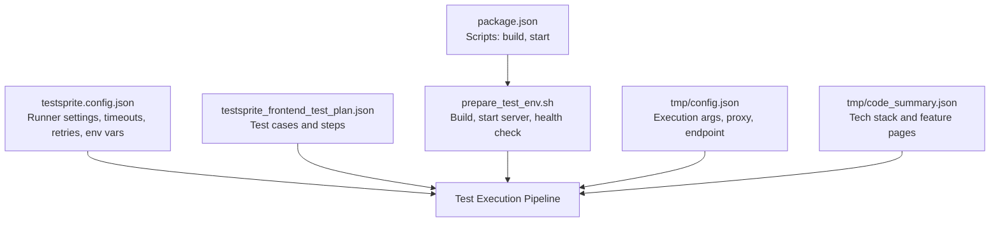
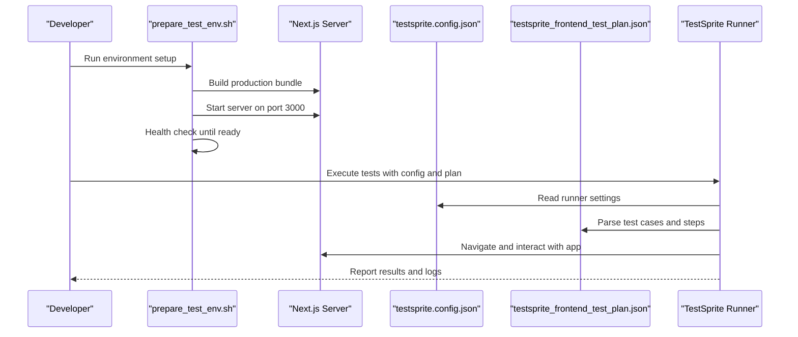
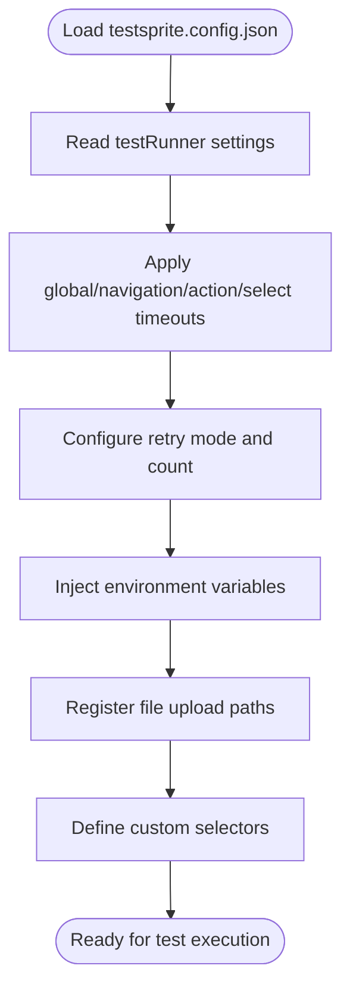
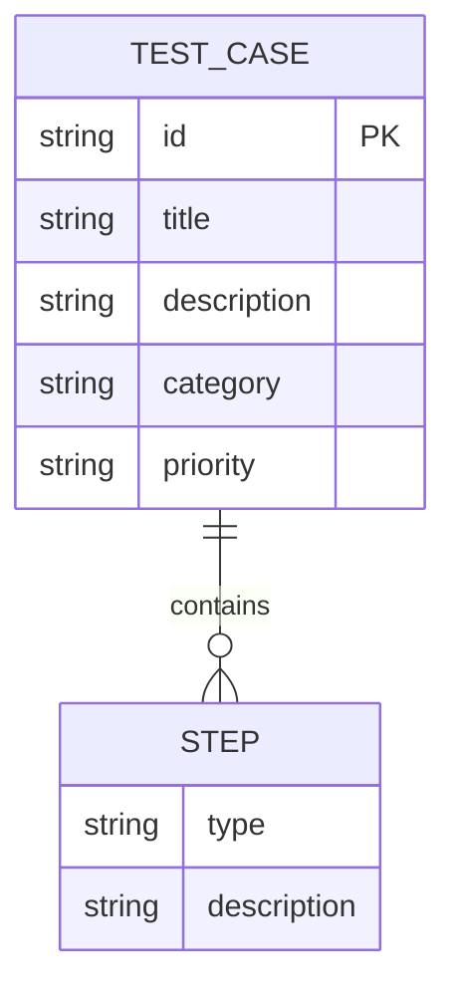
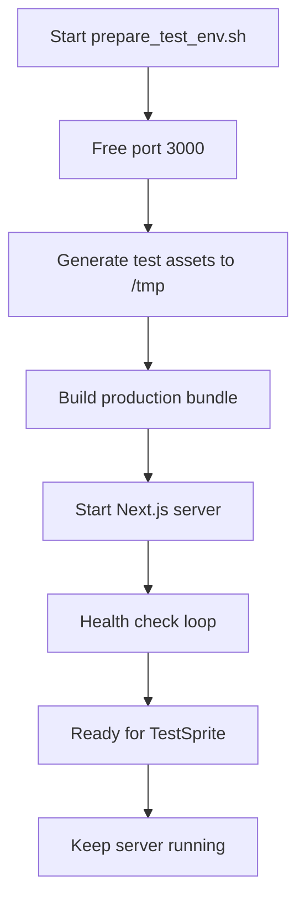
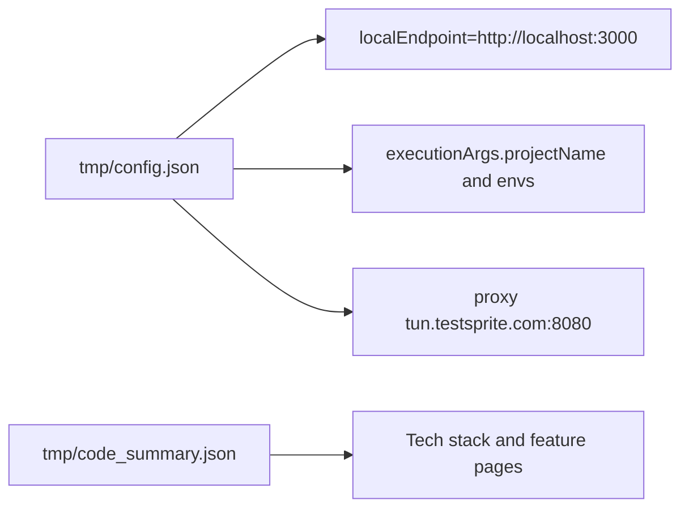
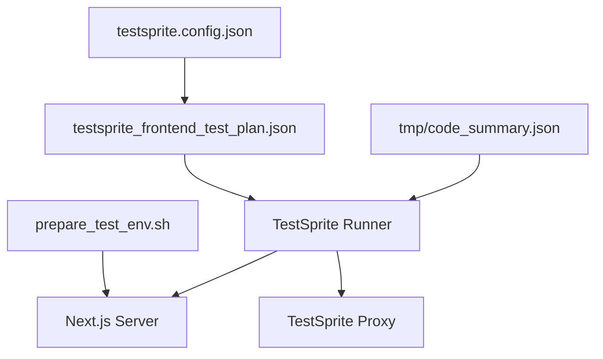

# Automated Testing Infrastructure

<cite>
**Referenced Files in This Document**
- [testsprite.config.json](file://testsprite.config.json)
- [testsprite_frontend_test_plan.json](file://testsprite_tests\testsprite_frontend_test_plan.json)
- [prepare_test_env.sh](file://prepare_test_env.sh)
- [package.json](file://package.json)
- [config.json](file://testsprite_tests\tmp\config.json)
- [code_summary.json](file://testsprite_tests\tmp\code_summary.json)
- [README.md](file://README.md)
- [BOOKING_SYSTEM.md](file://BOOKING_SYSTEM.md)
</cite>

## Table of Contents
1. [Introduction](#introduction)
2. [Project Structure](#project-structure)
3. [Core Components](#core-components)
4. [Architecture Overview](#architecture-overview)
5. [Detailed Component Analysis](#detailed-component-analysis)
6. [Dependency Analysis](#dependency-analysis)
7. [Performance Considerations](#performance-considerations)
8. [Troubleshooting Guide](#troubleshooting-guide)
9. [Conclusion](#conclusion)
10. [Appendices](#appendices)

## Introduction
This document describes the automated testing infrastructure built with the TestSprite framework for the Gamasa Properties Next.js application. It explains how to set up the test execution environment, configure the test runner, define test plans, orchestrate automated tests, and integrate with CI/CD. It also covers test sprite configuration, test data management, environment isolation, cleanup procedures, and reporting mechanisms.

## Project Structure
The testing infrastructure is organized around three primary areas:
- Test runner configuration and environment settings
- Test plan definitions in JSON format
- Test environment bootstrap script and auxiliary runtime artifacts

**Diagram sources**
- [testsprite.config.json](file://testsprite.config.json#L1-L36)
- [testsprite_frontend_test_plan.json](file://testsprite_tests\testsprite_frontend_test_plan.json#L1-L513)
- [prepare_test_env.sh](file://prepare_test_env.sh#L1-L36)
- [package.json](file://package.json#L1-L42)
- [config.json](file://testsprite_tests\tmp\config.json#L1-L18)
- [code_summary.json](file://testsprite_tests\tmp\code_summary.json#L1-L108)

**Section sources**
- [testsprite.config.json](file://testsprite.config.json#L1-L36)
- [testsprite_frontend_test_plan.json](file://testsprite_tests\testsprite_frontend_test_plan.json#L1-L513)
- [prepare_test_env.sh](file://prepare_test_env.sh#L1-L36)
- [package.json](file://package.json#L1-L42)
- [config.json](file://testsprite_tests\tmp\config.json#L1-L18)
- [code_summary.json](file://testsprite_tests\tmp\code_summary.json#L1-L108)

## Core Components
- TestSprite Runner Configuration
  - Defines headless mode, viewport, global/navigation/action/select timeouts, retry policy, environment variables, asset upload paths, and selector overrides.
- Test Plan JSON
  - Describes functional and security test cases with explicit steps (actions/assertions), categories, priorities, and descriptions.
- Test Environment Bootstrap
  - Builds the production bundle, starts the server on port 3000, waits for readiness, and keeps the process alive for testing.
- Execution Artifacts
  - Temporary configuration and code summary files that guide TestSprite execution and proxy connectivity.

Key configuration highlights:
- Base URL: http://localhost:3000
- Headless browser enabled
- Global timeout: 120 seconds
- Navigation timeout: 60 seconds
- Action timeout: 15 seconds
- Selector overrides for map container and loading spinner
- Asset upload paths for house images
- Environment variables for NODE_ENV and test credentials

**Section sources**
- [testsprite.config.json](file://testsprite.config.json#L1-L36)
- [testsprite_frontend_test_plan.json](file://testsprite_tests\testsprite_frontend_test_plan.json#L1-L513)
- [prepare_test_env.sh](file://prepare_test_env.sh#L1-L36)
- [config.json](file://testsprite_tests\tmp\config.json#L1-L18)
- [code_summary.json](file://testsprite_tests\tmp\code_summary.json#L1-L108)

## Architecture Overview
The TestSprite pipeline orchestrates the following flow:
- Prepare the environment (build and start server)
- Load TestSprite configuration and test plan
- Execute test cases with configured timeouts and retries
- Report results and handle cleanup

**Diagram sources**
- [prepare_test_env.sh](file://prepare_test_env.sh#L1-L36)
- [testsprite.config.json](file://testsprite.config.json#L1-L36)
- [testsprite_frontend_test_plan.json](file://testsprite_tests\testsprite_frontend_test_plan.json#L1-L513)

## Detailed Component Analysis

### TestSprite Runner Configuration
- Purpose: Centralized configuration for browser behavior, timeouts, retries, environment variables, and selectors.
- Key fields:
  - testRunner.headless: Enables non-GUI execution for CI.
  - testRunner.viewport: Consistent screen size for reproducible UI tests.
  - testRunner.timeouts: Global, navigation, action, and selector timeouts to balance speed and reliability.
  - testRunner.retries: Retry strategy for flaky tests.
  - env: Environment variables injected during test runs.
  - assets.fileUploadPaths: Predefined paths for test assets.
  - selectors: Overrides for map container and loading indicators.

**Diagram sources**
- [testsprite.config.json](file://testsprite.config.json#L1-L36)

**Section sources**
- [testsprite.config.json](file://testsprite.config.json#L1-L36)

### Test Plan JSON Structure and Examples
- Structure overview:
  - Array of test case objects with id, title, description, category, priority, and steps.
  - Steps include action and assertion types with human-readable descriptions.
- Example categories and priorities:
  - Functional tests (e.g., Homepage load performance, Advanced property search filtering)
  - Security tests (e.g., Admin dashboard access)
- Representative test cases:
  - Homepage load performance and featured listings display
  - Advanced property search filtering
  - Interactive map property location markers
  - User sign-up with valid credentials
  - User login with correct and incorrect credentials
  - User profile creation and update with validation
  - Add Property multi-step form validation and submission
  - Edit and manage own property listings
  - Favorites functionality
  - Internal messaging system
  - Real-time notifications
  - Booking creation, update, and cancellation
  - Admin dashboard access and management functions
  - Property details page correctness

**Diagram sources**
- [testsprite_frontend_test_plan.json](file://testsprite_tests\testsprite_frontend_test_plan.json#L1-L513)

**Section sources**
- [testsprite_frontend_test_plan.json](file://testsprite_tests\testsprite_frontend_test_plan.json#L1-L513)

### Test Environment Setup and Isolation
- Script responsibilities:
  - Free port 3000 if occupied
  - Generate dummy test assets (image URLs fetched to local paths)
  - Build production bundle to reduce runtime variability
  - Start Next.js server and wait for health check
  - Keep server running for the duration of tests
- Isolation considerations:
  - Uses production build to minimize dev-mode differences
  - Runs on localhost:3000 to align with TestSprite configuration
  - Keeps server alive until manually stopped

**Diagram sources**
- [prepare_test_env.sh](file://prepare_test_env.sh#L1-L36)
- [package.json](file://package.json#L1-L42)

**Section sources**
- [prepare_test_env.sh](file://prepare_test_env.sh#L1-L36)
- [package.json](file://package.json#L1-L42)

### Execution Artifacts and Proxy Configuration
- Temporary configuration:
  - Local endpoint set to http://localhost:3000
  - Backend auth type set to public
  - Execution arguments include project name, path, and additional instruction
  - Proxy endpoint configured for tunnel connectivity
- Code summary:
  - Lists tech stack and feature pages to guide test coverage

**Diagram sources**
- [config.json](file://testsprite_tests\tmp\config.json#L1-L18)
- [code_summary.json](file://testsprite_tests\tmp\code_summary.json#L1-L108)

**Section sources**
- [config.json](file://testsprite_tests\tmp\config.json#L1-L18)
- [code_summary.json](file://testsprite_tests\tmp\code_summary.json#L1-L108)

### Test Data Management and Cleanup
- Test data generation:
  - Dummy assets created under /tmp for upload scenarios
- Cleanup procedures:
  - Script frees port 3000 before starting
  - Server is kept running while tests execute; manual termination stops the server
- Recommendations:
  - Use isolated test accounts and temporary data per test session
  - Clear uploaded assets after tests complete
  - Consider database reset or test-specific Supabase project for persistent data

**Section sources**
- [prepare_test_env.sh](file://prepare_test_env.sh#L1-L36)
- [testsprite.config.json](file://testsprite.config.json#L26-L31)

### Continuous Testing Workflows and CI/CD Integration
- Workflow outline:
  - Install dependencies
  - Build application
  - Start server in background
  - Execute TestSprite tests with configured plan
  - Capture and publish results
- CI/CD integration points:
  - Use the environment setup script as part of CI job
  - Configure environment variables via CI secrets
  - Store proxy credentials and API keys in CI vault
  - Archive artifacts and reports for historical tracking

[No sources needed since this section provides general guidance]

## Dependency Analysis
- Internal dependencies:
  - Runner configuration depends on test plan structure and environment readiness
  - Test plan steps depend on selectors and assets defined in configuration
- External dependencies:
  - Next.js server on localhost:3000
  - TestSprite proxy for tunnel connectivity
  - Supabase for authentication and data (referenced in code summary)

**Diagram sources**
- [testsprite.config.json](file://testsprite.config.json#L1-L36)
- [testsprite_frontend_test_plan.json](file://testsprite_tests\testsprite_frontend_test_plan.json#L1-L513)
- [prepare_test_env.sh](file://prepare_test_env.sh#L1-L36)
- [config.json](file://testsprite_tests\tmp\config.json#L1-L18)
- [code_summary.json](file://testsprite_tests\tmp\code_summary.json#L1-L108)

**Section sources**
- [testsprite.config.json](file://testsprite.config.json#L1-L36)
- [testsprite_frontend_test_plan.json](file://testsprite_tests\testsprite_frontend_test_plan.json#L1-L513)
- [prepare_test_env.sh](file://prepare_test_env.sh#L1-L36)
- [config.json](file://testsprite_tests\tmp\config.json#L1-L18)
- [code_summary.json](file://testsprite_tests\tmp\code_summary.json#L1-L108)

## Performance Considerations
- Headless execution reduces overhead and improves CI throughput
- Consistent viewport ensures stable screenshot comparisons
- Optimized timeouts balance reliability and speed
- Production builds minimize runtime variability compared to dev servers
- Asset caching and pre-generated images improve upload test stability

[No sources needed since this section provides general guidance]

## Troubleshooting Guide
- Port conflicts:
  - The environment script attempts to free port 3000 before starting the server
- Server readiness:
  - Health check loops until the server responds on localhost:3000
- Timeout issues:
  - Adjust global/navigation/action/select timeouts in configuration as needed
- Selector failures:
  - Use custom selectors for map container and loading indicators
- Proxy connectivity:
  - Verify proxy configuration in temporary config file
- Test data issues:
  - Confirm asset paths exist and are accessible

**Section sources**
- [prepare_test_env.sh](file://prepare_test_env.sh#L1-L36)
- [testsprite.config.json](file://testsprite.config.json#L10-L15)
- [testsprite.config.json](file://testsprite.config.json#L32-L35)
- [config.json](file://testsprite_tests\tmp\config.json#L16-L17)

## Conclusion
The TestSprite-based testing infrastructure provides a robust, configurable, and repeatable framework for validating Gamasa Properties. By combining a centralized runner configuration, a comprehensive test plan, and a reliable environment bootstrap, teams can execute functional and security tests consistently across local and CI environments. Proper isolation, cleanup, and CI/CD integration further enhance reliability and maintainability.

## Appendices

### Appendix A: Test Plan JSON Structure Reference
- Test case object fields:
  - id: Unique identifier
  - title: Human-readable test title
  - description: Brief description
  - category: Functional or Security
  - priority: High, Medium, Low
  - steps: Array of step objects with type and description
- Step object fields:
  - type: action or assertion
  - description: Natural language description of the step

**Section sources**
- [testsprite_frontend_test_plan.json](file://testsprite_tests\testsprite_frontend_test_plan.json#L1-L513)

### Appendix B: Automated Test Execution Commands
- Build and start server:
  - Use the environment setup script to build and start the server
- Execute tests:
  - Run TestSprite with the configuration and test plan files
- CI/CD command example:
  - Install dependencies
  - Build application
  - Start server in background
  - Execute TestSprite tests
  - Publish results and artifacts

**Section sources**
- [prepare_test_env.sh](file://prepare_test_env.sh#L1-L36)
- [package.json](file://package.json#L5-L9)
- [README.md](file://README.md#L1-L37)

### Appendix C: Booking System Context for Tests
- Booking types and flows:
  - Daily, monthly, and seasonal rentals
  - Payment methods and confirmation flows
- Components and pages:
  - Date selection, tenant form, payment methods, price breakdown
  - Booking and confirmation pages
- Supabase integration:
  - Functions for availability checks, pricing calculation, booking creation, and status updates

**Section sources**
- [BOOKING_SYSTEM.md](file://BOOKING_SYSTEM.md#L1-L380)