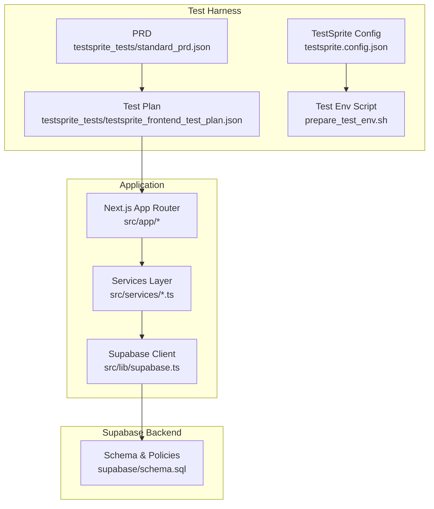
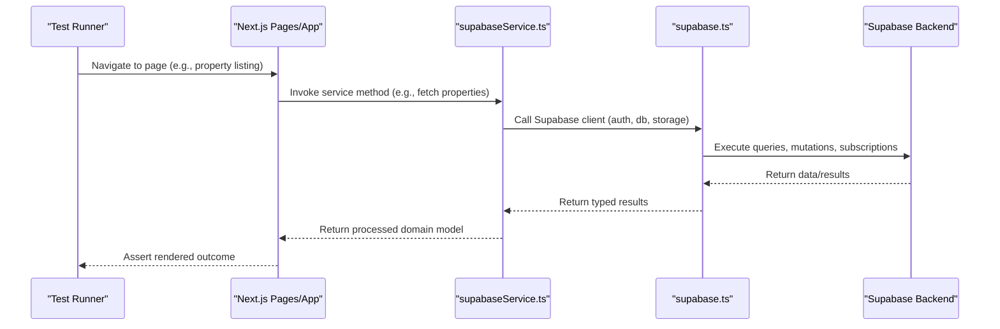
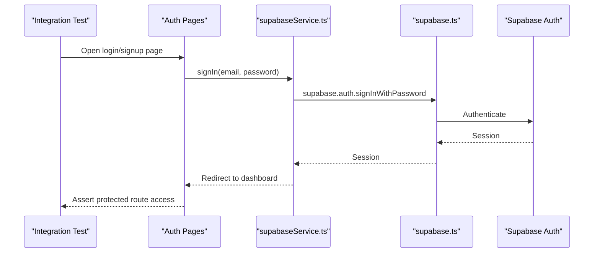
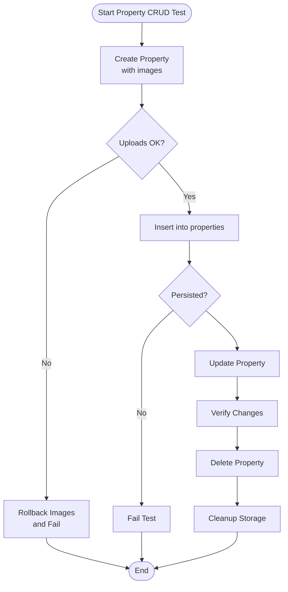
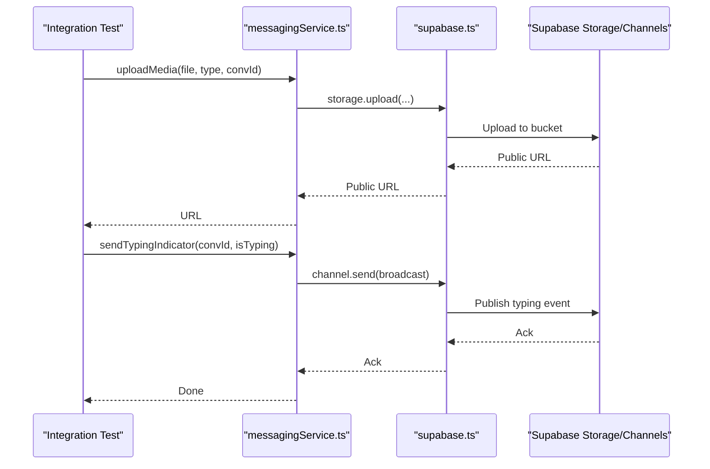
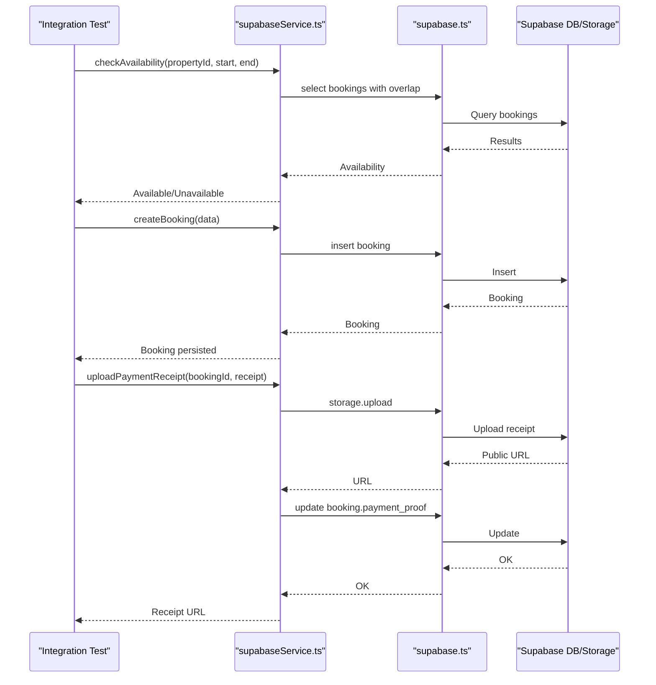
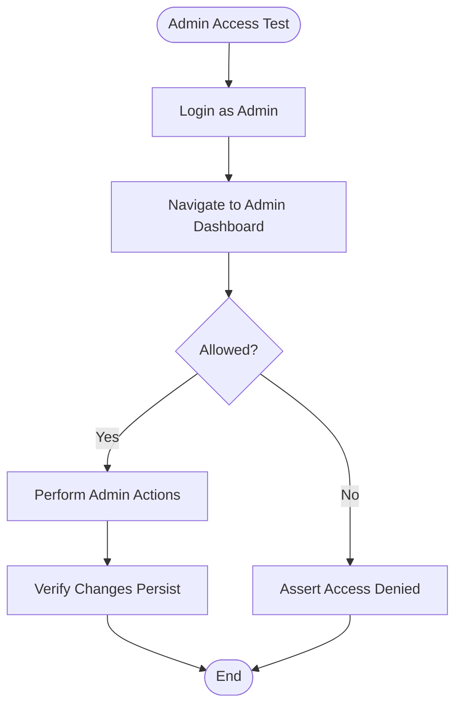
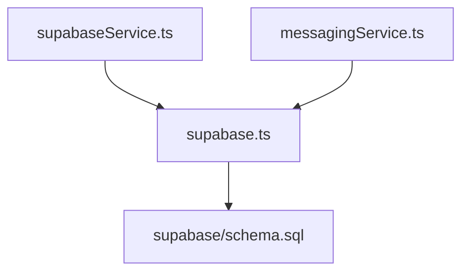

# Integration Testing

<cite>
**Referenced Files in This Document**
- [README.md](file://README.md)
- [package.json](file://package.json)
- [prepare_test_env.sh](file://prepare_test_env.sh)
- [testsprite.config.json](file://testsprite.config.json)
- [testsprite_tests/standard_prd.json](file://testsprite_tests/standard_prd.json)
- [testsprite_tests/testsprite_frontend_test_plan.json](file://testsprite_tests/testsprite_frontend_test_plan.json)
- [supabase/schema.sql](file://supabase/schema.sql)
- [src/lib/supabase.ts](file://src/lib/supabase.ts)
- [src/services/supabaseService.ts](file://src/services/supabaseService.ts)
- [src/services/messagingService.ts](file://src/services/messagingService.ts)
</cite>

## Table of Contents
1. [Introduction](#introduction)
2. [Project Structure](#project-structure)
3. [Core Components](#core-components)
4. [Architecture Overview](#architecture-overview)
5. [Detailed Component Analysis](#detailed-component-analysis)
6. [Dependency Analysis](#dependency-analysis)
7. [Performance Considerations](#performance-considerations)
8. [Troubleshooting Guide](#troubleshooting-guide)
9. [Conclusion](#conclusion)
10. [Appendices](#appendices)

## Introduction
This document provides comprehensive integration testing guidance for the Gamasa Properties platform. It focuses on strategies for component integration, service layer testing, and database connectivity validation against Supabase. It also documents testing patterns for Supabase integration, real-time subscriptions, API endpoint validation, authentication flows, property data retrieval, booking system integration, and messaging platform connectivity. Finally, it outlines test environment setup, database seeding, and integration test execution strategies tailored to the repository’s current tooling and configuration.

## Project Structure
The repository follows a Next.js application structure with a dedicated test harness configuration and a Supabase schema. Key areas relevant to integration testing include:
- Application entry points under src/app
- Supabase client initialization and storage utilities under src/lib
- Service abstractions for Supabase operations under src/services
- Supabase schema definitions under supabase
- Test configuration and plans under testsprite_tests and testsprite.config.json
- Test environment bootstrap script under prepare_test_env.sh

**Diagram sources**
- [testsprite.config.json](file://testsprite.config.json#L1-L36)
- [testsprite_tests/testsprite_frontend_test_plan.json](file://testsprite_tests/testsprite_frontend_test_plan.json#L1-L513)
- [testsprite_tests/standard_prd.json](file://testsprite_tests/standard_prd.json#L1-L159)
- [prepare_test_env.sh](file://prepare_test_env.sh#L1-L36)
- [src/lib/supabase.ts](file://src/lib/supabase.ts#L1-L68)
- [src/services/supabaseService.ts](file://src/services/supabaseService.ts#L1-L1384)
- [supabase/schema.sql](file://supabase/schema.sql#L1-L416)

**Section sources**
- [README.md](file://README.md#L1-L37)
- [package.json](file://package.json#L1-L42)
- [testsprite.config.json](file://testsprite.config.json#L1-L36)
- [testsprite_tests/standard_prd.json](file://testsprite_tests/standard_prd.json#L1-L159)
- [testsprite_tests/testsprite_frontend_test_plan.json](file://testsprite_tests/testsprite_frontend_test_plan.json#L1-L513)
- [prepare_test_env.sh](file://prepare_test_env.sh#L1-L36)
- [src/lib/supabase.ts](file://src/lib/supabase.ts#L1-L68)
- [src/services/supabaseService.ts](file://src/services/supabaseService.ts#L1-L1384)
- [supabase/schema.sql](file://supabase/schema.sql#L1-L416)

## Core Components
This section identifies the core components involved in integration testing:
- Supabase client initialization and storage utilities
- Services layer for Supabase operations (authentication, property CRUD, messaging, notifications, bookings)
- Supabase schema and policies governing data access and real-time subscriptions
- Test harness configuration and test plan

Key responsibilities:
- src/lib/supabase.ts: Creates the Supabase client, defines storage bucket constants, and exposes upload/delete helpers.
- src/services/supabaseService.ts: Provides a unified service facade for authentication, property management, favorites/unlocks, notifications, reviews, admin operations, messaging, and booking workflows. Includes a mock mode flag for isolated testing.
- src/services/messagingService.ts: Handles media uploads, typing indicators, and media permission flows via Supabase channels.
- supabase/schema.sql: Defines tables, RLS policies, triggers, and publication enabling real-time for messages.

**Section sources**
- [src/lib/supabase.ts](file://src/lib/supabase.ts#L1-L68)
- [src/services/supabaseService.ts](file://src/services/supabaseService.ts#L1-L1384)
- [src/services/messagingService.ts](file://src/services/messagingService.ts#L1-L123)
- [supabase/schema.sql](file://supabase/schema.sql#L1-L416)

## Architecture Overview
The integration testing architecture centers on validating end-to-end flows that span the UI, services, Supabase client, and backend schema/policies.

**Diagram sources**
- [src/services/supabaseService.ts](file://src/services/supabaseService.ts#L1-L1384)
- [src/lib/supabase.ts](file://src/lib/supabase.ts#L1-L68)
- [supabase/schema.sql](file://supabase/schema.sql#L1-L416)

## Detailed Component Analysis

### Authentication Integration Testing
Testing strategies:
- Validate sign-in/sign-up flows using Supabase Auth via the services layer.
- Verify session persistence and auto-refresh behavior configured in the Supabase client.
- Confirm role-based access control (RBAC) and RLS policies restrict unauthorized access.

Recommended test scenarios:
- Successful sign-in with valid credentials and navigation to protected pages.
- Sign-out and session cleanup.
- Attempted access to admin-only routes by non-admin users.

**Diagram sources**
- [src/services/supabaseService.ts](file://src/services/supabaseService.ts#L154-L202)
- [src/lib/supabase.ts](file://src/lib/supabase.ts#L1-L68)
- [supabase/schema.sql](file://supabase/schema.sql#L187-L250)

**Section sources**
- [src/services/supabaseService.ts](file://src/services/supabaseService.ts#L154-L202)
- [src/lib/supabase.ts](file://src/lib/supabase.ts#L1-L68)
- [supabase/schema.sql](file://supabase/schema.sql#L187-L250)

### Property Data Retrieval and CRUD Integration Testing
Testing strategies:
- Validate property listing retrieval with filters (status, category, area, price range, bedrooms, bathrooms, features).
- Validate property creation with image uploads and rollback on failures.
- Validate property updates and deletions, including associated storage cleanup.

Recommended test scenarios:
- Fetch properties with various filters and assert returned records match criteria.
- Create a property with valid data and images; assert status transitions and storage entries.
- Update property details and verify persistence.
- Delete property and confirm associated images are removed.

**Diagram sources**
- [src/services/supabaseService.ts](file://src/services/supabaseService.ts#L258-L440)
- [src/lib/supabase.ts](file://src/lib/supabase.ts#L34-L67)
- [supabase/schema.sql](file://supabase/schema.sql#L41-L168)

**Section sources**
- [src/services/supabaseService.ts](file://src/services/supabaseService.ts#L258-L440)
- [src/lib/supabase.ts](file://src/lib/supabase.ts#L34-L67)
- [supabase/schema.sql](file://supabase/schema.sql#L41-L168)

### Messaging Platform Connectivity Integration Testing
Testing strategies:
- Validate media uploads (images and voice notes) to Supabase storage buckets.
- Validate media permission requests and system messages.
- Validate typing indicator broadcasting and subscription via Supabase channels.

Recommended test scenarios:
- Upload an image and voice note to respective buckets; assert public URLs.
- Request media permission and verify system message delivery.
- Broadcast typing indicator and subscribe to typing events; assert real-time updates.

**Diagram sources**
- [src/services/messagingService.ts](file://src/services/messagingService.ts#L1-L123)
- [src/lib/supabase.ts](file://src/lib/supabase.ts#L1-L68)
- [supabase/schema.sql](file://supabase/schema.sql#L337-L416)

**Section sources**
- [src/services/messagingService.ts](file://src/services/messagingService.ts#L1-L123)
- [src/lib/supabase.ts](file://src/lib/supabase.ts#L1-L68)
- [supabase/schema.sql](file://supabase/schema.sql#L337-L416)

### Booking System Integration Testing
Testing strategies:
- Validate availability checks against overlapping bookings.
- Validate booking creation with pricing calculations and storage receipts.
- Validate booking status updates and retrieval by user.

Recommended test scenarios:
- Check availability for a given period; assert availability status.
- Create a booking with valid tenant details; assert persisted booking and derived totals.
- Upload a payment receipt; assert URL update and booking state.
- Retrieve user bookings and verify property joins and ordering.

**Diagram sources**
- [src/services/supabaseService.ts](file://src/services/supabaseService.ts#L1049-L1384)
- [src/lib/supabase.ts](file://src/lib/supabase.ts#L1-L68)
- [supabase/schema.sql](file://supabase/schema.sql#L94-L128)

**Section sources**
- [src/services/supabaseService.ts](file://src/services/supabaseService.ts#L1049-L1384)
- [src/lib/supabase.ts](file://src/lib/supabase.ts#L1-L68)
- [supabase/schema.sql](file://supabase/schema.sql#L94-L128)

### Admin Dashboard Functionality Integration Testing
Testing strategies:
- Validate admin-only access to admin routes and dashboards.
- Validate admin operations such as user profile updates and listing approvals.

Recommended test scenarios:
- Access admin dashboard as admin; assert metrics and management controls.
- Attempt to access admin dashboard as non-admin; assert denial.
- Update user profile via admin; assert persistence.

**Diagram sources**
- [src/services/supabaseService.ts](file://src/services/supabaseService.ts#L696-L737)
- [supabase/schema.sql](file://supabase/schema.sql#L306-L336)

**Section sources**
- [src/services/supabaseService.ts](file://src/services/supabaseService.ts#L696-L737)
- [supabase/schema.sql](file://supabase/schema.sql#L306-L336)

## Dependency Analysis
This section maps dependencies among components relevant to integration testing.

**Diagram sources**
- [src/services/supabaseService.ts](file://src/services/supabaseService.ts#L1-L1384)
- [src/services/messagingService.ts](file://src/services/messagingService.ts#L1-L123)
- [src/lib/supabase.ts](file://src/lib/supabase.ts#L1-L68)
- [supabase/schema.sql](file://supabase/schema.sql#L1-L416)

**Section sources**
- [src/services/supabaseService.ts](file://src/services/supabaseService.ts#L1-L1384)
- [src/services/messagingService.ts](file://src/services/messagingService.ts#L1-L123)
- [src/lib/supabase.ts](file://src/lib/supabase.ts#L1-L68)
- [supabase/schema.sql](file://supabase/schema.sql#L1-L416)

## Performance Considerations
- Use headless browser configuration and viewport sizing to stabilize page loads during integration tests.
- Configure global and navigation timeouts to accommodate slower environments.
- Prefer batched operations where feasible (e.g., bulk property fetches) to reduce test runtime.
- Leverage retries on failure to mitigate transient network conditions.

[No sources needed since this section provides general guidance]

## Troubleshooting Guide
Common issues and resolutions:
- Missing Supabase environment variables: The client logs warnings and falls back to placeholders. Ensure NEXT_PUBLIC_SUPABASE_URL and NEXT_PUBLIC_SUPABASE_ANON_KEY are set in the environment.
- Port conflicts during test environment startup: The script kills processes using port 3000 before starting the server. Verify the script runs successfully and the server responds to health checks.
- Storage upload failures: Validate bucket names and file sizes/types. Messaging service throws explicit errors for oversized or unsupported files.
- Real-time subscription issues: Ensure the messages table is included in the realtime publication and that channels are subscribed before sending broadcast events.

**Section sources**
- [src/lib/supabase.ts](file://src/lib/supabase.ts#L1-L68)
- [prepare_test_env.sh](file://prepare_test_env.sh#L1-L36)
- [src/services/messagingService.ts](file://src/services/messagingService.ts#L1-L123)
- [supabase/schema.sql](file://supabase/schema.sql#L406-L416)

## Conclusion
The integration testing approach leverages a clear separation of concerns: UI pages, a services layer, and a Supabase backend with robust RLS and real-time capabilities. By focusing on end-to-end flows—authentication, property CRUD, messaging, bookings, and admin operations—and aligning with the provided test harness configuration, teams can achieve reliable, repeatable integration tests. Proper environment setup, realistic data modeling, and thoughtful error handling are essential to maintaining test stability and coverage.

[No sources needed since this section summarizes without analyzing specific files]

## Appendices

### Test Environment Setup and Execution
- Build and start the production server for stable integration tests.
- Prepare test assets (e.g., property images) and configure the test runner’s asset paths.
- Configure timeouts, viewport, retries, and environment variables for the test harness.

**Section sources**
- [prepare_test_env.sh](file://prepare_test_env.sh#L1-L36)
- [testsprite.config.json](file://testsprite.config.json#L1-L36)

### Database Seeding and Supabase Schema Validation
- Apply the schema to Supabase to define tables, RLS policies, triggers, and realtime publication.
- Seed initial data as needed for tests (e.g., test users, properties, conversations) to support realistic scenarios.

**Section sources**
- [supabase/schema.sql](file://supabase/schema.sql#L1-L416)

### Example Integration Tests (by scenario)
- User authentication: Navigate to auth pages, submit forms, and assert protected route access.
- Property CRUD operations: Create property with images, update details, and delete with cleanup.
- Booking workflows: Check availability, create booking, upload receipt, and verify status updates.
- Admin dashboard: Access admin routes, perform management actions, and assert RBAC enforcement.

**Section sources**
- [testsprite_tests/testsprite_frontend_test_plan.json](file://testsprite_tests/testsprite_frontend_test_plan.json#L1-L513)
- [testsprite_tests/standard_prd.json](file://testsprite_tests/standard_prd.json#L1-L159)