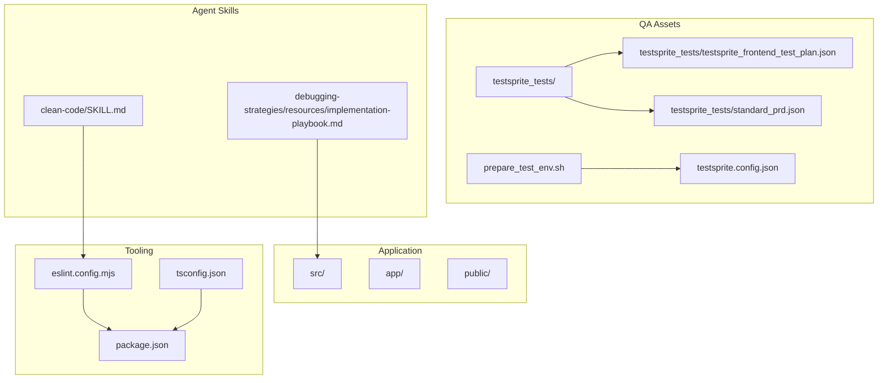
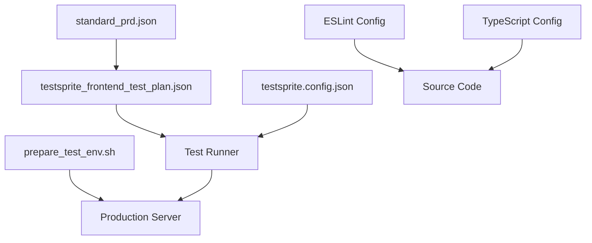
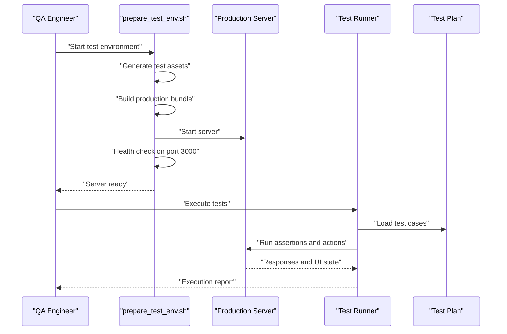
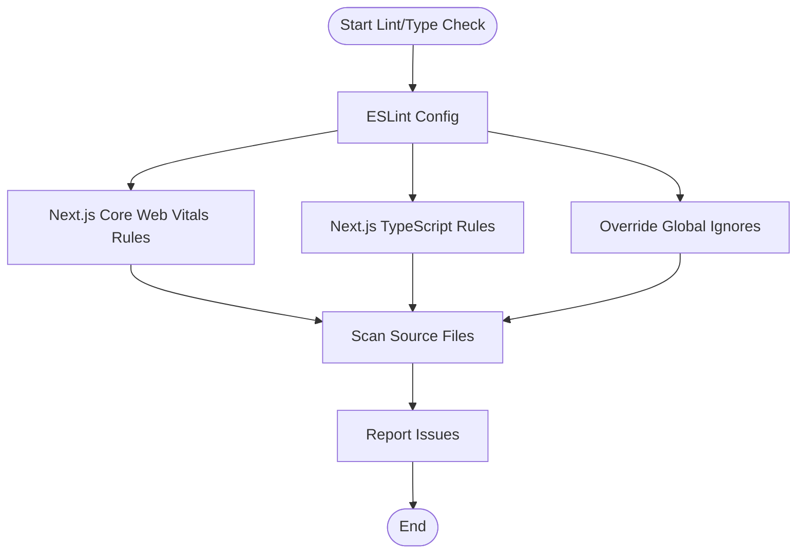
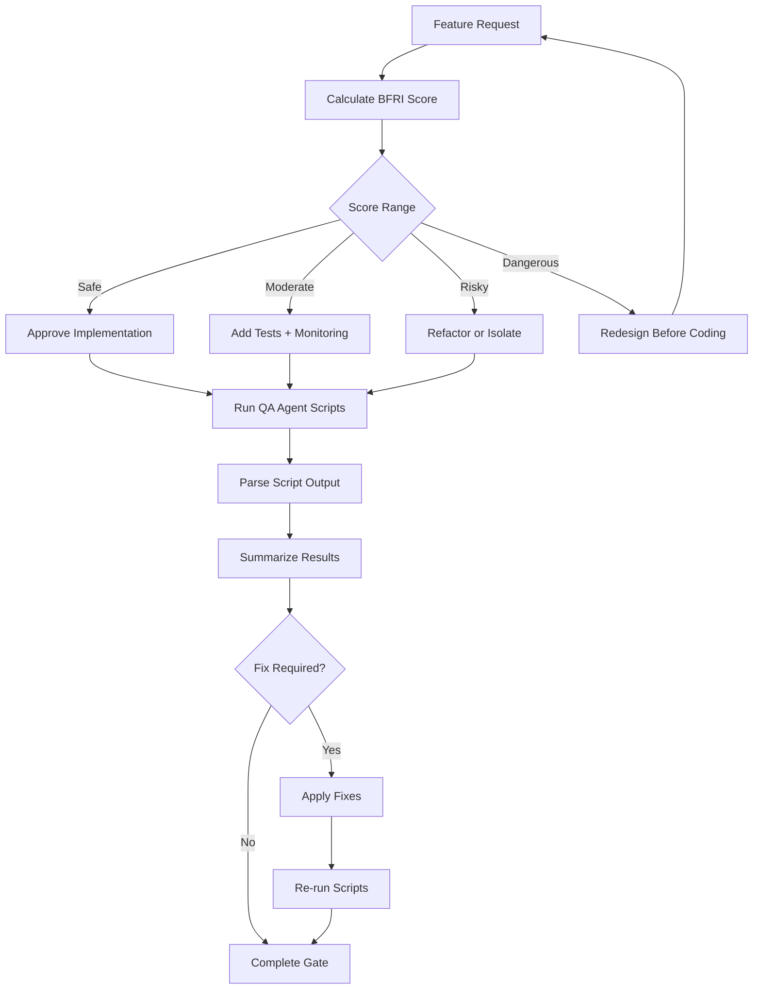
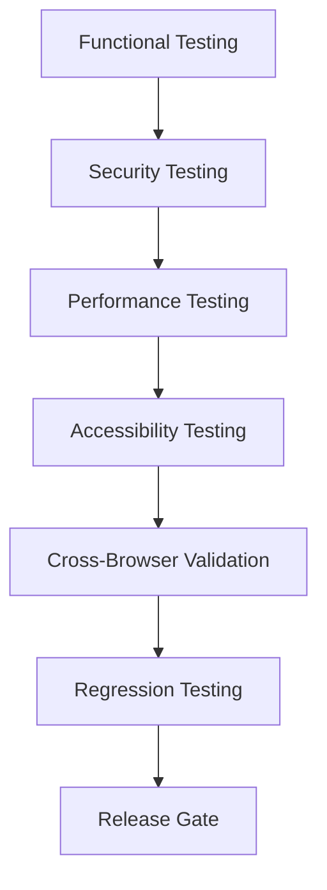
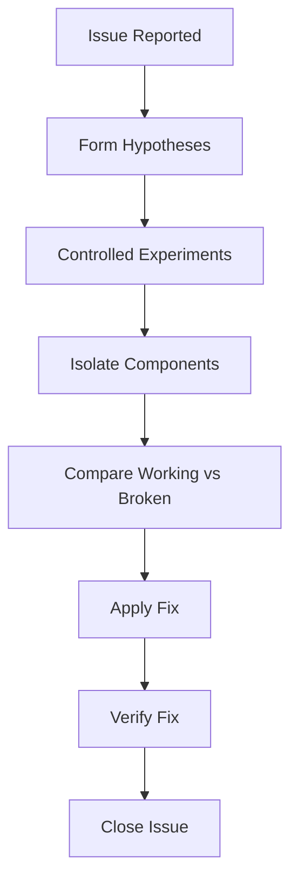
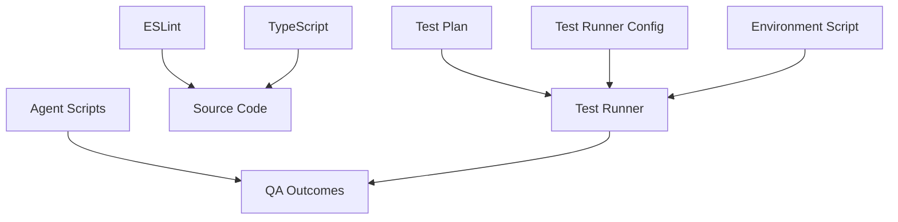

# Quality Assurance Processes

<cite>
**Referenced Files in This Document**
- [package.json](file://package.json)
- [README.md](file://README.md)
- [eslint.config.mjs](file://eslint.config.mjs)
- [tsconfig.json](file://tsconfig.json)
- [prepare_test_env.sh](file://prepare_test_env.sh)
- [testsprite.config.json](file://testsprite.config.json)
- [testsprite_frontend_test_plan.json](file://testsprite_tests/testsprite_frontend_test_plan.json)
- [standard_prd.json](file://testsprite_tests/standard_prd.json)
- [SKILL.md](file://.agent/skills/clean-code/SKILL.md)
- [implementation-playbook.md](file://.agent/skills/debugging-strategies/resources/implementation-playbook.md)
</cite>

## Table of Contents
1. [Introduction](#introduction)
2. [Project Structure](#project-structure)
3. [Core Components](#core-components)
4. [Architecture Overview](#architecture-overview)
5. [Detailed Component Analysis](#detailed-component-analysis)
6. [Dependency Analysis](#dependency-analysis)
7. [Performance Considerations](#performance-considerations)
8. [Troubleshooting Guide](#troubleshooting-guide)
9. [Conclusion](#conclusion)
10. [Appendices](#appendices)

## Introduction
This document describes the quality assurance (QA) processes and quality control measures for the Gamasa Properties web application. It explains the testing workflow, code review processes, quality gates, automated quality checks, code coverage requirements, performance benchmarking, QA phases, bug tracking, regression testing strategies, quality metrics, test result analysis, and continuous improvement processes. It also covers manual testing procedures, accessibility testing, cross-browser compatibility validation, and performance testing methodologies.

## Project Structure
The project follows a Next.js application structure with a dedicated QA and testing toolkit:
- Application code resides under src/ and app/.
- QA assets and test plans are located under testsprite_tests/.
- Test runner configuration is defined in testsprite.config.json.
- A shell script automates test environment setup and lifecycle.
- ESLint and TypeScript configurations define linting and compilation standards.
- Agent skills provide reusable QA tooling and guidelines.

**Diagram sources**
- [testsprite.config.json](file://testsprite.config.json#L1-L36)
- [testsprite_frontend_test_plan.json](file://testsprite_tests/testsprite_frontend_test_plan.json#L1-L513)
- [standard_prd.json](file://testsprite_tests/standard_prd.json#L1-L159)
- [prepare_test_env.sh](file://prepare_test_env.sh#L1-L36)
- [eslint.config.mjs](file://eslint.config.mjs#L1-L19)
- [tsconfig.json](file://tsconfig.json#L1-L43)
- [package.json](file://package.json#L1-L42)
- [SKILL.md](file://.agent/skills/clean-code/SKILL.md#L1-L202)
- [implementation-playbook.md](file://.agent/skills/debugging-strategies/resources/implementation-playbook.md#L83-L416)

**Section sources**
- [package.json](file://package.json#L1-L42)
- [README.md](file://README.md#L1-L37)
- [eslint.config.mjs](file://eslint.config.mjs#L1-L19)
- [tsconfig.json](file://tsconfig.json#L1-L43)
- [prepare_test_env.sh](file://prepare_test_env.sh#L1-L36)
- [testsprite.config.json](file://testsprite.config.json#L1-L36)
- [testsprite_frontend_test_plan.json](file://testsprite_tests/testsprite_frontend_test_plan.json#L1-L513)
- [standard_prd.json](file://testsprite_tests/standard_prd.json#L1-L159)
- [.agent/skills/clean-code/SKILL.md](file://.agent/skills/clean-code/SKILL.md#L1-L202)
- [.agent/skills/debugging-strategies/resources/implementation-playbook.md](file://.agent/skills/debugging-strategies/resources/implementation-playbook.md#L83-L416)

## Core Components
- Test Runner Configuration: Defines headless mode, viewport, timeouts, retries, environment variables, asset upload paths, and selectors for map and loading indicators.
- Test Plan: A JSON test plan enumerating functional, security, and performance test cases with steps, categories, and priorities.
- Product Requirements Definition: A PRD that outlines goals, features, user flows, and validation criteria used to derive test cases.
- Test Environment Setup: A shell script that prepares the environment, generates test assets, builds the production bundle, starts the server, and waits for readiness.
- Linting and Type Checking: ESLint configuration extends Next.js core-web-vitals and TypeScript configs; tsconfig enforces strictness and module resolution.
- QA Agent Scripts: Skill mappings and output handling for automated QA tasks (accessibility checks, performance audits, security scans, etc.).

**Section sources**
- [testsprite.config.json](file://testsprite.config.json#L1-L36)
- [testsprite_frontend_test_plan.json](file://testsprite_tests/testsprite_frontend_test_plan.json#L1-L513)
- [standard_prd.json](file://testsprite_tests/standard_prd.json#L1-L159)
- [prepare_test_env.sh](file://prepare_test_env.sh#L1-L36)
- [eslint.config.mjs](file://eslint.config.mjs#L1-L19)
- [tsconfig.json](file://tsconfig.json#L1-L43)
- [.agent/skills/clean-code/SKILL.md](file://.agent/skills/clean-code/SKILL.md#L146-L202)

## Architecture Overview
The QA architecture integrates automated test execution with environment orchestration and linting/type checking. The test runner consumes the test plan and configuration, launches a production-like server via the environment script, and executes tests against the running application. Agent skills provide reusable QA tooling for accessibility, performance, and security.

**Diagram sources**
- [testsprite.config.json](file://testsprite.config.json#L1-L36)
- [testsprite_frontend_test_plan.json](file://testsprite_tests/testsprite_frontend_test_plan.json#L1-L513)
- [standard_prd.json](file://testsprite_tests/standard_prd.json#L1-L159)
- [prepare_test_env.sh](file://prepare_test_env.sh#L1-L36)
- [eslint.config.mjs](file://eslint.config.mjs#L1-L19)
- [tsconfig.json](file://tsconfig.json#L1-L43)

## Detailed Component Analysis

### Test Execution Workflow
The test execution workflow orchestrates environment preparation, server startup, test plan execution, and result reporting. It uses a production build to minimize flakiness and ensures deterministic behavior.

**Diagram sources**
- [prepare_test_env.sh](file://prepare_test_env.sh#L1-L36)
- [testsprite.config.json](file://testsprite.config.json#L1-L36)
- [testsprite_frontend_test_plan.json](file://testsprite_tests/testsprite_frontend_test_plan.json#L1-L513)

**Section sources**
- [prepare_test_env.sh](file://prepare_test_env.sh#L1-L36)
- [testsprite.config.json](file://testsprite.config.json#L1-L36)
- [testsprite_frontend_test_plan.json](file://testsprite_tests/testsprite_frontend_test_plan.json#L1-L513)

### Automated Quality Checks
Automated quality checks are defined by linting and type checking configurations:
- ESLint extends Next.js core-web-vitals and TypeScript configurations, overriding default ignores to include necessary paths.
- TypeScript configuration enforces strict type checking, module resolution, and JSX handling.

**Diagram sources**
- [eslint.config.mjs](file://eslint.config.mjs#L1-L19)
- [tsconfig.json](file://tsconfig.json#L1-L43)

**Section sources**
- [eslint.config.mjs](file://eslint.config.mjs#L1-L19)
- [tsconfig.json](file://tsconfig.json#L1-L43)

### Code Review and Quality Gates
Code review and quality gates are supported by:
- Backend feasibility assessment (BFRI) scoring to evaluate architectural fit, testability, complexity, data risk, and operational risk.
- Agent skill mappings for QA tooling (accessibility, performance, security, linting, type coverage).
- Output handling rules requiring structured summarization and explicit user confirmation before fixes.

**Diagram sources**
- [.agent/skills/clean-code/SKILL.md](file://.agent/skills/clean-code/SKILL.md#L24-L56)
- [.agent/skills/clean-code/SKILL.md](file://.agent/skills/clean-code/SKILL.md#L146-L202)

**Section sources**
- [.agent/skills/clean-code/SKILL.md](file://.agent/skills/clean-code/SKILL.md#L24-L56)
- [.agent/skills/clean-code/SKILL.md](file://.agent/skills/clean-code/SKILL.md#L146-L202)

### QA Testing Phases
The QA process is organized into phases aligned with the test plan and PRD:
- Functional Testing: Verifies homepage performance, search filtering, map markers, authentication, profile management, property submission, favorites, messaging, notifications, bookings, and admin dashboard.
- Security Testing: Ensures admin access control and proper denial of unauthorized access.
- Performance Testing: Benchmarks homepage load time and navigation responsiveness.
- Accessibility Testing: Uses agent scripts to audit accessibility.
- Cross-Browser Compatibility: Defined by viewport and selector configuration; validated via manual checks and agent scripts.
- Regression Testing: Driven by the test plan; executed on every build and before releases.

**Section sources**
- [testsprite_frontend_test_plan.json](file://testsprite_tests/testsprite_frontend_test_plan.json#L1-L513)
- [standard_prd.json](file://testsprite_tests/standard_prd.json#L1-L159)
- [testsprite.config.json](file://testsprite.config.json#L1-L36)
- [.agent/skills/clean-code/SKILL.md](file://.agent/skills/clean-code/SKILL.md#L146-L202)

### Bug Tracking and Resolution
Bug tracking follows a structured approach:
- Hypothesis formation: Identify what changed, what is different, and where failure could occur.
- Testing and verification: Use binary search, logging, component isolation, and differential comparisons.
- Fix verification: Re-run scripts and tests to confirm resolution.

**Diagram sources**
- [.agent/skills/debugging-strategies/resources/implementation-playbook.md](file://.agent/skills/debugging-strategies/resources/implementation-playbook.md#L83-L416)

**Section sources**
- [.agent/skills/debugging-strategies/resources/implementation-playbook.md](file://.agent/skills/debugging-strategies/resources/implementation-playbook.md#L83-L416)

### Manual Testing Procedures
Manual testing complements automation:
- Interactive map marker validation and click-through behavior.
- Authentication flows with valid and invalid credentials.
- Profile updates with input validation.
- Property submission multi-step form and photo uploads.
- Favorites persistence across sessions.
- Messaging and notifications.
- Booking creation, updates, and cancellations.
- Admin dashboard access control.

**Section sources**
- [testsprite_frontend_test_plan.json](file://testsprite_tests/testsprite_frontend_test_plan.json#L1-L513)

### Accessibility Testing
Accessibility checks are integrated via agent scripts:
- Use dedicated scripts for accessibility audits.
- Summarize findings and require explicit confirmation before applying fixes.
- Re-run checks after fixes to confirm remediation.

**Section sources**
- [.agent/skills/clean-code/SKILL.md](file://.agent/skills/clean-code/SKILL.md#L146-L202)

### Cross-Browser Compatibility Validation
Compatibility is addressed by:
- Defining viewport and selector configuration for consistent behavior.
- Validating map and loading indicators across browsers.
- Performing manual checks on target browsers.

**Section sources**
- [testsprite.config.json](file://testsprite.config.json#L1-L36)

### Performance Testing Methodologies
Performance testing focuses on:
- Homepage load time thresholds.
- Navigation and action timeouts.
- Retries on failure to reduce flakiness.
- Production builds to minimize variability.

**Section sources**
- [testsprite.config.json](file://testsprite.config.json#L1-L36)
- [prepare_test_env.sh](file://prepare_test_env.sh#L1-L36)

### Quality Metrics and Test Result Analysis
Quality metrics derived from the test plan and PRD include:
- Load time thresholds (e.g., homepage under 3 seconds).
- Search result accuracy and completeness.
- Map marker responsiveness and correctness.
- Authentication success rates and error handling.
- Profile validation and persistence.
- Property submission success and media upload functionality.
- Favorites persistence and retrieval.
- Messaging delivery and permission enforcement.
- Real-time notification arrival.
- Booking lifecycle integrity.
- Admin dashboard access control.

Test result analysis involves:
- Categorizing failures by type (functional, security, performance).
- Prioritizing fixes based on severity and impact.
- Tracking regressions across test runs.
- Reporting pass/fail rates per category and priority.

**Section sources**
- [standard_prd.json](file://testsprite_tests/standard_prd.json#L37-L49)
- [testsprite_frontend_test_plan.json](file://testsprite_tests/testsprite_frontend_test_plan.json#L1-L513)

### Continuous Improvement Processes
Continuous improvement is achieved through:
- Regular execution of the test plan on every build.
- Re-running agent scripts to catch regressions.
- Updating the test plan based on new features and bug reports.
- Adjusting configuration (timeouts, retries, selectors) based on observed flakiness.
- Maintaining strict linting and type checking to prevent defects early.

**Section sources**
- [testsprite.config.json](file://testsprite.config.json#L1-L36)
- [eslint.config.mjs](file://eslint.config.mjs#L1-L19)
- [tsconfig.json](file://tsconfig.json#L1-L43)
- [.agent/skills/clean-code/SKILL.md](file://.agent/skills/clean-code/SKILL.md#L146-L202)

## Dependency Analysis
The QA pipeline depends on:
- Test runner configuration and test plan for execution.
- Environment setup script for server lifecycle.
- Linting and type checking for code quality.
- Agent skills for automated QA tasks.

**Diagram sources**
- [testsprite.config.json](file://testsprite.config.json#L1-L36)
- [testsprite_frontend_test_plan.json](file://testsprite_tests/testsprite_frontend_test_plan.json#L1-L513)
- [prepare_test_env.sh](file://prepare_test_env.sh#L1-L36)
- [eslint.config.mjs](file://eslint.config.mjs#L1-L19)
- [tsconfig.json](file://tsconfig.json#L1-L43)
- [.agent/skills/clean-code/SKILL.md](file://.agent/skills/clean-code/SKILL.md#L146-L202)

**Section sources**
- [testsprite.config.json](file://testsprite.config.json#L1-L36)
- [testsprite_frontend_test_plan.json](file://testsprite_tests/testsprite_frontend_test_plan.json#L1-L513)
- [prepare_test_env.sh](file://prepare_test_env.sh#L1-L36)
- [eslint.config.mjs](file://eslint.config.mjs#L1-L19)
- [tsconfig.json](file://tsconfig.json#L1-L43)
- [.agent/skills/clean-code/SKILL.md](file://.agent/skills/clean-code/SKILL.md#L146-L202)

## Performance Considerations
- Use production builds during tests to minimize variability.
- Configure timeouts and retries to handle slow environments.
- Monitor load times and navigation performance.
- Validate selectors for map containers and loading spinners to ensure reliable UI interactions.

**Section sources**
- [prepare_test_env.sh](file://prepare_test_env.sh#L1-L36)
- [testsprite.config.json](file://testsprite.config.json#L1-L36)

## Troubleshooting Guide
Common QA issues and resolutions:
- Port conflicts: The environment script kills processes on port 3000 before starting the server.
- Server readiness: Health checks ensure the server is fully started before tests begin.
- Flaky tests: Increase retries and adjust timeouts in the test runner configuration.
- Selector mismatches: Update selectors for map containers and loading indicators in the configuration.

**Section sources**
- [prepare_test_env.sh](file://prepare_test_env.sh#L1-L36)
- [testsprite.config.json](file://testsprite.config.json#L1-L36)

## Conclusion
The QA processes for Gamasa Properties integrate automated test execution, environment orchestration, linting, and type checking with reusable agent scripts for accessibility, performance, and security. The test plan and PRD define clear acceptance criteria, while structured debugging and continuous improvement practices ensure high-quality releases.

## Appendices
- Example test case IDs and categories are defined in the test plan.
- Agent skill mappings provide standardized commands for QA tasks.

**Section sources**
- [testsprite_frontend_test_plan.json](file://testsprite_tests/testsprite_frontend_test_plan.json#L1-L513)
- [.agent/skills/clean-code/SKILL.md](file://.agent/skills/clean-code/SKILL.md#L146-L202)