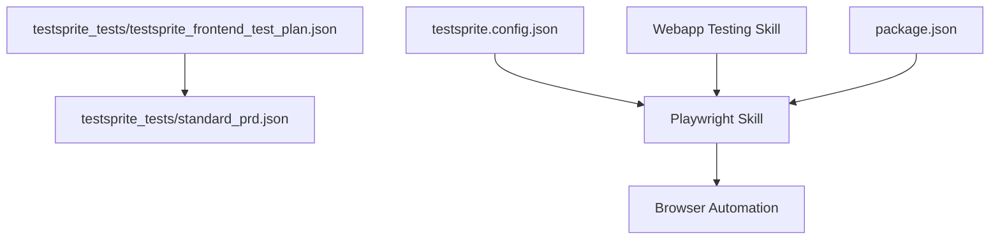
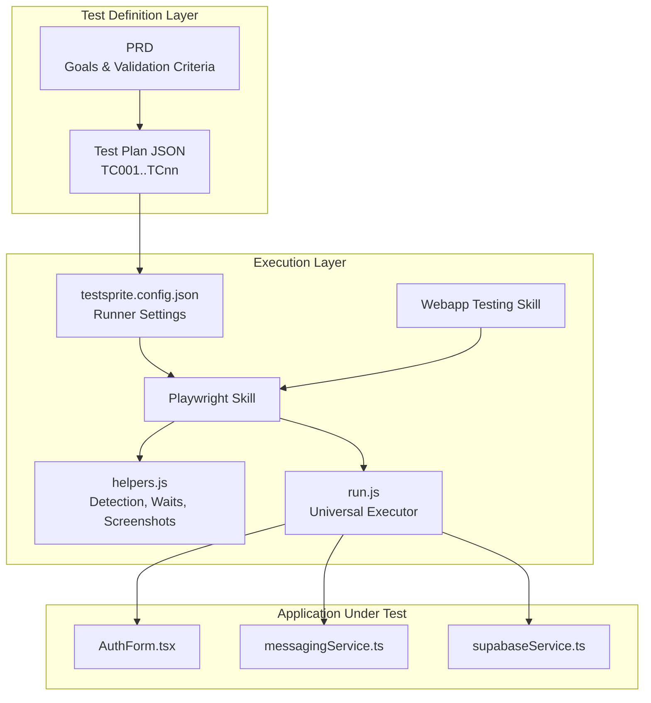
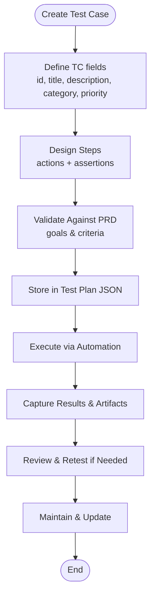
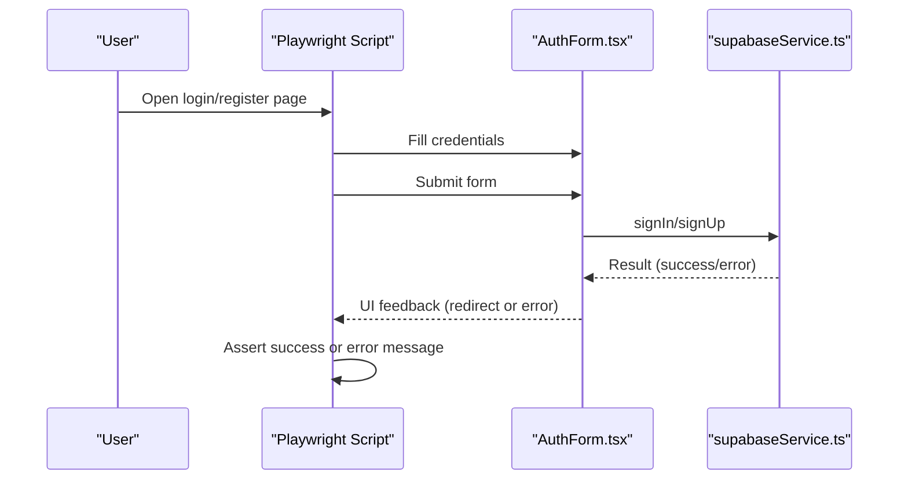
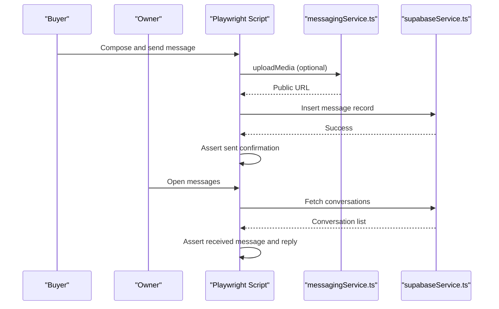
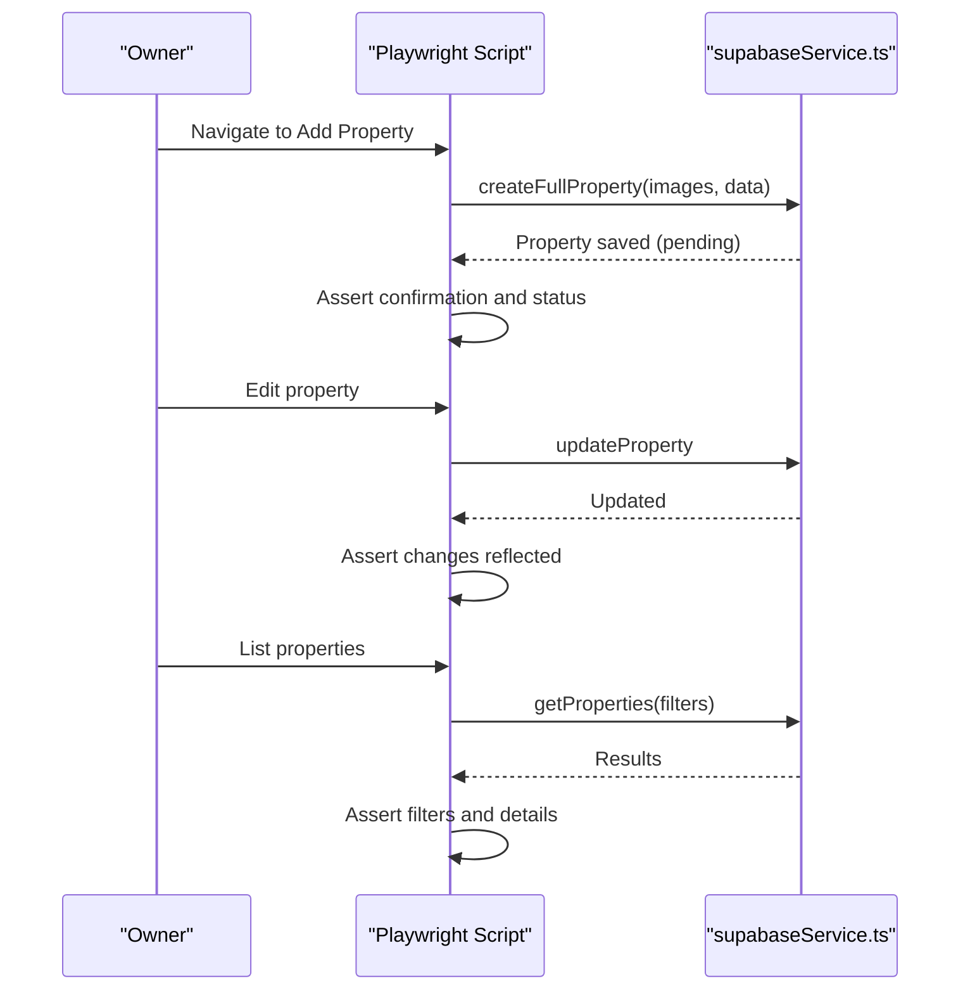
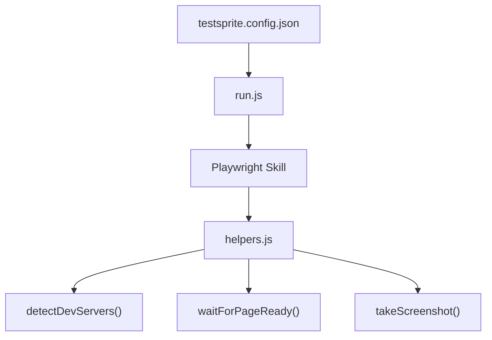

# Test Case Management

<cite>
**Referenced Files in This Document**
- [testsprite_frontend_test_plan.json](file://testsprite_tests/testsprite_frontend_test_plan.json)
- [standard_prd.json](file://testsprite_tests/standard_prd.json)
- [testsprite.config.json](file://testsprite.config.json)
- [SKILL.md](file://.agent/skills/webapp-testing/SKILL.md)
- [SKILL.md](file://.agent/skills/playwright-skill/SKILL.md)
- [run.js](file://.agent/skills/playwright-skill/run.js)
- [helpers.js](file://.agent/skills/playwright-skill/lib/helpers.js)
- [AuthForm.tsx](file://src/components/auth/AuthForm.tsx)
- [messagingService.ts](file://src/services/messagingService.ts)
- [supabaseService.ts](file://src/services/supabaseService.ts)
- [package.json](file://package.json)
</cite>

## Table of Contents
1. [Introduction](#introduction)
2. [Project Structure](#project-structure)
3. [Core Components](#core-components)
4. [Architecture Overview](#architecture-overview)
5. [Detailed Component Analysis](#detailed-component-analysis)
6. [Dependency Analysis](#dependency-analysis)
7. [Performance Considerations](#performance-considerations)
8. [Troubleshooting Guide](#troubleshooting-guide)
9. [Conclusion](#conclusion)
10. [Appendices](#appendices)

## Introduction
This document defines a comprehensive test case management and organization strategy for the Gamasa Properties web application. It explains how test cases are structured, categorized by functional areas, prioritized, and executed. It also documents the test plan JSON format, test case IDs, hierarchical organization, lifecycle from creation to maintenance, design patterns, step-by-step execution flows, assertion strategies, and practical examples across authentication, property management, booking system, and messaging. Finally, it covers maintenance, regression testing strategies, and test coverage tracking.

## Project Structure
The repository provides a dedicated test plan and configuration for frontend testing:
- A JSON test plan enumerates end-to-end scenarios across functional areas.
- A configuration file defines runtime behavior for the test runner (headless mode, timeouts, retries, environment variables).
- A PRD outlines product goals, key features, and validation criteria aligned with test coverage.
- Skills for webapp and Playwright testing provide automation capabilities and helper utilities.

**Diagram sources**
- [testsprite_frontend_test_plan.json](file://testsprite_tests/testsprite_frontend_test_plan.json#L1-L513)
- [standard_prd.json](file://testsprite_tests/standard_prd.json#L1-L159)
- [testsprite.config.json](file://testsprite.config.json#L1-L36)
- [SKILL.md](file://.agent/skills/webapp-testing/SKILL.md#L1-L96)
- [SKILL.md](file://.agent/skills/playwright-skill/SKILL.md#L1-L454)
- [package.json](file://package.json#L1-L42)

**Section sources**
- [testsprite_frontend_test_plan.json](file://testsprite_tests/testsprite_frontend_test_plan.json#L1-L513)
- [standard_prd.json](file://testsprite_tests/standard_prd.json#L1-L159)
- [testsprite.config.json](file://testsprite.config.json#L1-L36)
- [SKILL.md](file://.agent/skills/webapp-testing/SKILL.md#L1-L96)
- [SKILL.md](file://.agent/skills/playwright-skill/SKILL.md#L1-L454)
- [package.json](file://package.json#L1-L42)

## Core Components
- Test Plan JSON: Defines test cases with identifiers, titles, descriptions, categories, priorities, and step sequences containing action/assertion nodes.
- PRD: Provides product overview, core goals, key features, user flow summary, and validation criteria that align with test coverage targets.
- Test Runner Configuration: Controls headless mode, viewport, timeouts, retries, environment variables, asset upload paths, and reusable selectors.
- Automation Skills: Provide a framework for browser automation, reconnaissance patterns, and helper utilities for reliable test execution.

Key responsibilities:
- Test Plan JSON: Central registry of test cases and their execution steps.
- PRD: Validates that test coverage targets align with product goals and validation criteria.
- Test Runner Configuration: Ensures deterministic execution and robustness against flakiness.
- Automation Skills: Enable scalable, maintainable browser automation with helper utilities.

**Section sources**
- [testsprite_frontend_test_plan.json](file://testsprite_tests/testsprite_frontend_test_plan.json#L1-L513)
- [standard_prd.json](file://testsprite_tests/standard_prd.json#L1-L159)
- [testsprite.config.json](file://testsprite.config.json#L1-L36)
- [SKILL.md](file://.agent/skills/webapp-testing/SKILL.md#L16-L33)
- [SKILL.md](file://.agent/skills/playwright-skill/SKILL.md#L19-L44)

## Architecture Overview
The test management architecture integrates test plans, configuration, and automation skills to deliver repeatable, observable, and maintainable tests.

**Diagram sources**
- [testsprite_frontend_test_plan.json](file://testsprite_tests/testsprite_frontend_test_plan.json#L1-L513)
- [standard_prd.json](file://testsprite_tests/standard_prd.json#L1-L159)
- [testsprite.config.json](file://testsprite.config.json#L1-L36)
- [SKILL.md](file://.agent/skills/webapp-testing/SKILL.md#L1-L96)
- [SKILL.md](file://.agent/skills/playwright-skill/SKILL.md#L1-L454)
- [run.js](file://.agent/skills/playwright-skill/run.js#L1-L229)
- [helpers.js](file://.agent/skills/playwright-skill/lib/helpers.js#L1-L442)
- [AuthForm.tsx](file://src/components/auth/AuthForm.tsx#L1-L150)
- [messagingService.ts](file://src/services/messagingService.ts#L1-L123)
- [supabaseService.ts](file://src/services/supabaseService.ts#L1-L800)

## Detailed Component Analysis

### Test Plan JSON Format and Lifecycle
- Structure: An array of test case objects with fields: id, title, description, category, priority, and steps.
- Steps: Ordered sequence of action and assertion nodes describing navigation, interactions, validations, and outcomes.
- Categories: Functional and security categories enable grouping and targeted execution.
- Priority: High, Medium, Low labels guide test selection for smoke/sanity and regression suites.
- Lifecycle: Creation (design from PRD), refinement (step alignment), execution (via automation), feedback (results and screenshots), maintenance (updates with feature changes).

**Section sources**
- [testsprite_frontend_test_plan.json](file://testsprite_tests/testsprite_frontend_test_plan.json#L1-L513)
- [standard_prd.json](file://testsprite_tests/standard_prd.json#L31-L49)

### Test Case Design Patterns
- Action-Assertion Separation: Each step clearly distinguishes user actions from verifications.
- Hierarchical Organization: Group by functional area (authentication, property management, messaging, notifications, admin).
- Priority-Based Selection: High-priority tests included in smoke/regression suites; medium for exploratory; low for regression-only.
- Assertion Strategies:
  - Visibility checks for UI elements.
  - Content accuracy checks for listings, details, and messages.
  - Navigation and redirect validations.
  - Error handling validations for invalid inputs and unauthorized access.

**Section sources**
- [testsprite_frontend_test_plan.json](file://testsprite_tests/testsprite_frontend_test_plan.json#L8-L25)
- [testsprite_frontend_test_plan.json](file://testsprite_tests/testsprite_frontend_test_plan.json#L33-L62)
- [testsprite_frontend_test_plan.json](file://testsprite_tests/testsprite_frontend_test_plan.json#L70-L95)
- [testsprite_frontend_test_plan.json](file://testsprite_tests/testsprite_frontend_test_plan.json#L103-L120)
- [testsprite_frontend_test_plan.json](file://testsprite_tests/testsprite_frontend_test_plan.json#L128-L161)
- [testsprite_frontend_test_plan.json](file://testsprite_tests/testsprite_frontend_test_plan.json#L169-L198)
- [testsprite_frontend_test_plan.json](file://testsprite_tests/testsprite_frontend_test_plan.json#L206-L247)
- [testsprite_frontend_test_plan.json](file://testsprite_tests/testsprite_frontend_test_plan.json#L255-L284)
- [testsprite_frontend_test_plan.json](file://testsprite_tests/testsprite_frontend_test_plan.json#L292-L325)
- [testsprite_frontend_test_plan.json](file://testsprite_tests/testsprite_frontend_test_plan.json#L333-L370)
- [testsprite_frontend_test_plan.json](file://testsprite_tests/testsprite_frontend_test_plan.json#L378-L399)
- [testsprite_frontend_test_plan.json](file://testsprite_tests/testsprite_frontend_test_plan.json#L407-L440)
- [testsprite_frontend_test_plan.json](file://testsprite_tests/testsprite_frontend_test_plan.json#L448-L485)
- [testsprite_frontend_test_plan.json](file://testsprite_tests/testsprite_frontend_test_plan.json#L493-L510)

### Step-by-Step Execution Flows

#### Authentication Flow (Login and Registration)

**Diagram sources**
- [AuthForm.tsx](file://src/components/auth/AuthForm.tsx#L16-L53)
- [supabaseService.ts](file://src/services/supabaseService.ts#L154-L202)
- [testsprite_frontend_test_plan.json](file://testsprite_tests/testsprite_frontend_test_plan.json#L128-L161)

#### Messaging Flow (Send and Receive Messages)

**Diagram sources**
- [messagingService.ts](file://src/services/messagingService.ts#L6-L33)
- [messagingService.ts](file://src/services/messagingService.ts#L52-L67)
- [supabaseService.ts](file://src/services/supabaseService.ts#L740-L800)
- [testsprite_frontend_test_plan.json](file://testsprite_tests/testsprite_frontend_test_plan.json#L333-L370)

#### Property Management Flow (Add/Edit/List)

**Diagram sources**
- [supabaseService.ts](file://src/services/supabaseService.ts#L258-L311)
- [supabaseService.ts](file://src/services/supabaseService.ts#L393-L415)
- [supabaseService.ts](file://src/services/supabaseService.ts#L313-L358)
- [testsprite_frontend_test_plan.json](file://testsprite_tests/testsprite_frontend_test_plan.json#L206-L247)
- [testsprite_frontend_test_plan.json](file://testsprite_tests/testsprite_frontend_test_plan.json#L255-L284)
- [testsprite_frontend_test_plan.json](file://testsprite_tests/testsprite_frontend_test_plan.json#L327-L358)

### Test Case IDs and Hierarchical Organization
- IDs: TC001–TCnn format for traceability and sorting.
- Categories: Functional and Security for grouping.
- Priority: High/Medium/Low for execution planning.
- Hierarchical Organization: Group by functional area (authentication, property management, messaging, notifications, admin) with subgroups for detailed flows.

Examples of well-structured test cases:
- Homepage load performance and featured listings display (TC001)
- Advanced property search filtering (TC002)
- Interactive map property location markers (TC003)
- User sign-up with valid credentials (TC004)
- User login with correct and incorrect credentials (TC005)
- User profile creation and update with validation (TC006)
- Add Property multi-step form validation and submission (TC007)
- Edit and manage own property listings (TC008)
- Favorites functionality (TC009)
- Internal messaging system (TC010)
- Real-time notifications (TC011)
- Booking creation, update, and cancellation (TC012)
- Admin dashboard access and management (TC013)
- Property details page correctness (TC014)

**Section sources**
- [testsprite_frontend_test_plan.json](file://testsprite_tests/testsprite_frontend_test_plan.json#L2-L26)
- [testsprite_frontend_test_plan.json](file://testsprite_tests/testsprite_frontend_test_plan.json#L27-L63)
- [testsprite_frontend_test_plan.json](file://testsprite_tests/testsprite_frontend_test_plan.json#L64-L96)
- [testsprite_frontend_test_plan.json](file://testsprite_tests/testsprite_frontend_test_plan.json#L97-L121)
- [testsprite_frontend_test_plan.json](file://testsprite_tests/testsprite_frontend_test_plan.json#L122-L162)
- [testsprite_frontend_test_plan.json](file://testsprite_tests/testsprite_frontend_test_plan.json#L163-L199)
- [testsprite_frontend_test_plan.json](file://testsprite_tests/testsprite_frontend_test_plan.json#L200-L248)
- [testsprite_frontend_test_plan.json](file://testsprite_tests/testsprite_frontend_test_plan.json#L249-L285)
- [testsprite_frontend_test_plan.json](file://testsprite_tests/testsprite_frontend_test_plan.json#L286-L326)
- [testsprite_frontend_test_plan.json](file://testsprite_tests/testsprite_frontend_test_plan.json#L327-L371)
- [testsprite_frontend_test_plan.json](file://testsprite_tests/testsprite_frontend_test_plan.json#L372-L400)
- [testsprite_frontend_test_plan.json](file://testsprite_tests/testsprite_frontend_test_plan.json#L401-L441)
- [testsprite_frontend_test_plan.json](file://testsprite_tests/testsprite_frontend_test_plan.json#L442-L486)
- [testsprite_frontend_test_plan.json](file://testsprite_tests/testsprite_frontend_test_plan.json#L487-L512)

### Test Execution Planning
- Headless Mode: Controlled via configuration for CI or visible mode for debugging.
- Viewport and Timeouts: Standardized viewport and timeouts ensure consistent behavior across environments.
- Retries: On-failure retries reduce flakiness without manual intervention.
- Environment Variables: TEST_USER_EMAIL/PASS and NODE_ENV support reproducible test runs.
- Asset Upload Paths: Predefined paths for file uploads streamline property listing tests.
- Selectors: Shared selectors for map container and loading spinner improve reliability.

**Section sources**
- [testsprite.config.json](file://testsprite.config.json#L4-L20)
- [testsprite.config.json](file://testsprite.config.json#L21-L36)

### Test Coverage Tracking
- Alignment with PRD: Validation criteria in PRD map directly to test steps in the test plan.
- Coverage Targets: Use PRD’s validation criteria to define acceptance gates for each functional area.
- Reporting: Capture screenshots and artifacts per test execution to support regression tracking.

**Section sources**
- [standard_prd.json](file://testsprite_tests/standard_prd.json#L37-L49)
- [testsprite_frontend_test_plan.json](file://testsprite_tests/testsprite_frontend_test_plan.json#L1-L513)

## Dependency Analysis
Automation relies on Playwright and helper utilities for robust browser automation. The skills provide standardized execution and detection of dev servers, while the test runner configuration centralizes environment and timeout settings.

**Diagram sources**
- [testsprite.config.json](file://testsprite.config.json#L1-L36)
- [run.js](file://.agent/skills/playwright-skill/run.js#L1-L229)
- [helpers.js](file://.agent/skills/playwright-skill/lib/helpers.js#L377-L423)
- [helpers.js](file://.agent/skills/playwright-skill/lib/helpers.js#L89-L109)
- [helpers.js](file://.agent/skills/playwright-skill/lib/helpers.js#L185-L197)

**Section sources**
- [run.js](file://.agent/skills/playwright-skill/run.js#L1-L229)
- [helpers.js](file://.agent/skills/playwright-skill/lib/helpers.js#L1-L442)
- [testsprite.config.json](file://testsprite.config.json#L1-L36)

## Performance Considerations
- Headless execution reduces overhead for CI runs.
- Standard viewport ensures consistent rendering expectations.
- Timeouts and retries balance reliability and speed.
- Screenshot capture should be selective to avoid excessive I/O.

[No sources needed since this section provides general guidance]

## Troubleshooting Guide
- Dev Server Detection: Use helper detection to auto-resolve local URLs.
- Waits: Prefer waitForLoadState and waitForSelector over fixed timeouts.
- Screenshots: Use timestamped screenshots for artifact correlation.
- Authentication: Ensure TEST_USER_* environment variables are set for login tests.
- Cookie Banners: Dismiss banners before asserting UI elements.
- Retries: Leverage retry helpers for transient failures.

**Section sources**
- [SKILL.md](file://.agent/skills/webapp-testing/SKILL.md#L65-L77)
- [helpers.js](file://.agent/skills/playwright-skill/lib/helpers.js#L377-L423)
- [helpers.js](file://.agent/skills/playwright-skill/lib/helpers.js#L89-L109)
- [helpers.js](file://.agent/skills/playwright-skill/lib/helpers.js#L185-L197)
- [testsprite.config.json](file://testsprite.config.json#L21-L25)

## Conclusion
This test case management strategy aligns test plan JSON with PRD validation criteria, organizes tests by functional area and priority, and leverages Playwright automation with helper utilities for reliable, repeatable execution. By structuring tests around action/assertion steps, maintaining clear IDs and categories, and integrating configuration-driven execution, teams can efficiently plan, execute, and maintain tests while tracking coverage against product goals.

[No sources needed since this section summarizes without analyzing specific files]

## Appendices

### Appendix A: Test Case Lifecycle Checklist
- Design: Map PRD goals to test steps.
- Author: Populate TC fields and steps.
- Validate: Confirm alignment with validation criteria.
- Execute: Run via automation with configured settings.
- Report: Capture results and artifacts.
- Maintain: Update tests alongside feature changes.

[No sources needed since this section provides general guidance]