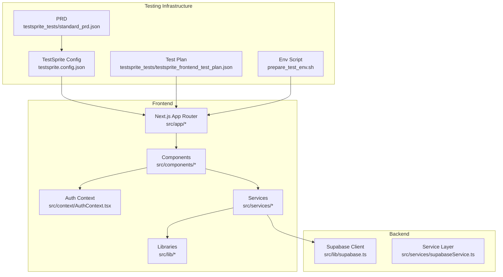
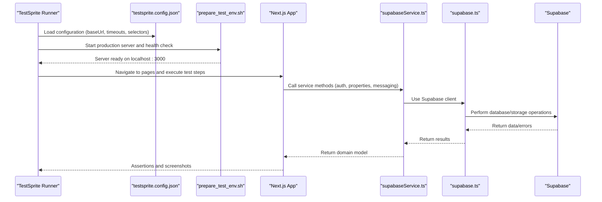
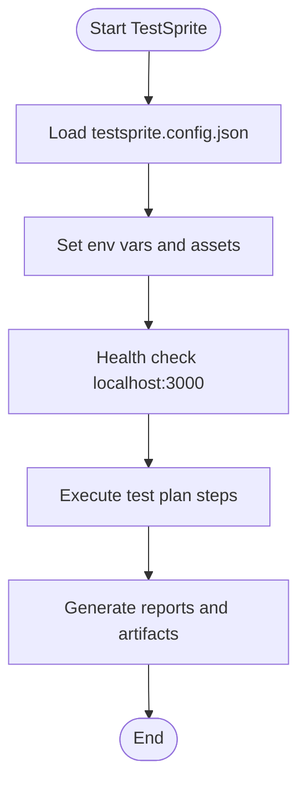
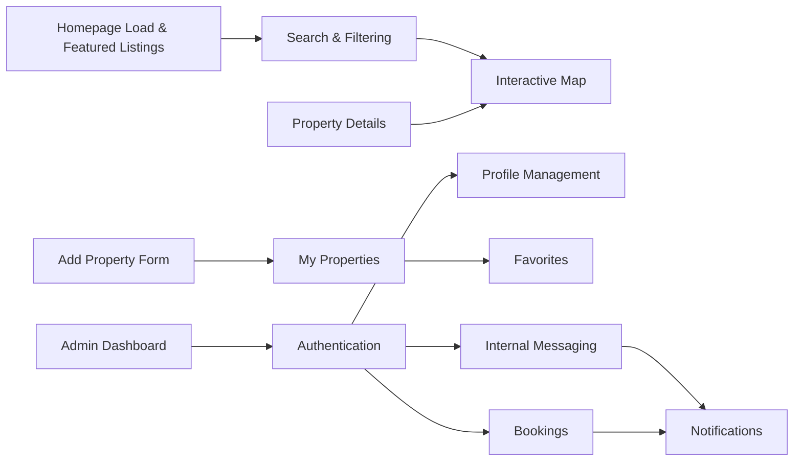
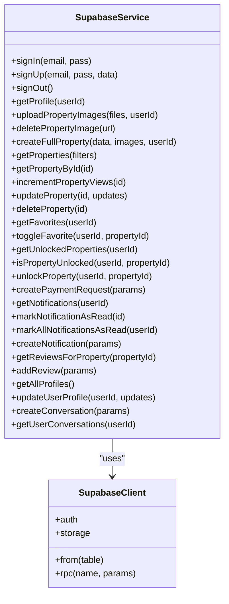
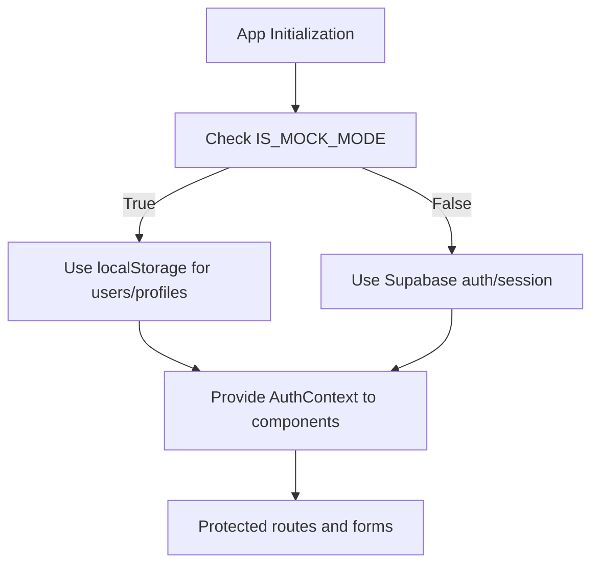
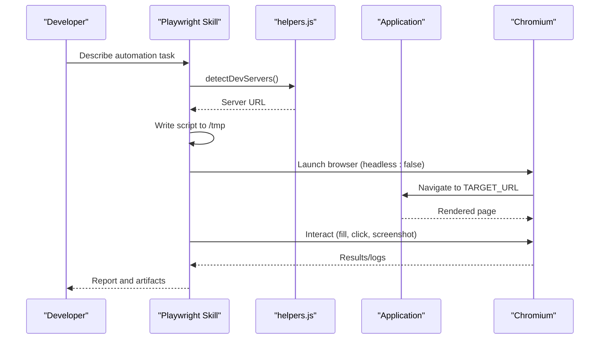
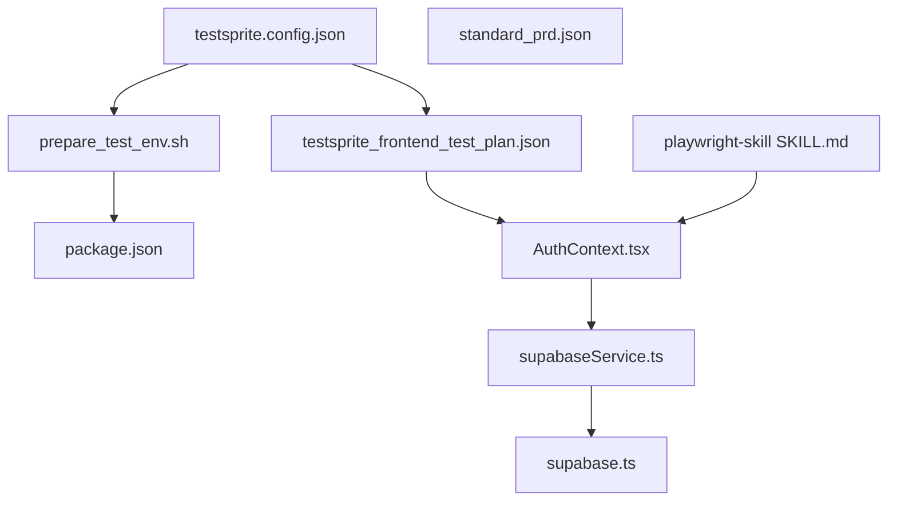

# Testing Strategy

<cite>
**Referenced Files in This Document**
- [testsprite.config.json](file://testsprite.config.json)
- [testsprite_frontend_test_plan.json](file://testsprite_tests/testsprite_frontend_test_plan.json)
- [standard_prd.json](file://testsprite_tests/standard_prd.json)
- [prepare_test_env.sh](file://prepare_test_env.sh)
- [package.json](file://package.json)
- [supabase.ts](file://src/lib/supabase.ts)
- [supabaseService.ts](file://src/services/supabaseService.ts)
- [AuthContext.tsx](file://src/context/AuthContext.tsx)
- [testing-guide.md](file://.agent/skills/backend-dev-guidelines/resources/testing-guide.md)
- [webapp-testing SKILL.md](file://.agent/skills/webapp-testing/SKILL.md)
- [playwright-skill SKILL.md](file://.agent/skills/playwright-skill/SKILL.md)
</cite>

## Table of Contents
1. [Introduction](#introduction)
2. [Project Structure](#project-structure)
3. [Core Components](#core-components)
4. [Architecture Overview](#architecture-overview)
5. [Detailed Component Analysis](#detailed-component-analysis)
6. [Dependency Analysis](#dependency-analysis)
7. [Performance Considerations](#performance-considerations)
8. [Troubleshooting Guide](#troubleshooting-guide)
9. [Conclusion](#conclusion)
10. [Appendices](#appendices)

## Introduction
This document defines a comprehensive testing strategy for Gamasa Properties, focusing on automated testing infrastructure using TestSprite for end-to-end (E2E) scenarios, component testing patterns, and integration testing methodologies. It also covers test execution environments, test data management, continuous testing workflows, best practices, coverage targets, and quality assurance processes. Special attention is given to performance testing, accessibility testing, and cross-browser compatibility testing approaches aligned with the project’s Next.js stack and Supabase backend.

## Project Structure
Gamasa Properties is a Next.js application with a clear separation of concerns:
- Frontend pages and components under src/app and src/components
- Services and utilities under src/services and src/lib
- Authentication and user state under src/context
- Testing assets and plans under testsprite_tests
- TestSprite configuration and environment bootstrap under testsprite.config.json and prepare_test_env.sh

**Diagram sources**
- [testsprite.config.json](file://testsprite.config.json#L1-L36)
- [testsprite_frontend_test_plan.json](file://testsprite_tests/testsprite_frontend_test_plan.json#L1-L513)
- [standard_prd.json](file://testsprite_tests/standard_prd.json#L1-L159)
- [prepare_test_env.sh](file://prepare_test_env.sh#L1-L36)
- [supabase.ts](file://src/lib/supabase.ts#L1-L68)
- [supabaseService.ts](file://src/services/supabaseService.ts#L1-L800)
- [AuthContext.tsx](file://src/context/AuthContext.tsx#L1-L195)

**Section sources**
- [testsprite.config.json](file://testsprite.config.json#L1-L36)
- [testsprite_frontend_test_plan.json](file://testsprite_tests/testsprite_frontend_test_plan.json#L1-L513)
- [standard_prd.json](file://testsprite_tests/standard_prd.json#L1-L159)
- [prepare_test_env.sh](file://prepare_test_env.sh#L1-L36)
- [package.json](file://package.json#L1-L42)

## Core Components
- TestSprite configuration defines base URL, headless mode, viewport, timeouts, retries, environment variables, asset upload paths, and selector aliases for map and loading indicators.
- Test plan outlines functional test cases covering homepage performance, search filtering, map markers, authentication, profile management, property listing workflows, favorites, messaging, notifications, bookings, admin dashboard, and property detail correctness.
- PRD documents product overview, goals, key features, user flows, and validation criteria, aligning test coverage with business outcomes.
- Environment bootstrap script prepares the system by cleaning port 3000, generating dummy assets, building for production, starting the server, and health checking readiness.

**Section sources**
- [testsprite.config.json](file://testsprite.config.json#L1-L36)
- [testsprite_frontend_test_plan.json](file://testsprite_tests/testsprite_frontend_test_plan.json#L1-L513)
- [standard_prd.json](file://testsprite_tests/standard_prd.json#L1-L159)
- [prepare_test_env.sh](file://prepare_test_env.sh#L1-L36)

## Architecture Overview
The testing architecture integrates TestSprite for E2E automation with the frontend application and Supabase backend. The service layer abstracts Supabase operations and supports a mock mode for isolated testing. Authentication is handled via Supabase or a mock context, enabling controlled test scenarios.

**Diagram sources**
- [testsprite.config.json](file://testsprite.config.json#L1-L36)
- [prepare_test_env.sh](file://prepare_test_env.sh#L1-L36)
- [supabaseService.ts](file://src/services/supabaseService.ts#L1-L800)
- [supabase.ts](file://src/lib/supabase.ts#L1-L68)

## Detailed Component Analysis

### TestSprite Configuration and Execution Environment
- Headless mode is enabled for CI-friendly runs; viewport is set to 1280x800; global and action timeouts configured to reduce flakiness; retries on failure are enabled.
- Environment variables include NODE_ENV and TEST_USER credentials; asset upload paths define where dummy images are staged.
- Selector aliases streamline map and loading indicator assertions across tests.

**Diagram sources**
- [testsprite.config.json](file://testsprite.config.json#L1-L36)
- [prepare_test_env.sh](file://prepare_test_env.sh#L1-L36)

**Section sources**
- [testsprite.config.json](file://testsprite.config.json#L1-L36)
- [prepare_test_env.sh](file://prepare_test_env.sh#L1-L36)

### Test Plan Coverage and Categories
The test plan includes high, medium, and security-priority functional tests covering:
- Homepage performance and featured listings
- Advanced property search and filtering
- Interactive map markers and responsiveness
- Authentication flows (sign-up, login, logout)
- Profile creation/update with validation
- Multi-step Add Property form (photos, location tagging)
- My Properties editing and status management
- Favorites persistence and retrieval
- Internal messaging between users and owners
- Real-time notifications
- Booking creation, updates, and cancellations
- Admin dashboard access and management
- Property detail completeness

**Diagram sources**
- [testsprite_frontend_test_plan.json](file://testsprite_tests/testsprite_frontend_test_plan.json#L1-L513)

**Section sources**
- [testsprite_frontend_test_plan.json](file://testsprite_tests/testsprite_frontend_test_plan.json#L1-L513)

### Service Layer Testing Strategy
The service layer encapsulates Supabase operations and exposes a mock mode flag for deterministic testing. Authentication, property CRUD, favorites, messaging, notifications, and admin functions are implemented as cohesive units suitable for unit and integration testing.

**Diagram sources**
- [supabaseService.ts](file://src/services/supabaseService.ts#L1-L800)
- [supabase.ts](file://src/lib/supabase.ts#L1-L68)

**Section sources**
- [supabaseService.ts](file://src/services/supabaseService.ts#L1-L800)
- [supabase.ts](file://src/lib/supabase.ts#L1-L68)

### Authentication Context and Mock Mode
The AuthContext manages user state and supports a mock mode flag. This enables test isolation by bypassing Supabase during E2E runs while preserving UI behavior. The service layer also respects a mock mode flag to simulate backend responses deterministically.

**Diagram sources**
- [AuthContext.tsx](file://src/context/AuthContext.tsx#L1-L195)
- [supabaseService.ts](file://src/services/supabaseService.ts#L1-L800)

**Section sources**
- [AuthContext.tsx](file://src/context/AuthContext.tsx#L1-L195)
- [supabaseService.ts](file://src/services/supabaseService.ts#L1-L800)

### Browser Automation and Cross-Browser Compatibility
The Playwright skill provides a robust framework for browser automation, including:
- Auto-detection of dev servers
- Writing scripts to /tmp
- Executing with visible browser by default
- Parameterizing URLs
- Responsive design testing across viewports
- Login flow automation
- Form filling and submission
- Link validation
- Screenshot capture with error handling
- Helper utilities for safe clicks, typing, cookie banners, and table extraction

**Diagram sources**
- [playwright-skill SKILL.md](file://.agent/skills/playwright-skill/SKILL.md#L1-L454)

**Section sources**
- [playwright-skill SKILL.md](file://.agent/skills/playwright-skill/SKILL.md#L1-L454)

### Accessibility and Cross-Browser Compatibility Testing
- Cross-browser compatibility: Use Playwright to emulate multiple devices and browsers via device emulators and browser contexts.
- Accessibility: Integrate automated accessibility checks using Playwright’s accessibility tools or plugins to validate ARIA attributes, color contrast, and keyboard navigation.
- Responsive design: Leverage Playwright’s viewport switching to capture screenshots and assert layout stability across desktop, tablet, and mobile.

[No sources needed since this section provides general guidance]

### Continuous Testing Workflows
- Pre-commit: Run unit/integration tests locally using the project’s test runner.
- CI pipeline: Use TestSprite to execute the test plan against a built production server started by prepare_test_env.sh.
- Coverage: Enforce coverage targets for unit tests and integrate coverage reporting in CI.
- Canary deployments: Run a subset of critical E2E tests on staging to validate hotfixes before production.

[No sources needed since this section provides general guidance]

## Dependency Analysis
The testing ecosystem depends on:
- TestSprite for orchestrating E2E scenarios
- Next.js application for rendering pages and components
- Supabase client and service layer for backend operations
- Playwright skill for browser automation and responsive testing
- Shell script for environment bootstrapping

**Diagram sources**
- [testsprite.config.json](file://testsprite.config.json#L1-L36)
- [testsprite_frontend_test_plan.json](file://testsprite_tests/testsprite_frontend_test_plan.json#L1-L513)
- [standard_prd.json](file://testsprite_tests/standard_prd.json#L1-L159)
- [prepare_test_env.sh](file://prepare_test_env.sh#L1-L36)
- [package.json](file://package.json#L1-L42)
- [supabase.ts](file://src/lib/supabase.ts#L1-L68)
- [supabaseService.ts](file://src/services/supabaseService.ts#L1-L800)
- [AuthContext.tsx](file://src/context/AuthContext.tsx#L1-L195)
- [playwright-skill SKILL.md](file://.agent/skills/playwright-skill/SKILL.md#L1-L454)

**Section sources**
- [testsprite.config.json](file://testsprite.config.json#L1-L36)
- [testsprite_frontend_test_plan.json](file://testsprite_tests/testsprite_frontend_test_plan.json#L1-L513)
- [standard_prd.json](file://testsprite_tests/standard_prd.json#L1-L159)
- [prepare_test_env.sh](file://prepare_test_env.sh#L1-L36)
- [package.json](file://package.json#L1-L42)
- [supabase.ts](file://src/lib/supabase.ts#L1-L68)
- [supabaseService.ts](file://src/services/supabaseService.ts#L1-L800)
- [AuthContext.tsx](file://src/context/AuthContext.tsx#L1-L195)
- [playwright-skill SKILL.md](file://.agent/skills/playwright-skill/SKILL.md#L1-L454)

## Performance Considerations
- Use TestSprite’s configured timeouts and retries to balance reliability and speed.
- Prefer production builds for E2E runs to minimize runtime overhead.
- Capture screenshots and measure page load timings to validate homepage performance targets.
- Apply Playwright viewport switching to detect rendering bottlenecks across devices.

[No sources needed since this section provides general guidance]

## Troubleshooting Guide
- Port conflicts: The environment script cleans port 3000 before starting the server.
- Asset availability: Dummy images are generated for upload tests; ensure paths in configuration match the environment.
- Authentication failures: Verify TEST_USER credentials and NODE_ENV in TestSprite configuration.
- Selector mismatches: Align component selectors with the selector aliases defined in the configuration.

**Section sources**
- [prepare_test_env.sh](file://prepare_test_env.sh#L1-L36)
- [testsprite.config.json](file://testsprite.config.json#L1-L36)

## Conclusion
Gamasa Properties’ testing strategy leverages TestSprite for robust E2E coverage, a well-defined service layer for backend integration, and Playwright for browser automation. By combining deterministic mock modes, structured test plans, and environment bootstrapping, the team can ensure reliable releases with strong quality guarantees across performance, accessibility, and cross-browser compatibility.

## Appendices

### Testing Best Practices
- Prefer declarative selectors and avoid brittle text-based locators.
- Use fixtures and factories for test data generation.
- Keep tests independent and idempotent; reset state between runs.
- Automate screenshots and logs for failed tests to accelerate debugging.

[No sources needed since this section provides general guidance]

### Test Coverage Requirements
- Unit tests: Target 70%+ coverage for critical business logic.
- Integration tests: Cover authenticated routes and key backend interactions.
- E2E tests: Focus on happy paths defined in the test plan.

**Section sources**
- [testing-guide.md](file://.agent/skills/backend-dev-guidelines/resources/testing-guide.md#L216-L229)

### Example Test Implementation References
- TestSprite configuration and selectors: [testsprite.config.json](file://testsprite.config.json#L1-L36)
- Test plan categories and steps: [testsprite_frontend_test_plan.json](file://testsprite_tests/testsprite_frontend_test_plan.json#L1-L513)
- Environment bootstrap for production server: [prepare_test_env.sh](file://prepare_test_env.sh#L1-L36)
- Service layer methods for testing: [supabaseService.ts](file://src/services/supabaseService.ts#L1-L800)
- Supabase client initialization: [supabase.ts](file://src/lib/supabase.ts#L1-L68)
- Authentication context and mock mode: [AuthContext.tsx](file://src/context/AuthContext.tsx#L1-L195)
- Playwright automation patterns: [playwright-skill SKILL.md](file://.agent/skills/playwright-skill/SKILL.md#L1-L454)
- Web app testing helper usage: [webapp-testing SKILL.md](file://.agent/skills/webapp-testing/SKILL.md#L1-L96)