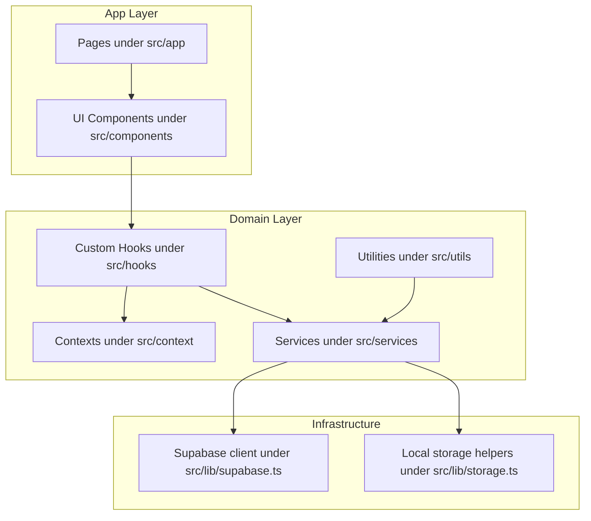
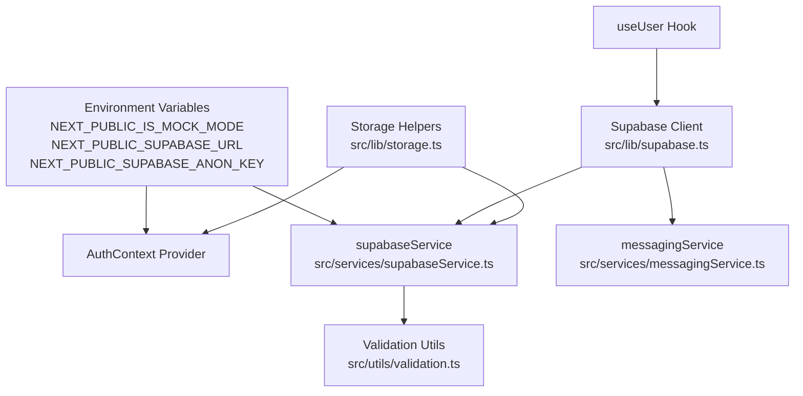
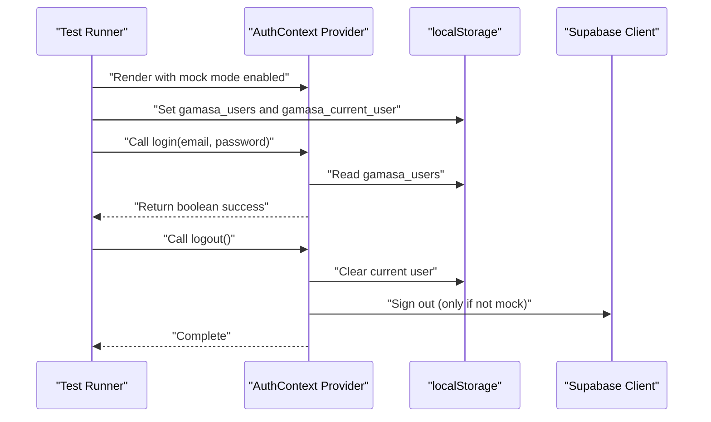
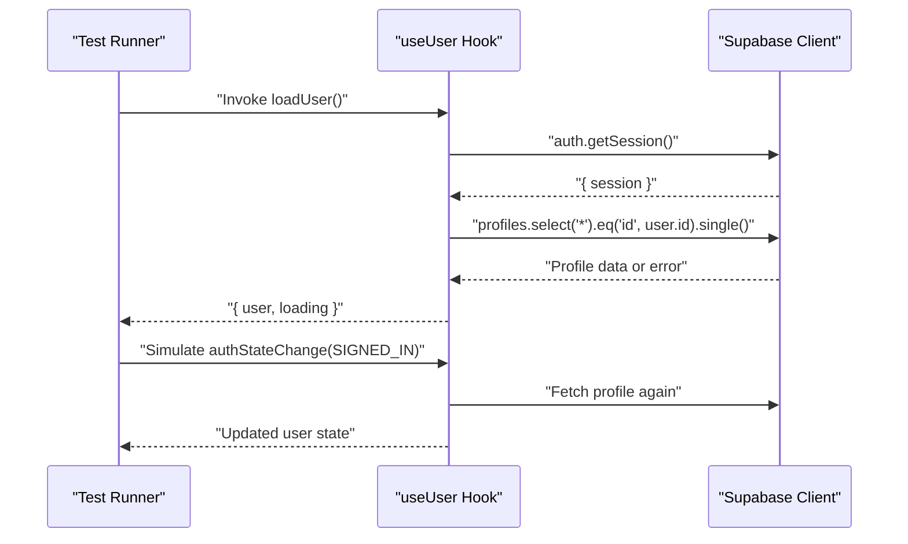
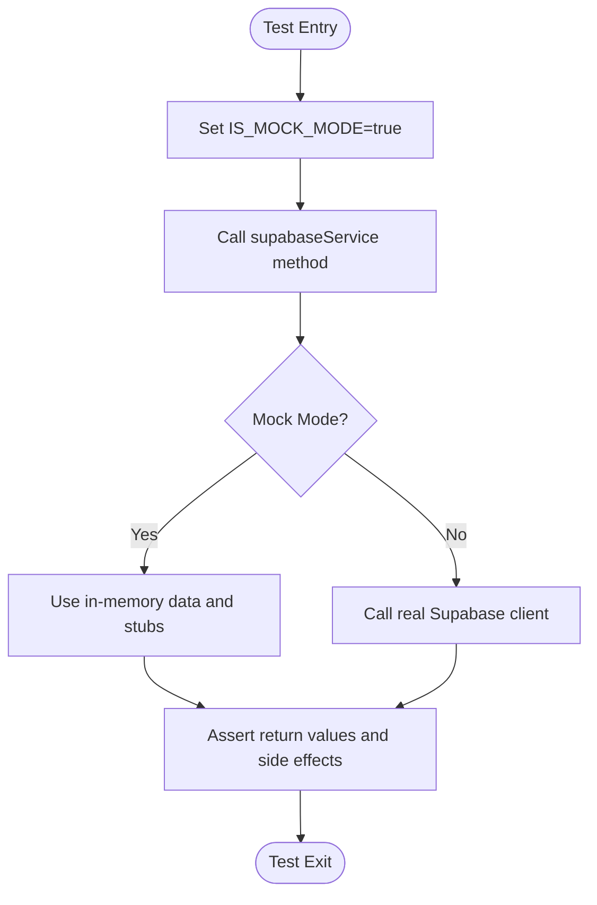
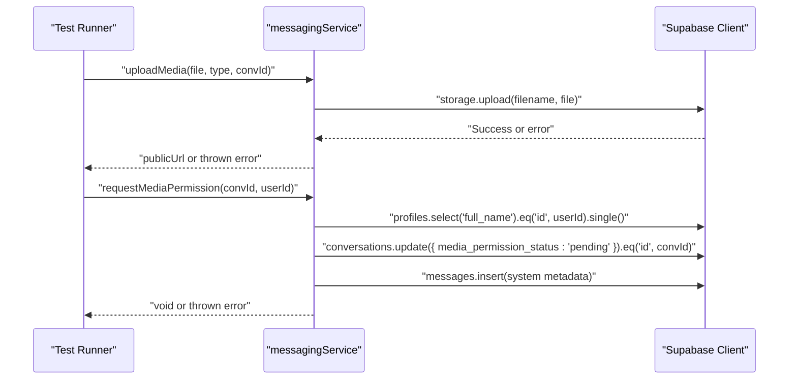
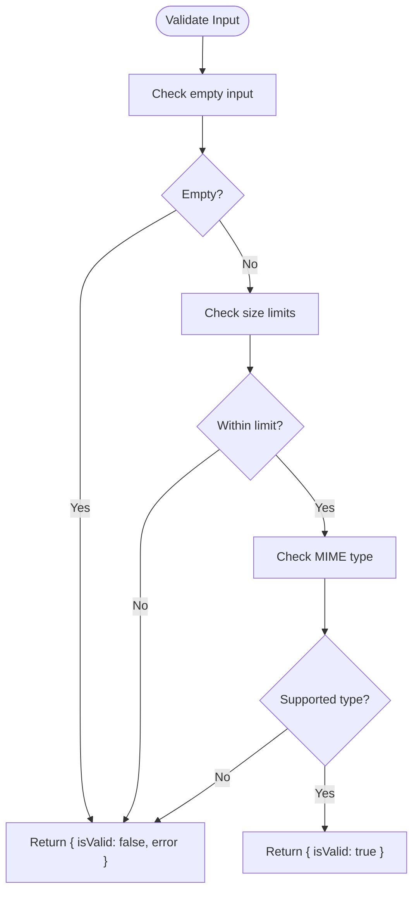
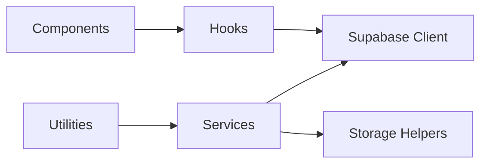

# Unit Testing Patterns

<cite>
**Referenced Files in This Document**
- [package.json](file://package.json)
- [tsconfig.json](file://tsconfig.json)
- [src/context/AuthContext.tsx](file://src/context/AuthContext.tsx)
- [src/hooks/useUser.ts](file://src/hooks/useUser.ts)
- [src/lib/supabase.ts](file://src/lib/supabase.ts)
- [src/lib/storage.ts](file://src/lib/storage.ts)
- [src/services/supabaseService.ts](file://src/services/supabaseService.ts)
- [src/services/messagingService.ts](file://src/services/messagingService.ts)
- [src/utils/validation.ts](file://src/utils/validation.ts)
</cite>

## Table of Contents
1. [Introduction](#introduction)
2. [Project Structure](#project-structure)
3. [Core Components](#core-components)
4. [Architecture Overview](#architecture-overview)
5. [Detailed Component Analysis](#detailed-component-analysis)
6. [Dependency Analysis](#dependency-analysis)
7. [Performance Considerations](#performance-considerations)
8. [Troubleshooting Guide](#troubleshooting-guide)
9. [Conclusion](#conclusion)

## Introduction
This document describes unit testing patterns and approaches used in the Gamasa Properties application. It focuses on testing strategies for React components, custom hooks, service layers, and utility functions. It also documents mocking techniques for Supabase services, authentication contexts, and external APIs, along with patterns for asynchronous operations, state management, and component rendering. Examples of unit tests are provided via file references and code snippet paths to guide implementation.

## Project Structure
The application follows a Next.js App Router structure with a clear separation of concerns:
- Application pages under src/app
- Shared UI components under src/components
- Context and hooks under src/context and src/hooks
- Services and libraries under src/services and src/lib
- Utilities under src/utils
- Types under src/types

**Diagram sources**
- [src/app/page.tsx](file://src/app/page.tsx)
- [src/components/PropertyCard.tsx](file://src/components/PropertyCard.tsx)
- [src/hooks/useUser.ts](file://src/hooks/useUser.ts)
- [src/context/AuthContext.tsx](file://src/context/AuthContext.tsx)
- [src/services/supabaseService.ts](file://src/services/supabaseService.ts)
- [src/lib/supabase.ts](file://src/lib/supabase.ts)
- [src/lib/storage.ts](file://src/lib/storage.ts)
- [src/utils/validation.ts](file://src/utils/validation.ts)

**Section sources**
- [package.json](file://package.json#L1-L42)
- [tsconfig.json](file://tsconfig.json#L1-L43)

## Core Components
This section outlines the core building blocks relevant to unit testing:
- Authentication context and provider for managing user state and login/logout flows
- Custom hook for user profile retrieval and auth state change subscriptions
- Supabase client and storage helpers for database and image operations
- Service layer abstractions for properties, messaging, and related operations
- Validation utilities for messages and media

Key testing targets:
- AuthContext provider and useAuth hook
- useUser hook and its auth state subscriptions
- supabaseService methods and messagingService methods
- validation utilities

**Section sources**
- [src/context/AuthContext.tsx](file://src/context/AuthContext.tsx#L1-L195)
- [src/hooks/useUser.ts](file://src/hooks/useUser.ts#L1-L178)
- [src/lib/supabase.ts](file://src/lib/supabase.ts#L1-L68)
- [src/lib/storage.ts](file://src/lib/storage.ts#L1-L633)
- [src/services/supabaseService.ts](file://src/services/supabaseService.ts#L1-L800)
- [src/services/messagingService.ts](file://src/services/messagingService.ts#L1-L123)
- [src/utils/validation.ts](file://src/utils/validation.ts#L1-L33)

## Architecture Overview
The testing architecture leverages environment-driven mock modes and centralized clients to enable deterministic unit tests:
- Environment flag controls mock vs real Supabase behavior
- Centralized Supabase client creation with typed client disabled to avoid compatibility issues
- Local storage helpers for offline-first and mock-mode scenarios
- Service layer encapsulates database and storage operations behind method-based APIs

**Diagram sources**
- [src/context/AuthContext.tsx](file://src/context/AuthContext.tsx#L8-L9)
- [src/services/supabaseService.ts](file://src/services/supabaseService.ts#L5-L6)
- [src/lib/supabase.ts](file://src/lib/supabase.ts#L4-L28)
- [src/lib/storage.ts](file://src/lib/storage.ts#L14-L40)
- [src/hooks/useUser.ts](file://src/hooks/useUser.ts#L5-L5)
- [src/services/messagingService.ts](file://src/services/messagingService.ts#L1-L3)
- [src/utils/validation.ts](file://src/utils/validation.ts#L1-L5)

## Detailed Component Analysis

### Authentication Context and Provider
Testing strategy:
- Isolate environment flags to force mock mode during unit tests
- Mock localStorage events and dispatch to simulate user updates across tabs
- Verify login/register/logout transitions and loading states
- Validate that logout clears current user and invokes Supabase sign out when not in mock mode

Recommended mocks:
- localStorage and window events
- AuthContext provider wrapper around components
- Environment variable overrides for NEXT_PUBLIC_IS_MOCK_MODE

Example test references:
- Login flow: [src/context/AuthContext.tsx](file://src/context/AuthContext.tsx#L80-L115)
- Registration flow: [src/context/AuthContext.tsx](file://src/context/AuthContext.tsx#L117-L161)
- Logout flow: [src/context/AuthContext.tsx](file://src/context/AuthContext.tsx#L163-L170)

**Diagram sources**
- [src/context/AuthContext.tsx](file://src/context/AuthContext.tsx#L8-L9)
- [src/context/AuthContext.tsx](file://src/context/AuthContext.tsx#L80-L115)
- [src/context/AuthContext.tsx](file://src/context/AuthContext.tsx#L163-L170)
- [src/lib/storage.ts](file://src/lib/storage.ts#L28-L40)
- [src/lib/supabase.ts](file://src/lib/supabase.ts#L18-L28)

**Section sources**
- [src/context/AuthContext.tsx](file://src/context/AuthContext.tsx#L1-L195)
- [src/lib/storage.ts](file://src/lib/storage.ts#L1-L633)

### Custom Hook: useUser
Testing strategy:
- Wrap components with AuthProvider to supply context
- Mock Supabase auth session and profile queries
- Simulate auth state changes to verify subscription handling
- Test loading states and error fallbacks

Recommended mocks:
- Supabase client auth.getSession and onAuthStateChange
- Supabase client from('profiles').select('*').eq('id', ...).single()

Example test references:
- Session retrieval: [src/hooks/useUser.ts](file://src/hooks/useUser.ts#L110-L136)
- Auth state subscription: [src/hooks/useUser.ts](file://src/hooks/useUser.ts#L144-L162)
- Profile mapping: [src/hooks/useUser.ts](file://src/hooks/useUser.ts#L57-L107)

**Diagram sources**
- [src/hooks/useUser.ts](file://src/hooks/useUser.ts#L110-L136)
- [src/hooks/useUser.ts](file://src/hooks/useUser.ts#L144-L162)
- [src/hooks/useUser.ts](file://src/hooks/useUser.ts#L57-L107)
- [src/lib/supabase.ts](file://src/lib/supabase.ts#L18-L28)

**Section sources**
- [src/hooks/useUser.ts](file://src/hooks/useUser.ts#L1-L178)
- [src/lib/supabase.ts](file://src/lib/supabase.ts#L1-L68)

### Service Layer: supabaseService
Testing strategy:
- Control mock mode via IS_MOCK_MODE flag
- Mock in-memory collections for properties, favorites, and unlocked properties
- Stub Supabase client methods for auth, storage, RPC, and table operations
- Validate error handling paths and cleanup logic (e.g., image deletion on failure)

Recommended mocks:
- Supabase client methods: auth.*, from(...).select/update/delete/insert/rpc
- Storage bucket operations via uploadImage/deleteImage
- Environment variable override for IS_MOCK_MODE

Example test references:
- Mock auth methods: [src/services/supabaseService.ts](file://src/services/supabaseService.ts#L154-L202)
- Property CRUD operations: [src/services/supabaseService.ts](file://src/services/supabaseService.ts#L258-L440)
- Favorites toggling: [src/services/supabaseService.ts](file://src/services/supabaseService.ts#L461-L492)
- Notifications: [src/services/supabaseService.ts](file://src/services/supabaseService.ts#L566-L616)
- Messaging conversations: [src/services/supabaseService.ts](file://src/services/supabaseService.ts#L740-L800)

**Diagram sources**
- [src/services/supabaseService.ts](file://src/services/supabaseService.ts#L5-L6)
- [src/services/supabaseService.ts](file://src/services/supabaseService.ts#L154-L202)
- [src/services/supabaseService.ts](file://src/services/supabaseService.ts#L258-L440)
- [src/lib/supabase.ts](file://src/lib/supabase.ts#L34-L67)

**Section sources**
- [src/services/supabaseService.ts](file://src/services/supabaseService.ts#L1-L800)
- [src/lib/supabase.ts](file://src/lib/supabase.ts#L1-L68)

### Service Layer: messagingService
Testing strategy:
- Mock Supabase storage uploads for images and voice notes
- Mock conversation and message inserts for permission requests and system messages
- Test typing indicator broadcast and subscription lifecycle
- Validate error handling for invalid file types/sizes

Recommended mocks:
- Supabase storage upload/getPublicUrl
- Supabase from('conversations').update/insert
- Supabase from('messages').insert
- Supabase channel broadcast and remove

Example test references:
- Media upload: [src/services/messagingService.ts](file://src/services/messagingService.ts#L6-L33)
- Media permission request: [src/services/messagingService.ts](file://src/services/messagingService.ts#L36-L68)
- Typing indicator: [src/services/messagingService.ts](file://src/services/messagingService.ts#L89-L121)

**Diagram sources**
- [src/services/messagingService.ts](file://src/services/messagingService.ts#L6-L33)
- [src/services/messagingService.ts](file://src/services/messagingService.ts#L36-L68)
- [src/services/messagingService.ts](file://src/services/messagingService.ts#L89-L121)
- [src/lib/supabase.ts](file://src/lib/supabase.ts#L18-L28)

**Section sources**
- [src/services/messagingService.ts](file://src/services/messagingService.ts#L1-L123)
- [src/lib/supabase.ts](file://src/lib/supabase.ts#L1-L68)

### Utilities: validation
Testing strategy:
- Validate empty and oversized inputs for messages and files
- Validate supported MIME types for images and voice recordings
- Sanitize text inputs to prevent XSS

Recommended mocks:
- No external dependencies; pure functions suitable for straightforward unit tests

Example test references:
- Message validation: [src/utils/validation.ts](file://src/utils/validation.ts#L1-L5)
- File validation: [src/utils/validation.ts](file://src/utils/validation.ts#L7-L27)
- Text sanitization: [src/utils/validation.ts](file://src/utils/validation.ts#L29-L32)

**Diagram sources**
- [src/utils/validation.ts](file://src/utils/validation.ts#L1-L33)

**Section sources**
- [src/utils/validation.ts](file://src/utils/validation.ts#L1-L33)

## Dependency Analysis
Key dependencies and coupling:
- Components depend on hooks and contexts for state and authentication
- Hooks depend on the Supabase client for auth/session/profile operations
- Services depend on the Supabase client and storage helpers for persistence and uploads
- Utilities are standalone and minimally coupled

**Diagram sources**
- [src/hooks/useUser.ts](file://src/hooks/useUser.ts#L5-L5)
- [src/services/supabaseService.ts](file://src/services/supabaseService.ts#L2-L2)
- [src/lib/supabase.ts](file://src/lib/supabase.ts#L1-L1)
- [src/lib/storage.ts](file://src/lib/storage.ts#L1-L2)
- [src/utils/validation.ts](file://src/utils/validation.ts#L1-L1)

**Section sources**
- [src/hooks/useUser.ts](file://src/hooks/useUser.ts#L1-L178)
- [src/services/supabaseService.ts](file://src/services/supabaseService.ts#L1-L800)
- [src/lib/supabase.ts](file://src/lib/supabase.ts#L1-L68)
- [src/lib/storage.ts](file://src/lib/storage.ts#L1-L633)
- [src/utils/validation.ts](file://src/utils/validation.ts#L1-L33)

## Performance Considerations
- Prefer mock mode for unit tests to avoid network overhead and external dependencies
- Use minimal DOM rendering; test hooks and services in isolation
- Avoid unnecessary re-renders by controlling provider wrappers and environment flags
- Keep test fixtures small and deterministic

## Troubleshooting Guide
Common issues and resolutions:
- Missing environment variables for Supabase cause warnings; ensure NEXT_PUBLIC_SUPABASE_URL and NEXT_PUBLIC_SUPABASE_ANON_KEY are set or rely on mock mode
- Auth state subscriptions must be unsubscribed to prevent memory leaks; verify cleanup in tests
- Storage helpers dispatch events; ensure tests account for synchronous side effects
- Service methods may throw errors; assert error paths and fallback behavior

**Section sources**
- [src/lib/supabase.ts](file://src/lib/supabase.ts#L7-L15)
- [src/hooks/useUser.ts](file://src/hooks/useUser.ts#L164-L168)
- [src/lib/storage.ts](file://src/lib/storage.ts#L32-L40)
- [src/services/supabaseService.ts](file://src/services/supabaseService.ts#L307-L310)

## Conclusion
The Gamasa Properties application employs environment-driven mock modes, centralized clients, and service abstractions that facilitate robust unit testing. By isolating environment flags, mocking localStorage and Supabase interactions, and structuring tests around hooks, services, and utilities, teams can achieve reliable, fast, and maintainable unit tests. Adopting the patterns and references outlined here ensures consistent coverage across authentication flows, property services, messaging, and validation utilities.