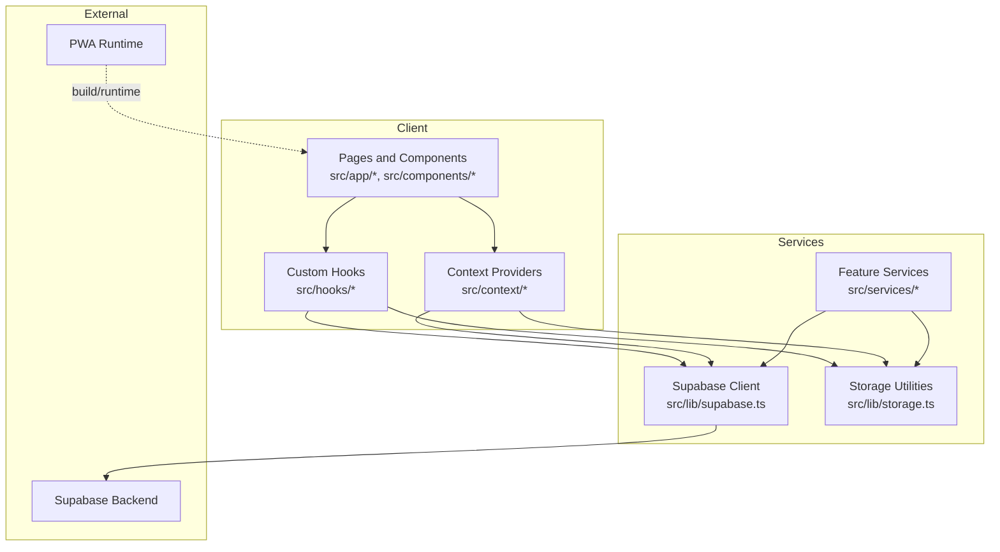
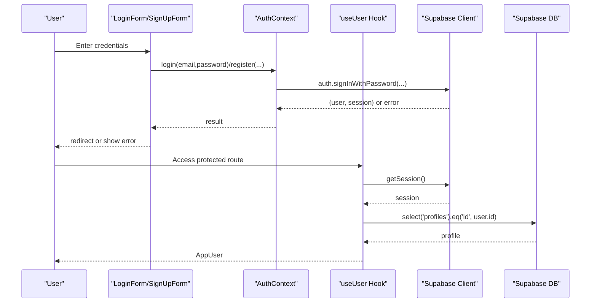
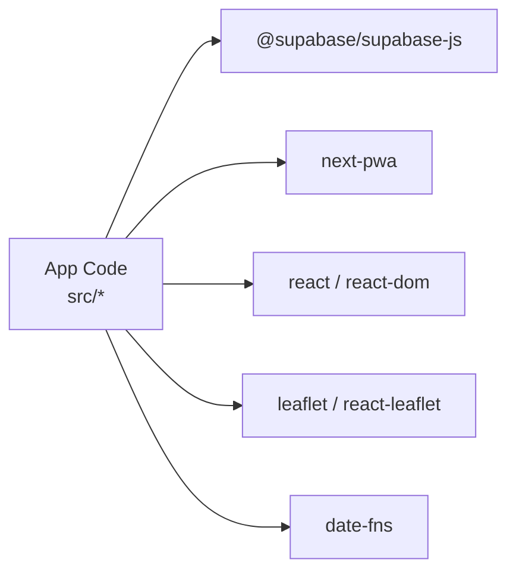

# Troubleshooting and FAQ

<cite>
**Referenced Files in This Document**
- [README.md](file://README.md)
- [package.json](file://package.json)
- [next.config.ts](file://next.config.ts)
- [src/lib/supabase.ts](file://src/lib/supabase.ts)
- [src/context/AuthContext.tsx](file://src/context/AuthContext.tsx)
- [src/hooks/useUser.ts](file://src/hooks/useUser.ts)
- [src/lib/storage.ts](file://src/lib/storage.ts)
- [src/services/supabaseService.ts](file://src/services/supabaseService.ts)
- [src/services/messagingService.ts](file://src/services/messagingService.ts)
- [src/utils/validation.ts](file://src/utils/validation.ts)
- [src/components/auth/LoginForm.tsx](file://src/components/auth/LoginForm.tsx)
- [src/components/auth/SignUpForm.tsx](file://src/components/auth/SignUpForm.tsx)
- [src/types/index.ts](file://src/types/index.ts)
</cite>

## Table of Contents
1. [Introduction](#introduction)
2. [Project Structure](#project-structure)
3. [Core Components](#core-components)
4. [Architecture Overview](#architecture-overview)
5. [Detailed Component Analysis](#detailed-component-analysis)
6. [Dependency Analysis](#dependency-analysis)
7. [Performance Considerations](#performance-considerations)
8. [Troubleshooting Guide](#troubleshooting-guide)
9. [Conclusion](#conclusion)
10. [Appendices](#appendices)

## Introduction
This Troubleshooting and FAQ guide focuses on diagnosing and resolving common issues in Gamasa Properties across development, deployment, and runtime phases. It covers authentication failures, database connectivity and Supabase-related errors, frontend rendering and media upload issues, and provides step-by-step diagnostic procedures, log analysis techniques, and escalation paths.

## Project Structure
Gamasa Properties is a Next.js application using Supabase for authentication and data, with a hybrid local-storage and Supabase-backed data layer. PWA support is enabled via next-pwa.

**Diagram sources**
- [next.config.ts](file://next.config.ts#L1-L31)
- [src/lib/supabase.ts](file://src/lib/supabase.ts#L1-L68)
- [src/lib/storage.ts](file://src/lib/storage.ts#L1-L633)
- [src/services/supabaseService.ts](file://src/services/supabaseService.ts#L1-L800)

**Section sources**
- [README.md](file://README.md#L1-L37)
- [package.json](file://package.json#L1-L42)
- [next.config.ts](file://next.config.ts#L1-L31)

## Core Components
- Supabase client initialization and environment checks
- Authentication context and user hook
- Local storage utilities and mock mode
- Feature services for properties, messaging, and uploads
- Validation utilities for messages and media

**Section sources**
- [src/lib/supabase.ts](file://src/lib/supabase.ts#L1-L68)
- [src/context/AuthContext.tsx](file://src/context/AuthContext.tsx#L1-L195)
- [src/hooks/useUser.ts](file://src/hooks/useUser.ts#L1-L178)
- [src/lib/storage.ts](file://src/lib/storage.ts#L1-L633)
- [src/services/supabaseService.ts](file://src/services/supabaseService.ts#L1-L800)
- [src/utils/validation.ts](file://src/utils/validation.ts#L1-L33)

## Architecture Overview
High-level flow for authentication and property operations.

**Diagram sources**
- [src/components/auth/LoginForm.tsx](file://src/components/auth/LoginForm.tsx#L1-L220)
- [src/components/auth/SignUpForm.tsx](file://src/components/auth/SignUpForm.tsx#L1-L274)
- [src/context/AuthContext.tsx](file://src/context/AuthContext.tsx#L1-L195)
- [src/hooks/useUser.ts](file://src/hooks/useUser.ts#L1-L178)
- [src/lib/supabase.ts](file://src/lib/supabase.ts#L1-L68)

## Detailed Component Analysis

### Authentication Troubleshooting
Common issues:
- Missing Supabase environment variables
- Invalid login credentials
- Session persistence and auth state changes
- Mock vs real auth behavior

Diagnostic steps:
- Verify environment variables for Supabase URL and anon key.
- Confirm auth state change listeners are active.
- Check mock mode flag and its impact on auth flows.
- Inspect thrown and returned errors from login/register.

Resolution tips:
- Add missing environment variables to .env.local.
- Normalize error messages for display to users.
- Ensure auth state changes trigger UI updates.

**Section sources**
- [src/lib/supabase.ts](file://src/lib/supabase.ts#L1-L68)
- [src/context/AuthContext.tsx](file://src/context/AuthContext.tsx#L1-L195)
- [src/hooks/useUser.ts](file://src/hooks/useUser.ts#L1-L178)
- [src/components/auth/LoginForm.tsx](file://src/components/auth/LoginForm.tsx#L1-L220)
- [src/components/auth/SignUpForm.tsx](file://src/components/auth/SignUpForm.tsx#L1-L274)

### Database Connectivity and Supabase Operations
Common issues:
- Network errors during queries
- Row conversion errors
- RPC/view failures
- Storage upload/delete errors

Diagnostic steps:
- Wrap DB calls in try/catch and log errors.
- Validate row conversion functions.
- Check RPC/view existence and permissions.
- Inspect storage bucket permissions and file sizes.

Resolution tips:
- Fail fast with user-friendly messages.
- Roll back partial operations (e.g., delete uploaded images if DB insert fails).
- Ensure buckets exist and policies allow access.

**Section sources**
- [src/lib/storage.ts](file://src/lib/storage.ts#L126-L141)
- [src/lib/storage.ts](file://src/lib/storage.ts#L144-L159)
- [src/lib/storage.ts](file://src/lib/storage.ts#L162-L177)
- [src/services/supabaseService.ts](file://src/services/supabaseService.ts#L280-L311)
- [src/services/supabaseService.ts](file://src/services/supabaseService.ts#L378-L391)

### Frontend Rendering and Media Upload Errors
Common issues:
- Large or unsupported media files
- CORS and remote image patterns
- PWA caching and updates

Diagnostic steps:
- Validate file types and sizes before upload.
- Check next.config remotePatterns for images.
- Inspect PWA registration and skipWaiting behavior.

Resolution tips:
- Enforce validation early in forms.
- Adjust next.config remotePatterns for staging domains.
- Clear service worker caches when updating assets.

**Section sources**
- [src/utils/validation.ts](file://src/utils/validation.ts#L1-L33)
- [next.config.ts](file://next.config.ts#L12-L31)
- [src/services/messagingService.ts](file://src/services/messagingService.ts#L1-L123)

## Dependency Analysis
Key external dependencies and their roles:
- @supabase/supabase-js: Authentication and database operations
- next-pwa: Progressive Web App support
- react, react-dom: UI framework
- leaflet/react-leaflet: Map rendering
- date-fns: Date utilities

**Diagram sources**
- [package.json](file://package.json#L11-L27)

**Section sources**
- [package.json](file://package.json#L1-L42)

## Performance Considerations
- Prefer local storage for mock mode to reduce network latency during development.
- Batch storage writes and debounce frequent updates.
- Use lazy loading for images and map components.
- Monitor Supabase query performance and add indexes as needed.
- Keep PWA caches minimal and update aggressively for critical fixes.

## Troubleshooting Guide

### Authentication Issues
Symptoms:
- Login fails with “Invalid login credentials”
- Redirect loops after login
- Profile not loaded after sign-in

Checklist:
- Confirm NEXT_PUBLIC_SUPABASE_URL and NEXT_PUBLIC_SUPABASE_ANON_KEY are set.
- Verify auth state change listener is attached and not unsubscribed prematurely.
- Ensure mock mode flag does not block real auth in production builds.
- Inspect thrown errors from Supabase auth APIs and surface user-friendly messages.

Actions:
- Add missing environment variables to .env.local.
- Normalize error messages in login/signup components.
- Reinitialize auth session on auth state changes.

**Section sources**
- [src/lib/supabase.ts](file://src/lib/supabase.ts#L1-L68)
- [src/context/AuthContext.tsx](file://src/context/AuthContext.tsx#L80-L115)
- [src/hooks/useUser.ts](file://src/hooks/useUser.ts#L138-L168)
- [src/components/auth/LoginForm.tsx](file://src/components/auth/LoginForm.tsx#L20-L46)
- [src/components/auth/SignUpForm.tsx](file://src/components/auth/SignUpForm.tsx#L16-L49)

### Database Connectivity Problems
Symptoms:
- Property fetch returns empty or throws error
- Insert/update/delete fails mid-operation
- Views increment RPC fails

Checklist:
- Wrap all DB calls with try/catch and log errors.
- Validate row conversion functions for properties.
- Confirm RPC/view exists and is accessible.
- Ensure storage cleanup runs on DB failure.

Actions:
- Fail fast with user-friendly messages.
- Roll back partial operations (e.g., delete uploaded images).
- Verify Supabase policies and column types match expected shapes.

**Section sources**
- [src/lib/storage.ts](file://src/lib/storage.ts#L127-L141)
- [src/lib/storage.ts](file://src/lib/storage.ts#L211-L230)
- [src/services/supabaseService.ts](file://src/services/supabaseService.ts#L378-L391)

### Frontend Rendering Errors
Symptoms:
- Images fail to load from remote hosts
- PWA offline behavior unexpected
- Excessive re-renders in auth context

Checklist:
- Validate file types and sizes before upload.
- Confirm next.config remotePatterns allow your image hosts.
- Check PWA registration and skipWaiting flags.
- Debounce storage events and avoid infinite loops.

Actions:
- Enforce validation early in forms.
- Adjust remotePatterns for staging environments.
- Clear service worker caches when updating assets.

**Section sources**
- [src/utils/validation.ts](file://src/utils/validation.ts#L1-L33)
- [next.config.ts](file://next.config.ts#L12-L31)
- [src/services/messagingService.ts](file://src/services/messagingService.ts#L1-L123)

### Logging and Debugging Techniques
- Console logs: Use targeted console.error for DB and auth failures.
- Environment checks: Warn when Supabase env vars are missing.
- Event-driven updates: Dispatch and listen to storage/user events to keep UI in sync.
- Error boundaries: Wrap critical sections to capture unhandled exceptions.

**Section sources**
- [src/lib/supabase.ts](file://src/lib/supabase.ts#L7-L15)
- [src/lib/storage.ts](file://src/lib/storage.ts#L34-L40)
- [src/lib/storage.ts](file://src/lib/storage.ts#L63-L67)

### Monitoring and Observability
- Track Supabase errors and query durations.
- Monitor PWA install prompts and update availability.
- Log user actions around property interactions and messaging.

**Section sources**
- [src/services/messagingService.ts](file://src/services/messagingService.ts#L1-L123)
- [next.config.ts](file://next.config.ts#L5-L10)

### Escalation Procedures
- For Supabase policy or permission issues, escalate to platform administrators with query logs and user roles.
- For PWA caching issues, provide service worker logs and browser cache inspection steps.
- For UI rendering anomalies, collect browser console logs and device/network conditions.

**Section sources**
- [src/lib/supabase.ts](file://src/lib/supabase.ts#L1-L68)
- [next.config.ts](file://next.config.ts#L5-L10)

## Conclusion
By following the diagnostic procedures and applying the targeted resolutions outlined above, most issues in Gamasa Properties can be quickly identified and resolved. Focus on environment correctness, robust error handling, and clear user feedback to minimize downtime and improve reliability.

## Appendices

### Step-by-Step Diagnostic Procedures
- Environment verification
  - Confirm NEXT_PUBLIC_SUPABASE_URL and NEXT_PUBLIC_SUPABASE_ANON_KEY are present.
  - Check for placeholder warnings in the console.
- Authentication flow
  - Trigger login and inspect returned error messages.
  - Verify auth state change events are firing.
- Database operations
  - Wrap queries in try/catch and log errors.
  - Validate row conversion and RPC/view access.
- Media and PWA
  - Validate file types and sizes.
  - Confirm remotePatterns and PWA registration.

**Section sources**
- [src/lib/supabase.ts](file://src/lib/supabase.ts#L1-L68)
- [src/context/AuthContext.tsx](file://src/context/AuthContext.tsx#L80-L115)
- [src/lib/storage.ts](file://src/lib/storage.ts#L127-L141)
- [src/utils/validation.ts](file://src/utils/validation.ts#L1-L33)
- [next.config.ts](file://next.config.ts#L12-L31)