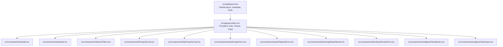
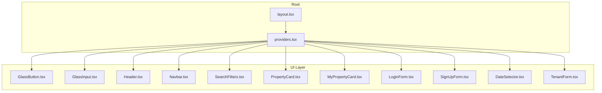
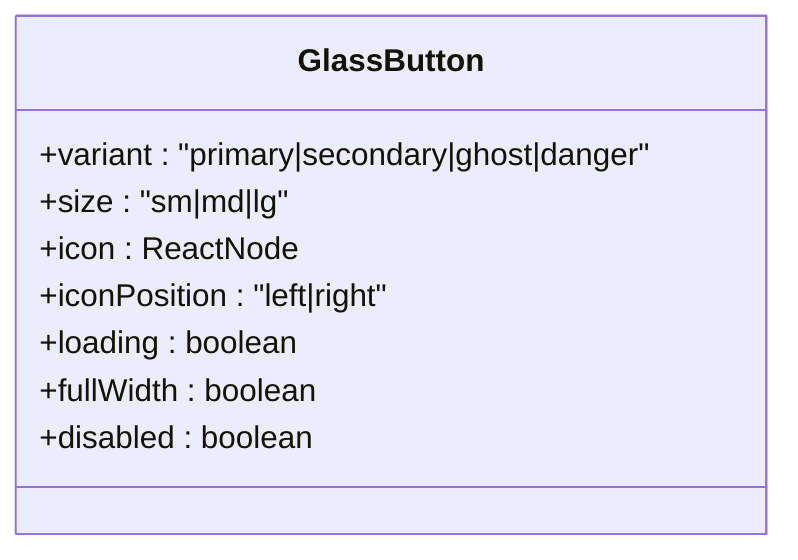
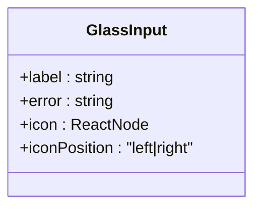
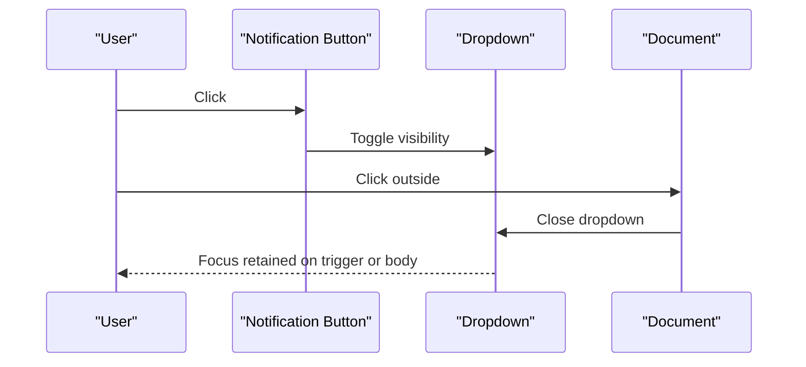
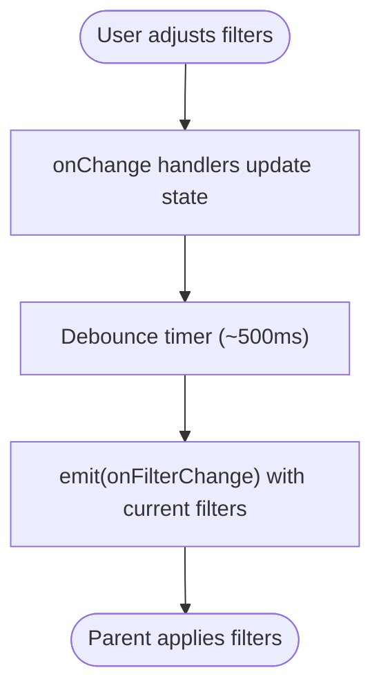
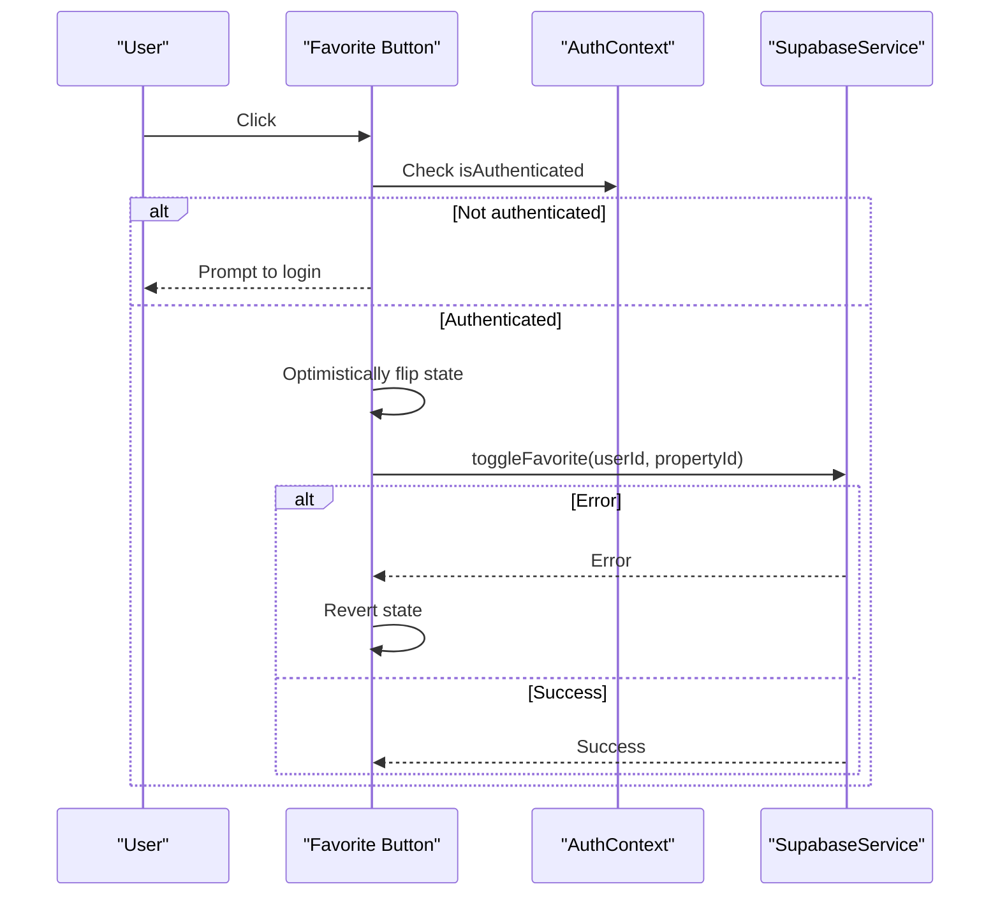
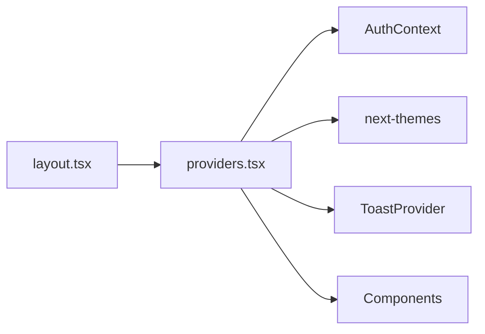

# Accessibility and Compliance

<cite>
**Referenced Files in This Document**
- [layout.tsx](file://src/app/layout.tsx)
- [providers.tsx](file://src/app/providers.tsx)
- [GlassButton.tsx](file://src/components/ui/glass/GlassButton.tsx)
- [GlassInput.tsx](file://src/components/ui/glass/GlassInput.tsx)
- [Header.tsx](file://src/components/Header.tsx)
- [Navbar.tsx](file://src/components/Navbar.tsx)
- [SearchFilters.tsx](file://src/components/SearchFilters.tsx)
- [PropertyCard.tsx](file://src/components/PropertyCard.tsx)
- [MyPropertyCard.tsx](file://src/components/MyPropertyCard.tsx)
- [LoginForm.tsx](file://src/components/auth/LoginForm.tsx)
- [SignUpForm.tsx](file://src/components/auth/SignUpForm.tsx)
- [DateSelector.tsx](file://src/components/booking/DateSelector.tsx)
- [TenantForm.tsx](file://src/components/booking/TenantForm.tsx)
- [web-interface.csv](file://.agent/skills/ui-ux-pro-max/data/web-interface.csv)
- [ux-guidelines.csv](file://.agent/skills/ui-ux-pro-max/data/ux-guidelines.csv)
</cite>

## Table of Contents
1. [Introduction](#introduction)
2. [Project Structure](#project-structure)
3. [Core Components](#core-components)
4. [Architecture Overview](#architecture-overview)
5. [Detailed Component Analysis](#detailed-component-analysis)
6. [Dependency Analysis](#dependency-analysis)
7. [Performance Considerations](#performance-considerations)
8. [Troubleshooting Guide](#troubleshooting-guide)
9. [Conclusion](#conclusion)
10. [Appendices](#appendices)

## Introduction
This document provides comprehensive accessibility guidance for Gamasa Properties UI components. It aligns implementation with WCAG guidelines, documents ARIA usage, keyboard navigation patterns, screen reader support, focus management, color contrast, and semantic HTML. It also outlines testing approaches, maintenance practices, and common pitfalls to avoid.

## Project Structure
Gamasa Properties follows a Next.js App Router structure with a global layout and providers for theme and authentication. UI components are organized under src/components, grouped by domain (auth, booking, chat, notifications, profile, ui). Providers wrap the app to supply theme switching and toast notifications.

**Diagram sources**
- [layout.tsx](file://src/app/layout.tsx#L64-L89)
- [providers.tsx](file://src/app/providers.tsx#L7-L17)
- [Header.tsx](file://src/components/Header.tsx#L87-L221)
- [Navbar.tsx](file://src/components/Navbar.tsx#L28-L55)
- [SearchFilters.tsx](file://src/components/SearchFilters.tsx#L43-L162)
- [PropertyCard.tsx](file://src/components/PropertyCard.tsx#L83-L198)
- [MyPropertyCard.tsx](file://src/components/MyPropertyCard.tsx#L11-L82)
- [LoginForm.tsx](file://src/components/auth/LoginForm.tsx#L48-L220)
- [SignUpForm.tsx](file://src/components/auth/SignUpForm.tsx#L51-L274)
- [DateSelector.tsx](file://src/components/booking/DateSelector.tsx#L15-L246)
- [TenantForm.tsx](file://src/components/booking/TenantForm.tsx#L14-L136)
- [GlassButton.tsx](file://src/components/ui/glass/GlassButton.tsx#L12-L70)
- [GlassInput.tsx](file://src/components/ui/glass/GlassInput.tsx#L10-L62)

**Section sources**
- [layout.tsx](file://src/app/layout.tsx#L64-L89)
- [providers.tsx](file://src/app/providers.tsx#L7-L17)

## Core Components
This section highlights key UI components and their accessibility characteristics, focusing on WCAG conformance, ARIA, keyboard navigation, focus management, and semantic markup.

- Global layout and providers
  - Sets language and direction, Open Graph metadata, and viewport configuration.
  - Wraps children with Auth, Theme, and Toast providers to unify state and UX.

- GlassButton
  - Uses native button semantics with disabled state and loading indicator.
  - Supports variants, sizes, icons, and full-width options.

- GlassInput
  - Renders label, input, and optional left/right icon.
  - Provides error messaging and focus styles.

- Header
  - Notification dropdown with click-outside handler and unread count.
  - User profile and logout actions.

- Navbar
  - Bottom navigation with active state styling and Material Symbols icons.

- SearchFilters
  - Range slider, select, numeric buttons, and feature toggles with debounced updates.

- PropertyCard
  - Favorite toggle, verified badge, rating, discount badges, and action link.

- MyPropertyCard
  - Edit/delete actions with confirmation dialogs and status badges.

- LoginForm and SignUpForm
  - Semantic labels, required fields, password visibility toggle, social sign-in options, and terms agreement.

- DateSelector and TenantForm
  - Localized date inputs, month selection, and form groups with labels.

**Section sources**
- [layout.tsx](file://src/app/layout.tsx#L20-L54)
- [providers.tsx](file://src/app/providers.tsx#L7-L17)
- [GlassButton.tsx](file://src/components/ui/glass/GlassButton.tsx#L12-L70)
- [GlassInput.tsx](file://src/components/ui/glass/GlassInput.tsx#L10-L62)
- [Header.tsx](file://src/components/Header.tsx#L87-L221)
- [Navbar.tsx](file://src/components/Navbar.tsx#L28-L55)
- [SearchFilters.tsx](file://src/components/SearchFilters.tsx#L43-L162)
- [PropertyCard.tsx](file://src/components/PropertyCard.tsx#L83-L198)
- [MyPropertyCard.tsx](file://src/components/MyPropertyCard.tsx#L11-L82)
- [LoginForm.tsx](file://src/components/auth/LoginForm.tsx#L48-L220)
- [SignUpForm.tsx](file://src/components/auth/SignUpForm.tsx#L51-L274)
- [DateSelector.tsx](file://src/components/booking/DateSelector.tsx#L15-L246)
- [TenantForm.tsx](file://src/components/booking/TenantForm.tsx#L14-L136)

## Architecture Overview
The app initializes providers at the root level to ensure consistent theme and authentication contexts across components. UI components rely on Tailwind classes for styling and focus-visible states, while semantic HTML and ARIA attributes support assistive technologies.

**Diagram sources**
- [layout.tsx](file://src/app/layout.tsx#L64-L89)
- [providers.tsx](file://src/app/providers.tsx#L7-L17)
- [GlassButton.tsx](file://src/components/ui/glass/GlassButton.tsx#L12-L70)
- [GlassInput.tsx](file://src/components/ui/glass/GlassInput.tsx#L10-L62)
- [Header.tsx](file://src/components/Header.tsx#L87-L221)
- [Navbar.tsx](file://src/components/Navbar.tsx#L28-L55)
- [SearchFilters.tsx](file://src/components/SearchFilters.tsx#L43-L162)
- [PropertyCard.tsx](file://src/components/PropertyCard.tsx#L83-L198)
- [MyPropertyCard.tsx](file://src/components/MyPropertyCard.tsx#L11-L82)
- [LoginForm.tsx](file://src/components/auth/LoginForm.tsx#L48-L220)
- [SignUpForm.tsx](file://src/components/auth/SignUpForm.tsx#L51-L274)
- [DateSelector.tsx](file://src/components/booking/DateSelector.tsx#L15-L246)
- [TenantForm.tsx](file://src/components/booking/TenantForm.tsx#L14-L136)

## Detailed Component Analysis

### Focus Management and Keyboard Navigation
- Focus styles and visible focus indicators
  - Components use focus-visible utilities and ring/outline replacements to ensure keyboard operability.
  - Inputs and buttons apply focus rings and transitions for clear focus states.

- Keyboard interaction patterns
  - Interactive elements (buttons, links, selects) are keyboard accessible.
  - Dropdowns close on outside clicks; ensure focus is returned appropriately after closing.

- Tab order and navigation
  - Maintain logical tab order aligned with visual layout.
  - Avoid negative tabindex; prefer natural DOM order.

**Section sources**
- [GlassInput.tsx](file://src/components/ui/glass/GlassInput.tsx#L39-L53)
- [GlassButton.tsx](file://src/components/ui/glass/GlassButton.tsx#L42-L68)
- [Header.tsx](file://src/components/Header.tsx#L135-L216)
- [SearchFilters.tsx](file://src/components/SearchFilters.tsx#L68-L98)
- [LoginForm.tsx](file://src/components/auth/LoginForm.tsx#L144-L150)
- [SignUpForm.tsx](file://src/components/auth/SignUpForm.tsx#L223-L230)

### ARIA Attributes and Screen Reader Support
- ARIA roles and labels
  - Prefer semantic HTML (button, label, select) before adding ARIA roles.
  - Icon-only buttons require accessible names via aria-label.
  - Dynamic content updates should use aria-live regions for announcements.

- Decorative icons
  - Decorative icons should be hidden from assistive technologies.

- Live regions
  - Announce asynchronous updates (e.g., notifications, errors) using aria-live.

**Section sources**
- [web-interface.csv](file://.agent/skills/ui-ux-pro-max/data/web-interface.csv#L1-L11)
- [ux-guidelines.csv](file://.agent/skills/ui-ux-pro-max/data/ux-guidelines.csv#L36-L42)
- [Header.tsx](file://src/components/Header.tsx#L135-L216)
- [LoginForm.tsx](file://src/components/auth/LoginForm.tsx#L134-L138)
- [SignUpForm.tsx](file://src/components/auth/SignUpForm.tsx#L215-L220)

### Color Contrast and Visual Design
- Contrast ratios
  - Ensure minimum 4.5:1 contrast for normal text and 3:1 for large text.
  - Test across light/dark themes and consider reduced motion preferences.

- Color-only communication
  - Supplement color cues with text or icons to convey meaning.

**Section sources**
- [ux-guidelines.csv](file://.agent/skills/ui-ux-pro-max/data/ux-guidelines.csv#L36-L42)

### Semantic HTML and Form Controls
- Labels and inputs
  - Associate labels with inputs using htmlFor/id or wrapping semantics.
  - Provide aria-label when labels are visually absent.

- Buttons and links
  - Use native button for actions; use anchor for navigation.

- Lists and grouping
  - Group related controls and use fieldsets/legends where appropriate.

**Section sources**
- [GlassInput.tsx](file://src/components/ui/glass/GlassInput.tsx#L20-L24)
- [LoginForm.tsx](file://src/components/auth/LoginForm.tsx#L78-L94)
- [SignUpForm.tsx](file://src/components/auth/SignUpForm.tsx#L108-L126)
- [web-interface.csv](file://.agent/skills/ui-ux-pro-max/data/web-interface.csv#L1-L11)

### Component-Level Accessibility Patterns

#### GlassButton
- Native button semantics with disabled/loading states.
- Supports icon placement and full-width layout.
- Maintain focus-visible ring and hover/focus states.

**Diagram sources**
- [GlassButton.tsx](file://src/components/ui/glass/GlassButton.tsx#L3-L10)

**Section sources**
- [GlassButton.tsx](file://src/components/ui/glass/GlassButton.tsx#L12-L70)

#### GlassInput
- Label rendering, icon placement, error messaging, and focus styles.
- Ensure error messages are programmatically associated with inputs.

**Diagram sources**
- [GlassInput.tsx](file://src/components/ui/glass/GlassInput.tsx#L3-L8)

**Section sources**
- [GlassInput.tsx](file://src/components/ui/glass/GlassInput.tsx#L10-L62)

#### Header (Notifications)
- Dropdown with click-outside behavior and unread count.
- Keyboard-friendly toggling and focus management.

**Diagram sources**
- [Header.tsx](file://src/components/Header.tsx#L135-L216)

**Section sources**
- [Header.tsx](file://src/components/Header.tsx#L16-L38)
- [Header.tsx](file://src/components/Header.tsx#L135-L216)

#### SearchFilters
- Debounced filter updates, range slider, select, and feature toggles.
- Maintain accessible labels and keyboard interaction for all controls.

**Diagram sources**
- [SearchFilters.tsx](file://src/components/SearchFilters.tsx#L19-L33)

**Section sources**
- [SearchFilters.tsx](file://src/components/SearchFilters.tsx#L11-L33)
- [SearchFilters.tsx](file://src/components/SearchFilters.tsx#L68-L98)

#### PropertyCard
- Favorite toggle with optimistic UI and confirmation for unauthenticated users.
- Verified, rating, and discount badges are presentational; ensure they are marked accordingly.

**Diagram sources**
- [PropertyCard.tsx](file://src/components/PropertyCard.tsx#L57-L79)

**Section sources**
- [PropertyCard.tsx](file://src/components/PropertyCard.tsx#L41-L79)

#### MyPropertyCard
- Edit/delete actions with confirmation dialogs.
- Status badges use color; pair with text for clarity.

**Section sources**
- [MyPropertyCard.tsx](file://src/components/MyPropertyCard.tsx#L63-L78)

#### LoginForm and SignUpForm
- Semantic labels, required fields, password visibility toggle, and terms agreement.
- Error messages are presented with sufficient contrast and accessible names.

**Section sources**
- [LoginForm.tsx](file://src/components/auth/LoginForm.tsx#L78-L150)
- [LoginForm.tsx](file://src/components/auth/LoginForm.tsx#L134-L138)
- [SignUpForm.tsx](file://src/components/auth/SignUpForm.tsx#L108-L230)
- [SignUpForm.tsx](file://src/components/auth/SignUpForm.tsx#L215-L220)

#### DateSelector and TenantForm
- Localized date inputs and month selection with proper labels.
- Form groups and labels ensure screen reader compatibility.

**Section sources**
- [DateSelector.tsx](file://src/components/booking/DateSelector.tsx#L74-L120)
- [DateSelector.tsx](file://src/components/booking/DateSelector.tsx#L122-L173)
- [DateSelector.tsx](file://src/components/booking/DateSelector.tsx#L175-L243)
- [TenantForm.tsx](file://src/components/booking/TenantForm.tsx#L26-L77)

## Dependency Analysis
Components depend on providers for theme and authentication. Providers are initialized at the root layout level to ensure consistent behavior across the app.

**Diagram sources**
- [layout.tsx](file://src/app/layout.tsx#L64-L89)
- [providers.tsx](file://src/app/providers.tsx#L7-L17)

**Section sources**
- [layout.tsx](file://src/app/layout.tsx#L64-L89)
- [providers.tsx](file://src/app/providers.tsx#L7-L17)

## Performance Considerations
- Keep focus-visible rings lightweight; avoid heavy animations on focus.
- Debounce filter updates to reduce re-renders during user interaction.
- Lazy-load images and defer non-critical assets to improve perceived performance for assistive technologies.

## Troubleshooting Guide
Common accessibility issues and resolutions:

- Icon-only buttons lack accessible names
  - Add aria-label to provide meaningful names for assistive technologies.

- Forms miss labels or aria-label
  - Use label elements or aria-label for all form controls.

- Click-only handlers prevent keyboard interaction
  - Add onKeyDown alongside onClick and ensure tabIndex is not misused.

- Decorative icons announced by screen readers
  - Add aria-hidden to decorative icons.

- Dynamic content not announced
  - Use aria-live regions for asynchronous updates.

- Low color contrast
  - Increase contrast ratios to meet WCAG guidelines; test across themes.

- Color-only indicators
  - Combine color with text or icons to convey meaning.

**Section sources**
- [web-interface.csv](file://.agent/skills/ui-ux-pro-max/data/web-interface.csv#L1-L11)
- [ux-guidelines.csv](file://.agent/skills/ui-ux-pro-max/data/ux-guidelines.csv#L36-L42)

## Conclusion
Gamasa Properties UI components incorporate several accessibility best practices, including semantic HTML, focus management, and form labeling. To achieve robust WCAG compliance, ensure all icon buttons have accessible names, dynamic content is announced, and color is not the sole means of conveying information. Implement automated and manual testing to validate keyboard navigation, screen reader compatibility, and color contrast across themes.

## Appendices

### WCAG Guidelines Checklist
- Use semantic HTML before ARIA attributes
- Provide accessible names for interactive elements
- Ensure keyboard accessibility and logical tab order
- Maintain sufficient color contrast
- Announce dynamic updates with aria-live
- Hide decorative icons from assistive technologies
- Pair color with text/icons for critical information

**Section sources**
- [web-interface.csv](file://.agent/skills/ui-ux-pro-max/data/web-interface.csv#L1-L11)
- [ux-guidelines.csv](file://.agent/skills/ui-ux-pro-max/data/ux-guidelines.csv#L36-L42)