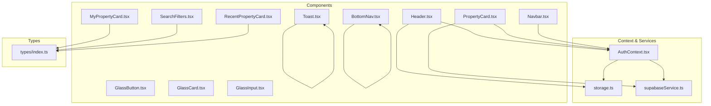
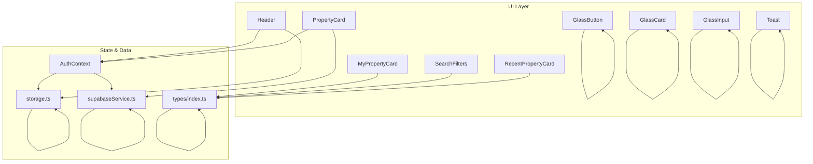
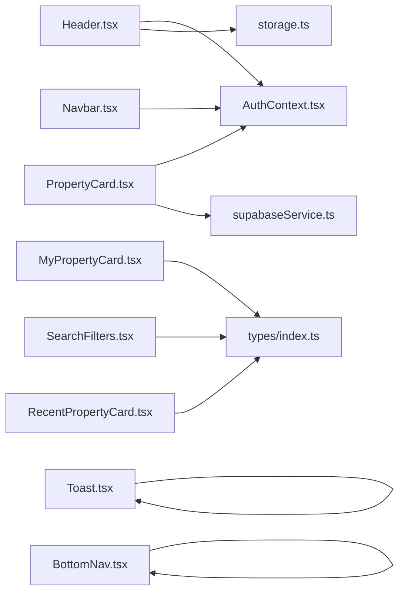

# Component Library

<cite>
**Referenced Files in This Document**
- [Header.tsx](file://src/components/Header.tsx)
- [PropertyCard.tsx](file://src/components/PropertyCard.tsx)
- [MyPropertyCard.tsx](file://src/components/MyPropertyCard.tsx)
- [SearchFilters.tsx](file://src/components/SearchFilters.tsx)
- [RecentPropertyCard.tsx](file://src/components/ui/RecentPropertyCard.tsx)
- [GlassButton.tsx](file://src/components/ui/glass/GlassButton.tsx)
- [GlassCard.tsx](file://src/components/ui/glass/GlassCard.tsx)
- [GlassInput.tsx](file://src/components/ui/glass/GlassInput.tsx)
- [Toast.tsx](file://src/components/ui/Toast.tsx)
- [types/index.ts](file://src/types/index.ts)
- [AuthContext.tsx](file://src/context/AuthContext.tsx)
- [storage.ts](file://src/lib/storage.ts)
- [supabaseService.ts](file://src/services/supabaseService.ts)
- [Navbar.tsx](file://src/components/Navbar.tsx)
- [BottomNav.tsx](file://src/components/BottomNav.tsx)
</cite>

## Table of Contents
1. [Introduction](#introduction)
2. [Project Structure](#project-structure)
3. [Core Components](#core-components)
4. [Architecture Overview](#architecture-overview)
5. [Detailed Component Analysis](#detailed-component-analysis)
6. [Dependency Analysis](#dependency-analysis)
7. [Performance Considerations](#performance-considerations)
8. [Troubleshooting Guide](#troubleshooting-guide)
9. [Conclusion](#conclusion)
10. [Appendices](#appendices)

## Introduction
This document describes the Gamasa Properties UI component library. It focuses on reusable UI elements that power property discovery, user interactions, and administrative workflows. Covered components include Header, PropertyCard, MyPropertyCard, SearchFilters, and supporting UI primitives such as RecentPropertyCard, GlassButton, GlassCard, GlassInput, and Toast. Each component’s props, usage patterns, styling options, composition, state management, accessibility, responsiveness, and cross-browser compatibility are explained with practical integration examples.

## Project Structure
The UI components live under src/components and src/components/ui. Supporting types and services are located under src/types, src/lib, and src/services. Authentication state is centralized via a React Context provider.

**Diagram sources**
- [Header.tsx](file://src/components/Header.tsx#L1-L222)
- [PropertyCard.tsx](file://src/components/PropertyCard.tsx#L1-L199)
- [MyPropertyCard.tsx](file://src/components/MyPropertyCard.tsx#L1-L83)
- [SearchFilters.tsx](file://src/components/SearchFilters.tsx#L1-L163)
- [RecentPropertyCard.tsx](file://src/components/ui/RecentPropertyCard.tsx#L1-L138)
- [GlassButton.tsx](file://src/components/ui/glass/GlassButton.tsx#L1-L70)
- [GlassCard.tsx](file://src/components/ui/glass/GlassCard.tsx#L1-L46)
- [GlassInput.tsx](file://src/components/ui/glass/GlassInput.tsx#L1-L62)
- [Toast.tsx](file://src/components/ui/Toast.tsx#L1-L63)
- [AuthContext.tsx](file://src/context/AuthContext.tsx#L1-L195)
- [storage.ts](file://src/lib/storage.ts#L1-L633)
- [supabaseService.ts](file://src/services/supabaseService.ts#L1-L800)
- [types/index.ts](file://src/types/index.ts#L1-L237)
- [Navbar.tsx](file://src/components/Navbar.tsx#L1-L56)
- [BottomNav.tsx](file://src/components/BottomNav.tsx#L1-L53)

**Section sources**
- [Header.tsx](file://src/components/Header.tsx#L1-L222)
- [PropertyCard.tsx](file://src/components/PropertyCard.tsx#L1-L199)
- [MyPropertyCard.tsx](file://src/components/MyPropertyCard.tsx#L1-L83)
- [SearchFilters.tsx](file://src/components/SearchFilters.tsx#L1-L163)
- [RecentPropertyCard.tsx](file://src/components/ui/RecentPropertyCard.tsx#L1-L138)
- [GlassButton.tsx](file://src/components/ui/glass/GlassButton.tsx#L1-L70)
- [GlassCard.tsx](file://src/components/ui/glass/GlassCard.tsx#L1-L46)
- [GlassInput.tsx](file://src/components/ui/glass/GlassInput.tsx#L1-L62)
- [Toast.tsx](file://src/components/ui/Toast.tsx#L1-L63)
- [AuthContext.tsx](file://src/context/AuthContext.tsx#L1-L195)
- [storage.ts](file://src/lib/storage.ts#L1-L633)
- [supabaseService.ts](file://src/services/supabaseService.ts#L1-L800)
- [types/index.ts](file://src/types/index.ts#L1-L237)
- [Navbar.tsx](file://src/components/Navbar.tsx#L1-L56)
- [BottomNav.tsx](file://src/components/BottomNav.tsx#L1-L53)

## Core Components
- Header: Displays user profile, logout, and notification dropdown with unread count and actions.
- PropertyCard: Renders property tiles with image, pricing, features, verification badge, rating, discount, and favorite toggle.
- MyPropertyCard: Renders a user-owned property card with edit/delete actions and status badges.
- SearchFilters: Provides sticky, debounced filters for price range, rooms, baths, area, category, and features.
- RecentPropertyCard: Lightweight vertical card for recent listings with optional favorite callback.
- GlassButton/GlassCard/GlassInput: Glassmorphism-styled primitives for buttons, cards, and inputs.
- Toast: Global toast notifications with provider and hook.

**Section sources**
- [Header.tsx](file://src/components/Header.tsx#L1-L222)
- [PropertyCard.tsx](file://src/components/PropertyCard.tsx#L1-L199)
- [MyPropertyCard.tsx](file://src/components/MyPropertyCard.tsx#L1-L83)
- [SearchFilters.tsx](file://src/components/SearchFilters.tsx#L1-L163)
- [RecentPropertyCard.tsx](file://src/components/ui/RecentPropertyCard.tsx#L1-L138)
- [GlassButton.tsx](file://src/components/ui/glass/GlassButton.tsx#L1-L70)
- [GlassCard.tsx](file://src/components/ui/glass/GlassCard.tsx#L1-L46)
- [GlassInput.tsx](file://src/components/ui/glass/GlassInput.tsx#L1-L62)
- [Toast.tsx](file://src/components/ui/Toast.tsx#L1-L63)

## Architecture Overview
The UI components integrate with:
- Authentication Context for user state and auth actions.
- Storage utilities for local persistence and mock data.
- Supabase service for remote data and operations.
- Types for strongly typed props and constants.

**Diagram sources**
- [Header.tsx](file://src/components/Header.tsx#L1-L222)
- [PropertyCard.tsx](file://src/components/PropertyCard.tsx#L1-L199)
- [MyPropertyCard.tsx](file://src/components/MyPropertyCard.tsx#L1-L83)
- [SearchFilters.tsx](file://src/components/SearchFilters.tsx#L1-L163)
- [RecentPropertyCard.tsx](file://src/components/ui/RecentPropertyCard.tsx#L1-L138)
- [GlassButton.tsx](file://src/components/ui/glass/GlassButton.tsx#L1-L70)
- [GlassCard.tsx](file://src/components/ui/glass/GlassCard.tsx#L1-L46)
- [GlassInput.tsx](file://src/components/ui/glass/GlassInput.tsx#L1-L62)
- [Toast.tsx](file://src/components/ui/Toast.tsx#L1-L63)
- [AuthContext.tsx](file://src/context/AuthContext.tsx#L1-L195)
- [storage.ts](file://src/lib/storage.ts#L1-L633)
- [supabaseService.ts](file://src/services/supabaseService.ts#L1-L800)
- [types/index.ts](file://src/types/index.ts#L1-L237)

## Detailed Component Analysis

### Header
- Purpose: Top bar with user profile, logout, and notification dropdown.
- Props: None.
- Key behaviors:
  - Loads user notifications from storage and tracks unread count.
  - Click-outside closes dropdown.
  - Marks single or all notifications as read.
  - Navigates to notification link on click.
- Accessibility: Uses semantic markup and keyboard-friendly controls; dropdown toggled via button.
- Responsive: Uses fluid spacing and RTL-aware icon rotation.
- Cross-browser: Relies on standard DOM APIs and CSS Grid/Flex.

Usage pattern:
- Place inside global layout to appear on all pages.
- Integrates with AuthContext for user state and with storage for notifications.

**Section sources**
- [Header.tsx](file://src/components/Header.tsx#L1-L222)
- [AuthContext.tsx](file://src/context/AuthContext.tsx#L1-L195)
- [storage.ts](file://src/lib/storage.ts#L434-L476)

### PropertyCard
- Purpose: Property tile for browsing with image, pricing, features, verification badge, rating, discount, and favorite toggle.
- Props:
  - id, title, location, price, priceUnit (default "night"), image, bedrooms, bathrooms, area, rating, isVerified (default false), isFeatured (default false), discount.
- State management:
  - Tracks favorite state locally; optimistically toggles UI then syncs with backend.
  - Checks favorites on user change.
- Integration:
  - Uses AuthContext for authentication checks.
  - Uses Supabase service to fetch and toggle favorites.
- Accessibility: Buttons use appropriate roles and labels; focus order logical.
- Responsive: Uses Next.js Image with aspect ratio and responsive sizes.

Usage pattern:
- Render in property lists; wrap in links to property detail page.
- Pass optional discount and rating to display badges.

**Section sources**
- [PropertyCard.tsx](file://src/components/PropertyCard.tsx#L1-L199)
- [AuthContext.tsx](file://src/context/AuthContext.tsx#L1-L195)
- [supabaseService.ts](file://src/services/supabaseService.ts#L443-L492)
- [types/index.ts](file://src/types/index.ts#L25-L54)

### MyPropertyCard
- Purpose: Displays a user’s own property with status, views, creation date, price, and action buttons (edit/delete).
- Props:
  - property: Property (from types).
  - onDelete: Callback to remove property.
- Styling: Uses category badge and status badge with color semantics.
- Accessibility: Buttons labeled with titles; links for navigation.

Usage pattern:
- Use in “My Properties” view; wire onDelete to a handler that confirms and removes.

**Section sources**
- [MyPropertyCard.tsx](file://src/components/MyPropertyCard.tsx#L1-L83)
- [types/index.ts](file://src/types/index.ts#L25-L54)

### SearchFilters
- Purpose: Sticky sidebar filters for price, area, rooms, baths, category, and features.
- Props:
  - onFilterChange: Function receiving current filters.
  - initialFilters: Optional initial filter values.
- Behavior:
  - Debounces filter changes to reduce re-renders and API calls.
  - Resets filters to defaults.
- Data:
  - Uses AREAS and FEATURES constants from types.
- Accessibility: Range input, select, and buttons are keyboard accessible.

Usage pattern:
- Wrap in a sticky container; pass onFilterChange to parent to apply filters to property list.

**Section sources**
- [SearchFilters.tsx](file://src/components/SearchFilters.tsx#L1-L163)
- [types/index.ts](file://src/types/index.ts#L135-L159)

### RecentPropertyCard
- Purpose: Compact vertical card for recent property listings with favorite toggle.
- Props:
  - id, title, location, price, image, bedrooms, bathrooms, area, isVerified, rating (optional), onFavoriteClick (optional).
- Styling: Minimal, focused on readability and quick scanning.
- Accessibility: Favorable focus order; clear labels.

Usage pattern:
- Use in “Recently Viewed” or “Recent Listings” sections.

**Section sources**
- [RecentPropertyCard.tsx](file://src/components/ui/RecentPropertyCard.tsx#L1-L138)

### GlassButton
- Purpose: Styled button with variants, sizes, icons, loading state, and full-width option.
- Props:
  - variant: primary | secondary | ghost | danger.
  - size: sm | md | lg.
  - icon, iconPosition, loading, fullWidth, className, disabled.
- Styling: Tailwind-based with glassmorphism classes and transitions.

Usage pattern:
- Replace standard buttons; combine with icons for affordance.

**Section sources**
- [GlassButton.tsx](file://src/components/ui/glass/GlassButton.tsx#L1-L70)

### GlassCard
- Purpose: Container with glassmorphism variants and optional hover/click behavior.
- Props:
  - children, className, variant: default | elevated | subtle, hover, onClick, padding: none | sm | md | lg.
- Styling: Consistent rounded corners and padding scales.

Usage pattern:
- Use as lightweight containers for forms, cards, and overlays.

**Section sources**
- [GlassCard.tsx](file://src/components/ui/glass/GlassCard.tsx#L1-L46)

### GlassInput
- Purpose: Styled input with optional label, error state, and icon placement.
- Props:
  - label, error, icon, iconPosition: left | right.
- Styling: Integrated padding for icons and error highlighting.

Usage pattern:
- Forms requiring consistent input styling.

**Section sources**
- [GlassInput.tsx](file://src/components/ui/glass/GlassInput.tsx#L1-L62)

### Toast
- Purpose: Global toast notifications with provider and hook.
- Props: None for provider; showToast(message, type) via hook.
- Behavior: Auto-dismiss after delay; supports success, error, info.
- Accessibility: Fixed positioning; animated entrance; semantic icon mapping.

Usage pattern:
- Wrap app with provider; call useToast in components to show messages.

**Section sources**
- [Toast.tsx](file://src/components/ui/Toast.tsx#L1-L63)

### Navigation Components
- Navbar: Desktop-style navigation bar with active state indicators.
- BottomNav: Mobile bottom navigation bar with active state and safe-area handling.

Usage pattern:
- Use BottomNav on mobile; Navbar for desktop layouts.

**Section sources**
- [Navbar.tsx](file://src/components/Navbar.tsx#L1-L56)
- [BottomNav.tsx](file://src/components/BottomNav.tsx#L1-L53)

## Dependency Analysis
- Header depends on AuthContext for user state and storage for notifications.
- PropertyCard depends on AuthContext for authentication and Supabase service for favorites.
- MyPropertyCard depends on Property type and onDelete callback.
- SearchFilters depends on types for AREAS and FEATURES and debounces filter changes.
- Glass* components are self-contained presentational utilities.
- Toast is a standalone provider/hook pair.

**Diagram sources**
- [Header.tsx](file://src/components/Header.tsx#L1-L222)
- [PropertyCard.tsx](file://src/components/PropertyCard.tsx#L1-L199)
- [MyPropertyCard.tsx](file://src/components/MyPropertyCard.tsx#L1-L83)
- [SearchFilters.tsx](file://src/components/SearchFilters.tsx#L1-L163)
- [RecentPropertyCard.tsx](file://src/components/ui/RecentPropertyCard.tsx#L1-L138)
- [GlassButton.tsx](file://src/components/ui/glass/GlassButton.tsx#L1-L70)
- [GlassCard.tsx](file://src/components/ui/glass/GlassCard.tsx#L1-L46)
- [GlassInput.tsx](file://src/components/ui/glass/GlassInput.tsx#L1-L62)
- [Toast.tsx](file://src/components/ui/Toast.tsx#L1-L63)
- [AuthContext.tsx](file://src/context/AuthContext.tsx#L1-L195)
- [storage.ts](file://src/lib/storage.ts#L1-L633)
- [supabaseService.ts](file://src/services/supabaseService.ts#L1-L800)
- [types/index.ts](file://src/types/index.ts#L1-L237)
- [Navbar.tsx](file://src/components/Navbar.tsx#L1-L56)
- [BottomNav.tsx](file://src/components/BottomNav.tsx#L1-L53)

**Section sources**
- [Header.tsx](file://src/components/Header.tsx#L1-L222)
- [PropertyCard.tsx](file://src/components/PropertyCard.tsx#L1-L199)
- [MyPropertyCard.tsx](file://src/components/MyPropertyCard.tsx#L1-L83)
- [SearchFilters.tsx](file://src/components/SearchFilters.tsx#L1-L163)
- [RecentPropertyCard.tsx](file://src/components/ui/RecentPropertyCard.tsx#L1-L138)
- [GlassButton.tsx](file://src/components/ui/glass/GlassButton.tsx#L1-L70)
- [GlassCard.tsx](file://src/components/ui/glass/GlassCard.tsx#L1-L46)
- [GlassInput.tsx](file://src/components/ui/glass/GlassInput.tsx#L1-L62)
- [Toast.tsx](file://src/components/ui/Toast.tsx#L1-L63)
- [AuthContext.tsx](file://src/context/AuthContext.tsx#L1-L195)
- [storage.ts](file://src/lib/storage.ts#L1-L633)
- [supabaseService.ts](file://src/services/supabaseService.ts#L1-L800)
- [types/index.ts](file://src/types/index.ts#L1-L237)
- [Navbar.tsx](file://src/components/Navbar.tsx#L1-L56)
- [BottomNav.tsx](file://src/components/BottomNav.tsx#L1-L53)

## Performance Considerations
- Debounced filters: SearchFilters uses a short debounce to avoid excessive re-renders and network calls.
- Local favorites: PropertyCard optimistically updates UI then syncs with backend to improve perceived performance.
- Image optimization: PropertyCard and RecentPropertyCard use Next.js Image with responsive sizes and aspect ratios.
- Minimal state: Header and Toast keep state scoped to their components to reduce unnecessary propagation.
- Sticky filters: SearchFilters uses sticky positioning to avoid layout shifts during scroll.

[No sources needed since this section provides general guidance]

## Troubleshooting Guide
- Favorite toggle not persisting:
  - Verify user is authenticated and Supabase service is reachable.
  - Check that toggleFavorite is called and errors are handled with rollback.
- Notifications not updating:
  - Ensure storage events are dispatched and AuthContext listeners are attached.
  - Confirm unread count calculation and mark-as-read functions.
- Filter not applying:
  - Verify onFilterChange receives expected keys and debounce timeout is sufficient.
- Toast not showing:
  - Ensure ToastProvider wraps the app and useToast is called within provider scope.

**Section sources**
- [PropertyCard.tsx](file://src/components/PropertyCard.tsx#L57-L79)
- [Header.tsx](file://src/components/Header.tsx#L16-L38)
- [storage.ts](file://src/lib/storage.ts#L455-L476)
- [SearchFilters.tsx](file://src/components/SearchFilters.tsx#L19-L33)
- [Toast.tsx](file://src/components/ui/Toast.tsx#L19-L62)

## Conclusion
Gamasa Properties’ UI library combines functional, accessible components with robust state and data integrations. The components emphasize responsive design, consistent glassmorphism styling, and efficient interactions. By leveraging the provided patterns and types, teams can compose reliable property discovery and management experiences across devices.

[No sources needed since this section summarizes without analyzing specific files]

## Appendices

### Props Reference Summary
- Header: No props; relies on AuthContext and storage.
- PropertyCard: id, title, location, price, priceUnit, image, bedrooms, bathrooms, area, rating, isVerified, isFeatured, discount.
- MyPropertyCard: property (Property), onDelete.
- SearchFilters: onFilterChange, initialFilters.
- RecentPropertyCard: id, title, location, price, image, bedrooms, bathrooms, area, isVerified, rating, onFavoriteClick.
- GlassButton: variant, size, icon, iconPosition, loading, fullWidth, className, disabled.
- GlassCard: children, className, variant, hover, onClick, padding.
- GlassInput: label, error, icon, iconPosition.
- Toast: Provider and hook; no props for provider.

**Section sources**
- [Header.tsx](file://src/components/Header.tsx#L1-L222)
- [PropertyCard.tsx](file://src/components/PropertyCard.tsx#L10-L40)
- [MyPropertyCard.tsx](file://src/components/MyPropertyCard.tsx#L6-L9)
- [SearchFilters.tsx](file://src/components/SearchFilters.tsx#L6-L9)
- [RecentPropertyCard.tsx](file://src/components/ui/RecentPropertyCard.tsx#L20-L32)
- [GlassButton.tsx](file://src/components/ui/glass/GlassButton.tsx#L3-L10)
- [GlassCard.tsx](file://src/components/ui/glass/GlassCard.tsx#L3-L10)
- [GlassInput.tsx](file://src/components/ui/glass/GlassInput.tsx#L3-L8)
- [Toast.tsx](file://src/components/ui/Toast.tsx#L19-L62)

### Integration Examples
- PropertyCard in a list:
  - Iterate over properties and render PropertyCard for each.
  - Handle navigation to property detail via Link.
- SearchFilters with debounced results:
  - Call onFilterChange with current filters; parent applies to property list.
- Toast usage:
  - Wrap app with ToastProvider at root.
  - In a form submit handler, call useToast().showToast("Success!", "success").

**Section sources**
- [PropertyCard.tsx](file://src/components/PropertyCard.tsx#L186-L195)
- [SearchFilters.tsx](file://src/components/SearchFilters.tsx#L20-L33)
- [Toast.tsx](file://src/components/ui/Toast.tsx#L19-L54)