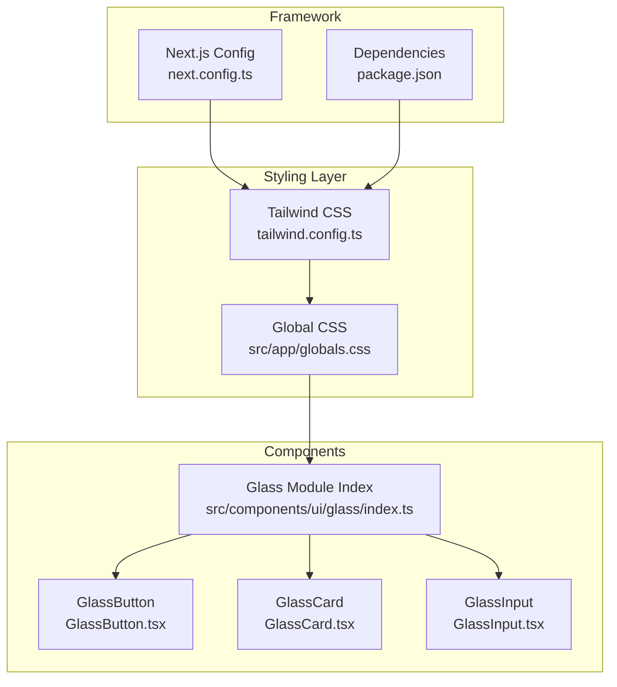
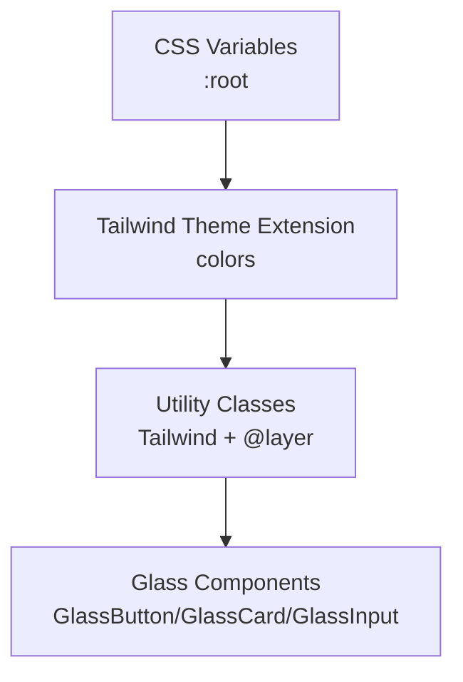
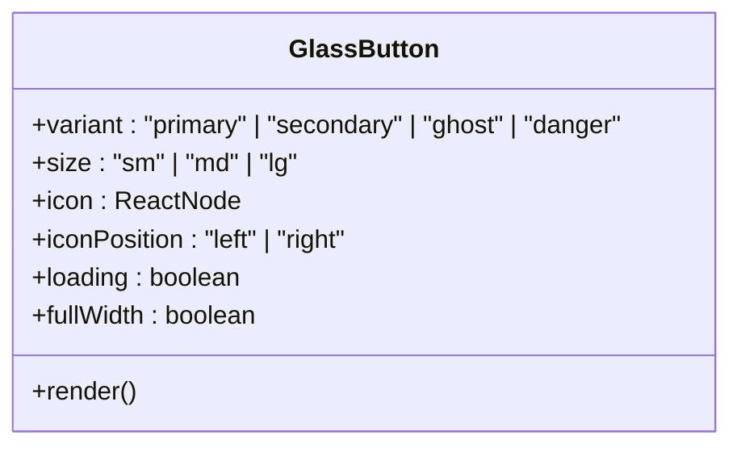
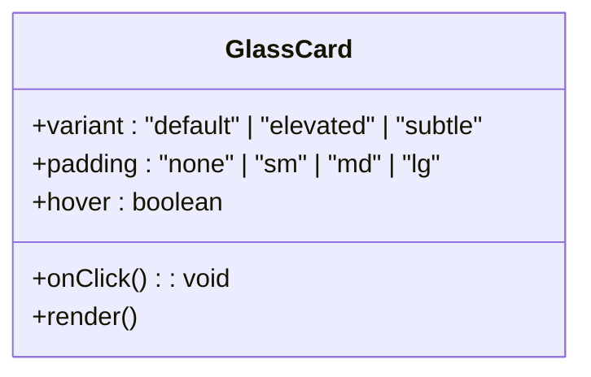
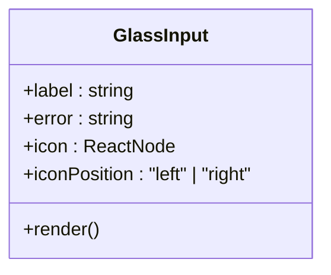
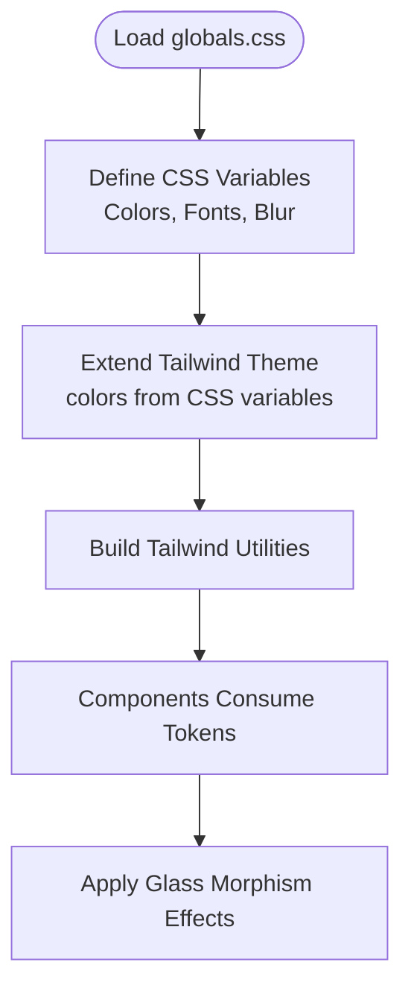
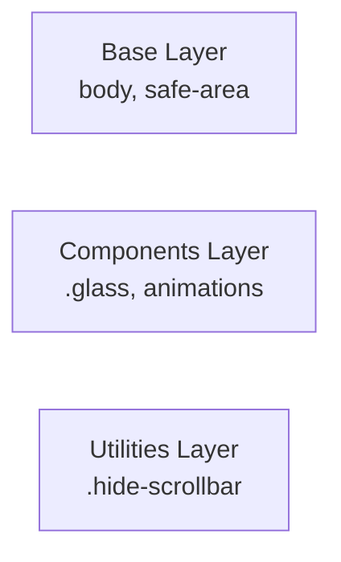
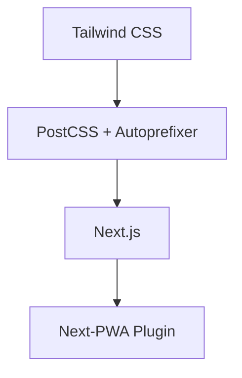

# Design System Foundations

<cite>
**Referenced Files in This Document**
- [tailwind.config.ts](file://tailwind.config.ts)
- [globals.css](file://src/app/globals.css)
- [index.ts](file://src/components/ui/glass/index.ts)
- [GlassButton.tsx](file://src/components/ui/glass/GlassButton.tsx)
- [GlassCard.tsx](file://src/components/ui/glass/GlassCard.tsx)
- [GlassInput.tsx](file://src/components/ui/glass/GlassInput.tsx)
- [next.config.ts](file://next.config.ts)
- [package.json](file://package.json)
</cite>

## Table of Contents
1. [Introduction](#introduction)
2. [Project Structure](#project-structure)
3. [Core Components](#core-components)
4. [Architecture Overview](#architecture-overview)
5. [Detailed Component Analysis](#detailed-component-analysis)
6. [Dependency Analysis](#dependency-analysis)
7. [Performance Considerations](#performance-considerations)
8. [Troubleshooting Guide](#troubleshooting-guide)
9. [Conclusion](#conclusion)
10. [Appendices](#appendices)

## Introduction
This document establishes the foundational design system for Gamasa Properties. It defines the core design principles, color palette system, typography hierarchy, spacing scale, and breakpoint definitions. It also explains the Tailwind CSS configuration, custom theme extensions, design tokens, and utility class organization. The glass morphism design philosophy and its implementation across components are documented, alongside brand guidelines, accessibility standards, and responsive design considerations. Examples of design token usage and consistency patterns are provided to ensure uniformity across the application.

## Project Structure
Gamasa Properties organizes its design system around a centralized Tailwind configuration and global CSS variables. The structure integrates:
- Tailwind CSS configuration extending design tokens via CSS variables
- Global CSS variables defining color palettes, fonts, and additional design tokens
- Glass morphism components under a dedicated UI module
- Next.js configuration supporting PWA and image optimization

**Diagram sources**
- [tailwind.config.ts](file://tailwind.config.ts#L1-L36)
- [globals.css](file://src/app/globals.css#L1-L118)
- [index.ts](file://src/components/ui/glass/index.ts#L1-L9)
- [GlassButton.tsx](file://src/components/ui/glass/GlassButton.tsx#L1-L70)
- [GlassCard.tsx](file://src/components/ui/glass/GlassCard.tsx#L1-L46)
- [GlassInput.tsx](file://src/components/ui/glass/GlassInput.tsx#L1-L62)
- [next.config.ts](file://next.config.ts#L1-L31)
- [package.json](file://package.json#L1-L42)

**Section sources**
- [tailwind.config.ts](file://tailwind.config.ts#L1-L36)
- [globals.css](file://src/app/globals.css#L1-L118)
- [index.ts](file://src/components/ui/glass/index.ts#L1-L9)
- [next.config.ts](file://next.config.ts#L1-L31)
- [package.json](file://package.json#L1-L42)

## Core Components
This section documents the design system’s foundational elements: color palette, typography, spacing, and breakpoints.

- Color Palette System
  - Primary and surface colors are defined as RGB triplets via CSS variables and exposed as Tailwind color utilities.
  - Status palette includes success, warning, error, and info tones for feedback and alerts.
  - Background and border variants support light and dark themes.

- Typography Hierarchy
  - Font families are set via CSS variables for consistent application-wide usage.
  - Sans and display fonts are configured to use Arabic fonts with system fallbacks.

- Spacing Scale
  - Consistent padding and margin scales are applied across components using Tailwind spacing utilities and component-specific props.

- Breakpoint Definitions
  - Tailwind’s default breakpoints are used. No custom breakpoints are defined in the configuration.

- Accessibility Standards
  - Focus visibility is defined with a visible outline and offset for keyboard navigation.
  - Sufficient contrast is ensured by using appropriate text and background combinations.

- Brand Guidelines
  - Primary color is used for emphasis and interactive elements.
  - Status colors communicate system states and errors.
  - Glass morphism components maintain brand consistency through shared visual language.

**Section sources**
- [tailwind.config.ts](file://tailwind.config.ts#L9-L28)
- [globals.css](file://src/app/globals.css#L8-L49)
- [globals.css](file://src/app/globals.css#L114-L118)

## Architecture Overview
The design system architecture ties together Tailwind’s theme extension, global CSS variables, and component-level implementations. The Tailwind configuration reads CSS variables and exposes them as color utilities. Global CSS variables define the foundational tokens. Glass morphism components consume these tokens and utilities to present a cohesive visual language.

**Diagram sources**
- [globals.css](file://src/app/globals.css#L8-L49)
- [tailwind.config.ts](file://tailwind.config.ts#L9-L28)
- [GlassButton.tsx](file://src/components/ui/glass/GlassButton.tsx#L24-L37)
- [GlassCard.tsx](file://src/components/ui/glass/GlassCard.tsx#L20-L35)
- [GlassInput.tsx](file://src/components/ui/glass/GlassInput.tsx#L39-L51)

## Detailed Component Analysis

### Glass Morphism Design Philosophy
Glass morphism is implemented through layered effects: backdrop blur, semi-transparent backgrounds, and thin borders. The approach adapts to light and dark modes with adjusted alpha values and fallbacks. Animations enhance perceived depth and responsiveness.

Key implementation elements:
- Base glass effect with backdrop blur and border
- Dark mode adjustments for background and border
- Animation utilities for entrance transitions
- Focus styles ensuring accessibility

**Section sources**
- [globals.css](file://src/app/globals.css#L66-L86)
- [globals.css](file://src/app/globals.css#L101-L111)
- [globals.css](file://src/app/globals.css#L114-L118)

### GlassButton Component
GlassButton encapsulates button variants, sizes, icons, loading states, and full-width behavior. It leverages:
- Variant classes for primary, secondary, ghost, and danger styles
- Size classes for small, medium, and large dimensions
- Icon positioning and loading spinner
- Full-width option and hover/active/disabled states

**Diagram sources**
- [GlassButton.tsx](file://src/components/ui/glass/GlassButton.tsx#L3-L10)
- [GlassButton.tsx](file://src/components/ui/glass/GlassButton.tsx#L24-L37)

**Section sources**
- [GlassButton.tsx](file://src/components/ui/glass/GlassButton.tsx#L1-L70)

### GlassCard Component
GlassCard provides container variants with optional elevation and subtle styles. It supports:
- Variant classes for default, elevated, and subtle appearances
- Padding options and hover effects
- Click handlers and custom class injection

**Diagram sources**
- [GlassCard.tsx](file://src/components/ui/glass/GlassCard.tsx#L3-L10)
- [GlassCard.tsx](file://src/components/ui/glass/GlassCard.tsx#L22-L35)

**Section sources**
- [GlassCard.tsx](file://src/components/ui/glass/GlassCard.tsx#L1-L46)

### GlassInput Component
GlassInput offers form field styling with optional labels, icons, and error states. It integrates:
- Label and error messaging
- Left/right icon placement
- Focus ring with primary color emphasis
- Conditional padding based on icon presence

**Diagram sources**
- [GlassInput.tsx](file://src/components/ui/glass/GlassInput.tsx#L3-L8)
- [GlassInput.tsx](file://src/components/ui/glass/GlassInput.tsx#L26-L51)

**Section sources**
- [GlassInput.tsx](file://src/components/ui/glass/GlassInput.tsx#L1-L62)

### Tailwind CSS Configuration and Design Tokens
The Tailwind configuration extends the theme using CSS variables, enabling dynamic color application across light and dark modes. Design tokens are centralized in global CSS variables for consistent usage.

**Diagram sources**
- [globals.css](file://src/app/globals.css#L8-L49)
- [tailwind.config.ts](file://tailwind.config.ts#L9-L28)

**Section sources**
- [tailwind.config.ts](file://tailwind.config.ts#L1-L36)
- [globals.css](file://src/app/globals.css#L1-L118)

### Utility Class Organization
Utility classes are organized under Tailwind layers:
- Base layer sets global defaults and safe areas
- Components layer defines glass morphism and animations
- Utilities layer adds custom helpers like scroll-hide

**Diagram sources**
- [globals.css](file://src/app/globals.css#L51-L60)
- [globals.css](file://src/app/globals.css#L66-L98)

**Section sources**
- [globals.css](file://src/app/globals.css#L51-L98)

## Dependency Analysis
The design system relies on Tailwind CSS and Next.js configurations. Dependencies include Tailwind CSS, PostCSS, autoprefixer, and Next.js PWA plugin. These enable responsive design, build-time optimizations, and offline capabilities.

**Diagram sources**
- [package.json](file://package.json#L11-L27)
- [next.config.ts](file://next.config.ts#L1-L31)

**Section sources**
- [package.json](file://package.json#L1-L42)
- [next.config.ts](file://next.config.ts#L1-L31)

## Performance Considerations
- Use of CSS variables reduces duplication and improves maintainability.
- Tailwind’s JIT compilation ensures only used utilities are generated.
- Glass morphism effects rely on backdrop blur; test performance on lower-end devices and consider reducing blur radius if needed.
- Keep animations subtle to avoid layout shifts and repaint overhead.

## Troubleshooting Guide
- Colors not applying: Verify CSS variable definitions and Tailwind theme extension.
- Glass effect not visible: Confirm backdrop blur support and ensure proper class application.
- Icons not aligned: Adjust icon position props and check padding classes.
- Focus styles missing: Ensure focus-visible styles are not overridden by global resets.

**Section sources**
- [globals.css](file://src/app/globals.css#L8-L49)
- [tailwind.config.ts](file://tailwind.config.ts#L9-L28)
- [GlassInput.tsx](file://src/components/ui/glass/GlassInput.tsx#L26-L51)
- [globals.css](file://src/app/globals.css#L114-L118)

## Conclusion
Gamasa Properties’ design system centers on a robust color palette, typography, and spacing foundation powered by CSS variables and Tailwind’s theme extension. The glass morphism design philosophy is consistently implemented across components, ensuring a modern, accessible, and visually coherent user experience. By adhering to the outlined patterns and guidelines, teams can maintain design consistency while scaling the application.

## Appendices
- Design Token Usage Patterns
  - Prefer using Tailwind color utilities derived from CSS variables for consistent theming.
  - Apply glass classes from the components module for unified visual behavior.
  - Use focus-visible outlines to meet accessibility requirements.
- Responsive Design Notes
  - Default Tailwind breakpoints apply; no custom breakpoints are defined.
  - Test components across device sizes to ensure readability and usability.