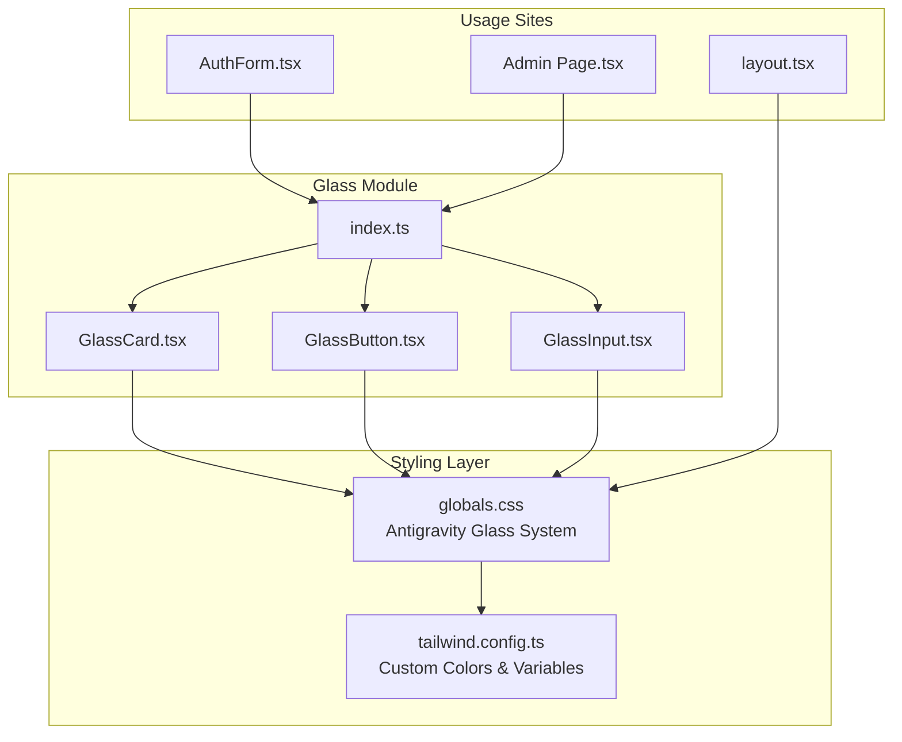
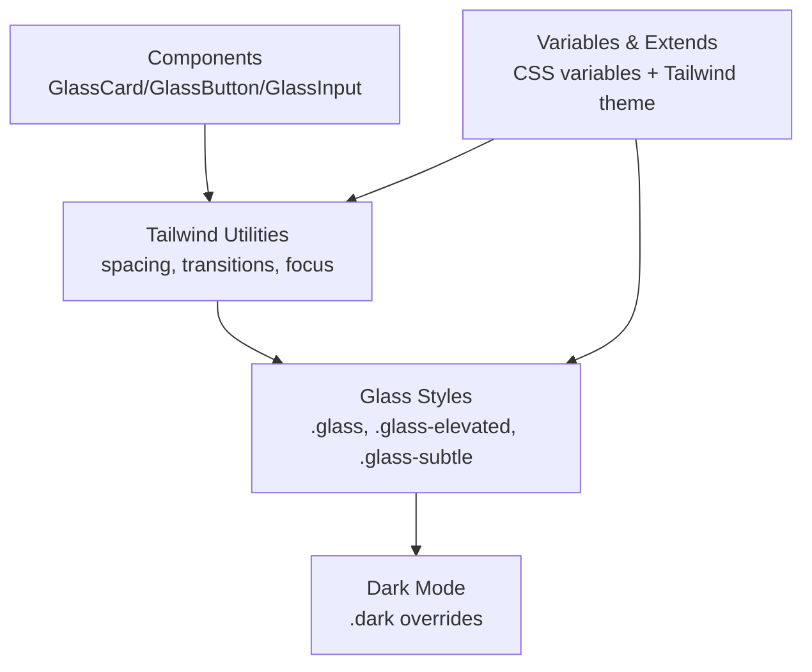
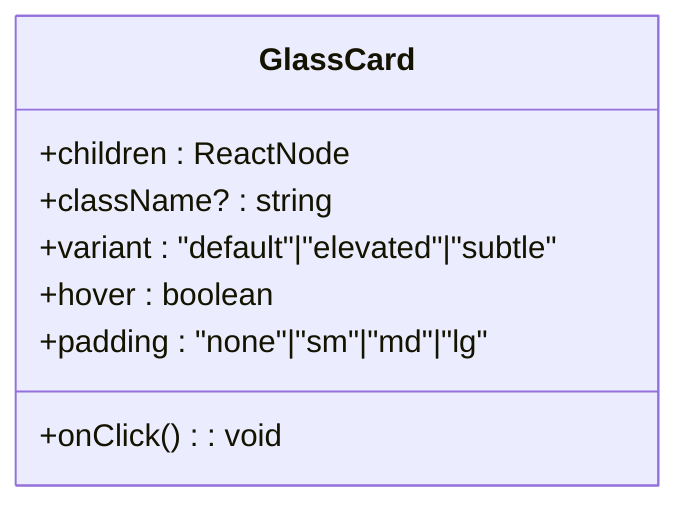
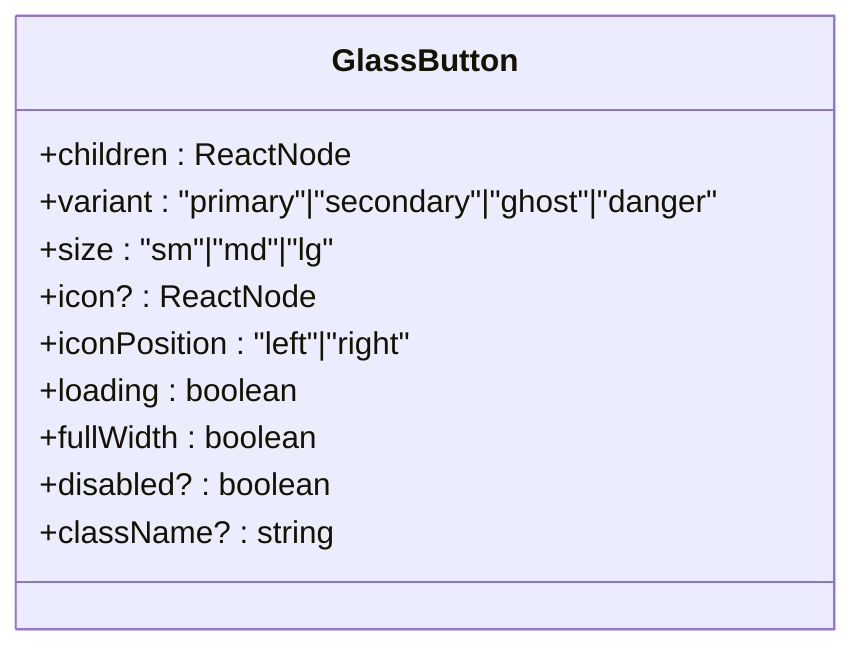
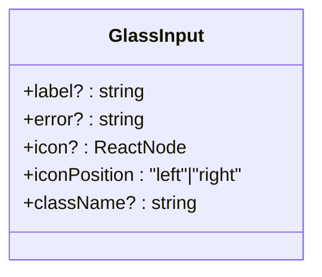
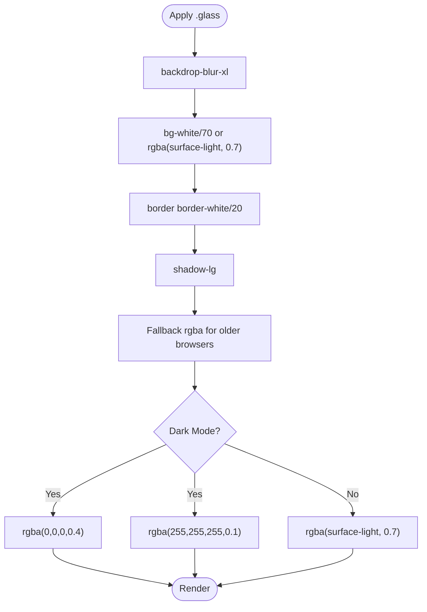
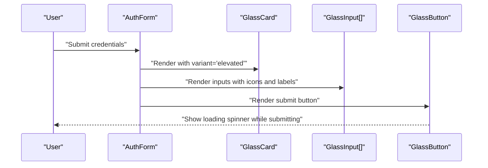
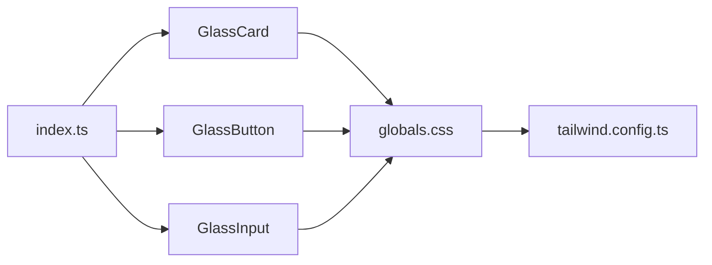

# Glass Morphism Design System

<cite>
**Referenced Files in This Document**
- [GlassCard.tsx](file://src/components/ui/glass/GlassCard.tsx)
- [GlassButton.tsx](file://src/components/ui/glass/GlassButton.tsx)
- [GlassInput.tsx](file://src/components/ui/glass/GlassInput.tsx)
- [index.ts](file://src/components/ui/glass/index.ts)
- [globals.css](file://src/app/globals.css)
- [tailwind.config.ts](file://tailwind.config.ts)
- [AuthForm.tsx](file://src/components/auth/AuthForm.tsx)
- [layout.tsx](file://src/app/layout.tsx)
- [page.tsx](file://src/app/admin/page.tsx)
- [package.json](file://package.json)
</cite>

## Table of Contents
1. [Introduction](#introduction)
2. [Project Structure](#project-structure)
3. [Core Components](#core-components)
4. [Architecture Overview](#architecture-overview)
5. [Detailed Component Analysis](#detailed-component-analysis)
6. [Dependency Analysis](#dependency-analysis)
7. [Performance Considerations](#performance-considerations)
8. [Troubleshooting Guide](#troubleshooting-guide)
9. [Conclusion](#conclusion)
10. [Appendices](#appendices)

## Introduction
This document describes the glass morphism design system used by Gamasa Properties. It focuses on three reusable UI primitives—Glass Card, Glass Button, and Glass Input—detailing their implementation, styling properties, customization options, and integration patterns. It also explains the glass effect techniques, backdrop blur effects, transparency handling, responsive behavior, and performance considerations across browsers.

## Project Structure
The glass system is implemented as a cohesive set of React components under a dedicated module and styled via Tailwind CSS utilities layered with custom CSS. The components are exported through a barrel index and consumed across pages and forms.

**Diagram sources**
- [index.ts](file://src/components/ui/glass/index.ts#L1-L9)
- [GlassCard.tsx](file://src/components/ui/glass/GlassCard.tsx#L1-L46)
- [GlassButton.tsx](file://src/components/ui/glass/GlassButton.tsx#L1-L70)
- [GlassInput.tsx](file://src/components/ui/glass/GlassInput.tsx#L1-L62)
- [globals.css](file://src/app/globals.css#L62-L86)
- [tailwind.config.ts](file://tailwind.config.ts#L9-L28)
- [AuthForm.tsx](file://src/components/auth/AuthForm.tsx#L6-L149)
- [page.tsx](file://src/app/admin/page.tsx#L94-L141)
- [layout.tsx](file://src/app/layout.tsx#L3-L86)

**Section sources**
- [index.ts](file://src/components/ui/glass/index.ts#L1-L9)
- [globals.css](file://src/app/globals.css#L62-L86)
- [tailwind.config.ts](file://tailwind.config.ts#L9-L28)
- [layout.tsx](file://src/app/layout.tsx#L3-L86)

## Core Components
This section documents the three glass components and their props, styling variants, and usage patterns.

- GlassCard
  - Purpose: Container with glass effect, padding, hover scaling, and click handling.
  - Key props:
    - variant: default | elevated | subtle
    - padding: none | sm | md | lg
    - hover: boolean (adds interactive scale and cursor)
    - onClick: handler for pointer events
    - className: additional Tailwind classes
  - Variants:
    - default: base glass effect
    - elevated: stronger depth effect
    - subtle: lighter glass effect
  - Padding presets:
    - none, sm, md, lg mapped to padding utilities
  - Hover behavior:
    - Optional scaling and pointer cursor when enabled

- GlassButton
  - Purpose: Interactive button with glass styling, variants, sizes, icons, loading state, and full-width option.
  - Key props:
    - variant: primary | secondary | ghost | danger
    - size: sm | md | lg
    - icon: ReactNode (optional)
    - iconPosition: left | right
    - loading: boolean (displays spinner)
    - fullWidth: boolean
    - disabled: inherited from ButtonHTMLAttributes
    - className: additional Tailwind classes
  - Variants:
    - primary: colored background with shadow and hover adjustments
    - secondary: glass background with text color and border hover
    - ghost: transparent background with text and glass hover
    - danger: error-colored background with brightness hover
  - Sizes:
    - sm, md, lg mapped to horizontal/vertical padding and text size
  - Loading:
    - Disables button and renders an inline spinner

- GlassInput
  - Purpose: Text input with optional label, icon, and error state.
  - Key props:
    - label: string (optional)
    - error: string (optional)
    - icon: ReactNode (optional)
    - iconPosition: left | right
    - className: additional Tailwind classes
  - Features:
    - Label rendering when provided
    - Icon placement either left or right with appropriate spacing
    - Error state applies red border and subtle pulse animation
    - Focus state with ring highlight and border transitions

**Section sources**
- [GlassCard.tsx](file://src/components/ui/glass/GlassCard.tsx#L3-L45)
- [GlassButton.tsx](file://src/components/ui/glass/GlassButton.tsx#L3-L69)
- [GlassInput.tsx](file://src/components/ui/glass/GlassInput.tsx#L3-L61)

## Architecture Overview
The glass system relies on a layered approach:
- Component layer: React components expose props and assemble Tailwind classes.
- Utility layer: Tailwind utilities define spacing, colors, transitions, and focus states.
- Glass layer: Custom CSS defines the glass effect, backdrop blur, and dark-mode overrides.
- Theme layer: Tailwind theme extends CSS variables for dynamic color application.

**Diagram sources**
- [globals.css](file://src/app/globals.css#L66-L86)
- [tailwind.config.ts](file://tailwind.config.ts#L9-L28)

## Detailed Component Analysis

### GlassCard
- Implementation highlights:
  - Accepts variant, padding, hover, and onClick props.
  - Applies base rounded corners and transition utilities.
  - Selects variant-specific glass class and padding class.
  - Adds hover scaling and pointer cursor when enabled.
- Styling variants:
  - default: base glass effect
  - elevated: deeper glass effect
  - subtle: lighter glass effect
- Responsive behavior:
  - Uses padding presets; parent containers control layout responsiveness.

**Diagram sources**
- [GlassCard.tsx](file://src/components/ui/glass/GlassCard.tsx#L3-L19)

**Section sources**
- [GlassCard.tsx](file://src/components/ui/glass/GlassCard.tsx#L12-L45)

### GlassButton
- Implementation highlights:
  - Inherits button attributes and adds variant, size, icon, loading, and fullWidth props.
  - Variant classes combine background, text color, shadows, and hover effects.
  - Size classes adjust padding and text size.
  - Loading state disables the button and renders a spinner.
  - Full-width option sets width to 100%.
- Interaction states:
  - active: slight scale-down
  - disabled: reduced opacity and non-clickable cursor
  - focus-visible: custom outline ring

**Diagram sources**
- [GlassButton.tsx](file://src/components/ui/glass/GlassButton.tsx#L3-L22)

**Section sources**
- [GlassButton.tsx](file://src/components/ui/glass/GlassButton.tsx#L12-L69)

### GlassInput
- Implementation highlights:
  - Renders optional label and input inside a relative container.
  - Supports left/right icon with proper padding adjustments.
  - Error state applies error border and subtle pulse animation.
  - Focus state adds ring highlight and border transitions.
- Accessibility:
  - Inherits standard input attributes and integrates with form validation.

**Diagram sources**
- [GlassInput.tsx](file://src/components/ui/glass/GlassInput.tsx#L3-L16)

**Section sources**
- [GlassInput.tsx](file://src/components/ui/glass/GlassInput.tsx#L10-L61)

### Glass Effect Implementation
- Base glass effect:
  - Backdrop blur, semi-transparent background, thin border, and shadow.
  - Fallback background and border colors using CSS variables for light/dark modes.
- Dark mode overrides:
  - Adjusts background and border alpha for contrast and readability.
- Color system:
  - Tailwind theme maps CSS variables to color tokens for dynamic theming.

**Diagram sources**
- [globals.css](file://src/app/globals.css#L68-L86)
- [tailwind.config.ts](file://tailwind.config.ts#L11-L27)

**Section sources**
- [globals.css](file://src/app/globals.css#L66-L86)
- [tailwind.config.ts](file://tailwind.config.ts#L9-L28)

### Usage Examples and Integration Patterns
- Authentication form:
  - Uses GlassCard for the form container, GlassInput for fields, and GlassButton for submission.
  - Demonstrates label, icon, error, and loading states.
- Admin dashboard:
  - Uses GlassCard with elevated variant and hover scaling for stat cards and recent items.
- Global integration:
  - Styles are included globally via the root layout, ensuring consistent glass behavior across pages.

**Diagram sources**
- [AuthForm.tsx](file://src/components/auth/AuthForm.tsx#L55-L124)

**Section sources**
- [AuthForm.tsx](file://src/components/auth/AuthForm.tsx#L55-L149)
- [page.tsx](file://src/app/admin/page.tsx#L94-L141)
- [layout.tsx](file://src/app/layout.tsx#L3-L86)

## Dependency Analysis
- Component exports:
  - Barrel index re-exports GlassCard, GlassButton, and GlassInput with their respective prop types.
- Styling dependencies:
  - Components rely on Tailwind utilities and the Antigravity Glass System defined in global CSS.
  - Tailwind theme extends CSS variables for color tokens.
- Runtime dependencies:
  - Next.js app directory structure and providers ensure global styles are applied.

**Diagram sources**
- [index.ts](file://src/components/ui/glass/index.ts#L1-L9)
- [GlassCard.tsx](file://src/components/ui/glass/GlassCard.tsx#L1-L46)
- [GlassButton.tsx](file://src/components/ui/glass/GlassButton.tsx#L1-L70)
- [GlassInput.tsx](file://src/components/ui/glass/GlassInput.tsx#L1-L62)
- [globals.css](file://src/app/globals.css#L62-L86)
- [tailwind.config.ts](file://tailwind.config.ts#L9-L28)

**Section sources**
- [index.ts](file://src/components/ui/glass/index.ts#L1-L9)
- [globals.css](file://src/app/globals.css#L62-L86)
- [tailwind.config.ts](file://tailwind.config.ts#L9-L28)

## Performance Considerations
- Backdrop blur cost:
  - backdrop-blur-xl can be expensive on low-end devices and older GPUs. Prefer fewer blurred elements on critical paths.
- Reduce repaints:
  - Keep hover animations minimal; avoid animating heavy properties like width/height.
- CSS fallbacks:
  - The glass effect includes fallback rgba values to mitigate rendering differences across browsers.
- Font and asset optimization:
  - Fonts are preloaded; ensure images and assets are optimized to minimize layout shifts.
- Browser support:
  - backdrop-filter is widely supported in modern browsers. For legacy environments, consider providing a reduced-motion or no-blur fallback.

[No sources needed since this section provides general guidance]

## Troubleshooting Guide
- Glass effect not visible:
  - Verify that the glass utility classes are present and global CSS is loaded.
  - Confirm dark mode toggle does not override colors unintentionally.
- Input focus ring not visible:
  - Ensure focus-visible styles are not overridden by parent containers.
- Hover scaling conflicts:
  - Check for conflicting transforms on child elements within GlassCard.
- Icon overlap:
  - Ensure padding classes are applied when using left/right icons in GlassInput.

**Section sources**
- [globals.css](file://src/app/globals.css#L114-L118)
- [GlassInput.tsx](file://src/components/ui/glass/GlassInput.tsx#L39-L53)

## Conclusion
Gamasa Properties’ glass morphism design system provides a consistent, theme-aware, and accessible set of UI primitives. By combining Tailwind utilities with custom glass styles and a robust color system, the components deliver a modern aesthetic with clear customization points. Following the usage patterns and performance recommendations ensures reliable rendering across devices and browsers.

[No sources needed since this section summarizes without analyzing specific files]

## Appendices

### Component Props Reference
- GlassCard
  - variant: default | elevated | subtle
  - padding: none | sm | md | lg
  - hover: boolean
  - onClick: function
  - className: string
- GlassButton
  - variant: primary | secondary | ghost | danger
  - size: sm | md | lg
  - icon: ReactNode
  - iconPosition: left | right
  - loading: boolean
  - fullWidth: boolean
  - disabled: boolean
  - className: string
- GlassInput
  - label: string
  - error: string
  - icon: ReactNode
  - iconPosition: left | right
  - className: string

**Section sources**
- [GlassCard.tsx](file://src/components/ui/glass/GlassCard.tsx#L3-L19)
- [GlassButton.tsx](file://src/components/ui/glass/GlassButton.tsx#L3-L22)
- [GlassInput.tsx](file://src/components/ui/glass/GlassInput.tsx#L3-L16)

### Browser Compatibility Notes
- backdrop-filter: Supported in modern browsers; consider reduced motion or simplified backgrounds for older devices.
- CSS variables: Used extensively for dynamic theming; ensure fallbacks remain functional.
- Tailwind utilities: Ensure PostCSS pipeline is configured to process utilities.

**Section sources**
- [package.json](file://package.json#L11-L26)
- [tailwind.config.ts](file://tailwind.config.ts#L31-L33)