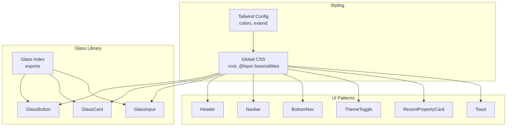
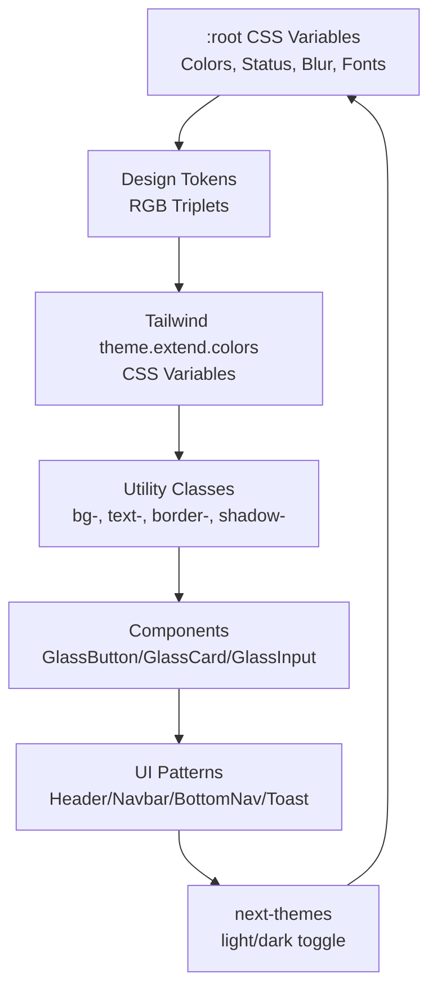
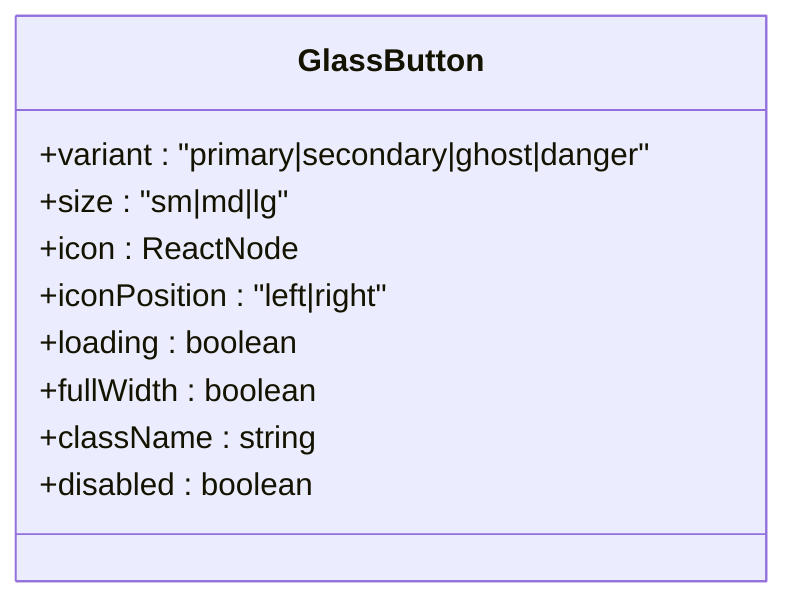
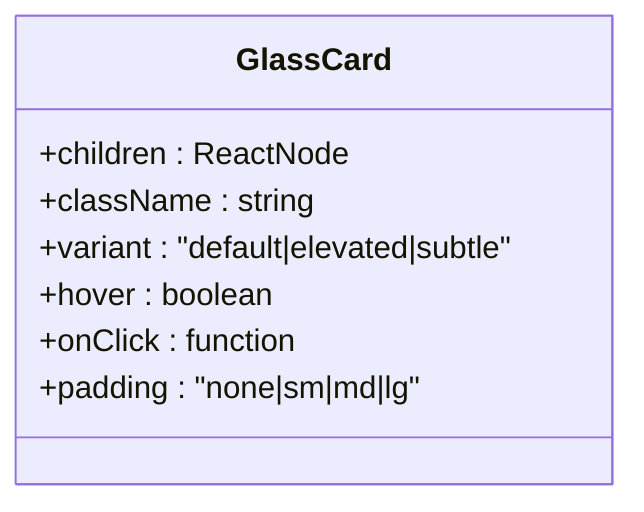
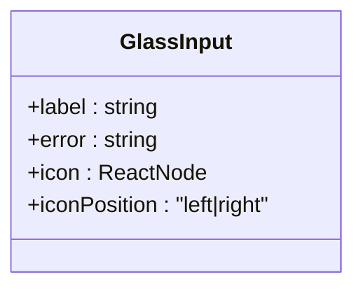
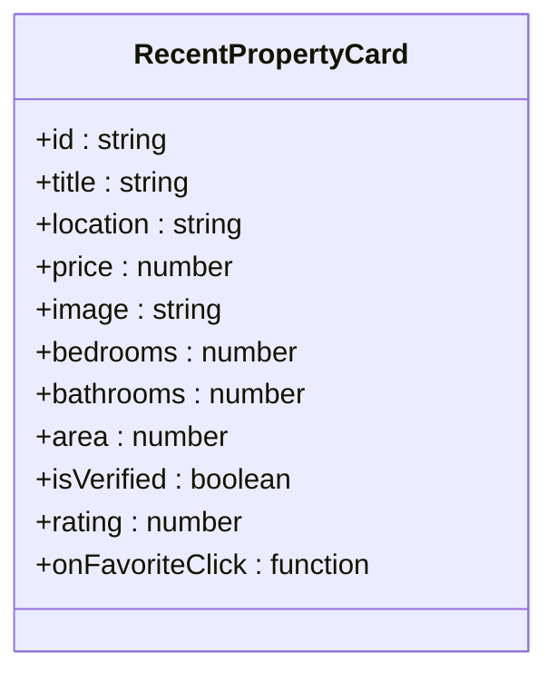
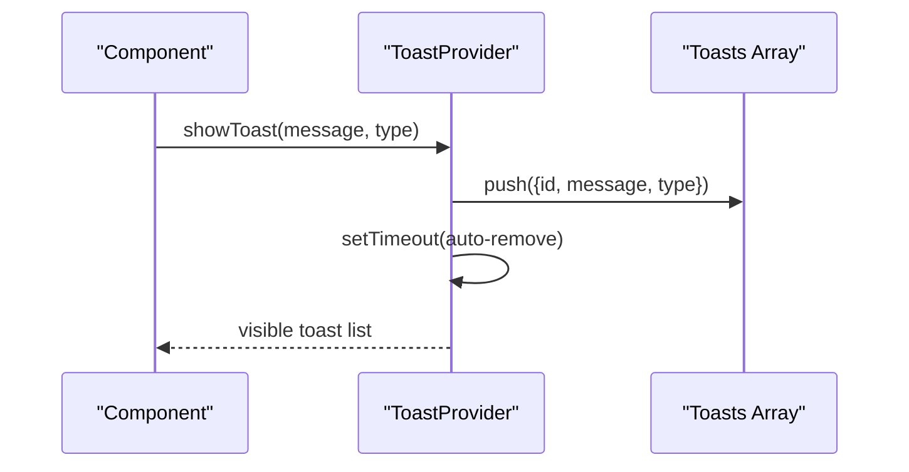
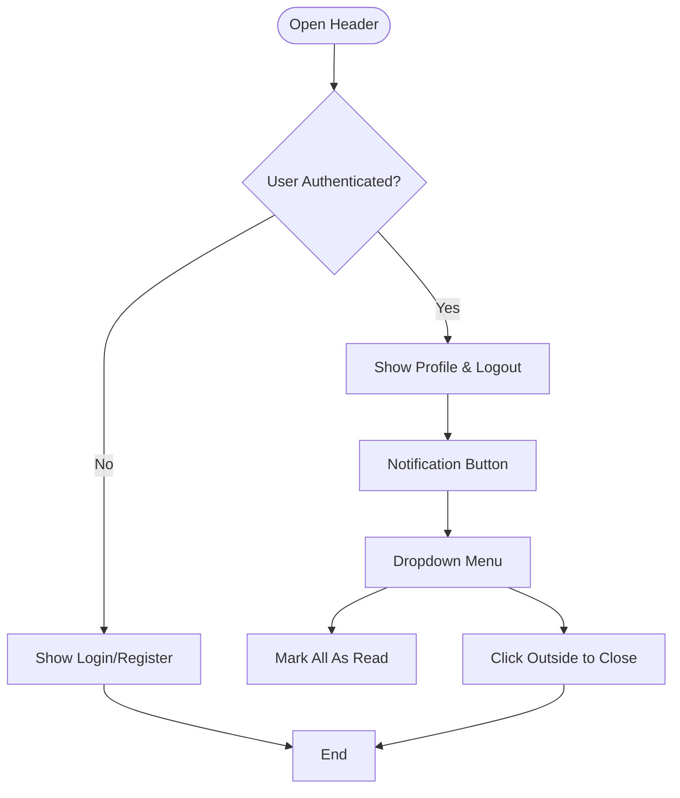
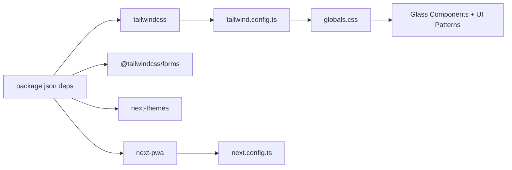

# UI Components and Design System

<cite>
**Referenced Files in This Document**
- [tailwind.config.ts](file://tailwind.config.ts)
- [globals.css](file://src/app/globals.css)
- [GlassButton.tsx](file://src/components/ui/glass/GlassButton.tsx)
- [GlassCard.tsx](file://src/components/ui/glass/GlassCard.tsx)
- [GlassInput.tsx](file://src/components/ui/glass/GlassInput.tsx)
- [index.ts](file://src/components/ui/glass/index.ts)
- [RecentPropertyCard.tsx](file://src/components/ui/RecentPropertyCard.tsx)
- [Toast.tsx](file://src/components/ui/Toast.tsx)
- [Header.tsx](file://src/components/Header.tsx)
- [Navbar.tsx](file://src/components/Navbar.tsx)
- [BottomNav.tsx](file://src/components/BottomNav.tsx)
- [ThemeToggle.tsx](file://src/components/ThemeToggle.tsx)
- [package.json](file://package.json)
- [next.config.ts](file://next.config.ts)
</cite>

## Table of Contents
1. [Introduction](#introduction)
2. [Project Structure](#project-structure)
3. [Core Components](#core-components)
4. [Architecture Overview](#architecture-overview)
5. [Detailed Component Analysis](#detailed-component-analysis)
6. [Dependency Analysis](#dependency-analysis)
7. [Performance Considerations](#performance-considerations)
8. [Troubleshooting Guide](#troubleshooting-guide)
9. [Conclusion](#conclusion)
10. [Appendices](#appendices)

## Introduction
This document describes the UI components and design system for Gamasa Properties. It covers the component library architecture, design tokens, color system, typography hierarchy, spacing guidelines, Tailwind CSS configuration, custom component implementations, responsive design patterns, glass morphism components, reusable UI patterns, accessibility compliance, component prop interfaces, styling customization options, and theme integration. It also provides examples of component usage, design system implementation, and responsive behavior across screen sizes.

## Project Structure
The UI system is organized around:
- A centralized Tailwind configuration that defines design tokens and extends color palettes.
- Global CSS variables and layers that define the base theme, animations, and utilities.
- A glass morphism component library under src/components/ui/glass.
- Reusable UI patterns such as navigation, header, toast notifications, and property cards.
- Theming via next-themes and PWA configuration for offline caching.

**Diagram sources**
- [tailwind.config.ts](file://tailwind.config.ts#L1-L36)
- [globals.css](file://src/app/globals.css#L1-L118)
- [index.ts](file://src/components/ui/glass/index.ts#L1-L9)
- [GlassButton.tsx](file://src/components/ui/glass/GlassButton.tsx#L1-L70)
- [GlassCard.tsx](file://src/components/ui/glass/GlassCard.tsx#L1-L46)
- [GlassInput.tsx](file://src/components/ui/glass/GlassInput.tsx#L1-L62)
- [Header.tsx](file://src/components/Header.tsx#L1-L222)
- [Navbar.tsx](file://src/components/Navbar.tsx#L1-L56)
- [BottomNav.tsx](file://src/components/BottomNav.tsx#L1-L53)
- [ThemeToggle.tsx](file://src/components/ThemeToggle.tsx#L1-L28)
- [RecentPropertyCard.tsx](file://src/components/ui/RecentPropertyCard.tsx#L1-L138)
- [Toast.tsx](file://src/components/ui/Toast.tsx#L1-L63)

**Section sources**
- [tailwind.config.ts](file://tailwind.config.ts#L1-L36)
- [globals.css](file://src/app/globals.css#L1-L118)
- [index.ts](file://src/components/ui/glass/index.ts#L1-L9)

## Core Components
This section documents the glass morphism component library and key UI patterns.

- GlassButton
  - Purpose: Interactive button with variants, sizes, icons, loading state, and full-width option.
  - Props: variant, size, icon, iconPosition, loading, fullWidth, className, disabled.
  - Styles: Uses base classes, variant-specific classes, size classes, and responsive full-width behavior.
  - Accessibility: Inherits native button semantics; disabled state handled.
  - Example usage: See [GlassButton usage](file://src/components/ui/glass/GlassButton.tsx#L12-L70).

- GlassCard
  - Purpose: Container with glass effect and optional hover/click behavior.
  - Props: children, className, variant, hover, onClick, padding.
  - Variants: default, elevated, subtle; padding presets.
  - Example usage: See [GlassCard usage](file://src/components/ui/glass/GlassCard.tsx#L12-L46).

- GlassInput
  - Purpose: Text input with optional label, error state, and icon placement.
  - Props: label, error, icon, iconPosition.
  - Behavior: Adjusts padding based on icon position; applies error styling and pulse animation.
  - Example usage: See [GlassInput usage](file://src/components/ui/glass/GlassInput.tsx#L10-L62).

- RecentPropertyCard
  - Purpose: Property listing card with image, features, pricing, verification badge, and action link.
  - Props: id, title, location, price, image, bedrooms, bathrooms, area, isVerified, rating, onFavoriteClick.
  - Styling: Uses surface and border tokens; hover effects; RTL-aware layout.
  - Example usage: See [RecentPropertyCard usage](file://src/components/ui/RecentPropertyCard.tsx#L34-L138).

- Toast
  - Purpose: Global toast notification provider with success/error/info types.
  - API: Provider exposes showToast(message, type); hook useToast for consumption.
  - Behavior: Auto-dismiss after timeout; animated entrance; pointer events managed.
  - Example usage: See [Toast usage](file://src/components/ui/Toast.tsx#L19-L63).

- Navigation and Header
  - Header: Glass-styled header with user profile, logout, and notification dropdown.
  - Navbar/BottomNav: Bottom tab bar with active state styling and icons.
  - ThemeToggle: Theme switcher with smooth transitions and aria-label.
  - Example usage: See [Header](file://src/components/Header.tsx#L87-L222), [Navbar](file://src/components/Navbar.tsx#L28-L56), [BottomNav](file://src/components/BottomNav.tsx#L14-L53), [ThemeToggle](file://src/components/ThemeToggle.tsx#L6-L28).

**Section sources**
- [GlassButton.tsx](file://src/components/ui/glass/GlassButton.tsx#L1-L70)
- [GlassCard.tsx](file://src/components/ui/glass/GlassCard.tsx#L1-L46)
- [GlassInput.tsx](file://src/components/ui/glass/GlassInput.tsx#L1-L62)
- [RecentPropertyCard.tsx](file://src/components/ui/RecentPropertyCard.tsx#L1-L138)
- [Toast.tsx](file://src/components/ui/Toast.tsx#L1-L63)
- [Header.tsx](file://src/components/Header.tsx#L1-L222)
- [Navbar.tsx](file://src/components/Navbar.tsx#L1-L56)
- [BottomNav.tsx](file://src/components/BottomNav.tsx#L1-L53)
- [ThemeToggle.tsx](file://src/components/ThemeToggle.tsx#L1-L28)

## Architecture Overview
The design system centers on CSS custom properties and Tailwind’s color extension to support light/dark themes. The glass morphism effect is implemented via global utilities and layered CSS. Components consume these tokens and utilities to maintain consistency.

**Diagram sources**
- [globals.css](file://src/app/globals.css#L8-L49)
- [tailwind.config.ts](file://tailwind.config.ts#L9-L30)
- [GlassButton.tsx](file://src/components/ui/glass/GlassButton.tsx#L24-L49)
- [GlassCard.tsx](file://src/components/ui/glass/GlassCard.tsx#L20-L40)
- [GlassInput.tsx](file://src/components/ui/glass/GlassInput.tsx#L39-L54)
- [Header.tsx](file://src/components/Header.tsx#L87-L222)
- [Navbar.tsx](file://src/components/Navbar.tsx#L28-L56)
- [BottomNav.tsx](file://src/components/BottomNav.tsx#L14-L53)
- [Toast.tsx](file://src/components/ui/Toast.tsx#L19-L63)
- [ThemeToggle.tsx](file://src/components/ThemeToggle.tsx#L6-L28)

## Detailed Component Analysis

### GlassButton Analysis
- Props and behavior:
  - variant: primary, secondary, ghost, danger.
  - size: sm, md, lg.
  - icon and iconPosition: left/right.
  - loading: renders spinner and disables button.
  - fullWidth: stretches to container width.
- Styling:
  - Base rounded, font, transitions, active scaling.
  - Variant-specific backgrounds, borders, shadows, and hover states.
  - Size-specific paddings and text sizing.
  - Full-width utility class.
- Accessibility:
  - Inherits native button disabled state.
  - Focus-visible outline via global CSS focus styles.

**Diagram sources**
- [GlassButton.tsx](file://src/components/ui/glass/GlassButton.tsx#L3-L10)

**Section sources**
- [GlassButton.tsx](file://src/components/ui/glass/GlassButton.tsx#L12-L70)

### GlassCard Analysis
- Props and behavior:
  - variant: default, elevated, subtle.
  - padding: none, sm, md, lg.
  - hover: adds interactive hover class and pointer cursor.
  - onClick: optional handler.
- Styling:
  - Base rounded corners and transitions.
  - Variant classes apply different glass/elevation treatments.
  - Padding presets for content spacing.

**Diagram sources**
- [GlassCard.tsx](file://src/components/ui/glass/GlassCard.tsx#L3-L10)

**Section sources**
- [GlassCard.tsx](file://src/components/ui/glass/GlassCard.tsx#L12-L46)

### GlassInput Analysis
- Props and behavior:
  - label: optional field label.
  - error: displays error message and applies error styling.
  - icon and iconPosition: left/right insertion with appropriate spacing.
- Styling:
  - Full-width input with glass background and border.
  - Focus ring with primary tint.
  - Error state with red border and pulse animation.
  - Dynamic padding adjustments based on icon presence and position.

**Diagram sources**
- [GlassInput.tsx](file://src/components/ui/glass/GlassInput.tsx#L3-L8)

**Section sources**
- [GlassInput.tsx](file://src/components/ui/glass/GlassInput.tsx#L10-L62)

### RecentPropertyCard Analysis
- Props and behavior:
  - Property metadata: id, title, location, price, image, bedrooms, bathrooms, area, isVerified, rating, onFavoriteClick.
- Styling and interactions:
  - Surface and border tokens for light/dark modes.
  - Hover scale on image; favorite button overlay with glass effect.
  - Verified badge with success tint.
  - RTL-aware layout and Arabic number formatting.
  - Action link styled as primary CTA.

**Diagram sources**
- [RecentPropertyCard.tsx](file://src/components/ui/RecentPropertyCard.tsx#L20-L32)

**Section sources**
- [RecentPropertyCard.tsx](file://src/components/ui/RecentPropertyCard.tsx#L34-L138)

### Toast Analysis
- Provider and hook:
  - ToastProvider manages a queue of toasts and auto-dismisses after a delay.
  - useToast returns a function to show toasts with type selection.
- Styling:
  - Fixed bottom-left positioning with z-index.
  - Animated entrance and exit; color-coded by type.
  - Pointer-events strategy to allow clicking toast while preventing dragging.

**Diagram sources**
- [Toast.tsx](file://src/components/ui/Toast.tsx#L19-L63)

**Section sources**
- [Toast.tsx](file://src/components/ui/Toast.tsx#L19-L63)

### Navigation and Header Analysis
- Header:
  - Glass header with user profile, logout, and notification dropdown.
  - Unread count indicator and mark-all-as-read functionality.
  - Click-outside detection to close dropdown.
- Navbar/BottomNav:
  - Bottom tab bar with active state styling and material-icons.
  - Active icon fill and label font weight changes.
- ThemeToggle:
  - Smooth rotation transition for theme icon.
  - ARIA label for accessibility.

**Diagram sources**
- [Header.tsx](file://src/components/Header.tsx#L87-L222)
- [Navbar.tsx](file://src/components/Navbar.tsx#L28-L56)
- [BottomNav.tsx](file://src/components/BottomNav.tsx#L14-L53)
- [ThemeToggle.tsx](file://src/components/ThemeToggle.tsx#L6-L28)

**Section sources**
- [Header.tsx](file://src/components/Header.tsx#L87-L222)
- [Navbar.tsx](file://src/components/Navbar.tsx#L28-L56)
- [BottomNav.tsx](file://src/components/BottomNav.tsx#L14-L53)
- [ThemeToggle.tsx](file://src/components/ThemeToggle.tsx#L6-L28)

## Dependency Analysis
- Tailwind CSS and plugins:
  - Tailwind configuration extends colors using CSS variables and enables the forms plugin.
  - Global CSS defines :root variables and layer utilities for glass, animations, and focus styles.
- Theming:
  - next-themes provides theme switching with smooth transitions.
- PWA:
  - next-pwa configured for service worker registration and caching.

**Diagram sources**
- [package.json](file://package.json#L11-L27)
- [tailwind.config.ts](file://tailwind.config.ts#L1-L36)
- [globals.css](file://src/app/globals.css#L1-L118)
- [next.config.ts](file://next.config.ts#L1-L31)

**Section sources**
- [package.json](file://package.json#L11-L27)
- [tailwind.config.ts](file://tailwind.config.ts#L1-L36)
- [globals.css](file://src/app/globals.css#L1-L118)
- [next.config.ts](file://next.config.ts#L1-L31)

## Performance Considerations
- CSS variable-based theming reduces reflows and avoids large-scale class churn during theme switches.
- Glass components rely on backdrop blur and semi-opaque backgrounds; keep blur radius moderate to avoid heavy GPU usage on low-end devices.
- Toasts auto-dismiss to prevent stacking; limit concurrent toasts to reduce DOM updates.
- Navigation and header components use minimal state and event listeners; ensure click-outside handlers are removed on unmount.

## Troubleshooting Guide
- Glass effect not visible:
  - Verify global glass utilities are loaded and CSS variables are defined.
  - Confirm dark mode selectors are applied when toggled.
- Focus styles not appearing:
  - Ensure global focus-visible styles are included and not overridden by local styles.
- Icons not rendering:
  - Confirm material-symbols-outlined fonts are available or CDN-based icons are accessible.
- Theme toggle not working:
  - Check next-themes initialization and that mounted state prevents SSR mismatches.
- PWA not registering:
  - Validate next-pwa configuration and service worker destination in production builds.

**Section sources**
- [globals.css](file://src/app/globals.css#L114-L118)
- [ThemeToggle.tsx](file://src/components/ThemeToggle.tsx#L6-L28)
- [next.config.ts](file://next.config.ts#L5-L10)

## Conclusion
Gamasa Properties’ UI system combines a robust design token foundation with a cohesive glass morphism component library and reusable UI patterns. Tailwind’s CSS variable integration ensures consistent theming, while global utilities and animations deliver polished interactions. The system supports accessibility through semantic HTML, focus management, and ARIA attributes. By following the documented patterns and prop interfaces, teams can extend the design system consistently across screens and contexts.

## Appendices

### Design Tokens and Color System
- Color tokens:
  - Primary palette: primary.
  - Background palette: background-light, background-dark.
  - Surface palette: surface-light, surface-dark.
  - Border palette: border-light, border-dark.
  - Text palette: text-main, text-muted.
  - Status palette: success, warning, error, info.
- CSS variables:
  - Defined in :root for RGB triplets and additional variables (e.g., blur radius).
- Tailwind theme extension:
  - Colors mapped to CSS variables for dynamic theming.

**Section sources**
- [globals.css](file://src/app/globals.css#L8-L49)
- [tailwind.config.ts](file://tailwind.config.ts#L9-L30)

### Typography Hierarchy and Spacing Guidelines
- Typography:
  - Font families defined via CSS variables for display and body text.
- Spacing:
  - Padding presets in components (e.g., GlassCard padding options).
  - Safe area utilities for mobile insets.

**Section sources**
- [globals.css](file://src/app/globals.css#L46-L60)
- [GlassCard.tsx](file://src/components/ui/glass/GlassCard.tsx#L28-L33)

### Responsive Design Patterns
- Mobile-first approach:
  - Bottom navigation fixed at the bottom with safe-area padding.
  - Icon-based navigation with small labels optimized for touch targets.
- Adaptive layouts:
  - Full-width buttons and cards on small screens.
  - Hover states and transitions optimized for pointer vs. touch interactions.

**Section sources**
- [BottomNav.tsx](file://src/components/BottomNav.tsx#L14-L53)
- [GlassButton.tsx](file://src/components/ui/glass/GlassButton.tsx#L39-L49)

### Accessibility Compliance
- Focus management:
  - Global focus-visible outline for keyboard navigation.
- Theming:
  - next-themes ensures consistent theme behavior across components.
- ARIA:
  - ThemeToggle includes aria-label for screen readers.

**Section sources**
- [globals.css](file://src/app/globals.css#L114-L118)
- [ThemeToggle.tsx](file://src/components/ThemeToggle.tsx#L20-L21)

### Component Prop Interfaces Summary
- GlassButton: variant, size, icon, iconPosition, loading, fullWidth, className, disabled.
- GlassCard: children, className, variant, hover, onClick, padding.
- GlassInput: label, error, icon, iconPosition.
- RecentPropertyCard: id, title, location, price, image, bedrooms, bathrooms, area, isVerified, rating, onFavoriteClick.
- Toast: Provider and useToast hook for global notifications.

**Section sources**
- [GlassButton.tsx](file://src/components/ui/glass/GlassButton.tsx#L3-L10)
- [GlassCard.tsx](file://src/components/ui/glass/GlassCard.tsx#L3-L10)
- [GlassInput.tsx](file://src/components/ui/glass/GlassInput.tsx#L3-L8)
- [RecentPropertyCard.tsx](file://src/components/ui/RecentPropertyCard.tsx#L20-L32)
- [Toast.tsx](file://src/components/ui/Toast.tsx#L7-L15)

### Theme Integration
- next-themes:
  - Theme switching with smooth transitions and persisted preference.
- Tailwind and CSS variables:
  - Dynamic color application across components and utilities.

**Section sources**
- [ThemeToggle.tsx](file://src/components/ThemeToggle.tsx#L6-L28)
- [tailwind.config.ts](file://tailwind.config.ts#L9-L30)
- [globals.css](file://src/app/globals.css#L8-L49)