# 🛡 Gamasa Properties – Security Foundation V1
### Production Enforcement Layer

> **Status:** Pre-Production Required  
> **Version:** V1  
> **Scope:** Authentication · Booking Lifecycle · Payments · Commission · Availability · RLS · Storage · Audit

---

## Executive Summary

هذا المستند يمثل المرجع الأمني الرسمي V1 لمنصة Gamasa Properties.

This document is the official security reference (V1) for Gamasa Properties. It covers:

- 🔐 Hardening the authentication and session layer
- 🔒 Tightening RLS policies
- 🧠 Enforcing State Machine at the database level
- 📅 Ensuring Availability is always derived only
- 💰 Protecting the commission system from manipulation
- 🧾 Guaranteeing full Auditability
- 🧨 Complete STRIDE Threat Model
- 🏗 Security Architecture Diagram
- 🔁 Sequence Diagrams with actor-owned transitions

This document is the security layer on top of:
- Business Rules V1
- State Machine V1
- Database Flow V1

> ⚠️ **The system MUST NOT be launched to Production without satisfying all elements of this document.**

---

## Table of Contents

1. [Critical Vulnerabilities Overview](#1-critical-vulnerabilities-overview)
2. [Security Hardening Roadmap](#2-security-hardening-roadmap)
3. [Production Security Checklist](#3-production-security-checklist)
4. [Threat Model (STRIDE)](#4-threat-model-stride)
5. [Security Architecture Diagram](#5-security-architecture-diagram)
6. [Security Sequence Diagrams – Actor-Owned Transitions](#6-security-sequence-diagrams--actor-owned-transitions)

---

## 1. Critical Vulnerabilities Overview

The following vulnerabilities represent critical conflicts between theoretical design and actual implementation if security is weak.

### 1.1 Plaintext Password Storage

If **any** code stores passwords in plaintext:
```js
localStorage.setItem("password", "123456")
```
This is a **Critical Severity** vulnerability.

**Why it's dangerous:**
- Any XSS = full account theft
- Any unencrypted device = direct credential leak
- `localStorage` is unencrypted, has no expiry, no `httpOnly`

**Correct Fix (Supabase Auth):**

Since the project is built on Supabase Auth (as per the official architecture):

```js
// ✅ Correct: use Supabase Auth only
supabase.auth.signInWithPassword(...)
// Supabase handles bcrypt hashing internally
```

**What must NEVER be stored:**
- `password`
- `access_token` (manually)
- `refresh_token` (manually)

**Architectural Decision:**
- ❌ No credential storage in `localStorage`
- ✅ Session relies only on Supabase managed session
- ✅ Any mock mode must never store passwords

---

### 1.2 Session Management (Session Validation & Token Refresh)

**If any of these exist:**
- No periodic session verification
- No token refresh
- Reliance on `localStorage` alone

**This means:**
- User can remain logged in after session revocation
- Potential session hijacking

**Correct Fix aligned with V1:**

Since the system uses `Supabase + RLS + Auth.uid()`:

**1️⃣ Server-Side Session Validation** (Next.js App Router):
```ts
const { data: { user } } = await supabase.auth.getUser()
// Do NOT rely on:
// supabase.auth.getSession() from client alone
```

**2️⃣ Middleware Protection for all routes:**
- `/landlord/*`
- `/admin/*`
- `/bookings/*`
- `/profile/*`

Each must validate `auth.uid()` before render.

**3️⃣ Token Refresh:**
- Supabase supports auto-refresh
- Use `createServerClient`
- Never store tokens manually
- Never disable cookie-based auth

> ⚠️ **Critical:** Any mock mode that bypasses auth entirely MUST be `DEV ONLY` and is strictly forbidden in production.

---

### 1.3 Overly Permissive Admin RLS

If RLS has a policy named `Admin full access` without precise restrictions, it may allow the admin to:
- Modify any booking regardless of state
- Change `property.status` to any value
- **Bypass the State Machine entirely**

This breaks:
- State Machine V1
- Business Rules V1
- Availability Derived Rule

**Required Fix:**

**1️⃣ Admin cannot bypass the State Machine:**
```sql
-- Even Admin must go through:
validate_booking_transition  -- trigger
-- No direct:
UPDATE bookings SET status = 'active'  -- without guard
```

**2️⃣ Admin cannot set `property.status` to `booked`/`rented`:**

Per Business Rules: *Property never enters booked/rented states.*
```sql
CHECK (status IN ('draft','approved','blocked','archived'))
-- must be actually enforced
```

**3️⃣ All Admin updates must audit log:**
```sql
INSERT INTO activity_logs ...
-- as mandated in Database Flow
```

---

### Security Severity Summary

| Vulnerability | Severity |
|---|---|
| Plaintext password storage | 🔴 Critical |
| Missing session validation | 🔴 High |
| Open Admin RLS | 🔴 High |
| Missing DB-level guards | 🔴 Critical |

---

## 2. Security Hardening Roadmap

**Objective:** Transform the system from "functionally working" to:
- 🔐 Secure by Design
- 🧠 State Machine Enforced at DB level
- 📅 Availability Derived Only
- 🧾 Fully Auditable
- 🛡 RLS Strict & Non-Bypassable

---

### 🧨 Phase 0 – Emergency Fixes (Critical – Do Immediately)

#### 0.1 Remove Plaintext Password Storage

**❌ Forbidden:**
- `localStorage` password
- Manual token storage
- Logging credentials

**✅ Required:**
- Use Supabase Auth only
- No password persistence after auth request

**Done When:**
- Codebase contains zero references storing password
- No access/refresh tokens manually stored
- No credentials in logs

**Quick code scan for:**
```
localStorage, password, token, refresh, auth, session
```

---

### 🔐 Phase 1 – Authentication & Session Hardening

#### 1.1 Server-Side Session Validation

**Required:** Protect all routes:
- `/profile`
- `/bookings`
- `/landlord`
- `/admin`

Validate session on server before render.

**Done When:**
- Expired session cannot access protected page
- Client-side session spoofing is impossible

#### 1.2 Token Handling

**Required:**
- Use Supabase managed session
- Do NOT store tokens manually
- Graceful logout on refresh failure

**Done When:**
- Session refresh works automatically
- Invalid session forces re-authentication

---

### 🧠 Phase 2 – Database Hardening (Critical Core)

#### 2.1 Enforce State Machine at DB Level

**Implement:**
- `validate_booking_transition` trigger
- Reject all illegal transitions

**Must Block:**
- `requested → active`
- `approved → active` (without confirmed)
- `confirmed → requested`
- `active → approved`
- Any manual SQL bypass

**Done When:**
- Any illegal transition throws DB exception

#### 2.2 Prevent Overlapping Confirmed/Active Bookings

**Rule:** Only `confirmed` and `active` block availability.

```sql
-- Exclusion/Unique constraint on:
(property_id, daterange)
WHERE status IN ('confirmed','active')
```

**Done When:**
- DB rejects overlapping confirmed/active bookings
- `requested`/`approved` do NOT block availability

#### 2.3 Lock Property Status

*Property never enters `booked` or `rented`.*

```sql
CHECK (status IN ('draft','approved','blocked','archived'))
```

**Done When:**
- Setting `status='booked'` fails at DB level
- Availability is not stored in properties table

---

### 🛡 Phase 3 – RLS Tightening (No Admin Bypass)

#### 3.1 Restrict Admin Policies

**Remove any policy using:**
```sql
USING (true)
```

**Replace with scoped policies:**

Admin CAN:
- `verify payment`
- `block property`
- `resolve disputes`

Admin CANNOT:
- Override State Machine
- Modify bookings arbitrarily

**Done When:**
- Admin update must pass DB trigger
- No global unrestricted update policy

#### 3.2 Booking Update Restrictions

| Actor | Allowed Actions |
|---|---|
| Tenant | create `requested`, upload receipt, cancel before `active` |
| Landlord | `approve`, `reject`, confirm check-in |
| System | `expired`, `completed` |

**Done When:**
- Any actor outside role receives RLS denial

---

### 💰 Phase 4 – Commission Protection

Per Business Rules V1: *10% from both sides. Only collected after `active`.*

**Implement DB Trigger on `NEW.status = 'active'`:**

```sql
-- Trigger:
INSERT INTO revenues -- calculate commission on first month only
```

**Must NOT Allow:**
- Commission before `active`
- Commission on `rejected`/`cancelled`/`expired`

**Done When:**
- No revenue record exists before `active`

---

### 🧾 Phase 5 – Audit & Observability

#### 5.1 Mandatory Audit Logging

```sql
-- Trigger on:
AFTER UPDATE OF status

-- Insert into activity_logs with:
actor_id, old_status, new_status, timestamp, correlation_id
```

**Done When:**
- Every state change visible in audit table automatically

---

### 📂 Phase 6 – Storage Security (Payment Receipts)

**Required:**
- Private bucket
- Signed URLs
- File type validation
- Size limits

**RLS Rules:**
- Tenant uploads only to own booking
- Landlord views only related booking
- Admin views if needed

**Done When:**
- Receipt URL cannot be guessed
- Cross-user file access impossible

---

### 🧪 Phase 7 – Security Testing Matrix

Must pass before production:

| Scenario | Expected Result |
|---|---|
| Tenant sets `booking.status='confirmed'` | ❌ DB rejects |
| Admin forces `requested → active` | ❌ DB rejects |
| Overlapping confirmed bookings | ❌ DB rejects |
| Commission before `active` | ❌ Not inserted |
| Expired session accessing `/admin` | ❌ Redirect |
| Access other user's receipt | ❌ RLS denies |

---

### 🚀 Implementation Timeline

| Sprint | Focus |
|---|---|
| Sprint 1 (Critical Lockdown) | Remove plaintext storage · DB state guard · Overlap constraint · Tighten admin RLS |
| Sprint 2 | Commission trigger · Audit logging · Storage security |
| Sprint 3 | Monitoring · Rate limiting · Security alerting |

---

### 🔒 System Invariants (After Hardening)

- ✅ Availability never stored
- ✅ No overlapping confirmed/active bookings
- ✅ Commission only after `active`
- ✅ No cancellation after `active`
- ✅ State Machine cannot be bypassed
- ✅ Admin cannot override core rules
- ✅ Every state change logged

---

## 3. Production Security Checklist

> This checklist MUST be reviewed before any Production release, major DB migration, or enabling real Payment Verification.

---

### 🧨 1️⃣ Authentication & Credentials

#### ⛔ 1.1 No Plaintext Storage
- [ ] No password stored in `localStorage`
- [ ] No `access_token` stored manually
- [ ] No `refresh_token` stored manually
- [ ] No `console.log` containing sensitive data
- [ ] No password passed to any non-auth service

**PASS ✅ = No reference to credential storage found in codebase**

#### 🔐 1.2 Session Protection
- [ ] All sensitive pages validate session on the server
- [ ] Expired session redirects to login
- [ ] No reliance on client-only auth state
- [ ] Logout clears session completely

---

### 🧠 2️⃣ Booking State Machine Protection

#### 🔒 2.1 DB Guard Enforced
- [ ] `validate_booking_transition` trigger exists
- [ ] `requested → active` is rejected
- [ ] `approved → active` is rejected
- [ ] `confirmed → requested` is rejected
- [ ] `active → approved` is rejected
- [ ] Any direct unauthorized `UPDATE` fails

**PASS ✅ = Attempting manual status modification fails**

#### 🔁 2.2 Overlapping Protection
- [ ] Constraint exists preventing `confirmed`/`active` overlap
- [ ] `requested` does NOT block availability
- [ ] `approved` does NOT block availability

---

### 🏠 3️⃣ Property Integrity

#### ⚠️ 3.1 Property Status Locked
- [ ] Cannot set `status = booked`
- [ ] Cannot set `status = rented`
- [ ] `CHECK` constraint is active
- [ ] Availability is NOT stored in `properties`

---

### 🛡 4️⃣ RLS Policies Verification

#### 👤 4.1 Tenant Restrictions
- [ ] Tenant cannot modify `booking.status`
- [ ] Tenant cannot view other users' bookings
- [ ] Tenant cannot change `start_date` after `confirmed`

#### 🏠 4.2 Landlord Restrictions
- [ ] Landlord cannot edit bookings not belonging to them
- [ ] Landlord cannot bypass State Machine
- [ ] Landlord cannot set `confirmed` without correct path

#### 🛡 4.3 Admin Restrictions
- [ ] No `USING (true)` open policy exists
- [ ] Admin cannot bypass DB triggers
- [ ] Admin cannot change `booking.status` outside the path
- [ ] Admin actions logged in `activity_logs`

---

### 💰 5️⃣ Commission Protection

#### 🧾 5.1 Commission Trigger
- [ ] Commission created only when `status='active'`
- [ ] No commission on `rejected`
- [ ] No commission on `expired`
- [ ] No commission on `cancelled`
- [ ] No commission before `check-in`

---

### 📅 6️⃣ Availability Enforcement

#### 🧮 6.1 Derived Only
- [ ] No stored `availability` column exists
- [ ] Search depends on `confirmed` + `active` + `property_unavailability`
- [ ] `requested` does not block availability
- [ ] `approved` does not block availability

---

### 🧾 7️⃣ Audit & Logging

#### 📜 7.1 Activity Logging
- [ ] Every `status` change is logged
- [ ] `old_status` is saved
- [ ] `new_status` is saved
- [ ] `actor_id` is saved
- [ ] `timestamp` is saved

---

### 📂 8️⃣ Storage Security

#### 📤 8.1 Payment Receipts
- [ ] Storage bucket is private
- [ ] No static public URLs
- [ ] Signed URLs in use
- [ ] File size limit active
- [ ] File type validation active

---

### 🧪 9️⃣ Attack Simulation Tests

| Test | Expected Result |
|---|---|
| Tenant attempts `confirmed` | ❌ DB reject |
| Admin attempts `active` directly | ❌ DB reject |
| Overlapping confirmed booking | ❌ DB reject |
| Commission before `active` | ❌ Not inserted |
| Expired session | ❌ Redirect |
| Reading another user's receipt | ❌ RLS deny |

---

### ⚙️ 1️⃣0️⃣ Infrastructure & Environment

- [ ] `.env.local` not present in repo
- [ ] Production secrets stored in secure environment
- [ ] `IS_MOCK_MODE = false` in production
- [ ] CORS configured correctly
- [ ] HTTPS enabled
- [ ] No test endpoints exposed

---

### 📊 1️⃣1️⃣ Monitoring & Alerts

- [ ] Logging enabled
- [ ] Error rate monitored
- [ ] Suspicious repeated booking attempts monitored
- [ ] No-show rate monitored
- [ ] Payment verification delay monitored

---

### 🏁 Production Release Gate

🚫 **Do NOT launch if any of the following:**
- Any item in sections 1–5 is incomplete
- DB triggers are not active
- RLS is not active
- Availability can be stored
- State Machine can be bypassed

### ✅ Final Certification

System is considered **Production-Ready** only if:
- All Critical items PASS
- All High items PASS
- Manual Penetration Simulation passed
- Overlapping test failed correctly
- Commission test validated
- Audit trail validated

---

## 4. Threat Model (STRIDE)

### 🧠 STRIDE Framework

| Letter | Threat |
|---|---|
| S | Spoofing |
| T | Tampering |
| R | Repudiation |
| I | Information Disclosure |
| D | Denial of Service |
| E | Elevation of Privilege |

---

### 1️⃣ S — Spoofing Identity

**Threat:** User pretends to be another user.

**Targets:** Tenant impersonates landlord · User impersonates admin · Session hijacking

**Attack Vectors:** Stolen session token · Client-side role manipulation · Forged JWT

**Mitigation:**
- Server-side session validation
- No client-trusted roles
- RLS policies enforced at DB level
- Supabase Auth signature verification
- HTTPS mandatory

**Residual Risk:** 🟢 Low if SSR + RLS active

---

### 2️⃣ T — Tampering With Data

**Threat:** Modify booking or financial data.

**Critical Targets:** `booking.status` · commission amount · `start_date`/`end_date` · `property.status`

**Attack Scenario 1 – Tenant manual SQL:**
```sql
UPDATE bookings SET status='confirmed'
```
*Mitigation:* RLS blocks unauthorized UPDATE; DB trigger validates transition.

**Attack Scenario 2 – Admin bypasses State Machine:**
*Mitigation:* DB-level guard rejects illegal transitions; no global admin `USING(true)`; all transitions logged.

**Attack Scenario 3 – Overlapping confirmed bookings:**
*Mitigation:* Exclusion/Unique constraint on `confirmed + active`.

**Residual Risk:** 🟢 Very Low if DB constraints active

---

### 3️⃣ R — Repudiation

**Threat:** Actor denies performing action.

**Examples:** Landlord denies approving booking · Admin denies blocking property · Tenant denies cancellation

**Mitigation:** Mandatory audit logging of every state change:
```
actor_id · old_status · new_status · timestamp · correlation_id
```

**Residual Risk:** 🟢 Low if immutable logs used

---

### 4️⃣ I — Information Disclosure

**Threat:** Data leakage.

**Sensitive Data:** Payment receipts · User phone numbers · Booking details · Commission records

| Attack Scenario | Mitigation |
|---|---|
| Access another user's booking | RLS SELECT restricted to `tenant_id OR landlord_id` |
| Public receipt URL leakage | Private bucket + Signed URLs |
| Availability scraping | Rate limiting + Pagination |

**Residual Risk:** 🟡 Moderate if rate limiting absent

---

### 5️⃣ D — Denial of Service

**Threat:** Exhaust system resources.

**Vectors:** Mass booking requests · Repeated overlapping attempts · Search spam · Payment upload spam

**Mitigation:**
- Rate limiting (API level)
- Constraint rejects invalid overlapping early
- Verification fee (50 EGP) reduces spam
- Query indexes for availability

**Residual Risk:** 🟡 Medium without rate limiting

---

### 6️⃣ E — Elevation of Privilege

**Threat:** User gains higher privileges.

**Examples:** Tenant becomes landlord · User becomes admin · Landlord modifies unowned bookings

**Mitigation:**
- Role stored in `profiles`
- Role checked server-side
- RLS restricts by `auth.uid()`
- No role trust from client payload

**Residual Risk:** 🟢 Low if no global policies

---

### 🔥 Cross-Domain Threats

#### 💰 Financial Manipulation
**Threat:** Collect commission before `active`.
**Mitigation:** Commission trigger fires only on `NEW.status = 'active'` per Business Rules.

#### 📅 Availability Corruption
**Threat:** Store availability manually.
**Mitigation:** Availability never stored. Property never enters `booked`/`rented`.

#### 🔁 Race Conditions
**Threat:** Two landlords confirm overlapping bookings simultaneously.
**Mitigation:** DB-level overlap constraint + Transaction-level isolation.

---

### 📊 Risk Matrix Summary

| Threat | Severity | Mitigated By |
|---|---|---|
| Booking status tampering | 🔴 Critical | DB Trigger |
| Commission manipulation | 🔴 Critical | Active-only trigger |
| Overlapping booking | 🔴 Critical | Unique constraint |
| Role spoofing | 🟠 High | RLS + SSR |
| Receipt leakage | 🟠 High | Private bucket |
| Spam booking | 🟡 Medium | Verification fee + rate limit |
| Admin abuse | 🟠 High | Restricted policies |

---

### 🧱 Security Assumptions

The system assumes:
- Supabase JWT verification is trusted
- Database triggers are enabled
- RLS is enabled on all critical tables
- HTTPS is enforced
- No service-role key is exposed client-side

---

### 🛡 Security Invariants

After mitigation:
- Availability is derived only
- State Machine cannot be bypassed
- Commission only after `active`
- No overlapping confirmed bookings
- No cancellation after `active`
- All state changes logged

---

## 5. Security Architecture Diagram

### 1) High-Level Security Architecture (Trust Boundaries)

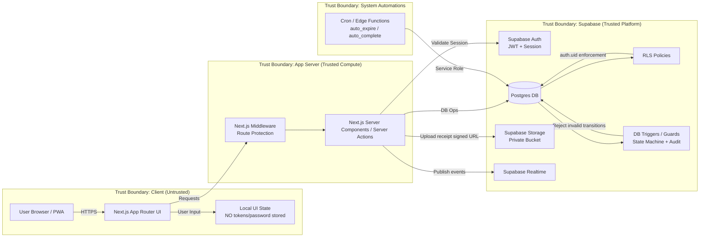

---

### 2) Booking Lifecycle Security Controls

```mermaid
flowchart TD
  A[Client UI] --> B{Server Action}
  B -->|Checks Session| C[Auth.getUser()]
  B -->|Authorization| D{Role Check\ntenant/landlord/admin/system}
  D -->|DB write| E[(bookings table)]
  E --> F[RLS: Row-Level Policies]
  E --> G[Trigger: validate_booking_transition]
  E --> H[Trigger: audit_log_on_status_change]
  E --> I[Constraint: no_overlap_confirmed_active]
  H --> J[(activity_logs)]

  subgraph Actors["Actor Permissions V1"]
    T[Tenant] -->|create requested| E
    T -->|upload receipt| P[(payments)]
    T -->|cancel before active| E
    L[Landlord] -->|approve/reject| E
    L -->|confirm check-in| E
    AD[Admin] -->|verify payment| E
    AD -->|block property| PR[(properties)]
    S[System] -->|auto_expire / auto_complete| E
  end
```

---

### 3) Availability Derived (Never Stored)

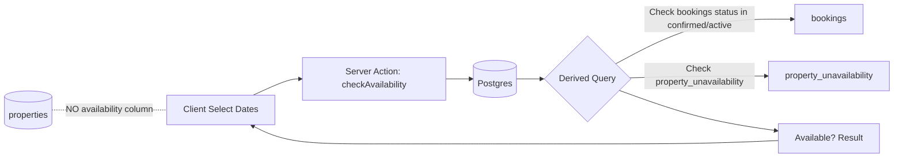

---

### 4) Payments & Storage Security

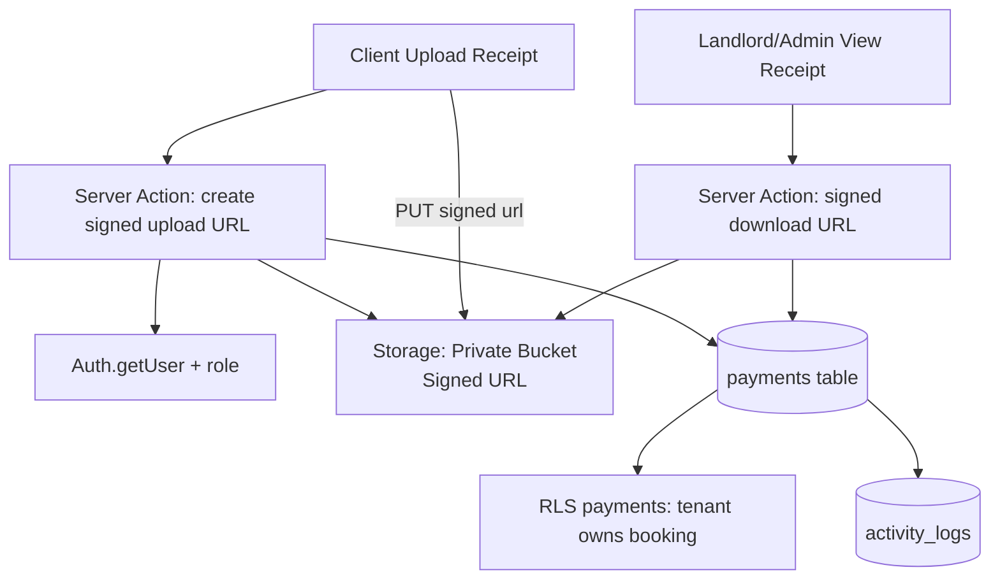

---

### 5) Admin Surface Security (No Bypass)

```mermaid
flowchart LR
  AUI[Admin UI Routes] --> MW[Middleware: require admin]
  MW --> NX[Server Components / Actions]
  NX --> AUTH[Auth.getUser()]
  NX --> RC{Role from profiles\nserver-side}
  RC -->|Allow| DB[(DB)]
  RC -->|Deny| DENY[403 / redirect]
  DB --> RLS[RLS: scoped admin policies]
  DB --> TRG[Triggers: state guard + audit]
```

---

### 🔐 Security Layers (Defense in Depth)

1. **Transport:** HTTPS only
2. **Auth:** Supabase Auth — no client-trusted roles
3. **App Gate:** Next.js Middleware + Server-side checks
4. **DB Gate:** RLS — `auth.uid()` enforcement
5. **DB Guards:** Triggers enforce State Machine + Audit
6. **Constraints:** No overlap for `confirmed`/`active`
7. **Storage:** Private buckets + Signed URLs
8. **Observability:** `activity_logs` mandatory

---

## 6. Security Sequence Diagrams – Actor-Owned Transitions

### Legend

| Actor | Owns |
|---|---|
| Tenant | `create requested` · `upload receipt` · `cancel before active` |
| Landlord | `approve/reject` · `confirm check-in → active` |
| Admin / Landlord | `verify payment → confirmed` (configurable) |
| System | `auto_expire` · `auto_complete` · `payment_pending` orchestration |

---

### 1) Create Booking → `requested` (Owner: Tenant)

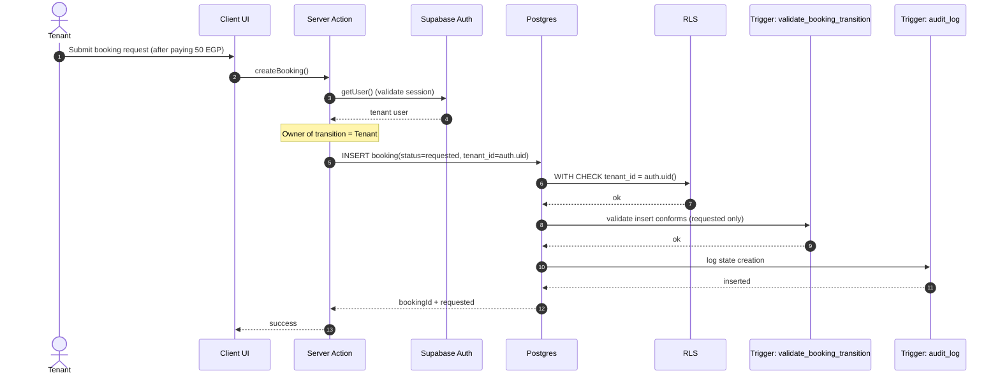

---

### 2) `requested → approved | rejected` (Owner: Landlord)

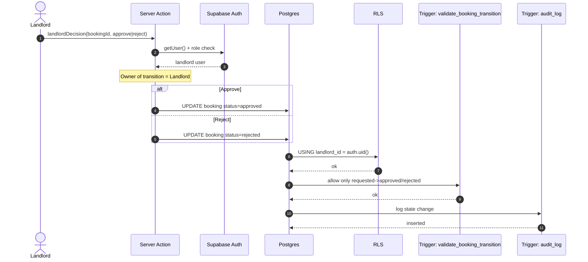

---

### 3A) `approved → payment_pending` (Owner: System)

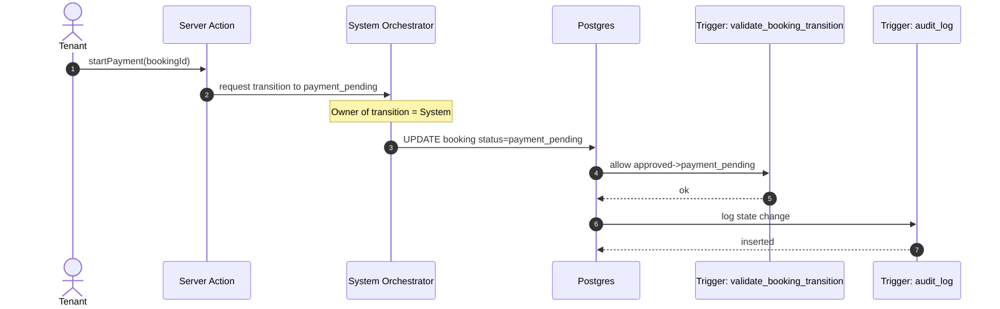

---

### 3B) `payment_pending → payment_uploaded` (Owner: Tenant)

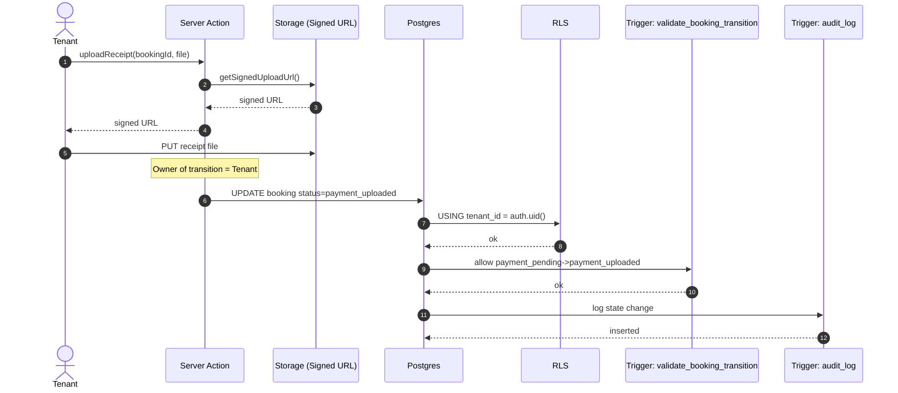

---

### 3C) `payment_uploaded → confirmed` (Owner: Admin or Landlord – configurable)

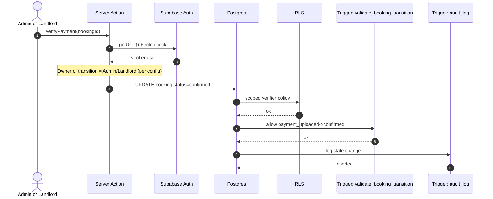

---

### 4) Cash on Delivery: `approved → confirmed` (Owner: System)

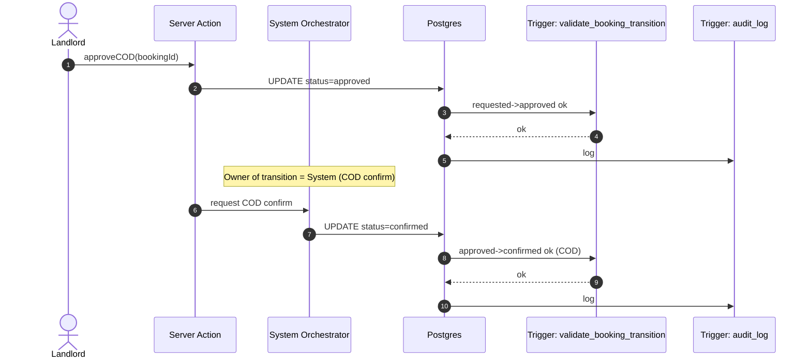

---

### 5) Check-in: `confirmed → active` + Commission Trigger (Owner: Landlord)

> ⚠️ Commission is collected **only** at `active`.

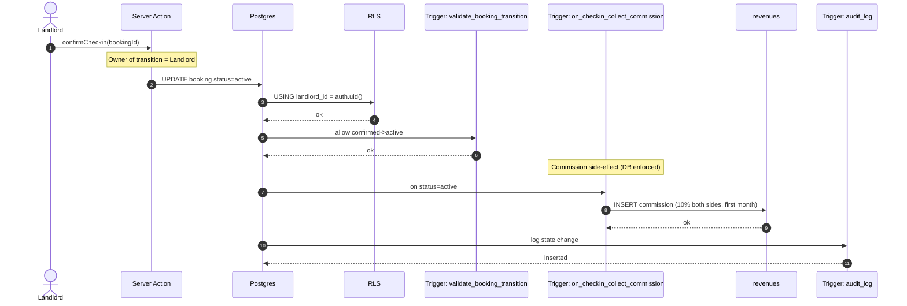

---

### 6A) Auto Complete: `active → completed` (Owner: System)

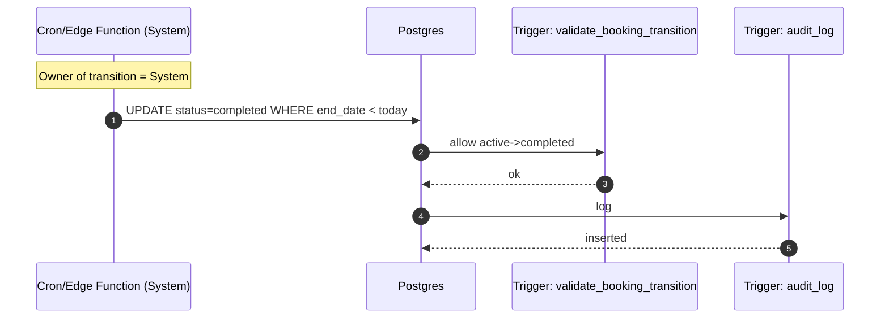

---

### 6B) Auto Expire: `payment_pending → expired` (Owner: System)

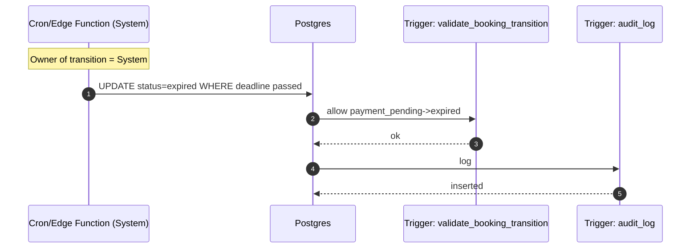

---

### 7) Cancellation: Before `active` only (Owner: Tenant)

> ❌ No cancellation after `active`.

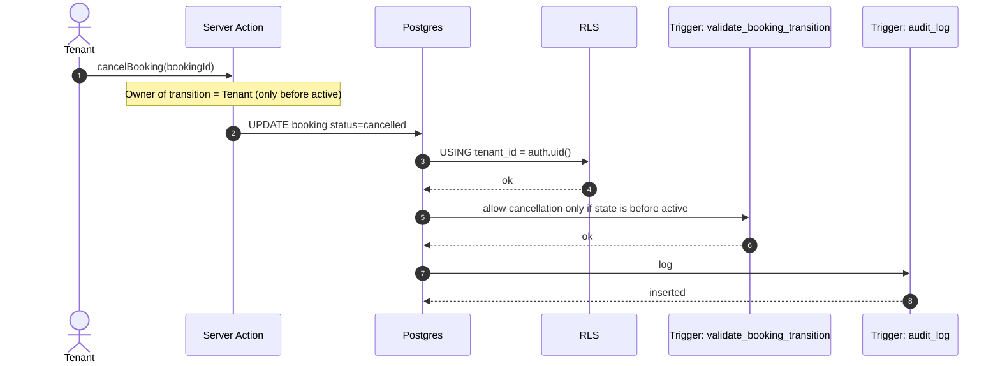

---

### 8) Landlord No-Show: `confirmed → cancelled` + Penalties

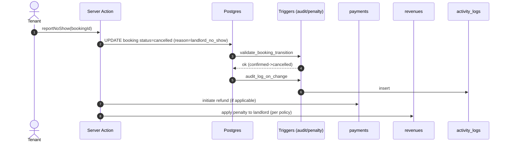

---

## ✅ Single Source of Truth: Actor-Owned Transition Table (V1)

| From | To | Owner (Actor) |
|---|---|---|
| — | `requested` | Tenant |
| `requested` | `approved` / `rejected` | Landlord |
| `approved` | `payment_pending` | System |
| `payment_pending` | `payment_uploaded` | Tenant |
| `payment_uploaded` | `confirmed` | Admin or Landlord (config) |
| `approved` | `confirmed` (COD) | System |
| `confirmed` | `active` | Landlord |
| `active` | `completed` | System |
| `payment_pending` | `expired` | System |
| `requested` / `approved` / `payment_pending` / `confirmed` | `cancelled` | Tenant (before `active` only) |

---

## 🏁 Final Goal

After full implementation, the system becomes:

- **Deterministic** — every outcome follows documented rules
- **Non-bypassable** — enforced at DB layer, not just UI
- **Audit-compliant** — every state change is traceable
- **Financially safe** — commission protection is DB-enforced
- **Production-grade secure** — all STRIDE threats mitigated

---

*Gamasa Properties – Security Foundation V1 | Production Enforcement Layer*
